+++
title = "knowledge-base"

[extra]
tags = ["general"]
+++

## Workspace Map

```mermaid
graph TD
    Hub["<span style='color:#F2ECE4'>Knowledge Hub</span>"]

    Hub --> Work["<span style='color:#F2ECE4'>Work Workspace</span><br/><span style='color:#D4CEC5;font-size:0.85em'>Business, Projects & Ops</span>"]
    Hub --> Personal["<span style='color:#F2ECE4'>Personal Workspace</span><br/><span style='color:#D4CEC5;font-size:0.85em'>Journal, Goals & Hobbies</span>"]
    Hub --> StudyNote["<span style='color:#F2ECE4'>Study Note Workspace</span><br/><span style='color:#D4CEC5;font-size:0.85em'>16 Core IT Subjects</span>"]
    Hub --> RD["<span style='color:#F2ECE4'>R&D Workspace</span><br/><span style='color:#A4B3A2;font-size:0.85em'>Hypotheses & Experiments</span>"]

    Work --> W1[Business Planning & GTM]
    Work --> W2[Projects & Tasks]
    Work --> W3[Tech Architecture & Ops]
    Work --> W4[Agent Infrastructure]

    Personal --> P1[Daily Journal]
    Personal --> P2[Life Goals & Bucket List]
    Personal --> P3[Personal Finances]
    Personal --> P4[Hobbies & Library]

    StudyNote --> SN1[IT Professional Study Notes]

    RD --> R1[R&D Hypotheses & Experiments]
    RD --> R2[R&D Roadmap]
    RD --> R3[N-Gram Linker Algorithm]
    RD --> R4[Graph DB Comparison]

    style Hub fill:#191715,stroke:#A65B32,color:#F2ECE4
    style Work fill:#383228,stroke:#A65B32,color:#F2ECE4
    style Personal fill:#383228,stroke:#A65B32,color:#F2ECE4
    style StudyNote fill:#383228,stroke:#A65B32,color:#F2ECE4
    style RD fill:#2D2A27,stroke:#73826F,color:#F2ECE4
```

---

## Workspace Directory

### **Work Workspace**
*   **Purpose:** Business planning, project management, developer stacks, and system infrastructure archiving.
*   **Key Documents:** `[Business Hub](/knowledge-base/work/business/)`, `[Projects Dashboard](/knowledge-base/work/projects/)`, `[Development Hub](/knowledge-base/work/development/)`, `[Operations Hub](/knowledge-base/work/operations/)`, `[Sales Pipeline](/knowledge-base/work/sales/)`.
*   **System Admin:** `[AI Ops](/knowledge-base/work/claude-code-mcp/)`, `[Knowledge Pipeline](/knowledge-base/work/knowledge-pipeline/)`, `[CMS Guide](/knowledge-base/work/decap-cms/)`.

### **Personal Workspace**
*   **Purpose:** A private sanctuary for daily life logs, growth progress, hobbies, and financial planning.
*   **Key Documents:** `[Daily Journal](/knowledge-base/personal/journal/)`, `[Life Goals](/knowledge-base/personal/life-goals/)`, `[Wealth Planner](/knowledge-base/personal/finances/)`, `[Hobbies & Reading](/knowledge-base/personal/hobby/)`.

### **Study Note Workspace**
*   **Purpose:** Deep study notes covering 16 core IT subjects for Professional Engineer examinations.
*   **Key Documents:** `Subject Index`.

### **R&D Workspace**
*   **Purpose:** A writing-focused playground for R&D hypotheses and experiments, covering search, RAG, document automation, and agent collaboration.
*   **Key Documents:** `[R&D Workspace Hub](/knowledge-base/r-and-d/)`, `[R&D Roadmap](/knowledge-base/r-and-d/r-and-d-roadmap/)`, `[N-Gram Linker](/knowledge-base/r-and-d/n-gram-linker/)`, `[Graph DBs Comparison](/knowledge-base/r-and-d/graph-databases/)`.

---

## Inbox

Throw any temporary thoughts, business ideas, quick tips, or unsorted drafts into the **[Inbox](/knowledge-base/inbox/)**.
Periodically review and triage items from this folder into the structured workspaces (Work, Personal, StudyNote, R&D) to keep your knowledge base fresh and organized.

---

> [!TIP]
> **Keyboard Shortcuts**
> - Press `Ctrl + P` to quickly search and navigate to any page by name.
> - Create two square brackets `[[Page Link]]` to link documents together.
> - Explore the interactive connectivity graph in the sidebar to visualize how your ideas connect!
