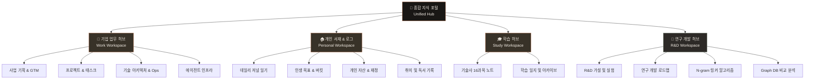

이곳은 **업무(Work)**, **개인(Personal)**, **학습(Study)**, **연구개발(R&D)** 영역을 모두 아우르는 통합 지식 허브입니다.
하나의 저장소 안에서 각 공간의 경계를 유지하며, 유기적으로 연결된 지식을 관리하고 확장해 보세요.

---

## 🗺️ 지식 지도 (Workspace Map)

---

## ⚡ 4대 영역 바로가기

### 🏢 **[[work/_index|Work (기업 업무 허브)]]**
*   **목적:** 회사 비즈니스, 프로젝트 관리, 개발 스택 및 시스템 인프라 아키이빙.
*   **주요 문서:** `[[business|사업기획]]`, `[[projects|프로젝트현황]]`, `[[development|기술개발]]`, `[[operations|운영관리]]`, `[[sales|영업자료]]`.
*   **시스템 관리:** `[[claude-code-mcp|AI Ops]]`, `[[knowledge-pipeline|검색 파이프라인]]`, `[[decap-cms|CMS 가이드]]`.

### 🏠 **[[personal/_index|Personal (개인 서재 & 로그)]]**
*   **목적:** 지극히 개인적인 일상, 성장 기록, 취미, 재정 계획을 관리하는 안식처.
*   **주요 문서:** `[[journal|데일리저널]]`, `[[life-goals|인생목표]]`, `[[finances|자산플래너]]`, `[[hobby|취미&독서]]`.

### 🎓 **[[study/_index|Study (학습 허브)]]**
*   **목적:** 방대한 스터디 노트를 마스터하는 **읽기 중심** 공간.
*   **주요 문서:** `[[study/_index#📚-과목-바로가기|기술사 16과목 스터디노트]]`.

### 🔬 **[[r-and-d/_index|R&D (연구 개발 허브)]]**
*   **목적:** 검색, RAG, 문서 자동화, 에이전트 협업 등 **연구개발 가설과 실험**을 다루는 **쓰기 중심** 공간.
*   **주요 문서:** `[[r-and-d|R&D 가설 허브]]`, `[[r-and-d-roadmap|R&D 로드맵]]`, `[[n-gram-linker|N-gram 링커]]`, `[[graph-databases|Graph DB 비교]]`.

---

## 📥 아이디어 보관함 (`Inbox`)

어디로 분류해야 할지 모르는 임시 메모, 갑자기 떠오른 비즈니스 아이디어, 오늘 배운 팁 등은 우선 **[[inbox|아이디어 보관함]]**에 자유롭게 던져 두세요.
정기적으로 이 공간을 비우며 적절한 카테고리(Work, Personal, Study, R&D)로 이동시키면 지식베이스의 신선함이 유지됩니다.

---

> [!TIP]
> **단축키 활용하기**
> - `Ctrl + P`를 누르면 문서 이름으로 빠르게 이동할 수 있습니다.
> - 새로운 문서를 만들고 연결하려면 대괄호 두 개 `[[새로운 문서 이름]]`을 본문에 적어세요.
> - Quartz 웹 포털에서 제공하는 연결성 그래프를 통해 내 지식들이 어떻게 연결되어 가고 있는지 한눈에 관찰할 수 있습니다.
