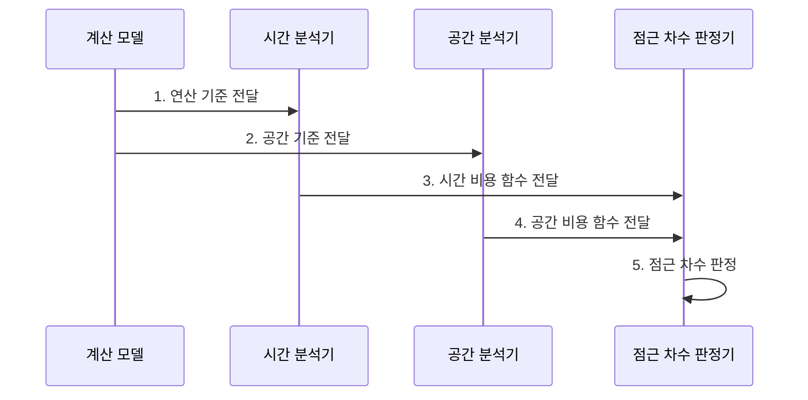

---
sidebar:
  order: 1
  label: "001. 알고리즘 시간복잡도•공간복잡도 (Time/Space Complexity)"
  badge:
    text: "기출 • 50%"
    variant: note
title: "알고리즘 시간복잡도•공간복잡도 (Time/Space Complexity)"
date: "2026-08-05T00:25:07+09:00"
tags:
  - "notes-basic-theory"
weight: 1
extra:
  question_no: "001"
  source_status: "기출"
  source_history: "131회"
  priority: 50
  priority_note: "131회 기출, 시간•공간 절충의 공통 근거"
---

## Ⅰ. 개요

<details>
<summary>핵심 용어</summary>

- **알고리즘 복잡도(Algorithmic Complexity)**: 입력 크기에 따른 자원 사용 증가를 분석하는 상위 개념이며 시간복잡도와 공간복잡도로 구분
- **점근 분석(Asymptotic Analysis)**: 상수와 하위항을 제외하고 큰 입력의 증가 형태를 비교하는 방법
- **자원 한도**: 시스템이 허용하는 최대 처리 시간이나 메모리 사용량

</details>

- 정의/개념: 알고리즘의 입력 증가에 따른 **연산량•메모리 증가** 를 나타내는 시간•공간 비용 척도
- 배경/필요성: 작은 입력의 실측만으로 큰 입력의 **자원 한도** 예측 곤란

#### 한줄 요약

- 택배 물량이 늘 때 분류 시간과 창고 공간이 얼마나 커지는지 보듯, 입력 증가에 따른 연산량과 메모리 증가를 예측한다.

## Ⅱ. 특징

<details>
<summary>핵심 용어</summary>

- **지배항(Dominant Term)**: 입력이 커질수록 전체 증가율을 결정하는 가장 빠르게 증가하는 항
- **빅오(Big-O)**: 입력 증가에 따른 비용의 점근적 상한 표기
- **빅세타(Big-Theta)**: 입력 증가에 따른 비용의 정확한 점근 차수 표기
- **빅오메가(Big-Omega)**: 입력 증가에 따른 비용의 점근적 하한 표기
- **시간•공간 상충**: 중간 결과를 저장해 재계산 시간을 줄이는 대신 메모리를 더 사용하는 관계
- **최선 사례(Best Case)**: 같은 입력 크기에서 비용이 가장 작은 입력 사례
- **평균 사례(Average Case)**: 입력 분포를 반영한 기대 비용 사례
- **최악 사례(Worst Case)**: 같은 입력 크기에서 비용이 가장 큰 입력 사례

</details>


> 입력 크기가 커질수록 붉은 O(n²)와 초록 O(n log n)이 파란 O(log n)•O(n)보다 빠르게 벌어지며, 기본 연산량을 정규화한 이론적 증가율이다.

- 하드웨어와 무관한 **점근 증가율•Big-O•Theta•Omega** 표기
- 재계산과 중간 결과 저장 사이의 **시간•공간 상충** 판단
- **최선•평균•최악** 입력별 비용 범위 분리

#### 한줄 요약

- 작업자 개인 속도를 제외하고 택배 물량에 따라 작업 시간과 창고 공간이 커지는 형태만 비교한다.

## Ⅲ. 구조 및 구성요소

<details>
<summary>핵심 용어</summary>

- **계산 모델**: 기본 연산 비용을 일정하다고 가정해 하드웨어 차이를 제외하는 분석 모델
- **기본 연산**: 비교•대입처럼 실행 횟수로 시간 비용을 대표하는 연산
- **보조 공간(Auxiliary Space)**: 입력 데이터 자체를 제외하고 알고리즘이 추가로 쓰는 메모리
- **점근 차수**: 상수와 하위항을 제외하고 지배항의 증가율로 분류한 비용 등급

</details>

```text
[계산 모델]
    |
    +-- [시간 분석기] --+
    |                    |
    `-- [공간 분석기] --+-- [점근 차수 판정기]
```

선의 의미: 계산 모델과 두 분석기, 차수 판정기 사이의 정적 분석 의존 관계

| 구성요소 | 책임 |
|:---|:---|
| 계산 모델 | **기본 연산** 의 단위 비용 규정 |
| 시간 분석기 | 입력 크기별 **기본 연산** 횟수 산정 |
| 공간 분석기 | 입력 크기별 최대 **보조 공간** 산정 |
| 점근 차수 판정기 | **지배항** 과 상•하한으로 증가율 분류 |

#### 한줄 요약

- 자와 저울의 기준을 먼저 맞춘 뒤 시간 분석기와 공간 분석기가 잰 비용을 점근 차수 판정기가 같은 증가율 등급으로 분류한다.

## Ⅳ. 흐름도

<details>
<summary>핵심 용어</summary>

- **비용 함수**: 입력 크기에 따라 시간이나 공간 사용량이 어떻게 증가하는지 나타내는 함수
- **상한•하한**: 입력이 커질 때 비용이 넘지 않는 위쪽 경계와 적어도 도달하는 아래쪽 경계

</details>



**동작 원리**

1. **연산 기준 전달**: 기본 연산의 단위 비용 제공
2. **공간 기준 전달**: 보조 공간의 포함 범위 제공
3. **시간 비용 함수 전달**: 입력별 연산 횟수로 함수 산정
4. **공간 비용 함수 전달**: 최대 보조 공간으로 함수 산정
5. **점근 차수 판정**: 지배항과 상•하한으로 증가율 분류

#### 한줄 요약

- 같은 물량표를 받은 두 측정자가 작업 횟수와 최대 창고 공간을 따로 재면 판정기가 가장 빨리 커지는 항으로 비용 등급을 정한다.

## Ⅴ. 종류 및 비교

<details>
<summary>핵심 용어</summary>

- **시간복잡도(Time Complexity)**: 입력 크기에 따라 기본 연산 횟수가 증가하는 정도
- **공간복잡도(Space Complexity)**: 입력 크기에 따라 최대 메모리 사용량이 증가하는 정도
- **추가 공간**: 입력 자체 외에 호출 스택•캐시•중간 결과 저장에 쓰는 메모리
- **점유 공간**: 실행 중 알고리즘이 실제로 차지하는 메모리 영역
- **할당기 비용**: 메모리 할당•해제와 배치에 드는 공간 비용
- **런타임 비용**: 프로그램 실행 환경이 추가로 사용하는 공간 비용

</details>

| 복잡도 | 시간복잡도 | 공간복잡도 |
|:---|:---|:---|
| 적용 기준 | **응답 시간** 한도가 우선일 때 | **메모리 예산** 이 우선일 때 |
| 핵심 특징 | **기본 연산** 횟수 증가율 | 최대 **점유 공간** 증가율 |
| 한계 | 같은 차수의 **상수 비용** 미반영 | 할당기•런타임 **추가 공간** 미반영 |

> 요약: **중간 결과 저장** 은 시간 절약•공간 증가

#### 한줄 요약

- 중간 결과를 저장하면 재계산은 줄지만 메모리 사용량은 늘어난다.

## Ⅵ. 실무 고려사항 및 대책

<details>
<summary>핵심 용어</summary>

- **대표 기본 연산**: 전체 시간 증가를 대표하는 비교•대입 등의 연산

</details>

| 문제 | 대책 | 효과 |
|:---|:---|:---|
| 비대표 **기본 연산** 을 세어 시간복잡도가 실제 병목과 불일치 | 지배 반복문의 동일 기본 연산으로 비용 함수 산정 | 입력 증가에 따른 **실행 비용 예측 정확도** 향상 |
| 평균 입력만 분석해 **최악 입력** 의 자원 한도 초과 은폐 | 입력 분포별 평균•최악 복잡도와 운영 상한 동시 검증 | 최대 부하의 **시간•공간 한도 초과** 방지 |
| 재귀 스택•캐시를 빼 **보조 공간** 과소평가 | 호출 깊이와 중간 결과 저장량을 공간 비용에 포함 | 최대 **메모리 사용량 예측** 정확도 향상 |
| 같은 점근 차수에서 **상수 비용** 차이로 응답시간 역전 | 목표 입력 구간의 동일 환경 벤치마크 병행 | 운영 구간의 **실제 우수 후보** 식별 |

#### 한줄 요약

- 최악 입력의 작업 횟수와 호출 스택까지 같은 비용 기준으로 센다.

## Ⅶ. 결론

<details>
<summary>핵심 용어</summary>

- **응답시간 한도**: 서비스가 요청 결과를 반환해야 하는 최대 허용 시간
- **메모리 한도**: 실행 중 알고리즘이 사용할 수 있는 최대 메모리 용량

</details>

- **응답•메모리 한도** 중 먼저 초과하는 자원 기준 알고리즘 선택

#### 한줄 요약

- 예상 입력에서 처리 시간과 메모리 중 먼저 한도에 닿는 자원을 찾아, 그 자원을 덜 쓰는 알고리즘을 우선 선택한다.
