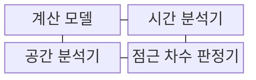
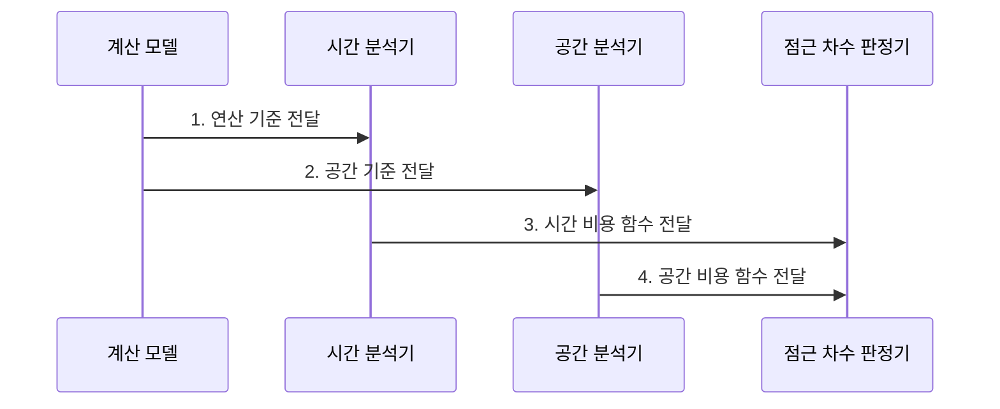

---
sidebar:
  order: 1
  label: "001. 알고리즘 시간복잡도•공간복잡도 (Time/Space Complexity)"
  badge:
    text: "기출 • 50%"
    variant: note
title: "알고리즘 시간복잡도•공간복잡도 (Time/Space Complexity)"
date: "2026-07-29T11:30:01+09:00"
tags:
  - "notes-basic-theory"
weight: 1
extra:
  question_no: "001"
  source_status: "기출"
  source_history: "131회"
  priority: 50
  priority_note: "131회 기출, 시간•공간 절충의 공통 근거"
---

## 미리 알고가기

- **시간•공간복잡도(Time/Space Complexity)**: 입력이 커질 때 연산량과 메모리 사용량이 얼마나 늘어나는지 나타내는 알고리즘 비용 척도
- **기본 연산**: 비교•대입처럼 실행 횟수로 시간 비용을 대표하는 연산
- **보조 공간(Auxiliary Space)**: 입력 데이터 자체를 제외하고 알고리즘이 추가로 쓰는 메모리
- **지배항(Dominant Term)**: 입력이 커질수록 전체 증가율을 결정하는 가장 빠르게 증가하는 항
- **점근 분석(Asymptotic Analysis)**: 상수와 하위항을 제외하고 큰 입력의 증가 형태를 비교하는 방법
- **빅오•빅세타•빅오메가(Big-O•Big-Theta•Big-Omega)**: 입력 증가에 따른 비용의 상한•정확한 차수•하한을 나타내는 점근 표기
- **계산 모델**: 기본 연산 비용을 일정하다고 가정해 하드웨어 차이를 제외하는 분석 모델
- **최선•평균•최악(Best/Average/Worst Case)**: 같은 입력 크기에서 가장 작거나 평균적이거나 가장 큰 비용을 구분하는 기준

## Ⅰ. 개요

- 정의/개념: 입력 증가에 따른 알고리즘 **연산량•메모리**의 점근 증가율 척도
- 배경/필요성: 작은 입력의 실측만으로 큰 입력의 **자원 한도** 예측 곤란

### 쉽게 이해하기 (학습용)

- 택배 물량이 늘 때 분류 시간과 창고 공간이 얼마나 커지는지 보듯, 입력 증가에 따른 연산량과 메모리 증가를 예측한다.

## Ⅱ. 특징

> 입력 크기가 커질수록 붉은 O(n²)와 초록 O(n log n)이 파란 O(log n)·O(n)보다 빠르게 벌어지며, 기본 연산량을 정규화한 이론적 증가율이다.

- 하드웨어와 무관한 **점근 증가율** 기반 확장성 비교
- 재계산과 중간 결과 저장 사이의 **시간•공간 상충** 판단
- **최선•평균•최악** 입력별 비용 범위 분리

### 쉽게 이해하기 (학습용)

- 작업자 개인 속도를 제외하고 택배 물량에 따라 작업 시간과 창고 공간이 커지는 형태만 비교한다.

## Ⅲ. 구조 및 구성요소

| 구성요소 | 책임 |
|:---|:---|
| 계산 모델 | **기본 연산**의 단위 비용 규정 |
| 시간 분석기 | 입력 크기별 **기본 연산** 횟수 산정 |
| 공간 분석기 | 입력 크기별 최대 **보조 공간** 산정 |
| 점근 차수 판정기 | **지배항**과 상•하한으로 증가율 분류 |

### 쉽게 이해하기 (학습용)

- 자와 저울의 기준을 먼저 맞춘 뒤 시간 분석기와 공간 분석기가 잰 비용을 점근 차수 판정기가 같은 증가율 등급으로 분류한다.

## Ⅳ. 흐름도

**동작 원리**

1. **연산 기준 전달**: 입력 크기별 기본 연산 횟수 산정
2. **공간 기준 전달**: 실행 중 최대 보조 공간 산정
3. **시간 비용 함수 전달**: 시간 비용의 지배항 분리
4. **공간 비용 함수 전달**: 공간 비용의 상•하한 분류

### 쉽게 이해하기 (학습용)

- 같은 물량표를 받은 두 측정자가 작업 횟수와 최대 창고 공간을 따로 재면 판정기가 가장 빨리 커지는 항으로 비용 등급을 정한다.

## Ⅴ. 종류 및 비교

| 복잡도 | 시간복잡도 | 공간복잡도 |
|:---|:---|:---|
| 적용 기준 | **응답 시간** 한도가 우선일 때 | **메모리 예산**이 우선일 때 |
| 핵심 특징 | **기본 연산** 횟수 증가율 | 최대 **점유 공간** 증가율 |
| 한계 | 같은 차수의 **상수 비용** 미반영 | 할당기•런타임 **추가 공간** 미반영 |

> 요약: **중간 결과 저장**은 시간 절약•공간 증가

### 쉽게 이해하기 (학습용)

- 중간 결과를 저장하면 재계산은 줄지만 메모리 사용량은 늘어난다.

## Ⅵ. 실무 고려사항 및 대책

| 핵심 고려사항 | 위험 | 대책 |
|:---|:---|:---|
| **기본 연산** 선정 | 비대표 연산 계수로 **시간복잡도** 왜곡 | 지배 반복문에서 동일 기본 연산으로 비용 함수 산정 |
| **최악 입력** 누락 | 평균 비용만으로 자원 한도 초과 은폐 | 입력 분포별 평균•최악 복잡도와 운영 상한 동시 검증 |
| **보조 공간** 누락 | 재귀 스택•캐시를 제외해 최대 메모리 과소평가 | 호출 깊이와 중간 결과 저장량을 공간 비용에 포함 |
| **상수 비용** 무시 | 같은 점근 차수 후보의 실제 응답 시간 역전 | 목표 입력 구간에서 동일 환경 벤치마크 병행 |

### 쉽게 이해하기 (학습용)

- 최악 입력의 작업 횟수와 호출 스택까지 같은 비용 기준으로 센다.

## Ⅶ. 결론

- **응답•메모리 한도** 중 먼저 초과하는 자원 기준 알고리즘 선택

### 쉽게 이해하기 (학습용)

- 예상 입력에서 처리 시간과 메모리 중 먼저 한도에 닿는 자원을 찾아, 그 자원을 덜 쓰는 알고리즘을 우선 선택한다.
