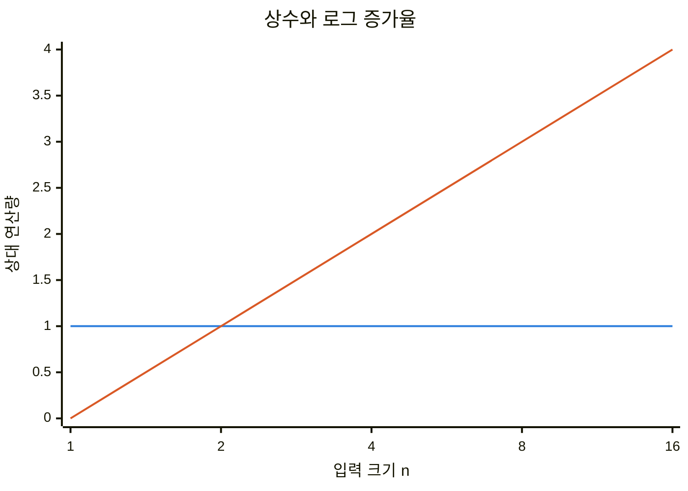
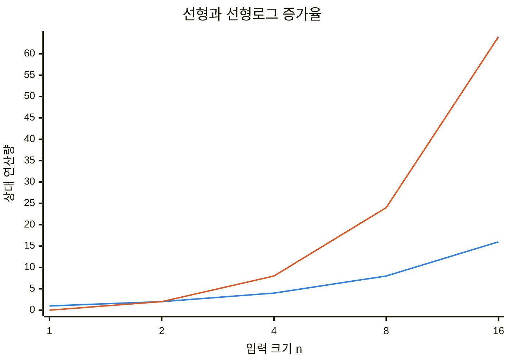
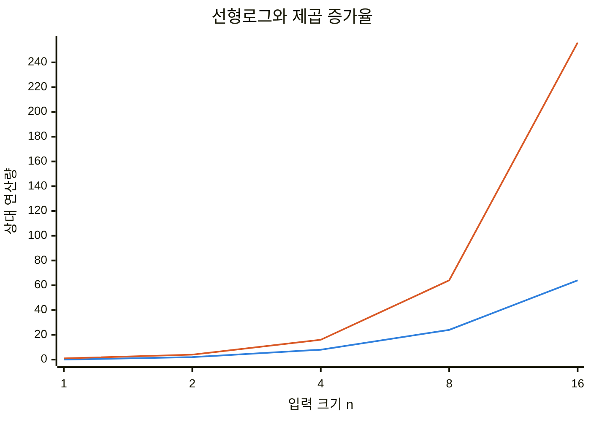

---
sidebar:
  order: 2
  label: "002. 빅오 표기법 (Big-O Notation)"
  badge:
    text: "기출 · 30%"
    variant: note
title: "빅오 표기법 (Big-O Notation)"
date: "2026-07-28T21:28:41+09:00"
tags:
  - "notes-basic-theory"
weight: 2
extra:
  question_no: "002"
  source_status: "기출"
  source_history: "131회"
  priority: 30
  priority_note: "성장률 비교의 기초 표현이라 독립성은 낮음"
---

## 미리 알고가기

- **빅오 표기법(Big-O Notation, $O$)**: 입력이 충분히 커진 뒤 비용 증가율이 넘지 않는 점근 상한을 나타내는 표기
- **입력 크기 $n$**: 비용 증가의 기준이 되는 데이터 수나 문제 규모
- **비용 함수 $T(n)$**: 입력 크기별 알고리즘 연산량을 나타내는 함수
- **기준 함수 $g(n)$**: 비용 함수의 증가율과 비교할 로그·선형·다항·지수 함수
- **빅세타(Big-Theta, $\Theta$)**: 상한과 하한을 함께 제한해 정확한 점근 차수를 나타내는 표기
- **빅오메가(Big-Omega, $\Omega$)**: 입력이 커진 뒤 비용 증가율이 밑돌지 않는 점근 하한 표기
- **양의 상수 $c$**: 기준 함수를 확대해 비용 함수의 상한선으로 만드는 배율
- **기준점 $n_0$**: 점근 상한 부등식이 이후 모든 입력에서 성립하기 시작하는 값
- **지배항(Dominant Term)**: 입력이 커질수록 비용 함수의 증가율을 결정하는 항
- **상한 증인(Witness)**: 특정 빅오 관계를 성립시키는 양의 상수 $c$와 기준점 $n_0$
- **실측값(Empirical Measurement)**: 실제 환경에서 같은 점근 차수의 후보를 구분하는 실행 시간이나 메모리 값

## Ⅰ. 개요

- 정의/개념: 비용 증가율의 **점근 상한**을 나타내는 표기
- 기존 한계: 제한된 **실측값**만으로 대규모 증가율 예측 곤란

### 쉽게 이해하기 (학습용)

- 물량이 충분히 많아진 뒤 작업량이 넘지 않을 천장선을 그어 두듯, 빅오는 큰 입력에서 비용 증가율의 상한을 나타낸다.

## Ⅱ. 특징

- 상수·하위항을 제외한 **지배항** 중심 분류
- 상수 배 구현 차이를 묶는 **점근 추상화**
- 양의 상수·기준점이 증명하는 **상한 관계**

■ **$O(1)$** &nbsp;&nbsp; ■ **$O(\log n)$**

> 로그 증가는 입력이 배가될 때 한 단계씩 증가

■ **$O(n)$** &nbsp;&nbsp; ■ **$O(n\log n)$**

> 선형로그 증가는 입력 처리와 분할 단계를 결합

■ **$O(n\log n)$** &nbsp;&nbsp; ■ **$O(n^2)$**

> 제곱 증가는 입력 쌍의 증가로 급격히 확대

### 쉽게 이해하기 (학습용)

- 정확한 작업 횟수 대신 물량이 커질 때의 증가 모양을 보듯, 빅오는 상수와 하위항을 제외해 장기 증가율이 같은 비용을 한 등급으로 묶는다.

## Ⅲ. 아키텍처

$$
T(n) \in O(g(n)) \iff \exists c>0,n_0>0,\ \forall n\ge n_0:\ 0\le T(n)\le c g(n)
$$

| 구성요소 | 책임 |
|:---|:---|
| 비용 함수 $T(n)$ | 입력 크기별 알고리즘 **연산량** 표현 |
| 기준 함수 $g(n)$ | 비교할 **점근 증가율** 표현 |
| 상한 증인 $c,n_0$ | 부등식의 배율·성립 시작점 지정 |
| 판정 조건 | 모든 $n\ge n_0$에서 **점근 상한** 확인 |

> 요약: **비용 함수**를 덮는 기준 함수와 **상한 증인** 제시

### 쉽게 이해하기 (학습용)

- 물량별 작업 횟수를 식으로 적고 천장 모양을 고른 뒤, 천장 높이와 적용 시작 물량을 제시하면 그 상한이 계속 유지됨을 보일 수 있다.

## Ⅳ. 종류 및 비교

| 점근 표기법 | 빅오 $O(g(n))$ | 빅세타 $\Theta(g(n))$ | 빅오메가 $\Omega(g(n))$ |
|:---|:---|:---|:---|
| 적용 기준 | **증가율 상한** 보증 | 정확한 **점근 차수** 표현 | **증가율 하한** 보증 |
| 핵심 특징 | 기준 함수 이하로 제한 | 상한·하한을 같은 함수로 제한 | 기준 함수 이상으로 제한 |
| 한계 | 느슨하면 **정확한 차수** 은폐 | 같은 상·하한 증명 필요 | **자원 상한** 판단 불가 |

> 요약: 상한은 **빅오**, 정확한 차수는 **빅세타**

### 쉽게 이해하기 (학습용)

- 작업량의 천장만 그리면 빅오, 바닥만 그리면 빅오메가이며, 같은 증가 모양으로 천장과 바닥을 함께 잡으면 빅세타다.

## Ⅴ. 실무 고려사항 및 대책

| 고려사항 | 대책 | 효과 |
|:---|:---|:---|
| 느슨한 함수도 성립하는 **상한 모호성** | 성립하는 최소 **점근 차수** 제시 | 후보 간 **증가율 차이** 식별 |
| 같은 차수의 **상수 비용** 차이 | 대표 입력의 **실측값** 병행 | 운영 구간의 **응답 시간** 판별 |
| 상한과 입력 사례의 **개념 혼동** | 최선·평균·최악 조건 명시 | **비용 사례**와 상한 구분 |

### 쉽게 이해하기 (학습용)

- 천장선은 여러 높이로 그을 수 있으므로 가장 낮은 증가 등급을 쓰고, 같은 등급의 후보는 실제 입력에서 걸린 시간까지 재어 구분한다.

## Ⅵ. 결론

- 입력 상한에서 **점근 차수** 우선, 같은 차수는 실측으로 결정

### 쉽게 이해하기 (학습용)

- 예상 입력이 커질 때의 증가 등급으로 후보를 먼저 추리고, 같은 등급끼리는 실제 환경에서 실행해 더 빠른 쪽을 고른다.
