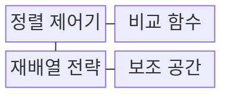
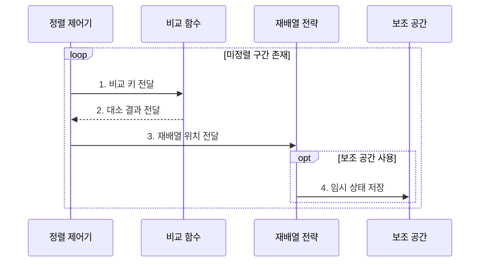

---
sidebar:
  order: 3
  label: "003. 정렬 알고리즘 비교: 퀵•병합•힙•버블 (Sorting Algorithms)"
  badge:
    text: "기출 • 50%"
    variant: note
title: "정렬 알고리즘 비교: 퀵•병합•힙•버블 (Sorting Algorithms)"
date: "2026-08-02T16:03:00+09:00"
tags:
  - "notes-basic-theory"
weight: 3
extra:
  question_no: "003"
  source_status: "기출"
  source_history: "122회, 131회"
  priority: 50
  priority_note: "반복 기출, 정렬 선택•복잡도 비교 가치가 높음"
---

## Ⅰ. 개요

핵심 용어

- **정렬 알고리즘(Sorting Algorithm)**: 원소를 키 순서로 재배열해 탐색•병합 같은 후속 처리를 돕는 알고리즘
- **키(Key)**: 원소의 정렬 순서를 결정하는 비교 기준값

- 정의/개념: 원소를 **키 순서** 로 재배열하는 알고리즘군
- 배경/필요성: 무순서 데이터는 **탐색•병합** 의 반복 비교 증가

#### 한줄 요약

- 책을 번호순으로 세워 두면 원하는 번호를 찾거나 두 책장을 합칠 때 처음부터 차례대로 모두 뒤질 필요가 줄어든다.

## Ⅱ. 특징

핵심 용어

- **비교 정렬(Comparison Sort)**: 원소의 대소 비교 결과만으로 순서를 정하는 방식
- **비교 정렬 하한 $\Omega(n\log n)$**: 비교만 사용하는 일반 정렬이 최악에 필요한 최소 비교 증가율
- **안정 정렬(Stable Sort)**: 같은 키를 가진 원소의 입력 순서를 보존하는 정렬
- **제자리 정렬(In-Place Sort)**: 입력 크기에 비례하는 별도 배열 없이 원본 공간에서 재배열하는 정렬
- **보조 공간(Auxiliary Space)**: 입력 배열 외에 정렬 과정에서 추가로 사용하는 메모리
- **평균•최악 시간복잡도**: 입력 분포에서 기대되는 연산 증가율과 가장 불리한 입력에서의 연산 증가율

> 입력이 커질수록 붉은 $n^2$ 비교 연산량이 파란 $n\log_2 n$보다 빠르게 증가하며, 정렬별 실측 시간이 아닌 이론적 증가율이다.

- 일반 **비교 정렬 하한** $\Omega(n\log n)$
- 알고리즘별 **평균•최악 시간복잡도** 차이
- 보조 공간•**안정성•제자리 정렬** 의 상이한 조합

#### 한줄 요약

- 책이 많아질수록 모든 쌍을 비교하는 방식은 분할 정렬보다 비교 횟수가 훨씬 빠르게 늘어난다.

## Ⅲ. 구조 및 구성요소

핵심 용어

- **정렬 제어기**: 미정렬 구간과 반복•재귀의 처리 순서를 관리하는 역할
- **비교 함수**: 두 원소의 키를 받아 대소•동등 관계를 판정하는 역할
- **재배열 전략**: 비교 결과에 따라 원소를 분할•병합•교환하는 역할
- **보조 공간(Auxiliary Space)**: 정렬 중 임시 배열이나 재귀 상태를 보관하는 추가 메모리

| 구성요소 | 책임 |
|:---|:---|
| 정렬 제어기 | 미정렬 구간과 **처리 순서** 관리 |
| 비교 함수 | 두 키의 **대소•동등 관계** 판정 |
| 재배열 전략 | 분할•병합•교환으로 위치 변경 |
| 보조 공간 | **임시 배열**•재귀 상태 보관 |

#### 한줄 요약

- 도서관의 작업 지시자•번호 비교자•책 이동자•임시 선반처럼 네 요소가 처리 순서•비교•재배열•보관 책임을 나눠 맡는다.

## Ⅳ. 흐름도

핵심 용어

- **미정렬 구간**: 아직 최종 순서가 확정되지 않아 비교와 재배열을 계속해야 하는 원소 범위
- **비교 키**: 두 원소의 대소 관계를 판정하기 위해 비교 함수에 전달하는 값
- **임시 상태**: 병합 배열이나 재귀 호출처럼 정렬 도중 보조 공간에 보관하는 정보

**동작 원리**

1. **비교 키 전달**: 현재 전략이 요구하는 원소 쌍 지정
2. **대소 결과 전달**: 키 순서에 따른 위치 변경 여부 판정
3. **재배열 위치 전달**: 분할•병합•교환으로 정렬 구간 확정
4. **임시 상태 저장**: 병합 배열•재귀 상태의 보조 공간 반영

#### 한줄 요약

- 지시자가 두 책 번호를 비교자에게 보내 순서를 확인하고 이동자에게 새 위치를 알려 주는 과정을 미정렬 구간이 사라질 때까지 반복한다.

## Ⅴ. 종류 및 비교

핵심 용어

- **퀵 정렬(Quick Sort)**: 피벗으로 배열을 분할하고 각 구간을 재귀 정렬하는 방식
- **병합 정렬(Merge Sort)**: 배열을 나눠 정렬한 뒤 순서대로 병합하는 안정 정렬
- **힙 정렬(Heap Sort)**: 최대 힙의 루트를 반복 추출해 제자리에서 순서를 확정하는 방식
- **버블 정렬(Bubble Sort)**: 역순인 이웃을 반복 교환해 큰 원소를 뒤로 보내는 방식
- **피벗(Pivot)**: 퀵 정렬에서 원소를 작은 쪽과 큰 쪽으로 나누는 기준값
- **캐시 지역성(Cache Locality)**: 가까운 메모리 위치를 연속 접근해 캐시 적중률을 높이는 성질

| 정렬 알고리즘 | 퀵 | 병합 | 힙 | 버블 |
|:---|:---|:---|:---|:---|
| 적용 기준 | 메모리 내 배열•**평균 속도** | **안정성**•외부 정렬 | **최악 상한**•공간 제한 | 거의 정렬된 소규모 입력 |
| 핵심 특징 | **피벗 분할**•제자리 정렬 | 순차 **분할•병합** | **최대 힙** 반복 추출 | 인접 **역순 교환** |
| 한계 | 불균형 시 **제곱 시간** | 입력 크기의 **임시 배열** | 불안정•낮은 **캐시 지역성** | 평균•최악 **제곱 시간** |

> 요약: 평균 속도•안정성•공간•**최악 상한** 에 따른 정렬 선택

#### 한줄 요약

- 빠른 평균 처리에는 퀵, 같은 키 순서 보존에는 병합, 최악 시간 보장에는 힙, 거의 정렬된 소량 데이터에는 버블을 선택한다.

## Ⅵ. 실무 고려사항 및 대책

핵심 용어

- **외부 정렬(External Sorting)**: 메모리보다 큰 데이터를 구간별로 정렬한 뒤 저장장치에서 병합하는 방식
- **불균형 분할(Unbalanced Partition)**: 퀵 정렬 원소가 피벗 한쪽에 몰려 재귀 깊이가 커지는 분할
- **무작위 피벗**: 특정 입력에서의 불균형 분할 가능성을 낮추도록 임의로 선택한 분할 기준값
- **키 사전 계산**: 반복 비교 전에 객체의 정렬 키를 한 번 계산해 두는 최적화
- **안정 정렬(Stable Sort)**: 같은 키를 가진 원소의 입력 순서를 보존하는 정렬
- **외부 병합**: 메모리에서 나누어 정렬한 구간들을 저장장치에서 순서대로 합치는 처리

| 문제 | 대책 | 효과 |
|:---|:---|:---|
| 메모리보다 큰 **입력 크기** 로 인메모리 정렬 중 고갈 | 구간 정렬 후 **외부 병합** 적용 | 제한 메모리에서 **대용량 정렬 완주** |
| 동일 키의 **입력 순서** 가 불안정 정렬로 변경 | 순서 보존 요구 시 **안정 정렬** 선택 | 연관 레코드의 **선행 순서 보존** |
| 퀵 정렬의 **불균형 분할** 로 최악 $O(n^2)$ 퇴화 | 무작위 피벗과 깊이 한계 이후 힙 정렬 전환 | 재귀 깊이와 **최악 수행시간 상한** 통제 |
| 객체의 높은 **비교 비용**으로 키 계산 지연 누적 | 키 사전 계산과 참조 기반 재배열 적용 | 반복 비교의 **연산·복사 비용 감소** |

#### 한줄 요약

- 책이 선반보다 많으면 작은 묶음으로 정렬한 뒤 순서대로 합친다.

## Ⅶ. 결론

핵심 용어

- **안정성**: 같은 키를 가진 원소의 입력 순서를 정렬 후에도 보존하는 성질
- **최악 상한**: 가장 불리한 입력에서도 수행시간이 넘지 않는 점근 경계

- 입력 규모•**안정성**•메모리•최악 상한으로 정렬 방식 결정

#### 한줄 요약

- 데이터가 메모리를 넘는지, 같은 키 순서를 지켜야 하는지, 최악 시간을 보장해야 하는지에 따라 정렬 방식을 정한다.
