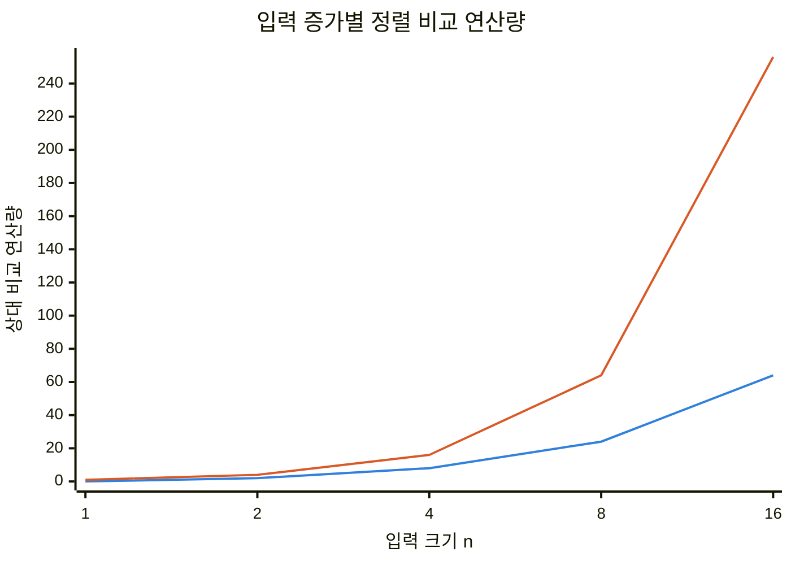
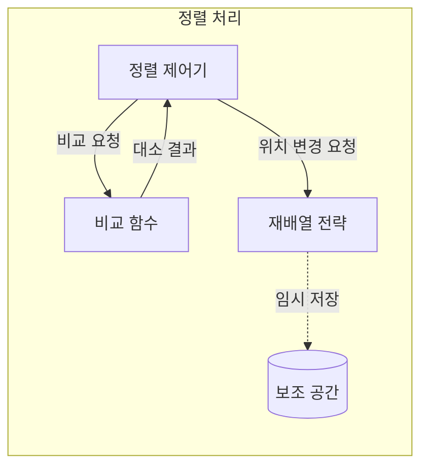
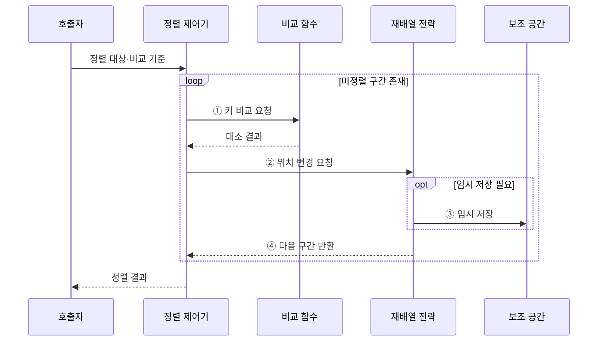

---
sidebar:
  order: 3
  label: "003. 정렬 알고리즘 비교 — 퀵·병합·힙·버블 (Sorting Algorithms)"
  badge:
    text: "기출 · 50%"
    variant: note
title: "정렬 알고리즘 비교 — 퀵·병합·힙·버블 (Sorting Algorithms)"
date: "2026-07-28T21:58:00+09:00"
tags:
  - "notes-basic-theory"
weight: 3
extra:
  question_no: "003"
  source_status: "기출"
  source_history: "122회, 131회"
  priority: 50
  priority_note: "반복 기출, 정렬 선택·복잡도 비교 가치가 높음"
---

## 미리 알고가기

- **정렬 알고리즘(Sorting Algorithm)**: 원소를 키 순서로 재배열해 탐색·병합 같은 후속 처리를 돕는 알고리즘
- **비교 정렬(Comparison Sort)**: 원소의 대소 비교 결과만으로 순서를 정하는 방식
- **비교 정렬 하한 $\Omega(n\log n)$**: 비교만 사용하는 일반 정렬이 최악에 필요한 최소 비교 증가율
- **안정 정렬(Stable Sort)**: 같은 키를 가진 원소의 입력 순서를 보존하는 정렬
- **제자리 정렬(In-Place Sort)**: 입력 크기에 비례하는 별도 배열 없이 원본 공간에서 재배열하는 정렬
- **피벗(Pivot)**: 퀵 정렬에서 작은 원소와 큰 원소를 나누는 기준값
- **최대 힙(Max Heap)**: 부모 키가 자식 키 이상이어서 최댓값이 루트에 있는 완전 이진 트리
- **외부 정렬(External Sorting)**: 메모리보다 큰 데이터를 구간별로 정렬한 뒤 저장장치에서 병합하는 방식
- **불균형 분할(Unbalanced Partition)**: 퀵 정렬 원소가 피벗 한쪽에 몰려 재귀 깊이가 커지는 분할
- **캐시 지역성(Cache Locality)**: 인접한 메모리를 연속 접근할 때 캐시 적중 가능성이 높아지는 성질
- **퀵 정렬(Quick Sort)**: 피벗으로 배열을 분할하고 각 구간을 재귀 정렬하는 방식
- **병합 정렬(Merge Sort)**: 배열을 나눠 정렬한 뒤 순서대로 병합하는 안정 정렬
- **힙 정렬(Heap Sort)**: 최대 힙의 루트를 반복 추출해 제자리에서 순서를 확정하는 방식
- **버블 정렬(Bubble Sort)**: 역순인 이웃을 반복 교환해 큰 원소를 뒤로 보내는 방식
- **정렬 제어기**: 미정렬 구간과 반복·재귀의 처리 순서를 관리하는 역할
- **비교 함수**: 두 원소의 키를 받아 대소·동등 관계를 판정하는 역할
- **재배열 전략**: 비교 결과에 따라 원소를 분할·병합·교환하는 역할
- **보조 공간(Auxiliary Space)**: 정렬 중 임시 배열이나 재귀 상태를 보관하는 추가 메모리

## Ⅰ. 개요

- 정의/개념: 원소를 **키 순서**로 재배열하는 알고리즘군
- 기존 한계: 무순서 데이터는 **탐색·병합**의 반복 비교 증가

### 쉽게 이해하기 (학습용)

- 책을 번호순으로 세워 두면 원하는 번호를 찾거나 두 책장을 합칠 때 처음부터 차례대로 모두 뒤질 필요가 줄어든다.

## Ⅱ. 특징

- 일반 **비교 정렬 하한** $\Omega(n\log n)$
- 평균·최악 시간 사이의 **성능 상충**
- 보조 공간·**안정성**·제자리 여부의 선택

■ **$O(n\log n)$** &nbsp;&nbsp; ■ **$O(n^2)$**

> 제곱 시간 정렬은 입력 증가 시 비교량이 급증

### 쉽게 이해하기 (학습용)

- 책 번호만 서로 비교해 줄을 세우면 필요한 비교 횟수에 한계가 있으므로, 속도·임시 선반·같은 번호 책의 원래 순서 중 무엇을 지킬지 정해야 한다.

## Ⅲ. 아키텍처

**도표안 A — 구조도**

**도표안 B — sequenceDiagram**

| 구성요소 | 책임 |
|:---|:---|
| 정렬 제어기 | 미정렬 구간과 **처리 순서** 관리 |
| 비교 함수 | 두 키의 **대소·동등 관계** 판정 |
| 재배열 전략 | 분할·병합·교환으로 위치 변경 |
| 보조 공간 | **임시 배열**·재귀 상태 보관 |

**동작 원리**

- **① 키 비교 요청**: 현재 구간의 두 비교 키 전달
- **② 위치 변경 요청**: 대소 결과에 따른 분할·병합·교환 지시
- **③ 임시 저장**: 병합·재귀에 필요한 중간 상태 보관
- **④ 다음 구간 반환**: 남은 미정렬 범위를 제어기에 전달

### 쉽게 이해하기 (학습용)

- 책에서 번호를 읽는 방법, 앞뒤를 가리는 규칙, 실제로 옮기는 방식과 임시 선반 크기가 정렬 성능을 결정한다.

## Ⅳ. 종류 및 비교

| 정렬 알고리즘 | 퀵 | 병합 | 힙 | 버블 |
|:---|:---|:---|:---|:---|
| 적용 기준 | 메모리 내 배열·**평균 속도** | **안정성**·외부 정렬 | **최악 상한**·공간 제한 | 거의 정렬된 소규모 입력 |
| 핵심 특징 | **피벗 분할**·제자리 정렬 | 순차 **분할·병합** | **최대 힙** 반복 추출 | 인접 **역순 교환** |
| 한계 | 불균형 시 **제곱 시간** | 입력 크기의 **임시 배열** | 불안정·낮은 **캐시 지역성** | 평균·최악 **제곱 시간** |

> 요약: 평균 속도·안정성·공간·**최악 상한**의 맞바꿈

### 쉽게 이해하기 (학습용)

- 메모리 안의 평균 속도는 퀵, 같은 키 순서와 외부 정렬은 병합, 최악 시간과 공간 제한은 힙, 작은 거의 정렬된 입력은 버블이 알맞다.

## Ⅴ. 실무 고려사항 및 대책

| 고려사항 | 대책 | 효과 |
|:---|:---|:---|
| 입력이 메모리를 넘는 **용량 제약** | 구간 정렬 후 **외부 병합** | 최대 **메모리 점유량** 제한 |
| 동일 키의 **입력 순서** 보존 | 요구 시 **안정 정렬** 선택 | 연관 레코드의 상대 순서 유지 |
| 퀵 정렬의 **불균형 분할** | 깊이 한계에서 힙으로 전환 | 최악 **제곱 시간** 퇴화 방지 |
| 객체 비교의 **키 비용** 증가 | 키 사전 계산·참조 재배열 | 중복 계산·데이터 이동 감소 |

### 쉽게 이해하기 (학습용)

- 책이 선반보다 많으면 묶음별로 정렬해 합치고, 같은 번호 순서를 지켜야 하면 안정 정렬을 쓰며, 퀵 분할이 계속 치우치면 힙으로 전환한다.

## Ⅵ. 결론

- 입력 규모·**안정성**·메모리·최악 상한으로 정렬 방식 결정

### 쉽게 이해하기 (학습용)

- 데이터가 메모리에 들어오는지, 같은 키 순서를 지켜야 하는지, 평균과 최악 시간 중 무엇이 중요한지를 정하면 알맞은 정렬 방식이 좁혀진다.
