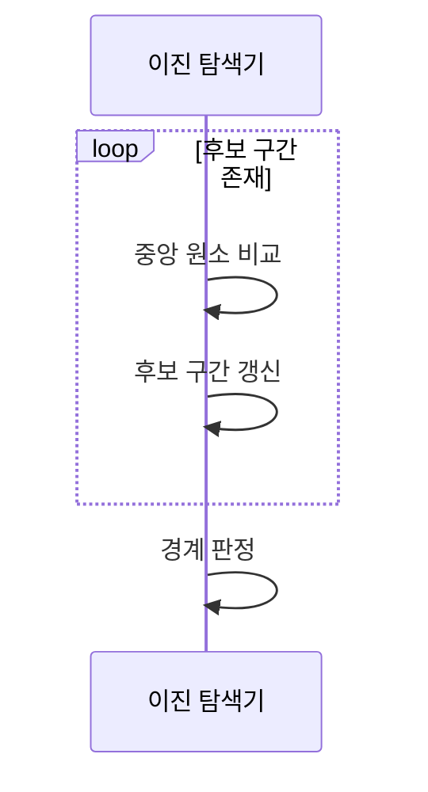

---
sidebar:
  order: 4
  label: "004. 이진 탐색 (Binary Search)"
  badge:
    text: "미출제 · 30%"
    variant: note
title: "이진 탐색 (Binary Search)"
date: "2026-07-25T23:40:00+09:00"
tags:
  - "notes-basic-theory"
weight: 4
extra:
  question_no: "004"
  source_status: "미출제"
  source_history: ""
  priority: 30
  priority_note: "탐색 절차와 복잡도 계산의 대표 기초"
---

## 미리 알고가기

- **이진 탐색(Binary Search)**: 중앙값 비교로 정렬 구간을 절반씩 줄여 목표 위치를 찾는 탐색
- **임의 접근(Random Access)**: 인덱스로 원하는 원소를 바로 읽어 탐색 이동을 줄이는 방식
- **하한(Lower Bound)**: 목표값 이상인 첫 원소 위치
- **상한(Upper Bound)**: 목표값 초과인 첫 원소 위치
- **반열린 구간 $[low, high)$**: ‘로우 이상 하이 미만’으로 읽고 포함 쪽에는 대괄호, 제외 쪽에는 소괄호를 쓰는 수학 관례에 따라 시작 인덱스는 포함하고 끝 인덱스는 제외하여 남은 탐색 범위를 나타냄
- **입력 크기 $n$**: ‘엔’으로 읽고 항목 개수(Number)의 머리글자를 쓰는 관례에 따라 탐색할 원소 수를 나타내며 최대 비교 횟수 차트의 가로축이 되는 변수
- **상수 시간 $O(1)$**: ‘빅 오 원’으로 읽고 증가 차수(Order)를 나타내는 $O$에 상수 1을 넣는 관례에 따라 입력 크기와 무관하게 인덱스로 한 원소에 접근하는 비용을 나타냄
- **로그 시간 $O(\log n)$**: ‘빅 오 로그 엔’으로 읽고 남은 범위를 일정 비율로 반복해 줄일 때 필요한 단계 수를 로그로 적는 표기 관례에 따라, 원소가 두 배로 늘어도 비교가 한 번만 늘어나는 증가율을 나타냄
- **선형 탐색(Linear Search)**: 처음부터 원소를 차례로 비교해 목표를 찾는 탐색
- **해시 조회(Hash Lookup)**: 키를 배열 위치로 바꿔 목표값에 직접 접근하는 조회
- **인덱스(Index)**: 배열 원소의 위치를 나타내는 번호이며 이진 탐색에서 후보 구간의 양 끝과 중앙 위치를 가리킴
- **해시 충돌(Hash Collision)**: 서로 다른 키가 같은 배열 위치로 변환되어 한 버킷에서 추가 비교가 필요한 상태
- **버킷(Bucket)**: 해시 함수가 산출한 인덱스가 가리키며 키와 값을 저장하는 공간
- **시계열(Time Series)**: 시간 순서에 따라 기록된 데이터이며 하한과 상한으로 특정 시간 구간을 추출하는 적용 대상
- **버전(Version)**: 소프트웨어 배포본의 변경 순서를 구분하는 식별값이며 상한 직전 위치로 요청 이하의 최신 배포본을 찾는 대상

## Ⅰ. 개요

- 정의/개념: **중앙 비교**로 정렬 구간을 줄여 목표 위치를 찾는 **탐색 기법**
- 기존 한계: **선형 탐색**은 정렬 정보를 활용하지 못해 전수 비교

### 쉽게 이해하기 (학습용)

- 두꺼운 사전을 한가운데 펼쳐 찾는 낱말이 앞쪽이면 뒤쪽 절반을 통째로 덮어 버리는 일을 되풀이하는 것이며, 가나다순으로 정리돼 있어야만 덮은 쪽에 답이 없다고 단정할 수 있어 정렬이 전제 조건이 된다.

## Ⅱ. 특징

- 정렬 데이터의 후보 구간을 절반씩 버리는 **분할 탐색**
- 입력 2배당 최대 비교 1회만 느는 **로그 증가율**

```mermaid
xychart-beta
    title "입력 2배: 최대 비교 1회 증가"
    x-axis "입력 크기 n" [1, 2, 4, 8, 16]
    y-axis "최대 비교 횟수" 0 --> 5
    line [1, 2, 3, 4, 5]
```

### 쉽게 이해하기 (학습용)

- 천 권짜리 서가가 이천 권으로 늘어도 가운데를 한 번 더 갈라 보면 되므로, 항목이 두 배가 될 때마다 늘어나는 비교는 딱 한 번뿐이고 이 완만한 계단이 곧 로그 증가율이다.

## Ⅲ. 아키텍처 및 구성요소

| 설계 요소 | 설명 |
|:---|:---|
| 정렬 배열 | **키 순서** 원소 보관·$O(1)$ 임의 접근 제공 |
| 이진 탐색기 | 중앙 키 대소로 **구간 갱신 방향** 결정 |
| 후보 구간 | 양 끝 **인덱스**로 남은 탐색 범위 보관 |

> 요약: **정렬 배열** 위에서 탐색기가 **후보 구간**을 좁히는 구조

### 쉽게 이해하기 (학습용)

- 키 순으로 꽂힌 책장이 원본 자료이고, 그 양 끝에 꽂아 둔 두 개의 책갈피가 아직 남은 후보 범위이며, 가운데 책을 뽑아 목표와 대소를 견주고 책갈피 하나를 안쪽으로 당기는 사람이 탐색기다.

## Ⅳ. 원리 및 절차 흐름도



| 절차 | 설명 |
|:---|:---|
| 중앙 원소 비교 | 중앙 키와 목표값의 **대소 판정** |
| 후보 구간 갱신 | 대소 방향 반대편 **절반 제거** |
| 경계 판정 | 구간 소진 시 일치·**하한·상한** 확정 |

### 쉽게 이해하기 (학습용)

- 가운데 책이 목표보다 뒤면 오른쪽 책갈피를, 앞이면 왼쪽 책갈피를 그 자리로 당겨 남은 칸이 매번 반으로 줄고, 두 책갈피가 맞붙어 남은 칸이 사라지는 순간 일치인지 하한·상한 위치인지 아니면 없는 값인지가 확정된다.

## Ⅴ. 종류 및 비교

| 탐색 방식 | 이진 탐색 (Binary Search) | 선형 탐색 (Linear Search) | 해시 조회 (Hash Lookup) |
|:---|:---|:---|:---|
| 적용 기준 | 정렬 유지되고 **범위·경계 조회** 반복 | **미정렬** 소규모 일회 조회 | 정확 키 **단건 조회**가 빈번할 때 |
| 핵심 특징 | **중앙 비교**로 후보 절반 제거 | 처음부터 **순차 비교** | **해시값**으로 버킷 직접 접근 |
| 한계 | 갱신 시 **정렬 유지 비용** 발생 | 입력 증가 시 **비교 횟수** 선형 급증 | **충돌 집중**·범위 조회 불가 |

### 쉽게 이해하기 (학습용)

- 가나다순 사전은 가운데를 갈라 반씩 좁히고, 뒤죽박죽 쌓인 메모는 처음부터 한 장씩 넘길 수밖에 없으며, 이름표 붙은 서랍은 그 칸을 바로 열면 되지만 순서를 버린 탓에 '가부터 나까지 전부' 같은 범위 요청은 아예 받지 못한다.

## Ⅵ. 실무 사례

1. 시계열 색인은 **하한·상한**으로 시간 구간 추출

### 쉽게 이해하기 (학습용)

- 한 달 치 로그에서 오후 2시부터 3시까지만 보고 싶을 때, 2시 이상인 첫 기록과 3시 초과인 첫 기록의 자리만 집어내면 그 사이를 통째로 잘라 낼 수 있어 전체를 훑지 않아도 된다.

## Ⅶ. 결론

- 정렬 **범위 조회**는 이진 탐색, 정확 키 조회는 **해시** 선택

### 쉽게 이해하기 (학습용)

- '이 시각부터 저 시각까지'처럼 구간을 통째로 잘라 내야 하면 순서가 살아 있는 이진 탐색이라야 하고, 반대로 정확한 키 하나만 자주 꺼낸다면 순서를 버리고 서랍을 바로 여는 해시가 빠르다.
