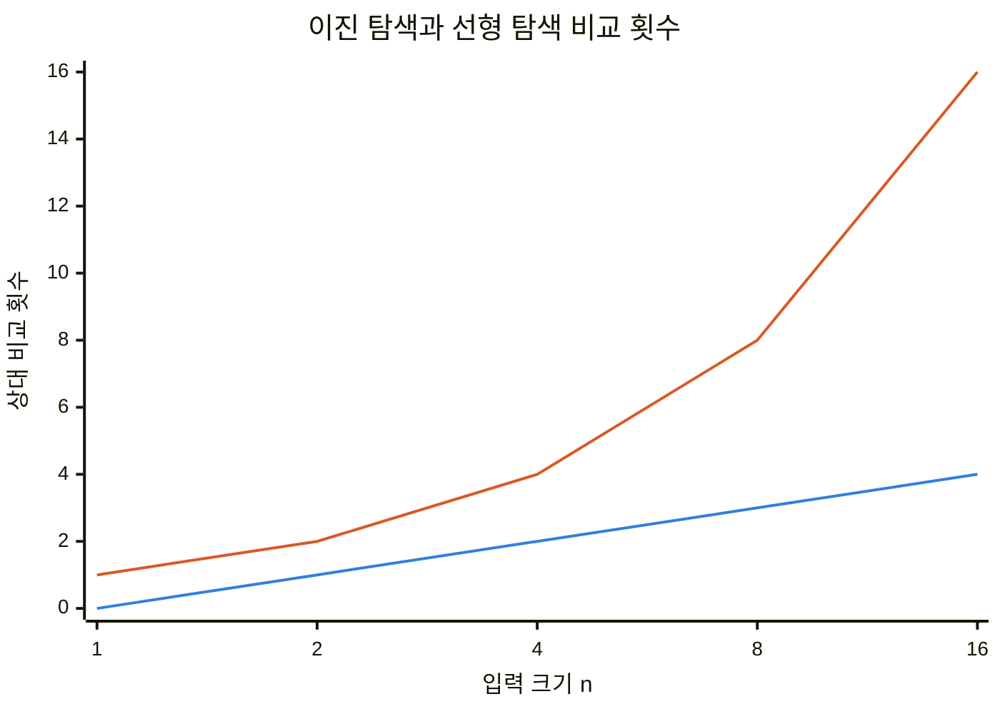
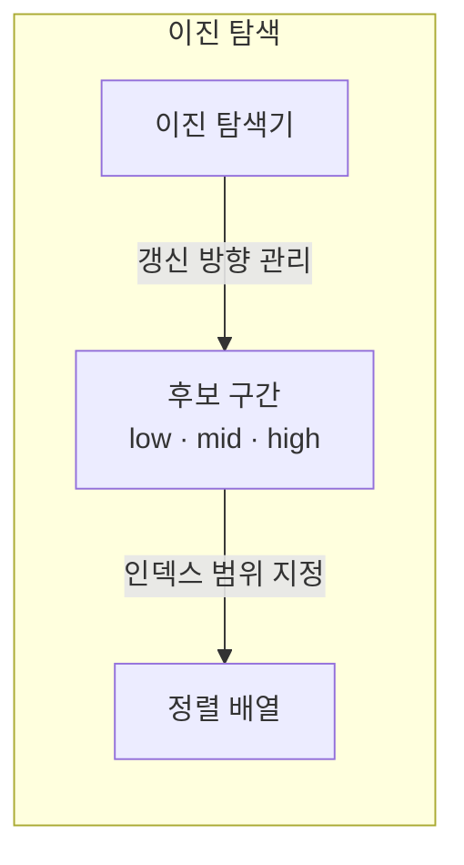
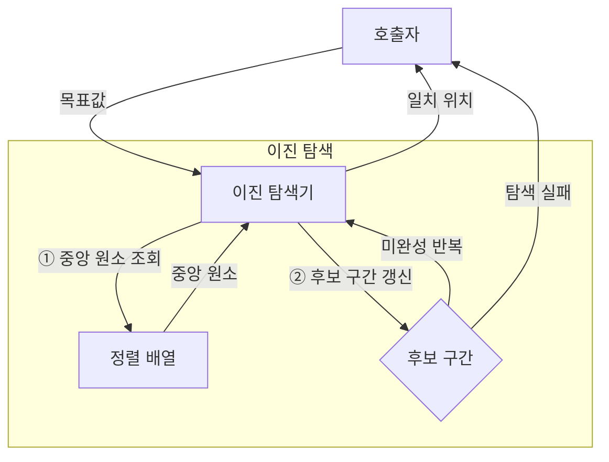
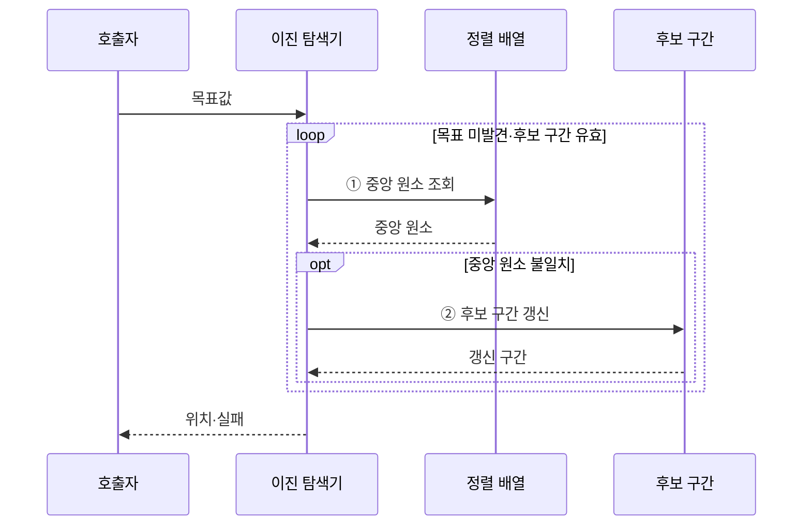

---
sidebar:
  order: 4
  label: "004. 이진 탐색 (Binary Search)"
  badge:
    text: "미출 · 30%"
    variant: note
title: "이진 탐색 (Binary Search)"
date: "2026-07-28T18:47:00+09:00"
tags:
  - "notes-basic-theory"
weight: 4
extra:
  question_no: "004"
  source_status: "미출"
  source_history: ""
  priority: 30
  priority_note: "탐색 절차와 복잡도 계산의 대표 기초"
---

## 미리 알고가기

- **이진 탐색(Binary Search)**: 중앙 원소와 목표값을 비교해 정렬된 후보 구간을 절반씩 줄이는 탐색
- **정렬 불변식(Sorted Invariant)**: 탐색 중에도 후보 구간의 원소가 키 순서를 유지한다는 전제
- **임의 접근(Random Access)**: 인덱스로 원하는 배열 원소를 일정한 시간에 읽는 방식
- **반열린 구간 $[low, high)$**: 시작 인덱스는 포함하고 끝 인덱스는 제외하는 후보 범위
- **하한(Lower Bound)**: 목표값 이상인 첫 원소의 위치
- **상한(Upper Bound)**: 목표값을 초과하는 첫 원소의 위치
- **로그 시간 $O(\log n)$**: 입력이 배수로 늘어도 처리 단계가 일정한 수만큼 증가하는 시간
- **선형 탐색(Linear Search)**: 첫 원소부터 차례로 비교해 목표값을 찾는 탐색
- **해시 조회(Hash Lookup)**: 키를 버킷 위치로 변환해 정확 키를 조회하는 방식
- **해시 충돌(Hash Collision)**: 서로 다른 키가 같은 버킷 위치로 변환된 상태

## Ⅰ. 개요

- 정의/개념: **중앙 비교**로 정렬 후보를 절반씩 줄이는 탐색
- 기존 한계: **선형 탐색**은 정렬 순서를 활용하지 못해 전수 비교

### 쉽게 이해하기 (학습용)

- 가나다순 사전의 가운데를 펼쳐 찾는 단어가 있을 수 없는 절반을 버리는 방식이며, 페이지가 순서대로 정렬돼 있어야 한다.

## Ⅱ. 특징

- 정렬 불변식에 따른 **후보 구간 절반 제거**
- 입력 2배당 비교 1회가 느는 **로그 증가율**
- 정확 일치와 경계 위치를 찾는 **하한·상한 변형**

■ **이진 탐색** &nbsp;&nbsp; ■ **선형 탐색**

> 이진 탐색은 입력 2배당 비교가 한 단계 증가

### 쉽게 이해하기 (학습용)

- 항목 수가 두 배가 되어도 가운데를 한 번 더 가르면 되며, 같은 원리로 첫 일치 위치와 마지막 경계도 찾을 수 있다.

## Ⅲ. 아키텍처

**도표안 A — 구조도**

**도표안 B — 동작 흐름도**

**도표안 C — sequenceDiagram**

| 구성요소 | 책임 |
|:---|:---|
| 이진 탐색기 | 중앙 키 대소로 **갱신 방향** 결정 |
| 정렬 배열 | **키 순서**와 임의 접근 제공 |
| 후보 구간 | 양 끝 **인덱스**·유효성 보관 |

**동작 원리**

- **① 중앙 원소 조회**: 중앙 키와 목표값 대소 판정
- **② 후보 구간 갱신**: 목표가 없는 절반을 탐색 범위에서 제거

### 쉽게 이해하기 (학습용)

- 탐색기는 정렬 배열의 가운데를 비교하고 목표값이 없다고 판정된 절반을 버리는 일을, 찾거나 구간이 빌 때까지 반복한다.

## Ⅳ. 종류 및 비교

| 탐색 방식 | 이진 탐색 | 선형 탐색 | 해시 조회 |
|:---|:---|:---|:---|
| 적용 기준 | 정렬된 **범위·경계 조회** | 미정렬 소규모 **일회 조회** | 정확 키 **단건 조회** |
| 핵심 특징 | **중앙 비교**로 후보 절반 제거 | 첫 원소부터 **순차 비교** | **해시값**으로 버킷 접근 |
| 한계 | 삽입 시 **정렬 유지 비용** | 입력 증가만큼 비교 증가 | **충돌**·범위 조회 제약 |

### 쉽게 이해하기 (학습용)

- 정렬된 범위나 경계를 찾을 때는 이진 탐색, 작은 미정렬 목록은 선형 탐색, 정확 키를 반복 조회할 때는 해시가 알맞다.

## Ⅴ. 실무 고려사항 및 대책

| 고려사항 | 대책 | 효과 |
|:---|:---|:---|
| 잦은 삽입의 **정렬 유지 비용** | 갱신 누적 후 **배치 정렬** | 반복 원소 이동 감소 |
| 중복 키의 **경계 의미** 혼동 | 반열린 구간·**하한·상한** 통일 | 범위 결과의 일관성 유지 |
| 중앙값의 **정수 오버플로** | $low+(high-low)/2$ 계산 | 잘못된 **인덱스** 방지 |
| 비교 함수와 **정렬 기준** 불일치 | 정렬·탐색에 같은 비교자 사용 | 누락·오탐 방지 |

### 쉽게 이해하기 (학습용)

- 삽입 비용을 감당할 수 있는지 확인하고, 중복 키의 경계와 중앙값 계산 방식, 정렬과 탐색에 쓰는 비교 규칙을 하나로 맞춘다.

## Ⅵ. 결론

- 정렬 유지 가능·**범위 조회**면 이진 탐색, 단건 갱신은 해시

### 쉽게 이해하기 (학습용)

- 정렬 상태를 유지하면서 범위나 경계를 자주 찾으면 이진 탐색을 쓰고, 정확한 키 한 건의 조회와 갱신이 중심이면 해시를 고른다.
