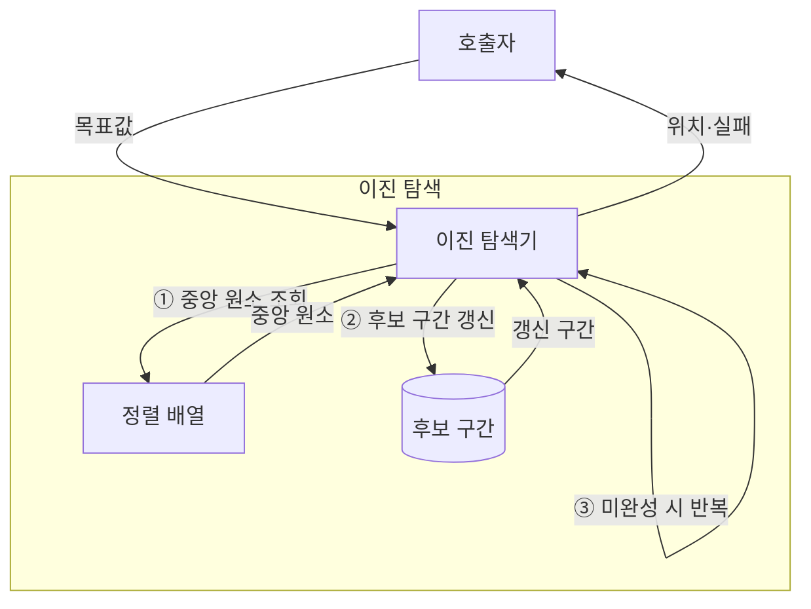

---
sidebar:
  order: 4
  label: "004. 이진 탐색 (Binary Search)"
  badge:
    text: "미출 · 30%"
    variant: note
title: "이진 탐색 (Binary Search)"
date: "2026-07-28T16:54:00+09:00"
tags:
  - "notes-basic-theory"
weight: 4
extra:
  question_no: "004"
  source_status: "미출"
  source_history: ""
  priority: 30
  priority_note: "탐색 절차와 복잡도 계산의 대표 기초"
---

## 미리 알고가기

- **이진 탐색(Binary Search)**: 중앙값 비교로 정렬 구간을 절반씩 줄여 목표 위치를 찾는 탐색
- **임의 접근(Random Access)**: 인덱스로 원하는 원소를 바로 읽어 탐색 이동을 줄이는 방식
- **하한(Lower Bound)**: 목표값 이상인 첫 원소 위치
- **상한(Upper Bound)**: 목표값 초과인 첫 원소 위치
- **반열린 구간 $[low, high)$**: 시작 인덱스는 포함하고 끝 인덱스는 제외한 탐색 범위
- **입력 크기 $n$**: 탐색할 원소 수
- **상수 시간 $O(1)$**: 입력 크기와 무관한 처리 시간
- **로그 시간 $O(\log n)$**: 입력이 배수로 늘 때 단계 수가 일정하게 증가하는 시간
- **선형 탐색(Linear Search)**: 처음부터 원소를 차례로 비교해 목표를 찾는 탐색
- **해시 조회(Hash Lookup)**: 키를 배열 위치로 바꿔 목표값에 직접 접근하는 조회
- **인덱스(Index)**: 배열 원소의 위치를 나타내는 번호이며 이진 탐색에서 후보 구간의 양 끝과 중앙 위치를 가리킴
- **해시 충돌(Hash Collision)**: 서로 다른 키가 같은 배열 위치로 변환되어 한 버킷에서 추가 비교가 필요한 상태
- **버킷(Bucket)**: 해시 함수가 산출한 인덱스가 가리키며 키와 값을 저장하는 공간
- **시계열(Time Series)**: 시간 순서에 따라 기록된 데이터이며 하한과 상한으로 특정 시간 구간을 추출하는 적용 대상

## Ⅰ. 개요

- 정의/개념: **중앙 비교**로 정렬 구간을 줄여 목표 위치를 찾는 **탐색 기법**
- 기존 한계: **선형 탐색**은 정렬 정보를 활용하지 못해 전수 비교

### 쉽게 이해하기 (학습용)

- 가나다순 사전의 가운데를 펼쳐 목표가 없는 절반을 버리는 방식으로, 정렬이 전제된다.

## Ⅱ. 특징

- 정렬 데이터의 후보 구간을 절반씩 버리는 **분할 탐색**
- 입력 2배당 최대 비교 1회만 느는 **로그 증가율**

### 쉽게 이해하기 (학습용)

- 항목이 두 배가 되어도 가운데를 가르는 비교는 한 번만 늘어난다.

## Ⅲ. 아키텍처

| 구성요소 | 책임 |
|:---|:---|
| 이진 탐색기 | 중앙 키 대소로 **갱신 방향** 결정 |
| 정렬 배열 | **키 순서** 원소·임의 접근 제공 |
| 후보 구간 | 양 끝 **인덱스**로 탐색 범위 보관 |

**동작 원리**

- **① 중앙 원소 조회**: 후보 구간 중앙 키와 목표값 비교
- **② 후보 구간 갱신**: 대소 결과로 왼쪽·오른쪽 절반 제거
- **③ 미완성 시 반복**: 일치하거나 구간이 빌 때까지 반복

### 쉽게 이해하기 (학습용)

- 탐색기는 정렬 배열의 가운데를 비교하고 후보 구간을 절반씩 좁혀 결과를 반환한다.

## Ⅳ. 종류 및 비교

| 탐색 방식 | 이진 탐색 | 선형 탐색 | 해시 조회 |
|:---|:---|:---|:---|
| 적용 기준 | 정렬된 **범위·경계 조회** 반복 | **미정렬** 소규모 일회 조회 | 정확 키 **단건 조회** 반복 |
| 핵심 특징 | **중앙 비교**로 후보 절반 제거 | 처음부터 **순차 비교** | **해시값**으로 버킷 직접 접근 |
| 한계 | 갱신 시 **정렬 유지 비용** 발생 | 입력 증가 시 **비교 횟수** 선형 증가 | **충돌 집중**·범위 조회 불가 |

### 쉽게 이해하기 (학습용)

- 범위 조회는 이진 탐색, 미정렬 소규모 조회는 선형 탐색, 정확 키 조회는 해시가 적합하다.

## Ⅴ. 실무 고려사항 및 대책

| 고려사항 | 대책 | 효과 |
|:---|:---|:---|
| 잦은 삽입의 **정렬 유지 비용** | 갱신 누적 후 **배치 정렬** | 반복 원소 이동 감소 |
| 중복 키의 **경계 의미** 혼동 | **반열린 구간**·하한·상한 통일 | 범위 결과 일관성 유지 |
| 중앙값 계산의 **정수 오버플로** | $low+(high-low)/2$ 계산 | 잘못된 **인덱스** 방지 |
| 시계열의 **구간 조회** | **하한·상한**으로 시간 경계 탐색 | 대상 로그 구간 정확히 한정 |

### 쉽게 이해하기 (학습용)

- 정렬 유지 비용과 중복 키의 경계 규칙, 안전한 중앙값 계산을 정하고 시계열은 하한·상한으로 필요한 로그 범위만 찾는다.

## Ⅵ. 결론

- **범위 조회**면 이진 탐색, 단건 조회·갱신 우선이면 **해시**

### 쉽게 이해하기 (학습용)

- 사전처럼 정렬된 범위를 반복 탐색할 때는 가운데를 가르고, 한 이름만 자주 찾거나 삽입이 잦으면 해시 사물함으로 바꾼다.
