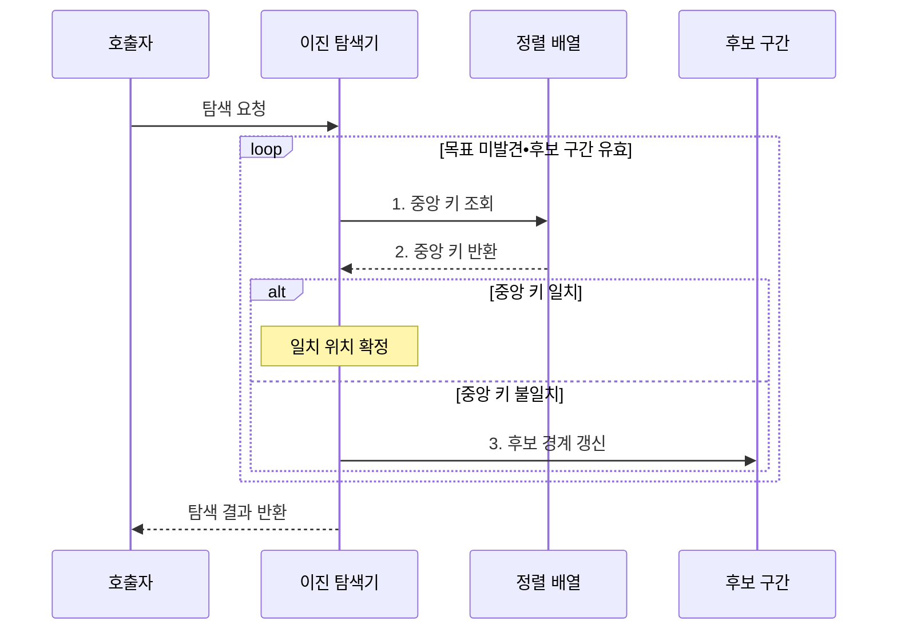

---
sidebar:
  order: 4
  label: "004. 이진 탐색 (Binary Search)"
  badge:
    text: "미출 • 30%"
    variant: note
title: "이진 탐색 (Binary Search)"
date: "2026-08-02T16:04:00+09:00"
tags:
  - "notes-basic-theory"
weight: 4
extra:
  question_no: "004"
  source_status: "미출"
  source_history: ""
  priority: 30
  priority_note: "탐색 절차와 복잡도 계산의 대표 기초"
---

## Ⅰ. 개요

핵심 용어

- **이진 탐색(Binary Search)**: 정렬된 배열의 중앙 원소와 목표값을 비교해 후보 구간을 절반씩 줄이는 탐색 알고리즘
- **선형 탐색(Linear Search)**: 첫 원소부터 차례로 비교해 목표값을 찾는 탐색
- **중앙 키**: 현재 후보 구간의 가운데 원소에서 목표값과 비교하는 값

- 정의/개념: 정렬된 배열에서 **중앙 키 비교**로 후보 구간을 절반씩 줄이는 탐색 알고리즘
- 배경/필요성: **선형 탐색**은 정렬 순서를 활용하지 못해 전수 비교

#### 한줄 요약

- 가나다순 사전의 가운데를 펼쳐 찾는 단어가 있을 수 없는 절반을 버리는 방식이며, 페이지가 순서대로 정렬돼 있어야 한다.

## Ⅱ. 특징

핵심 용어

- **정렬 불변식(Sorted Invariant)**: 탐색 중에도 후보 구간의 원소가 키 순서를 유지한다는 전제
- **로그 시간 $O(\log n)$**: 입력이 배수로 늘어도 처리 단계가 일정한 수만큼 증가하는 시간
- **하한•상한(Lower•Upper Bound)**: 목표값 이상인 첫 위치와 목표값을 초과하는 첫 위치

> 입력이 두 배가 될 때 파란 이진 탐색은 한 단계만 늘지만 붉은 선형 탐색은 입력 크기만큼 늘며, 정렬 배열을 가정한 이론적 비교 횟수다.

- 정렬 불변식에 따른 **후보 구간 절반 제거**
- 입력 2배당 비교 1회가 느는 **로그 증가율**
- 정확 일치와 경계 위치를 찾는 **하한•상한 변형**

#### 한줄 요약

- 항목 수가 두 배가 되어도 가운데를 한 번 더 가르면 되며, 같은 원리로 첫 일치 위치와 마지막 경계도 찾을 수 있다.

## Ⅲ. 구조 및 구성요소

핵심 용어

- **임의 접근(Random Access)**: 인덱스로 원하는 배열 원소를 일정한 시간에 읽는 방식
- **후보 구간**: 목표값이 존재할 가능성이 남아 있는 배열의 인덱스 범위
- **중앙 키**: 후보 구간의 가운데 원소에서 비교에 사용하는 값

| 구성요소 | 책임 |
|:---|:---|
| 이진 탐색기 | 중앙 키 대소로 **갱신 방향** 결정 |
| 정렬 배열 | **키 순서**와 **임의 접근** 제공 |
| 후보 구간 | 양 끝 **인덱스**•유효성 보관 |

#### 한줄 요약

- 사전의 탐색 담당자가 정렬된 페이지와 현재 후보 범위를 함께 보유해 가운데 비교와 범위 축소 책임을 분리한다.

## Ⅳ. 흐름도

핵심 용어

- **중앙 인덱스**: 후보 구간을 좌우로 나누기 위해 선택하는 가운데 위치
- **정수 오버플로(Integer Overflow)**: 계산 결과가 정수형의 표현 범위를 넘어 잘못된 값으로 바뀌는 현상
- **후보 경계**: 다음 탐색에서 포함할 구간의 시작과 끝 인덱스

**동작 원리**

1. **중앙 키 조회**: 오버플로를 피한 중앙 인덱스 산정
2. **중앙 키 반환**: 목표값과 비교해 일치•좌•우 판정
3. **후보 경계 갱신**: 목표가 없는 절반을 후보에서 제외

#### 한줄 요약

- 탐색기는 정렬 배열의 가운데를 비교하고 목표값이 없다고 판정된 절반을 버리는 일을, 찾거나 구간이 빌 때까지 반복한다.

## Ⅴ. 종류 및 비교

핵심 용어

- **이진 탐색(Binary Search)**: 정렬된 배열의 중앙 키를 비교해 후보를 절반씩 제거하는 방식
- **선형 탐색(Linear Search)**: 원소를 처음부터 순서대로 비교하는 방식
- **해시 조회(Hash Lookup)**: 키를 버킷 위치로 변환해 정확한 키를 조회하는 방식
- **해시 충돌(Hash Collision)**: 서로 다른 키가 같은 버킷 위치로 변환된 상태
- **해시값(Hash Value)**: 키를 해시 함수에 넣어 얻은 버킷 위치 계산값
- **버킷(Bucket)**: 같은 해시 위치로 매핑된 원소를 저장하는 공간

| 탐색 방식 | 이진 탐색 | 선형 탐색 | 해시 조회 |
|:---|:---|:---|:---|
| 적용 기준 | 정렬된 **범위•경계 조회** | 미정렬 소규모 **일회 조회** | 정확 키 **단건 조회** |
| 핵심 특징 | **중앙 비교**로 후보 절반 제거 | 첫 원소부터 **순차 비교** | **해시값**으로 버킷 접근 |
| 한계 | 삽입 시 **정렬 유지 비용** | 입력 증가만큼 비교 증가 | **충돌**•범위 조회 제약 |

#### 한줄 요약

- 정렬된 범위나 경계를 찾을 때는 이진 탐색, 작은 미정렬 목록은 선형 탐색, 정확 키를 반복 조회할 때는 해시가 알맞다.

## Ⅵ. 실무 고려사항 및 대책

핵심 용어

- **반열린 구간 $[low, high)$**: 시작 인덱스는 포함하고 끝 인덱스는 제외하는 후보 범위
- **하한•상한(Lower•Upper Bound)**: 중복 키 범위의 시작과 끝을 정하는 경계 위치
- **비교 함수**: 두 키의 순서와 일치 여부를 동일한 규칙으로 판정하는 함수
- **배치 정렬(Batch Sorting)**: 여러 갱신을 모은 뒤 한 번에 정렬해 유지 비용을 줄이는 방식
- **균형 탐색 트리(Balanced Search Tree)**: 높이를 로그 수준으로 유지해 조회와 삽입을 함께 지원하는 트리

| 문제 | 대책 | 효과 |
|:---|:---|:---|
| 잦은 삽입의 **정렬 유지 비용**이 조회 이득을 초과 | 갱신 누적 후 배치 정렬 또는 균형 탐색 트리 적용 | 갱신 빈도에 맞는 **총 처리비용 절감** |
| 중복 키의 **경계 의미**가 불명확해 범위 결과 불일치 | 반열린 구간과 **하한·상한** 계약 고정 | 중복 구간의 **반환 범위 일관성** 확보 |
| 큰 중앙 인덱스 합산으로 **정수 오버플로** 발생 | $low+(high-low)/2$ 방식 적용 | 중앙값 계산의 **범위 안전성** 확보 |
| 탐색·정렬의 비교 기준 불일치로 누락·오탐 | 정렬과 탐색에 동일 비교 함수 적용 | 이진 탐색의 **순서 전제 보장** |

#### 한줄 요약

- 정렬과 탐색의 비교 규칙을 맞춰 버릴 절반을 정확히 판정한다.

## Ⅶ. 결론

핵심 용어

- **정렬 유지 비용**: 삽입•수정 뒤에도 이진 탐색이 가능하도록 원소 순서를 보존하는 비용
- **범위 조회**: 특정 조건에 속하는 연속된 키 구간을 찾는 조회

- **정렬 유지**•범위 조회면 이진 탐색, 정확 키 반복 조회는 해시

#### 한줄 요약

- 정렬 상태를 유지하며 범위나 경계를 찾으면 이진 탐색을 쓰고, 정확 키를 반복 조회하면 해시를 선택한다.
