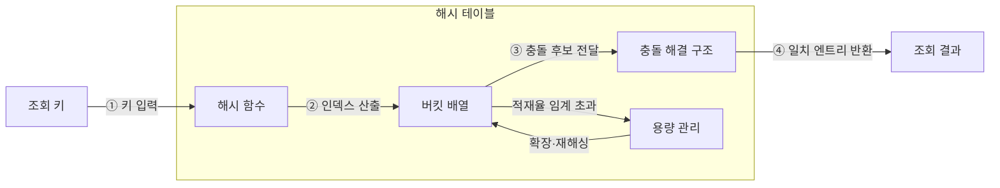

---
sidebar:
  order: 5
  label: "005. 해시 테이블 (Hash Table)"
  badge:
    text: "미출 · 30%"
    variant: note
title: "해시 테이블 (Hash Table)"
date: "2026-07-28T11:40:57+09:00"
tags:
  - "notes-basic-theory"
weight: 5
extra:
  question_no: "005"
  source_status: "미출"
  source_history: ""
  priority: 30
  priority_note: "충돌 처리·적재율이 좌우하는 해시 설계"
---

## 미리 알고가기

- **해시 테이블(Hash Table)**: 키를 배열 인덱스로 변환해 값을 빠르게 저장·조회하는 자료구조
- **해시 함수**: 키를 해시값으로 바꿔 접근할 배열 인덱스를 산출하는 함수
- **충돌(Collision)**: 서로 다른 키가 같은 인덱스에 배정되는 현상
- **버킷(Bucket)**: 해시 함수가 산출한 인덱스가 가리키며 키·값 엔트리나 충돌 체인을 담는 배열 저장 공간
- **엔트리(Entry)**: 해시 테이블에 함께 저장되는 키와 값의 한 쌍
- **체이닝(Chaining)**: 같은 버킷에 배정된 여러 엔트리를 연결 구조로 묶어 충돌을 해결하는 방식
- **탐사(Probing)**: 충돌 시 정해진 순서로 다른 버킷을 찾아 키를 저장·조회하는 절차
- **적재율(Load Factor)**: 원소 수를 버킷 수로 나눈 비율이며 재해싱 시점을 판단하는 값
- **재해싱(Rehashing)**: 버킷을 늘리고 키를 재배치해 충돌 탐색을 줄이는 작업
- **해시 충돌 서비스 거부(Hash Collision Denial-of-Service, DoS)**: 공격자가 같은 버킷으로 몰리는 키만 골라 대량 전송해 상수 시간이던 조회를 최악 선형 시간으로 퇴화시키고 서버를 마비시키는 공격
- **균형 이진 탐색 트리(Balanced Binary Search Tree)**: 높이를 제한해 키 순서와 범위 탐색을 지원하며 연산 단계를 로그 수준으로 유지하는 트리
- **정렬 배열(Sorted Array)**: 원소를 키 순서의 연속 공간에 저장해 이진 탐색을 지원하는 배열
- **무작위 해시 시드(Randomized Hash Seed)**: 실행마다 해시 계산을 바꿔 의도적 충돌 예측을 어렵게 하는 값
- **선형 탐색(Linear Search)**: 후보를 처음부터 차례로 비교하며 충돌 집중 시 해시 조회가 퇴화하는 탐색 방식
- **트리 회전(Tree Rotation)**: 부모·자식 연결을 국소적으로 바꿔 키 순서는 유지하면서 이진 탐색 트리의 높이 균형을 복원하는 연산
- **매개변수 맵(Parameter Map)**: 요청의 매개변수 이름을 키로, 전달값을 값으로 저장하여 단건 조회에 사용하는 해시 기반 자료구조

## Ⅰ. 개요

- 정의/개념: 키를 **배열 인덱스**로 바꿔 값을 찾는 **자료구조**
- 기존 한계: 키 순서가 없는 자료는 **선형 비교** 외에 조회 수단 부재

### 쉽게 이해하기 (학습용)

- 이름으로 사물함 번호를 계산해 해당 칸으로 가듯, 해시는 키를 인덱스로 바꿔 처음부터 비교하지 않고 값을 찾는다.

## Ⅱ. 특징

- **해시 함수**로 키를 버킷 **인덱스**로 직접 변환
- **충돌 해결 방식**·**적재율**에 좌우되는 조회 단계 수

### 쉽게 이해하기 (학습용)

- 다른 이름이 같은 사물함 번호를 받거나 칸이 차면 이름표를 더 대조해야 하므로, 충돌 방식과 적재율이 조회 단계를 좌우한다.

## Ⅲ. 아키텍처

| 구성요소 | 책임 | 흐름상 역할 |
|:---|:---|:---|
| 해시 함수 | 키를 **해시값**으로 바꿔 인덱스 산출 | ① 키 수신 → ② **인덱스** 반환 |
| 버킷 배열 | 인덱스별 **키·값 엔트리** 저장 | ② 접근 → ③ **충돌 후보** 전달 |
| 충돌 해결 구조 | **체이닝·탐사**로 같은 인덱스 키 구분 | ③ 원본 키 대조 → ④ 일치 엔트리 반환 |
| 용량 관리 | **적재율** 임계치에서 버킷 용량 조정 | 임계 초과 시 확장·**재해싱** |

> 요약: **인덱스 산출** 후 후보 키 대조·결과 반환

### 쉽게 이해하기 (학습용)

- 이름으로 사물함을 찾고 이름표가 맞는 물건을 돌려주며, 칸이 붐비는 때에만 사물함을 늘려 다시 배치한다.

## Ⅳ. 고려사항 및 대책

| 고려사항 | 대책 | 효과 |
|:---|:---|:---|
| 키 분포에 따른 **충돌 집중** | 데이터 특성에 맞는 **해시 함수** 선정 | 버킷별 **체인 길이** 편차 감소 |
| 적재율 증가에 따른 **탐사 길이** 확대 | 임계 **적재율**에서 선제 재해싱 | 평균 **조회 단계** 증가 억제 |
| 의도적 충돌의 **서비스 중단** | 요청 키에 **무작위 해시 시드** 적용 | 최악 조회를 노린 **충돌 예측** 억제 |

### 쉽게 이해하기 (학습용)

- 이름이 고르게 퍼지는 번호 계산법을 쓰고 붐비기 전에 칸을 늘리며, 계산 규칙을 숨기면 긴 충돌 탐색을 줄일 수 있다.

## Ⅴ. 종류 및 비교

| 탐색 자료구조 | 해시 테이블 (Hash Table) | 균형 이진 탐색 트리 | 정렬 배열 (Sorted Array) |
|:---|:---|:---|:---|
| 적용 기준 | 범위 조회 없는 정확 키 **단건 조회** | **범위 탐색**·정렬 순회 필요 | 삽입 드물고 **조회 빈번** |
| 핵심 특징 | **해시값**으로 버킷 직접 접근 | **균형 높이**로 키 순서 유지 | **연속 공간**에 키 순서 유지 |
| 한계 | **충돌 집중** 시 조회 선형 퇴화 | 갱신마다 **회전·재균형** 비용 | 중간 삽입 시 **원소 대량 이동** |

> 요약: 단건 조회는 **해시**, 범위 조회는 **균형 트리**, 삽입이 드물면 정렬 배열

### 쉽게 이해하기 (학습용)

- 이름 하나를 자주 찾으면 해시, 키 순서대로 범위를 찾으면 트리, 거의 바뀌지 않으면 정렬 배열을 쓴다.

## Ⅵ. 실무 사례

1. 요청 **매개변수 맵**은 **무작위 해시 시드**로 충돌 DoS 완화

### 쉽게 이해하기 (학습용)

- 요청 키를 매번 다르게 섞으면 공격자가 같은 버킷에 몰릴 키를 미리 만들기 어렵다.

## Ⅶ. 결론

- 단건 조회 성능을 위해 충돌·**적재율**을 고려하여 **해시 테이블** 활용

### 쉽게 이해하기 (학습용)

- 단건 키는 해시로 찾되 버킷이 붐비기 전에 배열을 늘려 긴 충돌 탐색을 피한다.
