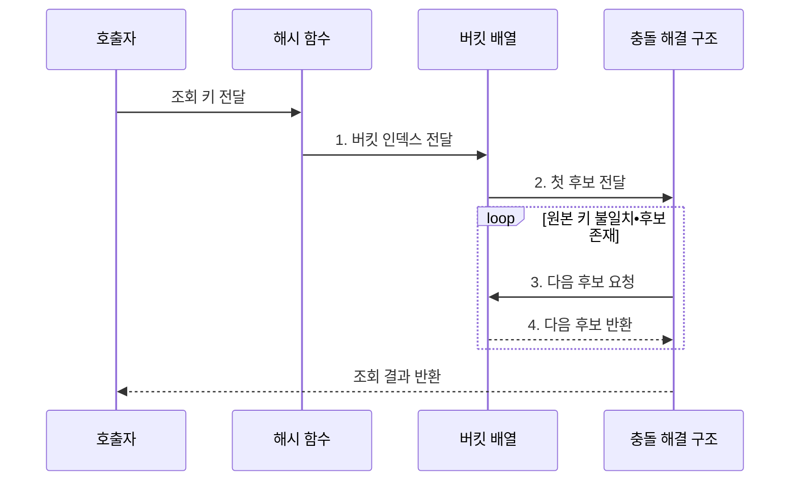

---
sidebar:
  order: 5
  label: "005. 해시 테이블 (Hash Table)"
  badge:
    text: "미출 • 30%"
    variant: note
title: "해시 테이블 (Hash Table)"
date: "2026-08-02T16:05:00+09:00"
tags:
  - "notes-basic-theory"
weight: 5
extra:
  question_no: "005"
  source_status: "미출"
  source_history: ""
  priority: 30
  priority_note: "충돌 처리•적재율에 따른 해시 설계"
---

## Ⅰ. 개요

핵심 용어

- **해시 테이블(Hash Table)**: 키를 버킷 인덱스로 변환해 키•값을 저장하고 조회하는 자료구조
- **버킷(Bucket)**: 같은 인덱스에 배정된 키•값 엔트리를 보관하는 배열 공간

- 정의/개념: 키를 **버킷 인덱스**로 바꿔 값을 찾는 자료구조
- 배경/필요성: 무순서 키 집합의 **선형 비교** 비용 절감

### 쉽게 이해하기 (학습용)

- 이름으로 사물함 번호를 계산해 해당 칸으로 가듯, 해시는 키를 버킷 위치로 바꾼 뒤 그 칸의 이름표만 대조한다.

## Ⅱ. 특징

핵심 용어

- **균등 해싱 가정(Uniform Hashing Assumption)**: 각 키가 버킷에 독립적이고 같은 확률로 배정된다고 보는 평균 분석 전제
- **충돌(Collision)**: 서로 다른 키가 같은 버킷 인덱스에 배정되는 현상
- **적재율(Load Factor)**: 저장된 엔트리 수를 버킷 수로 나눈 값

> 적재율이 0.9에 가까워질수록 붉은 개방 주소법 탐사 횟수는 급증하지만 파란 체이닝 후보 수는 완만하며, 균등 해싱 가정의 이론값이다.

- **균등 해싱 가정**에서 평균 상수 시간의 버킷 직접 접근
- **충돌 해결 방식**에 따른 후보 탐색
- **적재율** 증가에 따른 조회•삽입 비용 상승

### 쉽게 이해하기 (학습용)

- 같은 사물함에 이름이 몰릴수록 확인할 후보가 늘어난다.

## Ⅲ. 구조 및 구성요소

핵심 용어

- **해시 함수(Hash Function)**: 키를 고정 범위의 해시값과 버킷 인덱스로 변환하는 함수
- **엔트리(Entry)**: 해시 테이블에 함께 저장되는 키와 값의 한 쌍
- **체이닝•개방 주소법(Chaining•Open Addressing)**: 충돌한 엔트리를 연결 구조에 저장하거나 다른 빈 버킷을 탐사하는 방식

| 구성요소 | 책임 |
|:---|:---|
| 해시 함수 | 키를 **해시값**•인덱스로 변환 |
| 버킷 배열 | 인덱스별 **키•값 엔트리** 저장 |
| 충돌 해결 구조 | **체이닝•개방 주소법**으로 원본 키 대조 |

### 쉽게 이해하기 (학습용)

- 해시 함수가 사물함 번호를 정하고, 버킷 배열과 충돌 해결 구조가 같은 칸의 이름표를 차례로 대조한다.

## Ⅳ. 흐름도

핵심 용어

- **버킷 인덱스**: 해시값을 버킷 배열의 범위로 변환해 얻은 저장 위치
- **원본 키 대조**: 충돌 후보의 키가 조회 키와 실제로 같은지 확인하는 과정
- **탐사 순서**: 개방 주소법에서 충돌 후 다음 버킷을 확인하는 규칙

**동작 원리**

1. **버킷 인덱스 전달**: 해시값을 배열 위치로 변환
2. **첫 후보 전달**: 해당 버킷의 원본 키 대조 시작
3. **다음 후보 요청**: 체인•탐사 순서로 후보 이동
4. **다음 후보 반환**: 후보의 원본 키 일치 여부 대조

### 쉽게 이해하기 (학습용)

- 이름으로 사물함 칸을 찾고 이름표가 다르면 같은 칸의 다음 물건을 확인해, 일치하는 값이나 후보 소진 결과를 돌려준다.

## Ⅴ. 종류 및 비교

핵심 용어

- **해시 테이블(Hash Table)**: 키 순서 없이 정확한 키의 단건 조회에 적합한 자료구조
- **균형 이진 탐색 트리(Balanced Binary Search Tree)**: 키 순서와 범위 탐색을 로그 높이로 지원하는 트리
- **정렬 배열(Sorted Array)**: 키 순서의 연속 공간에 원소를 저장해 이진 탐색을 지원하는 배열

| 탐색 자료구조 | 해시 테이블 | 균형 이진 탐색 트리 | 정렬 배열 |
|:---|:---|:---|:---|
| 적용 기준 | 정확 키 **단건 조회** | **범위 탐색**•정렬 순회 | 삽입이 드문 **조회 중심** |
| 핵심 특징 | **해시값**으로 버킷 접근 | **균형 높이**로 키 순서 유지 | **연속 공간**•이진 탐색 |
| 한계 | 충돌 집중 시 **선형 퇴화** | 갱신 시 **재균형** 비용 | 중간 삽입 시 원소 이동 |

> 요약: 단건 조회는 **해시**, 범위 조회는 **균형 트리**

### 쉽게 이해하기 (학습용)

- 정확한 이름 하나를 자주 찾으면 해시, 키 범위를 순서대로 찾으면 균형 트리, 자료가 거의 바뀌지 않으면 정렬 배열을 쓴다.

## Ⅵ. 실무 고려사항 및 대책

핵심 용어

- **재해싱(Rehashing)**: 버킷 배열을 늘리고 모든 키의 위치를 다시 계산하는 작업
- **무작위 해시 시드(Randomized Hash Seed)**: 실행마다 해시 결과를 바꿔 의도적 충돌 예측을 어렵게 하는 값
- **해시 충돌 서비스 거부(Hash Collision DoS)**: 공격자가 같은 버킷에 몰리는 키를 보내 조회를 선형 탐색으로 퇴화시키는 공격

| 문제 | 대책 | 효과 |
|:---|:---|:---|
| 키 분포의 **충돌 집중**으로 버킷 탐색이 선형 퇴화 | 데이터 분포에 맞는 **해시 함수**와 분산 검증 | 버킷 편중 완화와 **평균 조회시간 회복** |
| 높은 **적재율**로 개방 주소 탐사 급증·빈 버킷 고갈 | 임계 적재율 이전 확장•**재해싱** | 탐사 길이 감소와 **삽입 가능 공간 확보** |
| 동등 키의 해시값 불일치로 **조회 누락** | 동등 비교와 해시 함수에 동일 필드 사용 | 키 **동등성 계약 일관성** 확보 |
| 외부 입력의 **충돌 DoS**로 조회 지연 집중 | **무작위 해시 시드**와 버킷 길이 제한 | 의도적 충돌의 **최악 지연 억제** |

### 쉽게 이해하기 (학습용)

- 칸이 붐비기 전에 배열을 늘려 긴 충돌 탐사를 억제한다.

## Ⅶ. 결론

핵심 용어

- **단건 조회**: 범위나 순서 없이 하나의 정확한 키로 값을 찾는 조회
- **적재율 통제**: 버킷 대비 엔트리 비율을 임계값 아래로 유지해 충돌 탐색을 제한하는 관리

- 정확 키 반복 조회•**적재율 통제** 가능 시 해시 테이블 선택

### 쉽게 이해하기 (학습용)

- 정확 키 한 건을 반복 조회하고 키 순서가 필요 없을 때 해시를 쓰되, 적재율과 충돌 분포를 통제해 긴 후보 탐색을 방지한다.
