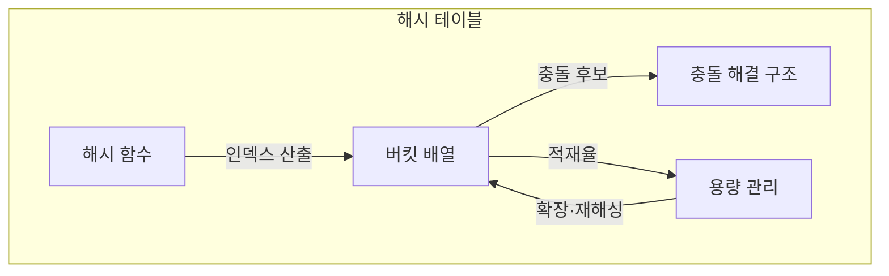
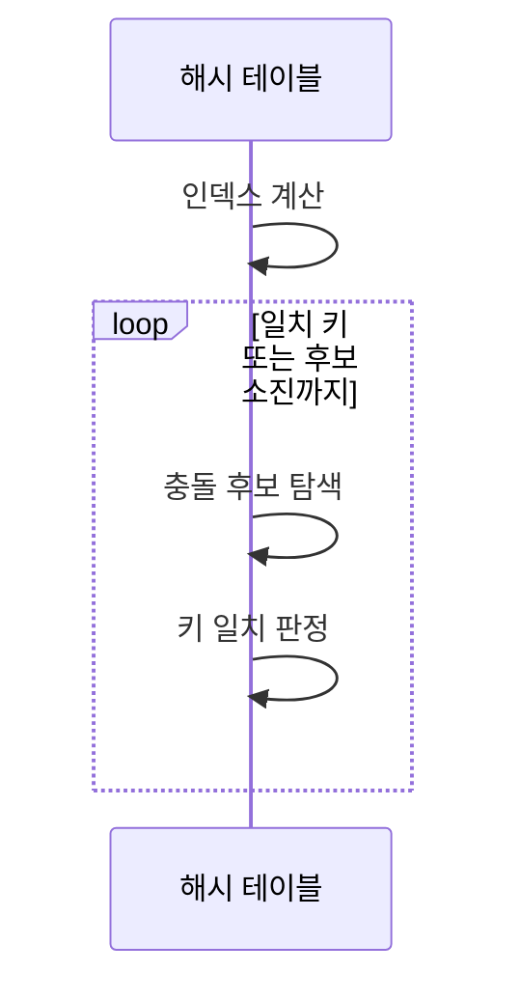

---
sidebar:
  order: 5
  label: "005. 해시 테이블 (Hash Table)"
  badge:
    text: "미출제 · 30%"
    variant: note
title: "해시 테이블 (Hash Table)"
date: "2026-07-26T22:16:20+09:00"
tags:
  - "notes-basic-theory"
weight: 5
extra:
  question_no: "005"
  source_status: "미출제"
  source_history: ""
  priority: 30
  priority_note: "충돌 처리·적재율이 좌우하는 해시 설계"
---

## 미리 알고가기

- **해시 테이블(Hash Table)**: 키를 배열 인덱스로 변환해 값을 빠르게 저장·조회하는 자료구조
- **해시 함수**: 키를 해시값으로 바꿔 접근할 배열 인덱스를 산출하는 함수
- **충돌(Collision)**: 서로 다른 키가 같은 인덱스에 배정되는 현상
- **버킷(Bucket)**: 해시 함수가 산출한 인덱스가 가리키며 키·값 엔트리나 충돌 체인을 담는 배열 저장 공간
- **엔트리(Entry)**: 해시 테이블에 함께 저장되는 키와 값의 한 쌍
- **체이닝(Chaining)**: 같은 버킷에 배정된 여러 엔트리를 연결 구조로 묶어 충돌을 해결하는 방식
- **탐사(Probing)**: 충돌 시 정해진 순서로 다른 버킷을 찾아 키를 저장·조회하는 절차
- **적재율(Load Factor)**: ‘원소 수 나누기 버킷 수’로 읽고 나눗셈 기호(÷)로 두 수의 비율을 나타내는 산술 관례에 따라 버킷이 찬 정도를 계산하여 재해싱 시점을 판정하는 값
- **재해싱(Rehashing)**: 버킷을 늘리고 키를 재배치해 충돌 탐색을 줄이는 작업
- **해시 충돌 서비스 거부(Hash Collision Denial-of-Service, DoS)**: 공격자가 같은 버킷으로 몰리는 키만 골라 대량 전송해 상수 시간이던 조회를 최악 선형 시간으로 퇴화시키고 서버를 마비시키는 공격
- **균형 이진 탐색 트리(Balanced Binary Search Tree)**: 높이를 제한해 키 순서와 범위 탐색을 지원하며 연산 단계를 로그 수준으로 유지하는 트리
- **정렬 배열(Sorted Array)**: 원소를 키 순서의 연속 공간에 저장해 이진 탐색을 지원하는 배열
- **무작위 해시 시드(Randomized Hash Seed)**: 실행마다 해시 계산을 바꿔 의도적 충돌 예측을 어렵게 하는 값
- **로그 시간 $O(\log n)$**: ‘빅 오 로그 엔’으로 읽고 증가 차수(Order)의 $O$, 반복 축소 단계의 로그, 항목 수(Number)의 $n$을 쓰는 관례에 따라 균형 트리 연산 단계가 항목 수의 로그 수준으로 증가함을 나타냄
- **선형 탐색(Linear Search)**: 후보를 처음부터 차례로 비교하며 충돌 집중 시 해시 조회가 퇴화하는 탐색 방식
- **트리 회전(Tree Rotation)**: 부모·자식 연결을 국소적으로 바꿔 키 순서는 유지하면서 이진 탐색 트리의 높이 균형을 복원하는 연산
- **매개변수 맵(Parameter Map)**: 요청의 매개변수 이름을 키로, 전달값을 값으로 저장하여 단건 조회에 사용하는 해시 기반 자료구조
- **캐시 서버(Cache Server)**: 자주 조회하는 데이터를 메모리에 보관해 원본 저장소 접근을 줄이는 서버이며 예상 항목 수로 해시 버킷 용량을 정하는 적용 대상

## Ⅰ. 개요

- 정의/개념: 키를 **배열 인덱스**로 바꿔 값을 찾는 **자료구조**
- 기존 한계: 키 순서가 없는 자료는 **선형 비교** 외에 조회 수단 부재

### 쉽게 이해하기 (학습용)

- 이름을 계산기에 넣어 사물함 번호를 얻고 그 칸으로 곧장 가는 것과 같으며, 목록을 처음부터 훑지 않고 번호 한 번 계산으로 자리에 닿기 때문에 항목이 아무리 늘어도 평균 조회 시간이 거의 그대로다.

## Ⅱ. 특징

- **해시 함수**로 키를 버킷 **인덱스**로 직접 변환
- **충돌 해결 방식**·**적재율**에 좌우되는 조회 단계 수

### 쉽게 이해하기 (학습용)

- 이름을 계산기에 넣으면 사물함 번호가 곧바로 튀어나와 줄을 서지 않고 그 칸으로 직행하지만, 다른 이름이 같은 번호를 받거나 사물함이 거의 다 차 버리면 한 칸 앞에서 이름표를 여러 장 넘겨야 해서 직행하던 조회가 다시 줄서기로 되돌아간다.

## Ⅲ. 아키텍처 및 구성요소

| 설계 요소 | 설명 |
|:---|:---|
| 해시 함수 | 키를 **해시값**으로 바꿔 인덱스 산출 |
| 버킷 배열 | 인덱스별 **키·값 엔트리** 저장 |
| 충돌 해결 구조 | 같은 인덱스 키를 **체이닝·탐사**로 구분 |
| 용량 관리 | **적재율** 임계치에서 버킷 확장·**재해싱** |

> 요약: **인덱스 산출**·원본 키 대조·적재율 기준 재해싱

### 쉽게 이해하기 (학습용)

- 답안이 용량 관리를 별도 구성요소로 세운 이유는, 해시 함수와 버킷 배열만 있으면 조회는 되지만 항목이 계속 쌓이는 동안 아무도 사물함을 늘려 주지 않으면 한 칸에 이름표가 수십 장씩 걸려 결국 처음부터 훑는 것과 같아지기 때문이며, 평균 $O(1)$이라는 말은 이 관리 주체가 적재율을 지켜 준다는 전제 위에서만 성립한다.

## Ⅳ. 원리 및 절차 흐름도

| 절차 | 설명 |
|:---|:---|
| 인덱스 계산 | 키를 **해시값**으로 바꿔 배열 범위 축소 |
| 충돌 후보 탐색 | **체이닝·탐사** 순서로 후보 선택 |
| 키 일치 판정 | 일치 시 값 반환, 후보 소진 시 **조회 실패** |

> 요약: **인덱스 산출** 후 버킷 후보의 **원본 키** 대조

### 쉽게 이해하기 (학습용)

- 이름으로 사물함 번호를 계산해 그 칸을 열어도 번호가 같을 뿐 이름이 다른 물건이 섞여 있을 수 있으므로 이름표를 하나씩 다시 대조해야 하고, 그 칸의 이름표가 모두 어긋나면 그 키는 없는 것으로 판정된다.

## Ⅴ. 종류 및 비교

| 탐색 자료구조 | 해시 테이블 (Hash Table) | 균형 이진 탐색 트리 | 정렬 배열 (Sorted Array) |
|:---|:---|:---|:---|
| 적용 기준 | 범위 조회 없는 정확 키 **단건 조회** | **범위 탐색**·정렬 순회 필요 | 삽입 드물고 **조회 빈번** |
| 핵심 특징 | **해시값**으로 버킷 직접 접근 | **균형 높이**로 키 순서 유지 | **연속 공간**에 키 순서 유지 |
| 한계 | **충돌 집중** 시 조회 선형 퇴화 | 갱신마다 **회전·재균형** 비용 | 중간 삽입 시 **원소 대량 이동** |

> 요약: 단건 조회는 **해시**, 범위 조회는 **균형 트리**, 삽입이 드물면 정렬 배열

### 쉽게 이해하기 (학습용)

- 이름 하나를 자주 찾으면 해시, 키 순서대로 범위를 찾으면 트리, 거의 바뀌지 않으면 정렬 배열을 쓴다.

## Ⅵ. 실무 사례

1. 요청 **매개변수 맵**은 **무작위 해시 시드**로 충돌 DoS 완화
2. 캐시 서버는 예상 항목 수만큼 **초기 버킷** 확보로 **재해싱** 억제

### 쉽게 이해하기 (학습용)

- 요청 키를 매번 다르게 섞으면 공격자가 같은 버킷에 몰릴 키를 미리 만들기 어렵다.
- 캐시 항목 수를 미리 알면 버킷을 넉넉히 잡아 전체 항목을 다시 옮기는 횟수를 줄인다.

## Ⅶ. 결론

- **단건 조회**는 해시, **적재율** 임계치에서 재해싱

### 쉽게 이해하기 (학습용)

- 단건 키는 해시로 찾되 버킷이 붐비기 전에 배열을 늘려 긴 충돌 탐색을 피한다.
