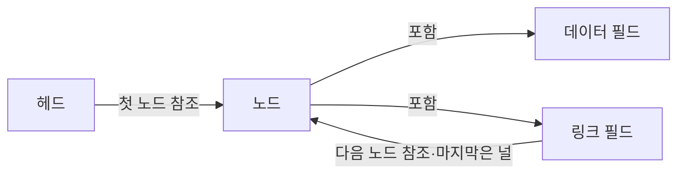
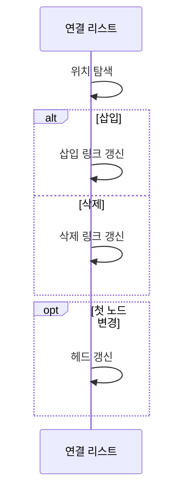

---
sidebar:
  order: 6
  label: "006. 연결 리스트 (Linked List)"
  badge:
    text: "기출 · 50%"
    variant: note
title: "연결 리스트 (Linked List)"
date: "2026-07-27T20:46:00+09:00"
tags:
  - "notes-basic-theory"
weight: 6
extra:
  question_no: "006"
  source_status: "기출"
  source_history: "135회"
  priority: 50
  priority_note: "최근 기출이나 자료구조 비교 비중이 큼"
---

## 미리 알고가기

- **연결 리스트(Linked List)**: 비연속 노드를 링크로 이어 순차 갱신을 돕는 선형 자료구조
- **노드(Node)**: 데이터와 링크를 함께 저장하는 단위
- **링크(Link)**: 인접 노드를 가리키는 참조 필드
- **포인터(Pointer)**: 메모리 위치를 가리키는 참조값
- **순차 접근·임의 접근(Sequential·Random Access)**: 순차 접근은 첫 노드부터 링크를 하나씩 따라가 목표에 닿는 조회 방식이고, 임의 접근은 번호로 자리를 계산해 곧바로 닿는 방식이며 연결 리스트는 앞쪽만 되고 배열은 뒤쪽이 된다.
- **캐시 지역성(Cache Locality)**: 인접 주소의 데이터에 연속 접근할수록 캐시에 이미 올라온 값을 다시 쓰게 되는 성질이며, 노드가 메모리 곳곳에 흩어지는 연결 리스트에서 이 성질이 낮아진다.
- **헤드(Head)**: 첫 노드를 가리키는 참조
- **널(Null)**: 다음 노드가 없음을 나타내는 값
- **입력 크기 $n$**: ‘엔’으로 읽고 항목 개수(Number)를 나타내는 관례에 따라 연결 리스트의 전체 노드 수를 뜻하는 변수
- **빅오(Big-O, $O$)**: ‘빅 오’로 읽고 증가 차수(Order)를 나타내는 $O$를 쓰는 관례에 따라 노드 수가 늘 때 연산 비용이 증가하는 상한을 나타내는 표기
- **동적 배열(Dynamic Array)**: 연속 공간을 재할당해 크기를 늘리는 배열
- **해시 테이블(Hash Table)**: 키로 항목 위치를 찾는 자료구조
- **이중 연결 리스트(Doubly Linked List)**: 앞·뒤 노드 참조를 모두 가진 연결 리스트
- **최소 최근 사용(Least Recently Used, LRU)**: 가장 오랫동안 참조되지 않은 항목을 우선 제거하는 캐시 교체 정책
- **데이터 필드(Data Field)**: 노드가 관리할 실제 값을 저장하는 영역
- **링크 필드(Link Field)**: 다음 노드나 이전 노드의 메모리 위치 또는 널을 저장해 노드 순서를 만드는 영역
- **선행·후속 노드(Predecessor/Successor Node)**: 현재 노드의 바로 앞과 뒤에 연결된 노드이며 삽입·삭제 때 링크를 다시 연결하는 대상

## Ⅰ. 개요

- 정의/개념: 비연속 노드를 **포인터**로 이어 순서를 관리하는 **자료구조**
- 기존 한계: 배열은 중간 삽입·삭제마다 **원소 대량 이동** 발생

### 쉽게 이해하기 (학습용)

- 종이 쪽지를 서랍 여기저기 흩어 두어도 각 쪽지에 다음 쪽지가 있는 자리를 적어 두면 한 줄 순서가 생기며, 쪽지를 붙여 놓은 것이 아니므로 중간에 한 장을 끼우거나 빼도 나머지를 밀어 옮길 필요 없이 적어 둔 자리만 고쳐 주면 된다.

## Ⅱ. 특징

- **포인터** 연결로 비연속 메모리에 만드는 **논리적 순서**
- 위치 탐색 $O(n)$, **선행 노드** 참조 시 삽입·삭제 $O(1)$

### 쉽게 이해하기 (학습용)

- 쪽지에 적힌 자리를 한 장씩 따라가야 하므로 열 번째 쪽지를 보려면 아홉 장을 거쳐야 하지만, 바로 앞 쪽지를 이미 손에 쥐고 있다면 적힌 자리 두 칸만 고쳐 끼우거나 빼므로 조회는 느리고 갱신은 즉시라는 비대칭이 생긴다.

## Ⅲ. 아키텍처 및 구성요소

| 설계 요소 | 설명 |
|:---|:---|
| 헤드 | 첫 노드를 가리키는 **시작 참조** 보관 |
| 노드 | **데이터·링크 필드**를 묶은 저장 단위 |
| 데이터 필드 | 노드가 관리할 **실제 값** 저장 |
| 링크 필드 | **다음 노드 참조** 또는 종료 표시 저장 |

> 요약: **헤드**에서 링크를 따라 **널**까지 이어지는 노드 사슬

### 쉽게 이해하기 (학습용)

- 시작 자리를 적어 둔 메모가 헤드이고, 쪽지 한 장에는 내용 칸과 다음 쪽지 자리를 적는 칸이 나란히 있어 그 자리를 따라가면 다음 쪽지가 나오며, 마지막 쪽지의 자리 칸은 비워 두어 여기가 끝임을 알린다.

## Ⅳ. 원리 및 절차 흐름도

| 절차 | 설명 |
|:---|:---|
| 위치 탐색 | 참조 없으면 대상의 **선행 노드**까지 순차 이동 |
| 삽입 링크 갱신 | 새 노드가 **후속 노드**를, 선행 노드가 새 노드를 참조 |
| 삭제 링크 갱신 | 선행 노드가 삭제 대상의 다음을 **직접 참조** |
| 헤드 갱신 | 첫 노드 변경 시 **시작 참조** 교체 |

> 요약: 위치 탐색 후 **링크 재연결**과 **시작점** 갱신

### 쉽게 이해하기 (학습용)

- 끼울 자리를 앞 쪽지까지 따라가 찾은 뒤 새 쪽지에 뒤 쪽지 자리를 적고 앞 쪽지가 새 쪽지를 가리키게 하면 줄이 다시 이어지고, 뺄 때는 앞 쪽지가 건너뛴 다음 쪽지를 가리키게 하며, 손댄 자리가 맨 앞이면 시작 자리를 적어 둔 메모까지 고쳐야 한다.

## Ⅴ. 종류 및 비교

| 선형 자료구조 | 연결 리스트 | 동적 배열 |
|:---|:---|:---|
| 적용 기준 | **선행 노드 참조**가 있고 삽입·삭제가 잦을 때 | **인덱스 임의 조회**가 잦을 때 |
| 핵심 특징 | **포인터**로 비연속 노드 연결 | **연속 공간**에 원소 저장 |
| 한계 | **임의 접근** 미지원·낮은 **캐시 지역성** | 중간 갱신 시 **원소 대량 이동** |

> 요약: **노드 참조**가 있으면 갱신은 연결 리스트, 임의 조회는 **동적 배열**

### 쉽게 이해하기 (학습용)

- 이미 손에 쥔 쪽지 옆에 한 장 끼우는 일은 연결 리스트가 자리 두 칸만 고치면 끝나지만 배열은 뒤쪽 원소를 전부 한 칸씩 밀어야 하고, 반대로 '백 번째 항목'을 바로 집는 일은 번호로 자리가 계산되는 배열이 이기고 연결 리스트는 처음부터 세어 가야 한다.

## Ⅵ. 실무 사례

1. **LRU 캐시**는 해시 테이블 탐색·**이중 연결 리스트** 순서 갱신

### 쉽게 이해하기 (학습용)

- 이름표로 쪽지를 바로 찾고 앞뒤 쪽지의 자리만 다시 적어 맨 앞으로 옮기면, 줄 전체를 다시 세우지 않고 가장 오래 안 쓴 쪽지가 맨 뒤에 남는다.

## Ⅶ. 결론

- 잦은 갱신을 위해 참조 비용을 검토하여 **연결 리스트** 활용

### 쉽게 이해하기 (학습용)

- 바꿀 쪽지를 이미 손에 쥐고 있느냐가 갈림길이어서, 그 자리를 가리키는 참조가 있고 넣고 빼는 일이 잦으면 연결 리스트를 고르고 매번 처음부터 세어 찾아야 하는 상황이면 그 이점이 사라진다.
