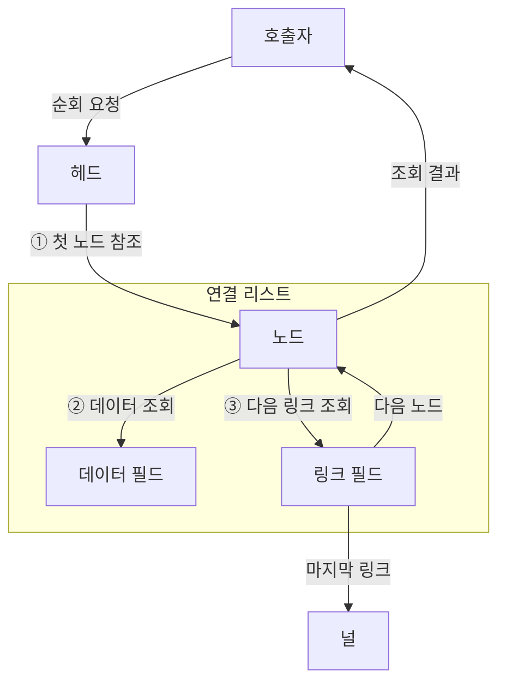
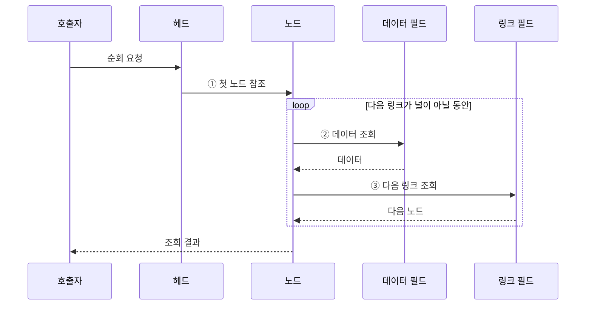

---
sidebar:
  order: 6
  label: "006. 연결 리스트 (Linked List)"
  badge:
    text: "기출 · 50%"
    variant: note
title: "연결 리스트 (Linked List)"
date: "2026-07-28T18:53:00+09:00"
tags:
  - "notes-basic-theory"
weight: 6
extra:
  question_no: "006"
  source_status: "기출"
  source_history: "135회"
  priority: 50
  priority_note: "최근 기출이나 자료구조 비교 비중이 큼"
---

## 미리 알고가기

- **연결 리스트(Linked List)**: 비연속 노드를 링크로 이어 논리적 순서를 만드는 선형 자료구조
- **노드(Node)**: 실제 데이터와 다음 또는 이전 노드의 링크를 함께 저장하는 단위
- **헤드(Head)**: 연결 리스트의 첫 노드를 가리키는 시작 참조
- **링크(Link)**: 다음 또는 이전 노드의 메모리 위치를 가리키는 참조 필드
- **널(Null)**: 연결할 다음 노드가 없음을 나타내는 종료값
- **순차 접근(Sequential Access)**: 헤드부터 링크를 차례로 따라가 목표 노드에 도달하는 방식
- **임의 접근(Random Access)**: 인덱스로 원하는 원소 위치에 바로 접근하는 방식
- **캐시 지역성(Cache Locality)**: 인접 주소를 연속 접근할 때 캐시를 효율적으로 쓰는 성질
- **동적 배열(Dynamic Array)**: 연속 공간을 재할당해 크기를 늘리는 배열
- **이중 연결 리스트(Doubly Linked List)**: 앞·뒤 노드의 링크를 모두 가진 연결 리스트
- **노드 풀(Node Pool)**: 노드 메모리를 묶음으로 미리 확보해 반복 할당 비용을 줄이는 저장소
- **최소 최근 사용(Least Recently Used, LRU)**: 가장 오래 참조되지 않은 항목부터 제거하는 캐시 교체 정책

## Ⅰ. 개요

- 정의/개념: 비연속 노드를 **링크**로 이어 순서를 관리하는 구조
- 기존 한계: 배열의 중간 갱신은 후속 **원소 이동** 발생

### 쉽게 이해하기 (학습용)

- 흩어진 쪽지마다 다음 쪽지의 위치를 적어 순서를 만들고, 중간에 쪽지를 끼우거나 뺄 때 주변 위치표만 바꾼다.

## Ⅱ. 특징

- **링크 연결**로 비연속 메모리에 형성한 논리적 순서
- 목표 위치까지 링크를 따르는 **순차 접근**
- 선행 노드 확보 시 링크 변경만 하는 **상수 갱신**

### 쉽게 이해하기 (학습용)

- 목표 쪽지까지 위치표를 차례로 따라가야 하지만 바로 앞 쪽지를 알고 있으면 주변 위치표만 바꿔 삽입·삭제할 수 있다.

## Ⅲ. 아키텍처

**도표안 A — 구조도**

```mermaid
flowchart TB
    H[헤드] --> N1[노드 1<br/>데이터 | 링크]
    N1 --> N2[노드 2<br/>데이터 | 링크]
    N2 --> N3[노드 3<br/>데이터 | 링크]
    N3 --> Z[널]
```

**도표안 B — 동작 흐름도**



**도표안 C — sequenceDiagram**



| 구성요소 | 책임 |
|:---|:---|
| 헤드 | 첫 노드의 **시작 참조** 보관 |
| 노드 | 데이터·링크 필드를 묶은 저장 단위 |
| 데이터 필드 | 노드가 관리할 **실제 값** 저장 |
| 링크 필드 | 다음 노드 참조 또는 **널** 저장 |

**동작 원리**

- **① 첫 노드 참조**: 헤드에서 순회의 시작 위치 획득
- **② 데이터 조회**: 현재 노드가 보관한 값 처리
- **③ 다음 링크 조회**: 널이 아니면 후속 노드로 이동

### 쉽게 이해하기 (학습용)

- 헤드가 알려 주는 첫 쪽지에서 값을 읽고 다음 위치표를 따라가는 일을, 마지막 위치표가 비어 있을 때까지 반복한다.

## Ⅳ. 종류 및 비교

| 선형 자료구조 | 연결 리스트 | 동적 배열 |
|:---|:---|:---|
| 적용 기준 | 선행 노드 확보·**중간 갱신** 빈번 | **인덱스 조회**·순차 처리 빈번 |
| 핵심 특징 | **링크**로 비연속 노드 연결 | **연속 공간**에 원소 저장 |
| 한계 | 임의 접근 불가·낮은 **캐시 지역성** | 중간 갱신 시 **원소 이동** |

> 요약: 잦은 갱신은 **연결 리스트**, 임의 조회는 **동적 배열**

### 쉽게 이해하기 (학습용)

- 바로 앞 노드를 알고 중간 갱신이 잦으면 연결 리스트, 번호로 바로 찾거나 연속 순회가 잦으면 동적 배열이 알맞다.

## Ⅴ. 실무 고려사항 및 대책

| 고려사항 | 대책 | 효과 |
|:---|:---|:---|
| 대상 위치의 **선형 탐색** | 선행 노드 참조·해시 색인 유지 | 삽입 전 탐색 비용 감소 |
| **링크 갱신 순서** 오류 | 후속 링크 보존 후 선행 링크 변경 | **노드 사슬** 유실 방지 |
| 낮은 **캐시 지역성**·할당 비용 | **노드 풀**로 연속 묶음 할당 | 캐시 누락·할당 횟수 감소 |
| 동시 갱신의 **링크 불일치** | 잠금으로 링크 변경 직렬화 | 노드 사슬 **일관성** 유지 |
| LRU의 **최근 사용 순서** | 해시·이중 연결 리스트 결합 | 탐색·순서 갱신 상수화 |

### 쉽게 이해하기 (학습용)

- 다음 링크를 잃지 않게 변경 순서를 정하고 동시 갱신을 막으며, LRU는 해시로 항목을 찾고 이중 링크로 최근 사용 순서를 바꾼다.

## Ⅵ. 결론

- 선행 노드 확보·**중간 갱신** 중심이면 연결 리스트 선택

### 쉽게 이해하기 (학습용)

- 중간 쪽지를 자주 끼우고 뺄 때 바로 앞 쪽지를 알고 있으면 연결 리스트를 쓰고, 번호로 바로 찾아야 하면 동적 배열을 쓴다.
