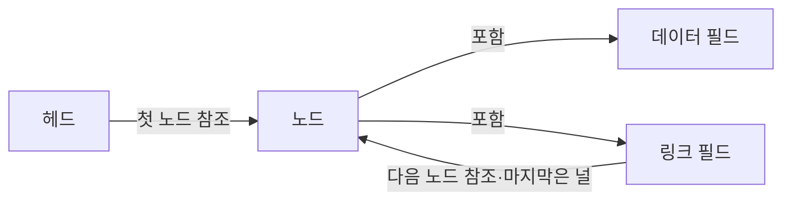

---
sidebar:
  order: 6
  label: "006. 연결 리스트 (Linked List)"
  badge:
    text: "기출 · 50%"
    variant: note
title: "연결 리스트 (Linked List)"
date: "2026-07-28T11:45:15+09:00"
tags:
  - "notes-basic-theory"
weight: 6
extra:
  question_no: "006"
  source_status: "기출"
  source_history: "135회"
  priority: 50
  priority_note: "최근 기출이나 자료구조 비교 비중이 큼"
---

## 미리 알고가기

- **연결 리스트(Linked List)**: 비연속 노드를 링크로 이어 순차 갱신을 돕는 선형 자료구조
- **노드(Node)**: 데이터와 링크를 함께 저장하는 단위
- **링크(Link)**: 인접 노드를 가리키는 참조 필드
- **포인터(Pointer)**: 메모리 위치를 가리키는 참조값
- **순차 접근·임의 접근(Sequential·Random Access)**: 링크를 차례로 따라가는 접근과 인덱스로 원소에 바로 닿는 접근
- **캐시 지역성(Cache Locality)**: 인접 주소의 데이터를 연속 접근할 때 캐시를 효율적으로 쓰는 성질
- **헤드(Head)**: 첫 노드를 가리키는 참조
- **널(Null)**: 다음 노드가 없음을 나타내는 값
- **입력 크기 $n$**: 연결 리스트의 전체 노드 수
- **빅오(Big-O, $O$)**: 입력 증가에 따른 연산 비용의 상한 표기
- **동적 배열(Dynamic Array)**: 연속 공간을 재할당해 크기를 늘리는 배열
- **해시 테이블(Hash Table)**: 키로 항목 위치를 찾는 자료구조
- **이중 연결 리스트(Doubly Linked List)**: 앞·뒤 노드 참조를 모두 가진 연결 리스트
- **최소 최근 사용(Least Recently Used, LRU)**: 가장 오랫동안 참조되지 않은 항목을 우선 제거하는 캐시 교체 정책
- **데이터 필드(Data Field)**: 노드가 관리할 실제 값을 저장하는 영역
- **링크 필드(Link Field)**: 다음 노드나 이전 노드의 메모리 위치 또는 널을 저장해 노드 순서를 만드는 영역
- **선행·후속 노드(Predecessor/Successor Node)**: 현재 노드의 바로 앞과 뒤에 연결된 노드이며 삽입·삭제 때 링크를 다시 연결하는 대상

## Ⅰ. 개요

- 정의/개념: 비연속 노드를 **포인터**로 이어 순서를 관리하는 **자료구조**
- 기존 한계: 배열은 중간 삽입·삭제마다 **원소 대량 이동** 발생

### 쉽게 이해하기 (학습용)

- 흩어진 쪽지마다 다음 쪽지의 위치를 적어 순서를 만들고, 삽입·삭제 때 그 위치만 고친다.

## Ⅱ. 특징

- **포인터** 연결로 비연속 메모리에 만드는 **논리적 순서**
- 위치 탐색 $O(n)$, **선행 노드** 참조 시 삽입·삭제 $O(1)$

### 쉽게 이해하기 (학습용)

- 목표까지 링크를 따라가야 하지만 선행 노드를 알면 링크 갱신만으로 삽입·삭제할 수 있다.

## Ⅲ. 구성 및 연결 구조

| 설계 요소 | 설명 |
|:---|:---|
| 헤드 | 첫 노드를 가리키는 **시작 참조** 보관 |
| 노드 | **데이터·링크 필드**를 묶은 저장 단위 |
| 데이터 필드 | 노드가 관리할 **실제 값** 저장 |
| 링크 필드 | **다음 노드 참조** 또는 종료 표시 저장 |

> 요약: **헤드**에서 링크를 따라 **널**까지 이어지는 노드 사슬

### 쉽게 이해하기 (학습용)

- 헤드에서 시작해 각 노드의 링크를 따라가며, 마지막 링크의 널이 끝을 표시한다.

## Ⅳ. 운영 고려사항

| 고려사항 | 대응 방안 | 기대 효과 |
|:---|:---|:---|
| 대상 위치 탐색의 선형 비용 | 선행 노드 참조나 보조 색인 유지 | 삽입·삭제 전 탐색 비용 감소 |
| 링크 갱신 순서 오류 | 후속 링크를 먼저 보존한 뒤 선행 링크 변경 | 노드 사슬 유실 방지 |
| 낮은 캐시 지역성과 참조 메모리 | 노드 풀·침입형 리스트 적용 여부 검토 | 할당 비용과 메모리 낭비 완화 |
| 동시 갱신 중 링크 불일치 | 잠금 또는 원자적 갱신 규칙 적용 | 구조 일관성 확보 |

### 쉽게 이해하기 (학습용)

- 링크 변경 순서와 동시 접근을 통제해야 노드 사슬이 끊어지지 않는다.

## Ⅴ. 종류 및 비교

| 선형 자료구조 | 연결 리스트 | 동적 배열 |
|:---|:---|:---|
| 적용 기준 | **선행 노드 참조**가 있고 삽입·삭제가 잦을 때 | **인덱스 임의 조회**가 잦을 때 |
| 핵심 특징 | **포인터**로 비연속 노드 연결 | **연속 공간**에 원소 저장 |
| 한계 | **임의 접근** 미지원·낮은 **캐시 지역성** | 중간 갱신 시 **원소 대량 이동** |

> 요약: **노드 참조**가 있으면 갱신은 연결 리스트, 임의 조회는 **동적 배열**

### 쉽게 이해하기 (학습용)

- 선행 노드를 알며 갱신이 잦으면 연결 리스트, 인덱스 조회가 잦으면 동적 배열이 적합하다.

## Ⅵ. 실무 사례

1. **LRU 캐시**는 해시 테이블 탐색·**이중 연결 리스트** 순서 갱신

### 쉽게 이해하기 (학습용)

- 해시로 항목을 찾고 이중 연결 리스트의 링크를 바꿔 최근 사용 순서를 갱신한다.

## Ⅶ. 결론

- 잦은 갱신을 위해 참조 비용을 검토하여 **연결 리스트** 활용

### 쉽게 이해하기 (학습용)

- 대상 참조를 확보한 상태에서 삽입·삭제가 잦을 때 효과적이다.
