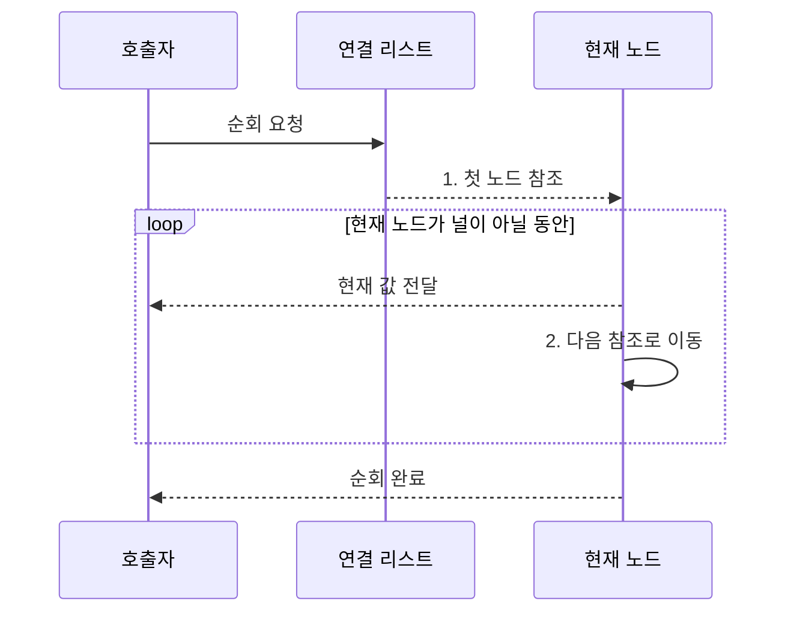

---
sidebar:
  order: 6
  label: "006. 연결 리스트 (Linked List)"
  badge:
    text: "기출 • 50%"
    variant: note
title: "연결 리스트 (Linked List)"
date: "2026-08-05T00:25:07+09:00"
tags:
  - "notes-basic-theory"
weight: 6
extra:
  question_no: "006"
  source_status: "기출"
  source_history: "135회"
  priority: 50
  priority_note: "최근 기출이나 자료구조 비교 비중이 큼"
---

## Ⅰ. 개요

<details>
<summary>핵심 용어</summary>

- **연결 리스트(Linked List)**: 비연속 노드를 링크로 이어 논리적 순서를 만드는 선형 자료구조
- **링크(Link)**: 다음 또는 이전 노드의 메모리 위치를 가리키는 참조 필드

</details>

- 정의/개념: 비연속 노드를 **링크** 로 이어 순서를 관리하는 구조
- 배경/필요성: 배열의 중간 갱신에 따른 **원소 이동** 절감

#### 한줄 요약

- 흩어진 쪽지마다 다음 쪽지의 위치를 적어 순서를 만들고, 중간에 쪽지를 끼우거나 뺄 때 주변 위치표만 바꾼다.

## Ⅱ. 특징

<details>
<summary>핵심 용어</summary>

- **순차 접근(Sequential Access)**: 헤드부터 링크를 차례로 따라가 목표 노드에 도달하는 방식
- **상수 시간 갱신**: 선행 노드를 알고 있을 때 입력 크기와 무관하게 일정 횟수의 링크 변경으로 삽입•삭제하는 작업
- **비연속 메모리**: 노드들이 서로 인접하지 않은 주소에 나뉘어 저장된 상태

</details>


> 목표 위치가 멀어질수록 파란 연결 리스트는 링크 추적 단계가 선형 증가하지만 붉은 동적 배열은 한 단계이며, 임의 접근을 가정한 이론값이다.

- **링크 연결** 로 비연속 메모리에 형성한 논리적 순서
- 목표 위치까지 링크를 따르는 **순차 접근**
- 선행 노드 확보 시 링크 변경만 하는 **상수 갱신**

#### 한줄 요약

- 목표 쪽지까지 위치표를 차례로 따라가야 하지만 바로 앞 쪽지를 알고 있으면 주변 위치표만 바꿔 삽입•삭제할 수 있다.

## Ⅲ. 구조 및 구성요소

<details>
<summary>핵심 용어</summary>

- **헤드(Head)**: 연결 리스트의 첫 노드를 가리키는 시작 참조
- **노드(Node)**: 실제 데이터와 다음 또는 이전 노드의 링크를 함께 저장하는 단위
- **널(Null)**: 연결할 다음 노드가 없음을 나타내는 종료값
- **데이터 필드**: 노드가 관리하는 실제 값을 저장하는 영역
- **링크 필드**: 다음 또는 이전 노드의 참조를 저장하는 영역

</details>

전체 연결 구조

```text
[헤드] ----- [노드] ----- [노드] ----- [널]
```

내부 노드 구조

```text
[노드]
    |
    +-- [데이터 필드]
    `-- [링크 필드]
```

선의 의미: 전체 구조의 가로선은 링크 연결, 내부 구조의 가지는 필드 포함 관계

| 구성요소 | 책임 |
|:---|:---|
| 헤드 | 첫 노드의 **시작 참조** 보관 |
| 노드 | 데이터•링크 필드를 묶은 저장 단위 |
| 데이터 필드 | 노드가 관리할 **실제 값** 저장 |
| 링크 필드 | 다음 노드 참조 또는 **널** 저장 |

#### 한줄 요약

- 헤드가 첫 쪽지를 가리키고, 각 노드는 실제 값과 다음 쪽지의 위치를 함께 보관한다.

## Ⅳ. 흐름도

<details>
<summary>핵심 용어</summary>

- **순회(Traversal)**: 헤드에서 시작해 링크를 따라 각 노드를 차례로 방문하는 작업
- **현재 노드**: 순회 과정에서 값과 다음 노드 참조를 읽는 노드
- **후속 노드**: 현재 노드가 가진 링크가 가리키는 다음 방문 대상

</details>



**동작 원리**

1. **첫 노드 참조**: 헤드가 가리키는 노드를 순회 시작점으로 설정
2. **다음 참조로 이동**: 링크가 가리키는 후속 노드를 현재 노드로 전환

#### 한줄 요약

- 헤드가 알려 주는 첫 쪽지에서 값을 읽고 다음 위치표를 따라가는 일을, 마지막 위치표가 비어 있을 때까지 반복한다.

## Ⅴ. 종류 및 비교

<details>
<summary>핵심 용어</summary>

- **단일 연결 리스트**: 각 노드가 다음 노드의 링크만 저장하는 구조
- **이중 연결 리스트(Doubly Linked List)**: 각 노드가 앞•뒤 노드의 링크를 모두 저장하는 구조
- **동적 배열(Dynamic Array)**: 연속 공간을 재할당해 크기를 늘리며 인덱스 임의 접근을 지원하는 배열

</details>

| 선형 자료구조 | 단일 연결 리스트 | 이중 연결 리스트 | 동적 배열 |
|:---|:---|:---|:---|
| 적용 기준 | 단방향 순회•**저장 공간** 절약 | 양방향 순회•**중간 삭제** 빈번 | **인덱스 조회**•순차 처리 빈번 |
| 핵심 특징 | 노드마다 **다음 링크** 저장 | 노드마다 **이전•다음 링크** 저장 | **연속 공간** 에 원소 저장 |
| 한계 | 선행 노드 없는 **역방향 이동** 불가 | 이전 링크의 **추가 공간•갱신** | 중간 갱신 시 **원소 이동** |

> 요약: 잦은 갱신은 **연결 리스트**, 임의 조회는 **동적 배열**

#### 한줄 요약

- 바로 앞 노드를 알고 중간 갱신이 잦으면 연결 리스트, 번호로 바로 찾거나 연속 순회가 잦으면 동적 배열이 알맞다.

## Ⅵ. 실무 고려사항 및 대책

<details>
<summary>핵심 용어</summary>

- **선행 노드 참조**: 삽입•삭제 대상 바로 앞 노드를 직접 가리켜 위치 탐색을 줄이는 참조
- **캐시 지역성(Cache Locality)**: 인접 주소를 연속 접근할 때 캐시를 효율적으로 쓰는 성질
- **노드 풀(Node Pool)**: 노드 메모리를 묶음으로 미리 확보해 반복 할당 비용을 줄이는 저장소
- **원자적 리스트 알고리즘**: 동시 갱신 중에도 링크 변경을 분할할 수 없는 연산으로 처리하는 알고리즘
- **색인(Index)**: 키나 위치에서 대상 노드 참조를 빠르게 찾도록 따로 유지하는 조회 구조
- **잠금(Lock)**: 여러 실행 흐름이 같은 링크를 동시에 변경하지 못하도록 접근을 직렬화하는 동기화 수단

</details>

| 문제 | 대책 | 효과 |
|:---|:---|:---|
| 대상 위치의 **선형 탐색** 이 삽입•삭제 비용을 지배 | 선행 노드 참조 또는 별도 색인 유지 | 위치 탐색을 제외한 **상수 시간 갱신** 활용 |
| 잘못된 **링크 갱신 순서** 로 후속 사슬 단절 | 후속 링크 보존 후 선행 링크 변경 | 노드 연결의 **참조 연속성** 보장 |
| 비연속 노드의 낮은 **캐시 지역성**으로 순회 지연 | 노드 풀과 묶음 할당으로 인접 배치 | 캐시 누락 감소와 **순회 처리량 향상** |
| 동시 링크 갱신의 경쟁으로 유실•중복 연결 | 잠금 또는 검증된 원자적 리스트 알고리즘 적용 | 동시 갱신의 **구조 무결성** 확보 |

#### 한줄 요약

- 다음 링크를 보존하는 순서로 포인터를 바꿔 연결 단절을 방지한다.

## Ⅶ. 결론

<details>
<summary>핵심 용어</summary>

- **선행 노드**: 삽입•삭제할 위치의 바로 앞에 연결된 노드
- **중간 갱신**: 자료구조의 처음과 끝이 아닌 위치에서 원소를 삽입하거나 삭제하는 작업

</details>

- 선행 노드를 확보하고 **중간 갱신** 이 잦으면 연결 리스트 선택

#### 한줄 요약

- 바로 앞 노드를 알고 중간 갱신이 잦을 때 연결 리스트를 쓴다.
