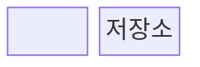
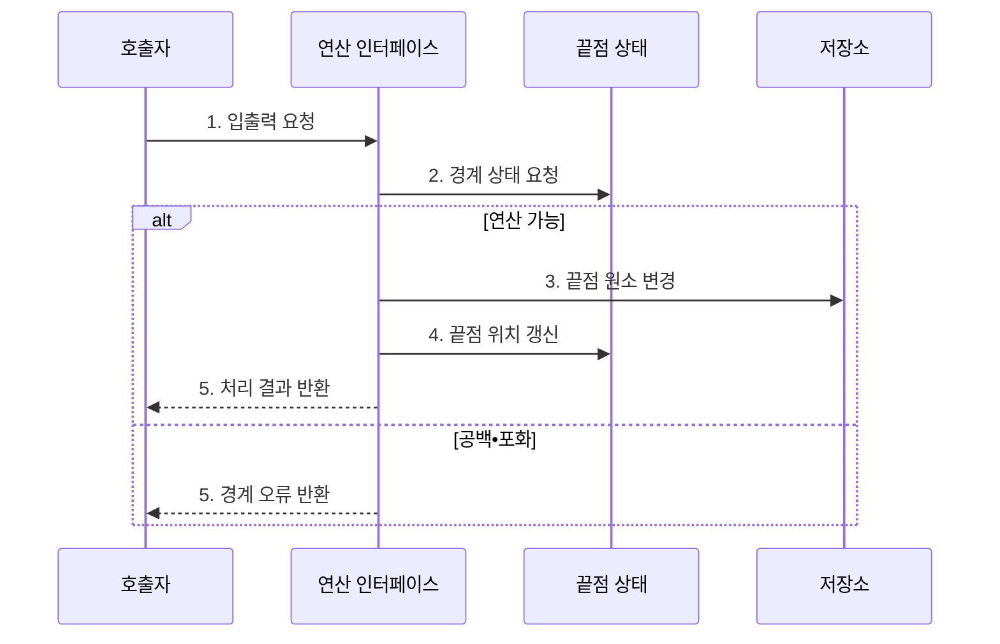

---
sidebar:
  order: 7
  label: "007. 스택•큐•덱 (Stack Queue Deque)"
  badge:
    text: "미출 • 30%"
    variant: note
title: "스택•큐•덱 (Stack Queue Deque)"
date: "2026-07-29T11:38:11+09:00"
tags:
  - "notes-basic-theory"
weight: 7
extra:
  question_no: "007"
  source_status: "미출"
  source_history: ""
  priority: 30
  priority_note: "선입•후입•양단 연산 비교의 기초"
---

## 미리 알고가기

- **스택•큐•덱(Stack•Queue•Deque)**: 입출력 끝점을 제한해 원소 처리 순서를 통제하는 선형 자료구조
- **후입선출(Last-In First-Out, LIFO)**: 마지막에 삽입한 원소를 가장 먼저 제거하는 자료 처리 규칙
- **선입선출(First-In First-Out, FIFO)**: 가장 먼저 삽입한 원소를 가장 먼저 제거하는 자료 처리 규칙
- **덱(Double-Ended Queue, Deque)**: 앞과 뒤 양쪽 끝에서 원소를 삽입•삭제할 수 있는 선형 자료구조
- **상단•전단•후단**: 스택 맨 위와 큐•덱의 앞•뒤 끝점
- **오버플로(Overflow)**: 포화 상태의 삽입 요청 오류
- **언더플로(Underflow)**: 공백 상태의 삭제 요청 오류
- **원형 큐(Circular Queue)**: 배열 끝과 시작을 이어 비운 슬롯을 재사용하는 큐
- **상수 시간(Constant Time)**: 입력 크기와 무관한 연산 시간
- **연결 리스트(Linked List)**: 노드를 링크로 이어 순서를 만든 자료구조
- **연산 인터페이스(Operation Interface)**: 호출자가 자료구조의 내부 저장 방식을 몰라도 허용된 삽입•삭제 연산을 요청하게 하는 접점
- **선두 차단(Head-of-Line Blocking)**: 큐의 첫 작업이 지연되어 뒤의 처리 가능한 작업까지 대기하는 현상
- **원자적 인덱스 갱신(Atomic Index Update)**: 동시 실행 중에도 끝점 인덱스 변경이 나뉘지 않은 한 연산처럼 완료되게 하는 방식

## Ⅰ. 개요

- 정의/개념: 입출력 **끝점**으로 순서를 통제하는 선형 자료구조
- 배경/필요성: 자료의 **입출력 순서**를 구조적으로 통제

### 쉽게 이해하기 (학습용)

- 접시 더미•대기 줄•양쪽 문처럼 접근 끝점이 처리 순서를 정한다.

## Ⅱ. 특징

- **LIFO•FIFO**•양방향 입출력에 따른 처리 순서 통제
- **끝점 갱신** 기반 $O(1)$ 삽입•삭제
- 공백•포화 검사를 통한 **경계 오류** 차단

### 쉽게 이해하기 (학습용)

- 접시 더미는 맨 위, 대기 줄은 앞뒤 끝만 움직이듯, 허용된 끝점의 위치만 바꾸면 원소 수와 무관하게 삽입•삭제할 수 있다.

## Ⅲ. 구조 및 구성요소

| 구성요소 | 책임 |
|:---|:---|
| 연산 인터페이스 | **허용 끝점**의 삽입•삭제 통제 |
| 끝점 상태 | **상단•전단•후단** 위치•경계 관리 |
| 저장소 | 배열•연결 리스트에 원소 저장 |

### 쉽게 이해하기 (학습용)

- 연산 인터페이스가 사용할 끝점을 제한하고, 끝점 상태와 저장소가 원소의 위치와 값을 함께 관리한다.

## Ⅳ. 흐름도

**동작 원리**

1. **입출력 요청**: 스택•큐•덱별 허용 끝점 식별
2. **경계 상태 요청**: 공백•포화 여부 판정
3. **끝점 원소 변경**: 허용된 위치의 원소 삽입•삭제
4. **끝점 위치 갱신**: 처리 후 상단•전단•후단 반영
5. **처리 결과 반환**: 변경 원소 또는 경계 오류 확정

### 쉽게 이해하기 (학습용)

- 인터페이스는 허용된 끝점의 원소와 위치를 함께 갱신한다.

## Ⅴ. 종류 및 비교

| 선형 자료구조 | 스택 | 큐 | 덱 |
|:---|:---|:---|:---|
| 적용 기준 | **호출 이력**•되돌리기 관리 | 도착 순서대로 **작업 처리** | **양단 삽입•삭제** 필요 |
| 핵심 특징 | **후입선출**로 최근 원소부터 처리 | **선입선출**로 도착 원소부터 처리 | **양단** 중 선택해 처리 |
| 한계 | 깊이 증가 시 **스택 오버플로** | **선두 차단**으로 후속 작업 지연 | 양단 규칙 혼용 시 **순서 오류** |

> 요약: 역순은 **스택**, 도착순은 **큐**, 양단 처리는 덱

### 쉽게 이해하기 (학습용)

- 쌓은 접시를 거꾸로 꺼내면 스택, 매표소 도착순으로 보내면 큐, 통로 양쪽 문을 모두 쓰면 덱이다.

## Ⅵ. 실무 고려사항 및 대책

| 핵심 고려사항 | 위험 | 대책 |
|:---|:---|:---|
| **공백•포화 상태** | 잘못된 삭제•삽입으로 경계 밖 접근 | 연산 전 원소 수•용량 검사 |
| 배열 큐의 빈 공간 | 삭제된 앞쪽 슬롯을 재사용하지 못해 조기 포화 | **원형 큐** 인덱스 순환 적용 |
| 동시 **끝점 갱신** | 원소 유실•중복과 순서 역전 | 잠금 또는 원자적 인덱스 갱신 |
| 처리 정책 불일치 | 잘못된 끝점 사용으로 LIFO•FIFO 위반 | 자료구조별 허용 연산 인터페이스 제한 |

### 쉽게 이해하기 (학습용)

- 창고 출입구를 하나씩 통제하듯 빈 공간•용량•동시 접근을 확인하고 허용된 끝점만 갱신한다.

## Ⅶ. 결론

- 최근 항목 우선은 **스택**, 도착순은 큐, 양단 처리는 덱 선택

### 쉽게 이해하기 (학습용)

- 처리 순서가 역순•도착순•양단인지에 따라 스택•큐•덱을 고른다.
