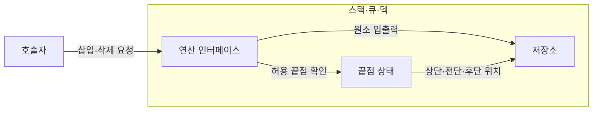
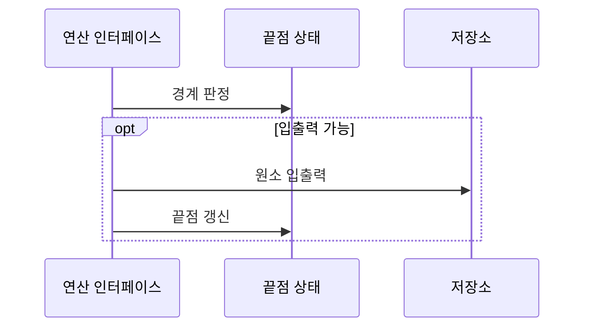

---
sidebar:
  order: 7
  label: "007. 스택·큐·덱 (Stack Queue Deque)"
  badge:
    text: "미출제 · 30%"
    variant: note
title: "스택·큐·덱 (Stack Queue Deque)"
date: "2026-07-26T22:16:20+09:00"
tags:
  - "notes-basic-theory"
weight: 7
extra:
  question_no: "007"
  source_status: "미출제"
  source_history: ""
  priority: 30
  priority_note: "선입·후입·양단 연산 비교의 기초"
---

## 미리 알고가기

- **스택·큐·덱(Stack·Queue·Deque)**: 입출력 끝점을 제한해 원소 처리 순서를 통제하는 선형 자료구조
- **후입선출(Last-In First-Out, LIFO)**: 마지막에 삽입한 원소를 가장 먼저 제거하는 자료 처리 규칙
- **선입선출(First-In First-Out, FIFO)**: 가장 먼저 삽입한 원소를 가장 먼저 제거하는 자료 처리 규칙
- **덱(Double-Ended Queue, Deque)**: 앞과 뒤 양쪽 끝에서 원소를 삽입·삭제할 수 있는 선형 자료구조
- **상단·전단·후단**: 스택 맨 위와 큐·덱의 앞·뒤 끝점
- **오버플로(Overflow)**: 포화 상태의 삽입 요청 오류
- **언더플로(Underflow)**: 공백 상태의 삭제 요청 오류
- **원형 큐(Circular Queue)**: 배열 끝과 시작을 이어 비운 슬롯을 재사용하는 큐
- **상수 시간(Constant Time)**: 입력 크기와 무관한 연산 시간
- **연결 리스트(Linked List)**: 노드를 링크로 이어 순서를 만든 자료구조
- **깊이 우선 탐색(Depth-First Search, DFS)**: 한 경로를 끝까지 탐색한 뒤 이전 분기점으로 되돌아가 탐색을 계속하는 방식
- **연산 인터페이스(Operation Interface)**: 호출자가 자료구조의 내부 저장 방식을 몰라도 허용된 삽입·삭제 연산을 요청하게 하는 접점
- **재귀 스택(Recursion Stack)**: 함수가 자신을 다시 호출할 때 반환 위치와 처리 상태를 호출 깊이만큼 저장하는 스택
- **메시지 버퍼(Message Buffer)**: 생산자와 소비자의 처리 속도 차이를 흡수하도록 도착 메시지를 임시 저장하는 공간
- **병렬 스케줄러(Parallel Scheduler)**: 여러 작업자에게 실행 작업을 배분하고 각 작업자의 대기열을 조정하는 구성요소
- **작업 탈취(Work Stealing)**: 유휴 작업자가 다른 작업자의 덱 반대쪽에서 대기 작업을 가져와 병렬 부하를 나누는 스케줄링 기법
- **빌드 의존 그래프(Build Dependency Graph)**: 소프트웨어 모듈의 선행 빌드 관계를 정점과 간선으로 나타내며 DFS 스택으로 순환을 탐지하는 그래프

## Ⅰ. 개요

- 정의/개념: 입출력 **끝점**을 제한해 처리 순서를 통제하는 **선형 자료구조**
- 기존 한계: 임의 접근 자료구조로는 **처리 순서**를 구조로 강제 불가

### 쉽게 이해하기 (학습용)

- 스택은 맨 위만 손이 닿는 접시 더미, 큐는 앞에서 빠지고 뒤에 붙는 매표소 줄, 덱은 앞뒤 문이 다 열린 지하철 칸이며, 이렇게 손댈 자리를 끝으로 못 박아 두어야 누가 언제 요청하든 꺼내지는 순서가 흔들리지 않는다.

## Ⅱ. 특징

- **LIFO·FIFO**·양방향 입출력에 따른 처리 순서 통제
- **끝점 갱신** 기반 $O(1)$ 삽입·삭제

### 쉽게 이해하기 (학습용)

- 손댈 수 있는 자리가 접시 더미의 맨 위, 줄의 맨 앞과 맨 뒤로 아예 못 박혀 있으므로 넣고 뺄 때 그 끝을 가리키는 표지 하나만 옮기면 되고, 줄 전체를 훑을 일이 없어 원소가 몇 개든 한 번의 삽입·삭제는 같은 시간에 끝난다.

## Ⅲ. 아키텍처 및 구성요소

| 설계 요소 | 설명 |
|:---|:---|
| 연산 인터페이스 | 자료구조별 **허용 끝점**에서 삽입·삭제 |
| 끝점 상태 | **상단·전단·후단** 위치와 원소 수 관리 |
| 저장소 | **배열·연결 리스트**에 원소 저장 |

> 요약: **연산 인터페이스**가 끝점 상태를 이용해 **저장소** 접근을 통제

### 쉽게 이해하기 (학습용)

- 물건을 맡기고 찾는 창구가 연산 인터페이스이고, 창구 직원이 보는 '지금 맨 위·맨 앞·맨 뒤가 어디인가' 쪽지가 끝점 상태이며, 물건이 실제로 쌓여 있는 보관함이 저장소라서 손님은 보관함 내부를 몰라도 창구에만 요청하면 된다.

## Ⅳ. 원리 및 절차 흐름도

| 절차 | 설명 |
|:---|:---|
| 경계 판정 | 원소 수·용량으로 **공백·포화** 확인 |
| 원소 입출력 | **허용 끝점**에서 원소 읽기·쓰기 |
| 끝점 갱신 | **상단·전단·후단** 위치와 원소 수 갱신 |

> 요약: **경계 판정** 후 원소 입출력·**끝점 상태** 갱신

### 쉽게 이해하기 (학습용)

- 창구는 보관함이 꽉 찼는지 텅 비었는지부터 확인해 오버플로·언더플로가 될 요청을 먼저 걸러 내고, 통과한 요청만 정해진 끝에서 물건을 넣거나 빼며, 마지막으로 '맨 위가 어디'라는 쪽지를 한 칸 옮겨야 다음 요청이 올바른 자리를 보게 된다.

## Ⅴ. 종류 및 비교

| 선형 자료구조 | 스택(Stack) | 큐(Queue) | 덱(Deque) |
|:---|:---|:---|:---|
| 적용 기준 | **호출 이력**·되돌리기 관리 | 도착 순서대로 **작업 처리** | **양단 삽입·삭제** 필요 |
| 핵심 특징 | **후입선출**로 최근 원소부터 처리 | **선입선출**로 도착 원소부터 처리 | **양단** 중 선택해 처리 |
| 한계 | 깊이 증가 시 **스택 오버플로** | **선두 차단**으로 후속 작업 지연 | 양단 규칙 혼용 시 **순서 오류** |

> 요약: 역순 처리는 **스택**, 도착순 처리는 **큐**, 양단 처리는 덱

### 쉽게 이해하기 (학습용)

- 접시 더미는 맨 위 한 장만 손이 닿아 나중에 놓은 접시가 먼저 나오고, 매표소 줄은 먼저 선 사람이 먼저 빠지며, 앞뒤 문이 다 열린 지하철 칸은 어느 쪽으로든 타고 내릴 수 있어 같은 원소 묶음이라도 어느 끝을 열어 두느냐에 따라 처리 순서가 갈린다.

## Ⅵ. 실무 사례

1. 빌드 의존 그래프는 **DFS 재귀 스택**으로 **순환 탐지**

### 쉽게 이해하기 (학습용)

- 지금 내려가는 중인 모듈만 스택에 쌓아 두면 그 스택 안에 이미 있는 모듈을 다시 만나는 순간 길이 자기 자신으로 되돌아왔다는 뜻이므로, 되돌아온 그 지점이 곧 빌드 순환이다.

## Ⅶ. 결론

- **후입선출·선입선출**·양단 접근으로 스택·큐·덱 선택

### 쉽게 이해하기 (학습용)

- 꺼낼 순서를 먼저 못 박는 것이 이 셋의 갈림길이어서, 가장 최근 것을 되돌려야 하면 스택, 들어온 차례를 지켜야 하면 큐, 양쪽 끝을 다 열어야 하면 덱으로 정해진다.
