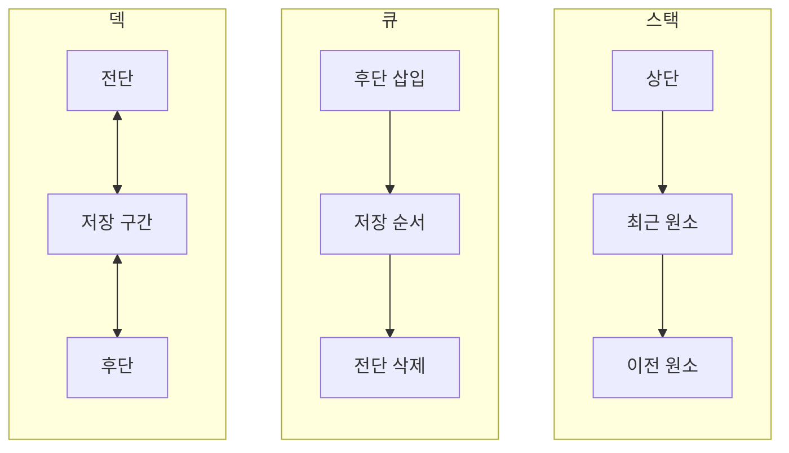
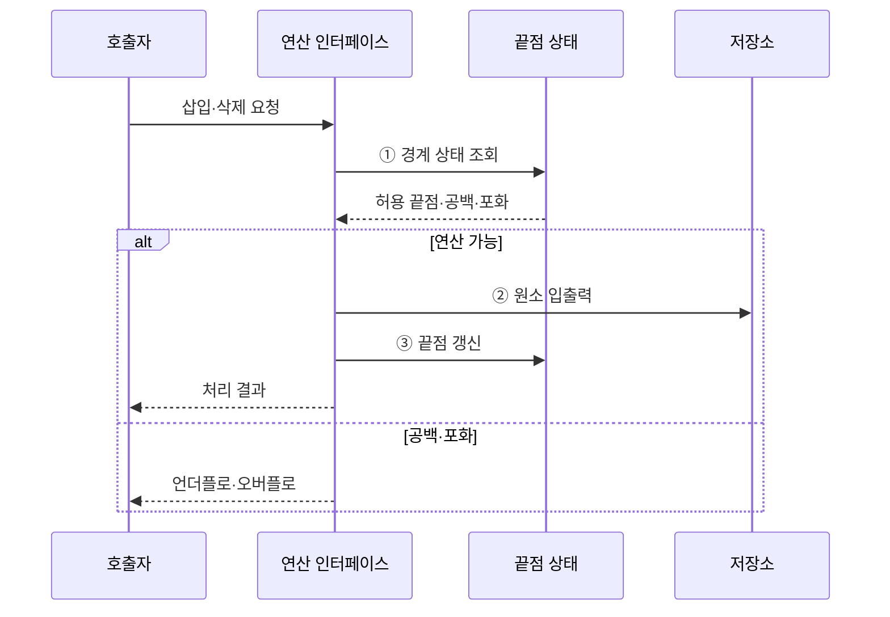

---
sidebar:
  order: 7
  label: "007. 스택·큐·덱 (Stack Queue Deque)"
  badge:
    text: "미출 · 30%"
    variant: note
title: "스택·큐·덱 (Stack Queue Deque)"
date: "2026-07-28T22:10:00+09:00"
tags:
  - "notes-basic-theory"
weight: 7
extra:
  question_no: "007"
  source_status: "미출"
  source_history: ""
  priority: 30
  priority_note: "선입·후입·양단 연산 비교의 기초"
---

## 미리 알고가기

- **스택·큐·덱(Stack·Queue·Deque)**: 입출력 끝점을 제한해 원소 처리 순서를 통제하는 선형 자료구조
- **후입선출(Last-In First-Out, LIFO)**: 마지막에 삽입한 원소를 가장 먼저 제거하는 자료 처리 규칙
- **선입선출(First-In First-Out, FIFO)**: 가장 먼저 삽입한 원소를 가장 먼저 제거하는 자료 처리 규칙
- **덱(Double-Ended Queue, Deque)**: 앞과 뒤 양쪽 끝에서 원소를 삽입·삭제할 수 있는 선형 자료구조
- **상단·전단·후단**: 스택 맨 위와 큐·덱의 앞·뒤 끝점
- **오버플로(Overflow)**: 포화 상태의 삽입 요청 오류
- **언더플로(Underflow)**: 공백 상태의 삭제 요청 오류
- **원형 큐(Circular Queue)**: 배열 끝과 시작을 이어 비운 슬롯을 재사용하는 큐
- **상수 시간(Constant Time)**: 입력 크기와 무관한 연산 시간
- **연결 리스트(Linked List)**: 노드를 링크로 이어 순서를 만든 자료구조
- **연산 인터페이스(Operation Interface)**: 호출자가 자료구조의 내부 저장 방식을 몰라도 허용된 삽입·삭제 연산을 요청하게 하는 접점
- **선두 차단(Head-of-Line Blocking)**: 큐의 첫 작업이 지연되어 뒤의 처리 가능한 작업까지 대기하는 현상
- **원자적 인덱스 갱신(Atomic Index Update)**: 동시 실행 중에도 끝점 인덱스 변경이 나뉘지 않은 한 연산처럼 완료되게 하는 방식

## Ⅰ. 개요

- 정의/개념: 입출력 **끝점**을 제한해 처리 순서를 통제하는 **선형 자료구조**
- 기존 한계: 임의 접근 자료구조로는 **처리 순서**를 구조로 강제 불가

### 쉽게 이해하기 (학습용)

- 스택은 접시 더미, 큐는 매표소 줄, 덱은 양쪽 문이 열린 통로처럼 접근 가능한 끝점으로 처리 순서를 정한다.

## Ⅱ. 특징

- **LIFO·FIFO**·양방향 입출력에 따른 처리 순서 통제
- **끝점 갱신** 기반 $O(1)$ 삽입·삭제

### 쉽게 이해하기 (학습용)

- 정해진 끝점에서 원소를 처리하므로 끝점 위치만 갱신하면 된다.

## Ⅲ. 아키텍처

**도표안 A — 구조도**

**도표안 B — sequenceDiagram**

| 구성요소 | 책임 |
|:---|:---|
| 연산 인터페이스 | **허용 끝점**의 삽입·삭제 통제 |
| 끝점 상태 | **상단·전단·후단** 위치·경계 관리 |
| 저장소 | 배열·연결 리스트에 원소 저장 |

**동작 원리**

- **① 경계 상태 조회**: 허용 끝점과 공백·포화 여부 판정
- **② 원소 입출력**: 허용된 저장 위치의 원소 변경
- **③ 끝점 갱신**: 처리 후 상단·전단·후단 위치 반영

### 쉽게 이해하기 (학습용)

- 인터페이스가 경계를 확인하고 허용된 끝점에서 저장소를 갱신한 뒤 결과를 반환한다.

## Ⅳ. 종류 및 비교

| 선형 자료구조 | 스택 | 큐 | 덱 |
|:---|:---|:---|:---|
| 적용 기준 | **호출 이력**·되돌리기 관리 | 도착 순서대로 **작업 처리** | **양단 삽입·삭제** 필요 |
| 핵심 특징 | **후입선출**로 최근 원소부터 처리 | **선입선출**로 도착 원소부터 처리 | **양단** 중 선택해 처리 |
| 한계 | 깊이 증가 시 **스택 오버플로** | **선두 차단**으로 후속 작업 지연 | 양단 규칙 혼용 시 **순서 오류** |

> 요약: 역순은 **스택**, 도착순은 **큐**, 양단 처리는 덱

### 쉽게 이해하기 (학습용)

- 역순은 스택, 도착순은 큐, 양쪽 끝 처리는 덱을 선택한다.

## Ⅴ. 실무 고려사항 및 대책

| 고려사항 | 대책 | 효과 |
|:---|:---|:---|
| **공백·포화 상태**의 잘못된 입출력 | 연산 전 **원소 수·용량** 검사 | **언더플로·오버플로** 방지 |
| **배열 큐**의 앞쪽 빈 공간 낭비 | **원형 큐**로 인덱스 순환 | **고정 용량** 재사용 |
| 병렬 접근 중 **끝점 상태** 충돌 | 잠금 또는 **원자적 인덱스** 갱신 | 원소 유실·중복 제거 |
| 자료구조와 **처리 정책** 불일치 | **LIFO·FIFO·양단** 연산만 허용 | **처리 순서** 보장 |

### 쉽게 이해하기 (학습용)

- 창고 출입구를 하나씩 통제하듯 빈 공간·용량·동시 접근을 확인하고 허용된 끝점만 갱신한다.

## Ⅵ. 결론

- 최근 항목 우선이면 **스택**, 도착순은 **큐**, 양단 변경은 덱 선택

### 쉽게 이해하기 (학습용)

- 가장 최근 항목, 가장 먼저 온 항목, 양쪽 끝 중 무엇을 먼저 처리할지에 따라 선택한다.
