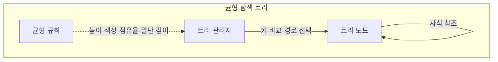
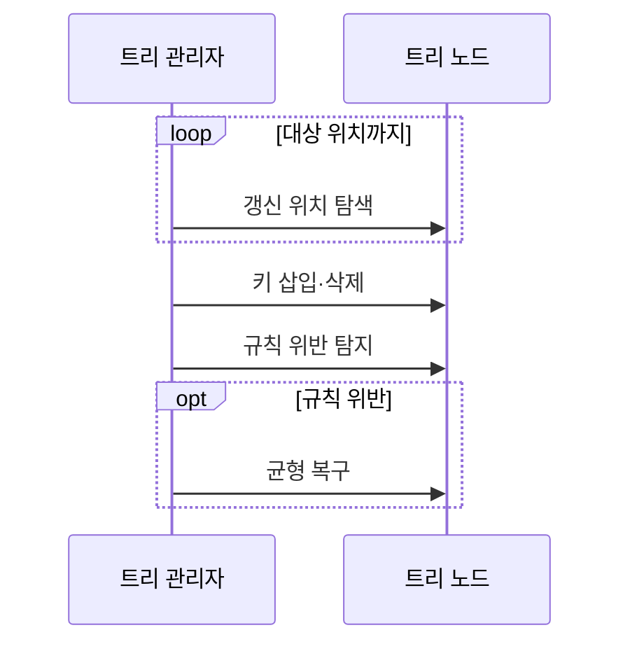
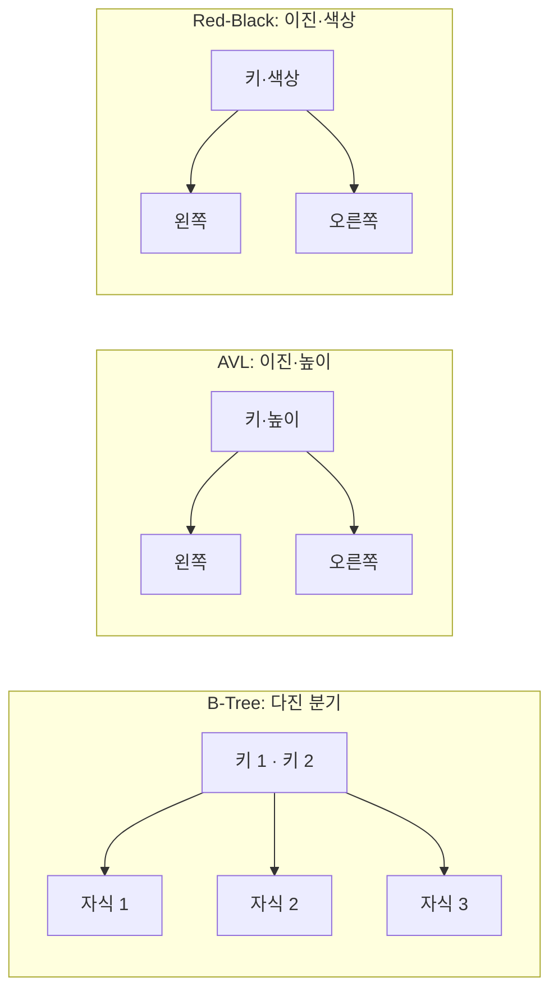

---
sidebar:
  order: 8
  label: "008. 트리 구조 — B-Tree·AVL·Red-Black (Tree Data Structures)"
  badge:
    text: "기출 · 70%"
    variant: note
title: "트리 구조 — B-Tree·AVL·Red-Black (Tree Data Structures)"
date: "2026-07-26T22:16:20+09:00"
tags:
  - "notes-basic-theory"
weight: 8
extra:
  question_no: "008"
  source_status: "기출"
  source_history: "122회, 137회"
  priority: 70
  priority_note: "반복 기출, 균형 트리 선택·갱신 비교 유력"
---

## 미리 알고가기

- **균형 탐색 트리(Balanced Search Tree)**: 균형 규칙으로 높이를 제한해 탐색 비용을 줄이는 트리
- **편향 트리(Skewed Tree)**: 한쪽 자식만 이어져 선형화된 트리
- **로그 시간(Logarithmic Time)**: 입력이 늘어도 처리 단계가 완만히 증가하는 시간
- **회전(Rotation)**: 키 순서를 보존하며 부모·자식 관계를 바꿔 균형을 복구하는 연산
- **페이지(Page)**: 저장소에서 한 번에 읽고 쓰는 블록
- **입출력(Input/Output, I/O)**: ‘아이 오’로 읽고 입력과 출력을 빗금(/)으로 묶는 관례 표기를 사용하며 저장소 페이지와 메모리 간에 데이터를 읽고 쓰는 작업
- **비 트리(B-Tree)**: ‘비 트리’로 읽으며 한 노드에 여러 키와 자식을 두어 트리 높이를 낮추고 저장소 페이지를 읽는 횟수를 줄이는 균형 트리
- **AVL 트리(Adelson-Velsky and Landis Tree, AVL, 에이브이엘)**: 고안자 성명의 첫 글자를 따 AVL로 표기하며 좌우 자식의 높이 차를 1 이하로 제한해 균형을 유지하는 이진 탐색 트리
- **트리 관리자(Tree Manager)**: 키 비교로 내려갈 자식을 고르고 삽입·삭제 뒤 균형 규칙 위반을 확인해 회전이나 분할을 지시하는 연산 주체
- **레드블랙 트리(Red-Black Tree)**: 노드 색상 규칙으로 높이를 제한한 이진 트리
- **정렬 맵(Ordered Map)**: 키 순서를 유지하는 키·값 자료구조
- **말단 깊이(Leaf Depth)**: 루트에서 자식 링크를 따라 말단 노드까지 내려간 단계 수이며 모든 말단을 같은 깊이에 두는 B-Tree 균형 조건
- **노드 점유율(Node Occupancy)**: 한 노드가 허용 키 공간 중 실제로 채운 비율이며 B-Tree의 분할·병합을 결정하는 균형 조건
- **다진 분기(Multiway Branching)**: 한 노드가 셋 이상의 자식을 가질 수 있어 트리 높이와 저장소 페이지 접근 횟수를 줄이는 구조
- **데이터베이스(Database, DB, 디비)**: 영문 단어의 첫 글자를 따 DB로 표기하며 구조화된 데이터를 페이지 단위로 저장·조회하는 체계
- **선택 화살표($\rightarrow$)**: ‘이면 선택’으로 읽고 조건에서 결과로 이어짐을 화살표로 나타내는 관례에 따라 결론에서 저장 위치·작업 유형별 트리 선택을 연결함

## Ⅰ. 개요

- **정의/개념**: 키 순서·**균형 규칙**으로 높이를 제한해 탐색을 단축하는 **트리**
- **기존 한계**: 일반 이진 탐색 트리는 **편향 트리**가 되면 $O(n)$ 퇴화

### 쉽게 이해하기 (학습용)
- 사전 중간을 펼쳐 찾는 단어가 앞쪽인지 뒤쪽인지만 보고 절반을 접어 두듯 트리도 키 하나를 비교해 한쪽 가지만 남기는데, 가지가 한쪽으로만 자라 한 줄이 되어 버리면 접을 것이 없어 처음부터 훑는 것과 같아지므로 높이를 눌러 둘 규칙이 필요하다.

## Ⅱ. 특징

- 키 순서에 따른 **계층적 탐색 범위** 축소
- **균형 유지**로 탐색·삽입·삭제의 $O(\log n)$ 보장

### 쉽게 이해하기 (학습용)
- 한쪽 가지만 길어지려 할 때마다 가지를 돌려 모양을 다시 눌러 놓기 때문에, 자료가 백만 건으로 불어나도 뿌리에서 잎까지 내려가는 걸음 수는 스무 걸음 남짓으로만 늘고 삽입·삭제도 같은 걸음 수 안에서 끝난다.

## Ⅲ. 아키텍처 및 구성요소

| 설계 요소 | 설명 |
|:---|:---|
| 트리 관리자 | 키 비교로 경로 선택·**균형 복구** 수행 |
| 트리 노드 | **키·자식 참조**와 균형 정보 보관 |
| 균형 규칙 | 높이·색상·**점유율·말단 깊이** 제약 |

> 요약: 노드 키로 경로 선택·**균형 규칙**으로 최장 깊이 제한

### 쉽게 이해하기 (학습용)
- 갈림길마다 키를 견줘 어느 가지로 내려갈지 정하는 사람이 트리 관리자이고, 키와 자식 주소를 들고 있는 갈림길 하나하나가 트리 노드이며, '한쪽이 이만큼 이상 길어지면 안 된다'는 사규가 균형 규칙이라 관리자는 갱신 뒤 그 사규를 확인해 모양을 되돌린다.

## Ⅳ. 원리 및 절차 흐름도

| 절차 | 설명 |
|:---|:---|
| 갱신 위치 탐색 | **키 비교**로 삽입·삭제 대상 위치 결정 |
| 키 삽입·삭제 | 대상 노드의 **키·자식 참조** 갱신 |
| 규칙 위반 탐지 | 높이·색상·**키 수 규칙** 위반 판정 |
| 균형 복구 | **회전**·색상 변경·노드 **분할·병합** |

> 요약: **키 순서**를 보존하며 위반한 **균형 규칙** 복구

### 쉽게 이해하기 (학습용)
- 키를 넣거나 뺀 자리는 규칙이 깨지기 쉬운 자리라서, 관리자가 그 자리부터 위쪽으로 올라가며 사규 위반을 확인하고 가지를 돌리거나 색을 바꾸거나 꽉 찬 노드를 둘로 쪼개는데, 이때도 왼쪽이 작고 오른쪽이 크다는 키 순서는 건드리지 않는다.

## Ⅴ. 종류 및 비교

| 균형 탐색 트리 | B-Tree 계열 | AVL 트리 | 레드블랙 트리 |
|:---|:---|:---|:---|
| 적용 기준 | **페이지 단위** 외부 저장소 색인 | 갱신 드물고 **조회 집중** | 메모리에서 **삽입·삭제 빈번** |
| 핵심 특징 | **다진 분기**로 노드당 여러 키 보유 | 좌우 **높이 차 1 이하** 제한 | 노드 **색상·경로 규칙** 유지 |
| 한계 | 분할·병합 시 **페이지 쓰기** 비용 | 갱신마다 **회전 횟수 증가** | AVL보다 **긴 탐색 경로** |

> 요약: 노드당 키 수와 **균형 강도**에 따라 **갱신 비용**이 달라짐

### 쉽게 이해하기 (학습용)
- 디스크는 한 번 손대면 한 페이지를 통째로 읽어 오므로 B-Tree는 그 페이지에 키를 잔뜩 실어 층수를 줄이고, 메모리 안에서는 페이지 부담이 없어 이진 트리를 쓰되 AVL은 높이를 빡빡하게 조여 조회가 가장 짧은 대신 고칠 일이 잦고, 레드블랙은 조금 헐겁게 조여 경로는 길어도 고치는 횟수를 아낀다.

## Ⅵ. 실무 사례

1. 데이터베이스 색인은 **B-Tree 계열**로 **페이지 I/O** 감소
2. 메모리 **정렬 맵**은 레드블랙 트리 **색상 변경·회전**으로 균형 복구

### 쉽게 이해하기 (학습용)
- 디스크는 한 번 읽을 때 페이지 한 장을 통째로 가져오므로 그 한 장에 키를 최대한 많이 담아 두면 뿌리에서 잎까지 내려가는 동안 손대야 할 페이지 수가 서너 장으로 줄어든다.
- 메모리의 키·값 사전은 값이 쉴 새 없이 들어오고 빠지므로, 고칠 일이 적은 레드블랙 트리로 색을 바꾸거나 가지를 한 번 돌리는 정도만으로 키 순서와 높이를 함께 지킨다.

## Ⅶ. 결론

- 디스크→**B-Tree**, 메모리 조회→**AVL**, 갱신→레드블랙

### 쉽게 이해하기 (학습용)
- 자료가 디스크에 있느냐 메모리에 있느냐를 먼저 가르고, 메모리라면 읽기가 잦은지 쓰기가 잦은지를 다시 갈라야 B-Tree·AVL·레드블랙 중 하나가 정해진다.
