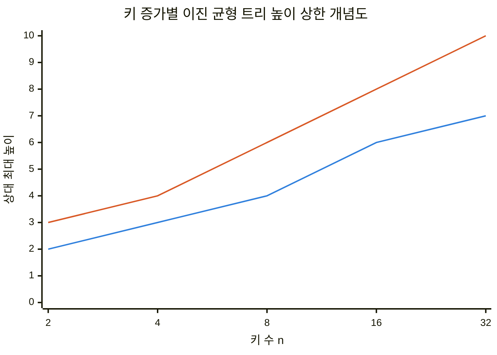
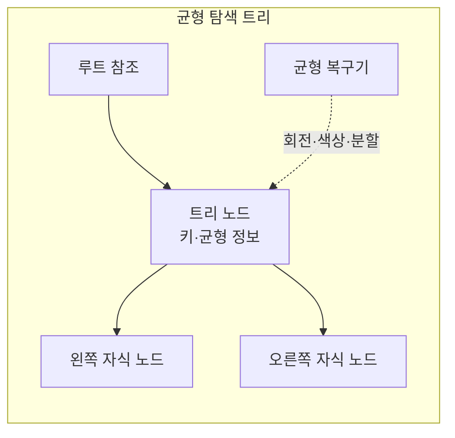
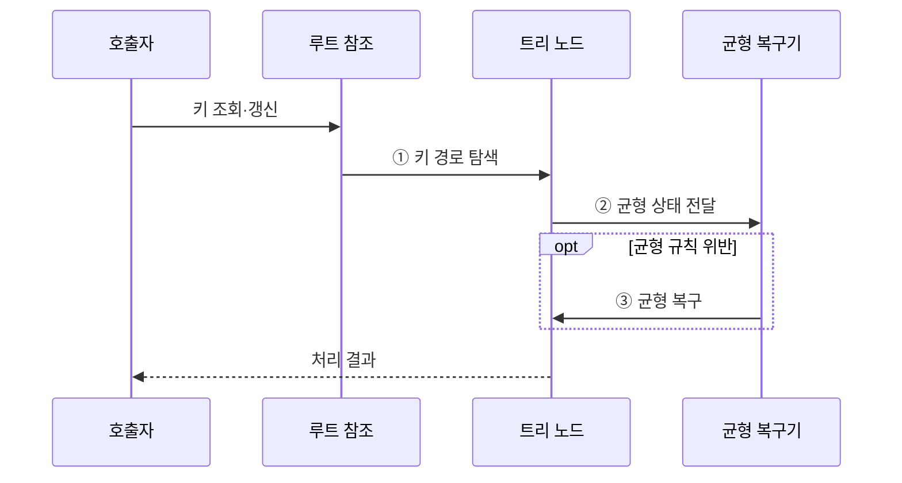

---
sidebar:
  order: 8
  label: "008. 트리 구조 — B-Tree·AVL·Red-Black (Tree Data Structures)"
  badge:
    text: "기출 · 70%"
    variant: note
title: "트리 구조 — B-Tree·AVL·Red-Black (Tree Data Structures)"
date: "2026-07-28T21:29:34+09:00"
tags:
  - "notes-basic-theory"
weight: 8
extra:
  question_no: "008"
  source_status: "기출"
  source_history: "122회, 137회"
  priority: 70
  priority_note: "반복 기출, 균형 트리 선택·갱신 비교 유력"
---

## 미리 알고가기

- **균형 탐색 트리(Balanced Search Tree)**: 균형 규칙으로 높이를 제한해 탐색 비용을 줄이는 트리
- **편향 트리(Skewed Tree)**: 한쪽 자식만 이어져 선형화된 트리
- **로그 시간(Logarithmic Time)**: 입력이 늘어도 처리 단계가 완만히 증가하는 시간
- **입력 크기 $n$**: 트리에 저장된 키 수
- **빅오(Big-O, $O$)**: 입력 증가에 따른 연산 비용의 상한 표기
- **회전(Rotation)**: 키 순서를 보존하며 부모·자식 관계를 바꿔 균형을 복구하는 연산
- **페이지(Page)**: 저장소에서 한 번에 읽고 쓰는 블록
- **입출력(Input/Output, I/O)**: 저장소 페이지와 메모리 사이의 읽기·쓰기 작업
- **비 트리(B-Tree)**: 한 노드에 여러 키와 자식을 저장하여 트리 높이와 저장장치 페이지 접근 횟수를 줄이는 균형 트리
- **AVL 트리(Adelson-Velsky and Landis Tree, AVL)**: 각 노드의 좌우 서브트리 높이 차를 1 이하로 유지하는 높이 균형 이진 탐색 트리
- **레드블랙 트리(Red-Black Tree)**: 노드 색상 규칙으로 높이를 제한한 이진 트리
- **다진 분기(Multiway Branching)**: 한 노드가 셋 이상의 자식을 가질 수 있어 트리 높이와 저장소 페이지 접근 횟수를 줄이는 구조

## Ⅰ. 개요

- 정의/개념: 키 순서·**균형 규칙**으로 높이를 제한해 탐색을 단축하는 **트리**
- 기존 한계: 일반 이진 탐색 트리는 **편향 트리**가 되면 $O(n)$ 퇴화

### 쉽게 이해하기 (학습용)

- 키 비교로 한쪽 가지를 선택하되, 트리가 한쪽으로 치우치지 않도록 균형 규칙으로 높이를 제한한다.

## Ⅱ. 특징

- 키 순서에 따른 **계층적 탐색 범위** 축소
- **균형 유지**로 탐색·삽입·삭제의 $O(\log n)$ 보장

■ **AVL** &nbsp;&nbsp; ■ **레드블랙**

> AVL은 더 강한 균형으로 최대 탐색 경로를 단축

### 쉽게 이해하기 (학습용)

- 균형 복구로 루트에서 말단까지의 경로가 과도하게 길어지는 것을 방지한다.

## Ⅲ. 아키텍처

**도표안 A — 구조도**

**도표안 B — sequenceDiagram**

| 구성요소 | 책임 |
|:---|:---|
| 루트 참조 | **탐색 시작 노드** 위치 보관 |
| 트리 노드 | 키·자식 참조와 **균형 정보** 보관 |
| 균형 복구기 | **회전·색상·분할**로 규칙 복구 |

**동작 원리**

- **① 키 경로 탐색**: 루트부터 키 대소로 자식 선택
- **② 균형 상태 전달**: 갱신 경로의 높이·색상·용량 판정
- **③ 균형 복구**: 회전·색상 변경·노드 분할 수행

### 쉽게 이해하기 (학습용)

- 루트에서 키를 비교해 노드를 찾고, 갱신으로 규칙이 깨지면 복구한 뒤 결과를 반환한다.

## Ⅳ. 종류 및 비교

| 균형 탐색 트리 | B-Tree 계열 | AVL 트리 | 레드블랙 트리 |
|:---|:---|:---|:---|
| 적용 기준 | **페이지 단위** 외부 저장소 색인 | 갱신 드물고 **조회 집중** | 메모리에서 **삽입·삭제 빈번** |
| 핵심 특징 | **다진 분기**로 노드당 여러 키 보유 | 좌우 **높이 차 1 이하** 제한 | 노드 **색상·경로 규칙** 유지 |
| 한계 | 분할·병합 시 **페이지 쓰기** 비용 | 삭제 시 상향 **재균형 반복** | AVL보다 **긴 탐색 경로** |

> 요약: 노드당 키 수와 **균형 강도**에 따라 **갱신 비용**이 달라짐

### 쉽게 이해하기 (학습용)

- 외부 저장소는 B-Tree, 조회 중심 메모리는 AVL, 갱신 중심 메모리는 레드블랙이 적합하다.

## Ⅴ. 실무 고려사항 및 대책

| 고려사항 | 대책 | 효과 |
|:---|:---|:---|
| 저장 계층과 **노드 크기** 불일치 | 페이지 크기로 **B-Tree 차수** 설정 | 저장소 **I/O** 감소 |
| 조회·갱신 비율과 **균형 강도** 불일치 | 조회는 **AVL**, 갱신은 레드블랙 선택 | 회전 횟수·탐색 경로 절충 |
| 분할·병합 중 **구조 불일치** | 갱신 전 복구 로그·원자적 쓰기 | 중단 후 **구조 일관성** 복구 |
| 동시 탐색·갱신의 **잠금 경합** | 노드 잠금 범위·순서 고정 | **상호 대기**·경합 감소 |

### 쉽게 이해하기 (학습용)

- 저장 계층과 작업 비율에 맞는 트리를 고르고 갱신 중단과 동시 접근에도 구조를 일관되게 유지한다.

## Ⅵ. 결론

- 페이지 병목은 **B-Tree**, 메모리는 조회·갱신률로 **AVL·레드블랙** 결정

### 쉽게 이해하기 (학습용)

- 저장 위치와 조회·갱신 비율에 따라 균형 트리 종류를 선택한다.
