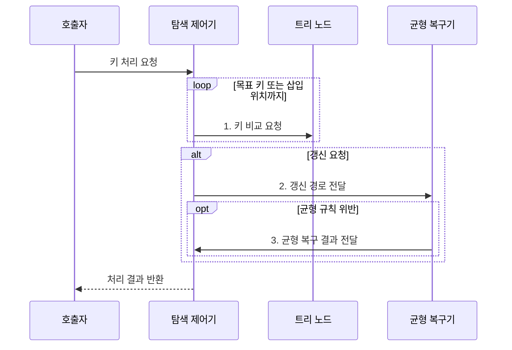

---
sidebar:
  order: 8
  label: "008. 트리 구조: B-Tree•AVL•Red-Black (Tree Data Structures)"
  badge:
    text: "기출 • 70%"
    variant: note
title: "트리 구조: B-Tree•AVL•Red-Black (Tree Data Structures)"
date: "2026-07-30T18:23:20+09:00"
tags:
  - "notes-basic-theory"
weight: 8
extra:
  question_no: "008"
  source_status: "기출"
  source_history: "122회, 137회"
  priority: 70
  priority_note: "반복 기출, 균형 트리 선택•갱신 비교 유력"
---

## 미리 알고가기

- **균형 탐색 트리(Balanced Search Tree)**: 균형 규칙으로 높이를 제한해 탐색 비용을 줄이는 트리
- **편향 트리(Skewed Tree)**: 한쪽 자식만 이어져 선형화된 트리
- **로그 시간(Logarithmic Time)**: 입력이 늘어도 처리 단계가 완만히 증가하는 시간
- **입력 크기 $n$**: 트리에 저장된 키 수
- **빅오(Big-O, $O$)**: 입력 증가에 따른 연산 비용의 상한 표기
- **회전(Rotation)**: 키 순서를 보존하며 부모•자식 관계를 바꿔 균형을 복구하는 연산
- **루트•서브트리(Root•Subtree)**: 루트는 탐색을 시작하는 최상위 노드이고, 서브트리는 한 노드와 그 아래 자손으로 이뤄진 부분 트리
- **페이지(Page)**: 저장소에서 한 번에 읽고 쓰는 블록
- **입출력(Input/Output, I/O)**: 저장소 페이지와 메모리 사이의 읽기•쓰기 작업
- **비 트리(B-Tree)**: 한 노드에 여러 키와 자식을 저장하여 트리 높이와 저장장치 페이지 접근 횟수를 줄이는 균형 트리
- **AVL 트리(Adelson-Velsky and Landis Tree, AVL)**: 각 노드의 좌우 서브트리 높이 차를 1 이하로 유지하는 높이 균형 이진 탐색 트리
- **레드블랙 트리(Red-Black Tree)**: 노드 색상 규칙으로 높이를 제한한 이진 트리
- **다진 분기(Multiway Branching)**: 한 노드가 셋 이상의 자식을 가질 수 있어 트리 높이와 저장소 페이지 접근 횟수를 줄이는 구조
- **B-Tree 차수(Order)**: 한 노드가 가질 수 있는 자식 수의 상한으로, 페이지 크기에 맞춰 한 번에 읽을 키 수를 결정하는 값
- **복구 로그•원자적 쓰기(Recovery Log•Atomic Write)**: 복구 로그는 변경 전후 정보를 기록하고, 원자적 쓰기는 변경을 전부 반영하거나 전혀 반영하지 않아 중간 상태 노출을 막는 방식
- **잠금 경합(Lock Contention)**: 여러 실행 흐름이 같은 노드 잠금을 얻으려고 대기하는 상태
- **AVL 높이 상한**: 키가 $n$개일 때 높이가 약 $1.44\log_2(n+2)-0.328$ 이하인 강한 균형 한계
- **레드블랙 높이 상한**: 키가 $n$개일 때 높이가 $2\log_2(n+1)$ 이하인 색상 균형 한계

## Ⅰ. 개요

- 정의/개념: **균형 규칙**으로 높이를 제한한 키 탐색 트리
- 배경/필요성: **편향 트리**의 $O(n)$ 탐색 비용 방지

### 쉽게 이해하기 (학습용)

- 갈림길 표지판의 키를 보고 한쪽 길만 고르되, 어느 길도 지나치게 길어지지 않게 가지를 재배치해 탐색 단계를 제한한다.

## Ⅱ. 특징

> 키 수가 늘어도 두 선은 로그 증가하며 파란 AVL 높이 상한이 붉은 레드블랙보다 낮고, 각 균형 규칙의 이론적 상한이다.

- 키 순서에 따른 **계층적 탐색 범위** 축소
- **균형 유지**로 탐색•삽입•삭제의 $O(\log n)$ 보장
- 키 순서를 보존한 **범위 탐색** 지원

### 쉽게 이해하기 (학습용)

- 한쪽 계단만 길어진 건물을 다시 나누듯, 균형 복구는 루트에서 말단까지의 최대 경로를 로그 높이로 제한한다.

## Ⅲ. 구조 및 구성요소

| 구성요소 | 책임 |
|:---|:---|
| 루트 참조 | **탐색 시작 노드** 위치 보관 |
| 탐색 제어기 | 키 대소로 **탐색 경로** 선택 |
| 트리 노드 | 키•자식 참조와 **균형 정보** 보관 |
| 균형 복구기 | **회전•색상•분할**로 규칙 복구 |

### 쉽게 이해하기 (학습용)

- 탐색 제어기가 루트부터 키를 비교하고, 균형 복구기가 갱신된 노드의 규칙 위반을 바로잡는다.

## Ⅳ. 흐름도

**동작 원리**

1. **키 비교 요청**: 루트부터 키 대소로 자식 선택
2. **갱신 경로 전달**: 변경 경로의 균형 규칙 위반 판정
3. **균형 복구 결과 전달**: 회전•색상•분할 반영

### 쉽게 이해하기 (학습용)

- 안내판의 키를 따라 목적 노드를 찾고, 새 키로 가지 균형이 깨지면 복구기가 회전•색상 변경•분할로 경로를 다시 줄인다.

## Ⅴ. 종류 및 비교

| 균형 탐색 트리 | B-Tree 계열 | AVL 트리 | 레드블랙 트리 |
|:---|:---|:---|:---|
| 적용 기준 | **페이지 단위** 외부 저장소 색인 | 갱신 드물고 **조회 집중** | 메모리에서 **삽입•삭제 빈번** |
| 핵심 특징 | **다진 분기**로 노드당 여러 키 보유 | 좌우 **높이 차 1 이하** 제한 | 노드 **색상•경로 규칙** 유지 |
| 한계 | 분할•병합 시 **페이지 쓰기** 비용 | 삭제 시 상향 **재균형 반복** | AVL보다 **긴 탐색 경로** |

> 요약: 노드당 키 수와 **균형 강도**에 따라 **갱신 비용**이 달라짐

### 쉽게 이해하기 (학습용)

- 저장장치는 넓은 B-Tree, 메모리는 균형 강도에 따라 AVL•레드블랙을 고른다.

## Ⅵ. 실무 고려사항 및 대책

| 고려사항 | 대책 | 효과 |
|:---|:---|:---|
| 저장 페이지보다 작은 **노드 분기 수**로 I/O 증가 | 페이지 크기에 맞춘 **B-Tree 차수** 설정 | 트리 높이와 **페이지 접근 횟수 감소** |
| 조회·갱신 비율과 균형 정책 불일치로 비용 증가 | 조회 중심 AVL, 갱신 중심 레드블랙 선택 | 워크로드별 **탐색·회전 비용 균형** |
| 분할·병합 중 장애로 일부 구조만 반영돼 경로 손상 | 복구 로그와 원자적 페이지 쓰기 적용 | 장애 후 **트리 구조 일관성** 복구 |
| 동시 노드 갱신의 잠금 순서 충돌·경합 | 루트·리프 방향 잠금 순서와 범위 고정 | 교착 방지와 **동시 처리량 안정화** |

### 쉽게 이해하기 (학습용)

- 노드 크기를 저장장치 페이지에 맞춰 한 번에 읽는 키를 늘린다.

## Ⅶ. 결론

- I/O는 **B-Tree**, 조회는 **AVL**, 갱신은 레드블랙 선택

### 쉽게 이해하기 (학습용)

- 디스크 페이지 왕복이 병목이면 넓고 낮은 B-Tree를, 메모리에서는 조회가 많으면 AVL을, 갱신이 많으면 레드블랙을 고른다.
