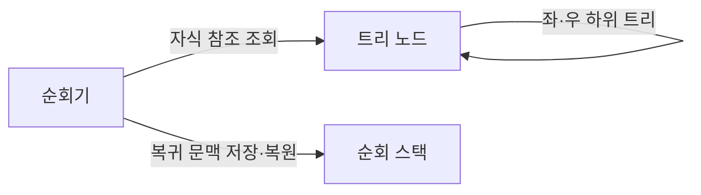
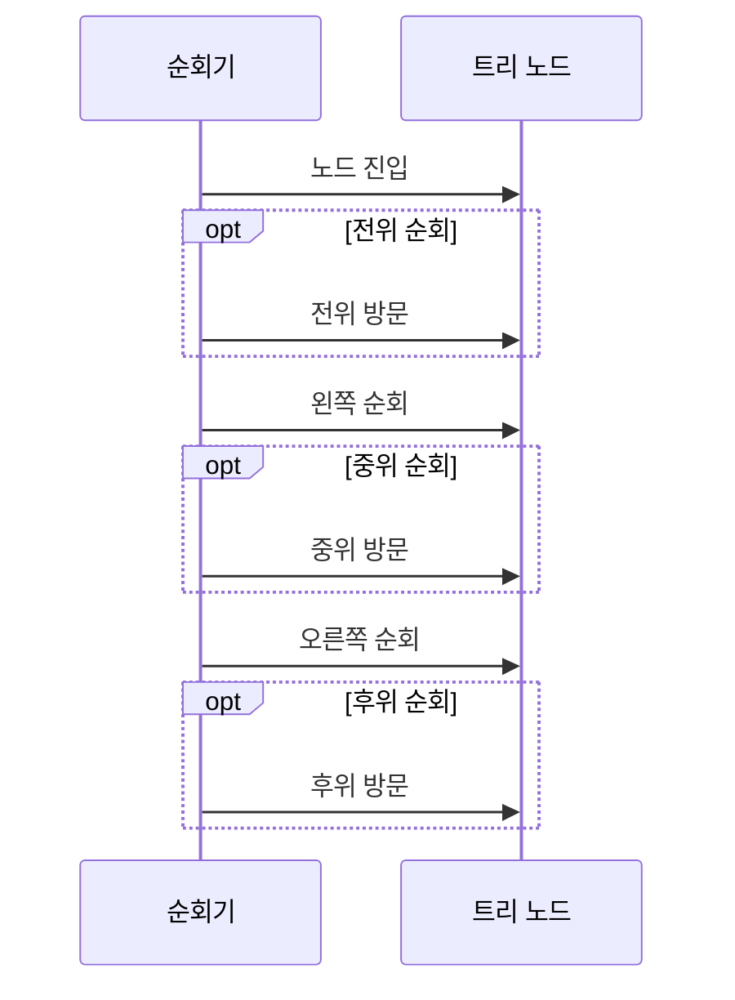

---
sidebar:
  order: 9
  label: "009. 이진 트리 순회 — 전위·중위·후위 (Binary Tree Traversal)"
  badge:
    text: "기출 · 30%"
    variant: note
title: "이진 트리 순회 — 전위·중위·후위 (Binary Tree Traversal)"
date: "2026-07-27T21:03:00+09:00"
tags:
  - "notes-basic-theory"
weight: 9
extra:
  question_no: "009"
  source_status: "기출"
  source_history: "126회"
  priority: 30
  priority_note: "순회 절차 중심이라 독립 확장성은 낮음"
---

## 미리 알고가기

- **이진 트리 순회(Binary Tree Traversal)**: 루트와 두 하위 트리의 방문 순서를 정해 모든 노드를 처리하는 절차
- **루트(Root)**: 하위 트리의 최상위 노드
- **하위 트리(Subtree)**: 특정 노드 아래의 자식 트리
- **재귀 호출(Recursive Call)**: 하위 트리에 같은 함수를 호출해 반복 구조를 처리하는 동작
- **방문(Visit)**: 노드 데이터를 처리하거나 출력하는 동작
- **이진 탐색 트리(Binary Search Tree, BST, 비에스티)**: 영문명 Binary Search Tree를 줄인 공식 약어로, 왼쪽 키는 작고 오른쪽 키는 큰 이진 트리
- **입력 크기 $n$**: ‘엔’으로 읽고 항목 개수(Number)를 나타내는 관례에 따라 순회할 전체 노드 수를 뜻하는 변수
- **빅오(Big-O, $O$)**: ‘빅 오’로 읽고 증가 차수(Order)를 나타내는 $O$를 쓰는 관례에 따라 노드 수가 늘 때 순회 비용이 증가하는 상한을 나타내는 표기
- **트리 높이 $h$**: ‘에이치’로 읽고 높이(Height)의 머리글자를 쓰는 관례에 따라 루트부터 가장 깊은 말단 노드까지의 경로 길이를 나타내며 재귀 스택 사용량을 좌우하는 변수
- **말단 노드(Leaf Node)**: 자식이 없는 트리의 끝 노드이며 트리 높이와 순회 종료 지점을 정하는 대상
- **직렬화(Serialization)·널 표식(Null Marker)**: 트리와 빈 자리를 연속 데이터로 기록하는 기법
- **스택 오버플로(Stack Overflow)**: 호출 스택이 용량 한도를 넘은 오류
- **편향 트리(Skewed Tree)**: 한쪽 자식만 이어져 높이가 커진 트리
- **전위 순회(Pre-order Traversal)**: 루트를 두 하위 트리보다 먼저 방문하는 순회
- **중위 순회(In-order Traversal)**: 루트를 왼쪽과 오른쪽 하위 트리 사이에 방문하는 순회
- **후위 순회(Post-order Traversal)**: 루트를 두 하위 트리보다 나중에 방문하는 순회
- **순회기(Traverser)**: 정해진 방문 순서 규칙에 따라 자식으로 내려가고 노드를 처리한 뒤 상위로 되돌아오는 연산 주체
- **순회 스택(Traversal Stack)**: 하위 트리 처리가 끝난 뒤 돌아갈 노드와 실행 문맥을 저장하는 후입선출 구조
- **복귀 문맥(Return Context)**: 재귀 호출을 마친 뒤 이어서 실행할 위치와 현재 노드 상태를 묶은 정보
- **처리 순서 화살표($\rightarrow$)**: ‘다음’으로 읽고 앞 항목에서 뒤 항목으로 진행함을 화살표로 나타내는 관례에 따라 전위·중위·후위 순회의 노드 방문 순서를 표시함
- **스냅샷 백업(Snapshot Backup)**: 특정 시점의 트리 구조와 데이터를 보존하며 전위 순회와 널 표식으로 같은 모양을 복원하는 백업
- **오름차순(Ascending Order)**: 키를 작은 값부터 큰 값 순서로 나열하며 이진 탐색 트리의 중위 순회 결과를 설명하는 정렬 순서

## Ⅰ. 개요

- **정의/개념**: 루트·두 **하위 트리**의 순서를 정해 모든 노드를 처리하는 **절차**
- **기존 한계**: **방문 순서** 미정 시 직렬화·정렬 결과 재현 불가

### 쉽게 이해하기 (학습용)

- 갈림길마다 자기 자신과 왼쪽 길·오른쪽 길이 있는 산길에서 표지판을 언제 읽을지 정하는 일이며, 같은 나무를 돌아도 표지판을 언제 읽었느냐에 따라 손에 남는 기록이 트리 모양이 되기도 하고 오름차순 목록이 되기도 해서 목적에 맞는 순서를 골라야 한다.

## Ⅱ. 특징

- **전위·중위·후위**에 따른 루트 처리 시점 구분
- 전체 노드 **1회 방문**으로 시간복잡도 $O(n)$
- **재귀 깊이**가 트리 높이에 비례해 스택 사용량 증가

### 쉽게 이해하기 (학습용)

- 세 순회 모두 모든 갈림길을 한 번씩 방문하지만, 한쪽으로 긴 나무에서는 되돌아갈 자리를 적은 메모가 높이만큼 쌓여 순회 스택 사용량이 커진다.

## Ⅲ. 아키텍처 및 구성요소

| 설계 요소 | 설명 |
|:---|:---|
| 순회기 | 유형별 **방문 순서**대로 하강·방문·복귀 수행 |
| 트리 노드 | 데이터와 **좌·우 자식 참조** 보관 |
| 순회 스택 | **복귀 문맥**과 미방문 하위 트리 보관 |

> 요약: **순회기**가 자식 참조로 하강하고 스택에 **재개 지점** 보관

### 쉽게 이해하기 (학습용)

- 산길을 걷는 사람이 순회기이고, 갈림길마다 서 있는 표지판과 두 갈래 길 안내가 트리 노드이며, 왔던 길을 잊지 않으려고 갈림길 이름을 적어 주머니에 차곡차곡 쌓아 두는 메모 뭉치가 순회 스택이라 막다른 길에서 맨 위 메모를 꺼내 되돌아온다.

## Ⅳ. 원리 및 절차 흐름도

| 절차 | 설명 |
|:---|:---|
| 노드 진입 | 현재 노드의 **방문 시점** 판정 |
| 전위 방문 | 하위 트리보다 **루트 우선** 처리 |
| 왼쪽 순회 | 왼쪽 **하위 트리** 재귀 호출 |
| 중위 방문 | 두 하위 트리 사이에 **루트** 처리 |
| 오른쪽 순회 | 오른쪽 **하위 트리** 재귀 호출 |
| 후위 방문 | 두 하위 트리 뒤에 **루트** 처리 |

> 요약: 루트 방문 시점만 바꿔 **전위·중위·후위** 구분

### 쉽게 이해하기 (학습용)

- 세 순회의 걸음걸이는 완전히 같고 표지판을 읽는 순간만 달라서, 갈림길에 닿자마자 읽으면 전위, 왼쪽 길을 다 돌고 와서 읽으면 중위, 양쪽 길을 모두 마친 뒤 읽으면 후위가 되며 막다른 길에서는 주머니의 맨 위 메모를 꺼내 한 갈림길 위로 되돌아온다.

## Ⅴ. 종류 및 비교

| 이진 트리 순회 | 전위 순회 | 중위 순회 | 후위 순회 |
|:---|:---|:---|:---|
| 적용 기준 | **널 표식** 포함 트리 직렬화 | **이진 탐색 트리** 정렬 출력 | 하위 노드 삭제·**용량 집계** |
| 핵심 특징 | 루트 → 왼쪽 → 오른쪽 | 왼쪽 → 루트 → 오른쪽 | 왼쪽 → 오른쪽 → 루트 |
| 한계 | **하위 결과** 기반 집계에 부적합 | 일반 이진 트리는 **정렬 미보장** | **부모 선처리** 작업에 부적합 |

> 요약: 직렬화는 **전위**, 정렬은 **중위**, 하위 집계는 후위 선택

### 쉽게 이해하기 (학습용)

- 부모를 먼저 적어 두면 나중에 그 모양대로 다시 조립할 수 있어 백업에 맞고, 왼쪽을 다 본 뒤 부모를 적으면 작은 키부터 차례로 나와 정렬 출력에 맞으며, 두 자식을 다 끝낸 뒤 부모를 적으면 자식 결과가 이미 손에 있어 폴더 용량 합계처럼 아래에서 위로 모으는 계산에 맞는다.

## Ⅵ. 실무 사례

1. 주문 번호 색인은 **중위 순회**로 **오름차순** 추출
2. **스냅샷 백업**은 전위 순회로 **널 표식** 기록해 트리 복원

### 쉽게 이해하기 (학습용)

- 이진 탐색 트리는 왼쪽에 작은 키, 오른쪽에 큰 키가 놓이므로 왼쪽을 다 훑고 부모를 읽고 오른쪽으로 가면 별도 정렬 없이 주문 번호가 작은 값부터 그대로 흘러나온다.
- 부모를 먼저 적고 자식이 없는 자리에 '여기는 비었음' 표시까지 남겨 두면, 나중에 그 기록을 앞에서부터 읽어 내려가는 것만으로 어느 자리가 비었는지까지 알아 같은 모양의 트리를 그대로 복원할 수 있다.

## Ⅶ. 결론

- **직렬화·정렬·하위 집계** 목적으로 순회 유형 선택

### 쉽게 이해하기 (학습용)

- 순회 셋은 빠르기가 아니라 결과물의 모양이 다르므로, 트리 모양을 그대로 남길지·키를 순서대로 뽑을지·자식 결과를 위로 모을지를 먼저 정하면 쓸 순회가 하나로 정해진다.
