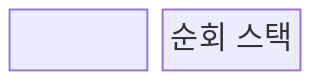
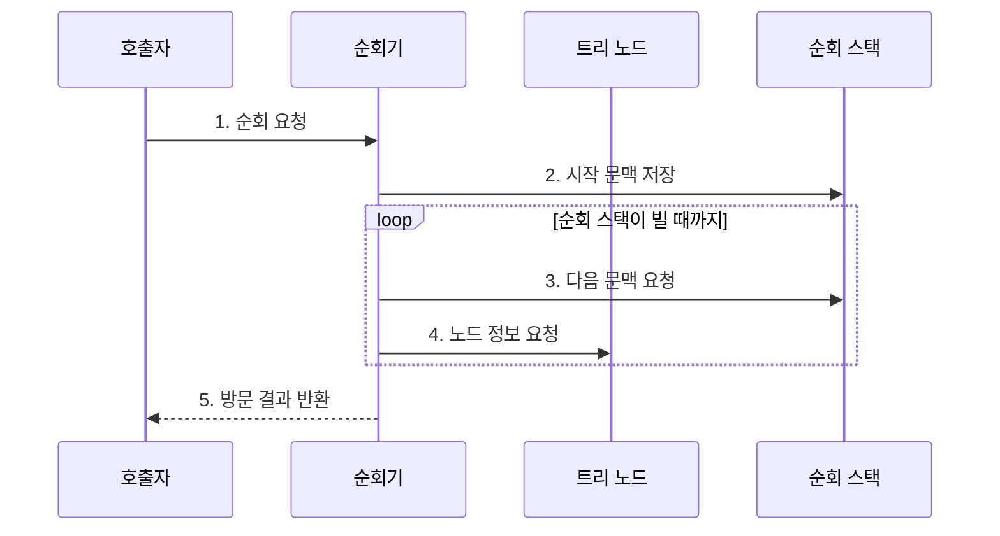

---
sidebar:
  order: 9
  label: "009. 이진 트리 순회: 전위•중위•후위 (Binary Tree Traversal)"
  badge:
    text: "기출 • 30%"
    variant: note
title: "이진 트리 순회: 전위•중위•후위 (Binary Tree Traversal)"
date: "2026-07-29T11:39:55+09:00"
tags:
  - "notes-basic-theory"
weight: 9
extra:
  question_no: "009"
  source_status: "기출"
  source_history: "126회"
  priority: 30
  priority_note: "순회 절차 중심이라 독립 확장성은 낮음"
---

## 미리 알고가기

- **이진 트리 순회(Binary Tree Traversal)**: 루트와 두 하위 트리의 방문 순서를 정해 모든 노드를 처리하는 절차
- **루트(Root)**: 하위 트리의 최상위 노드
- **하위 트리(Subtree)**: 특정 노드 아래의 자식 트리
- **재귀 호출(Recursive Call)**: 하위 트리에 같은 함수를 호출해 반복 구조를 처리하는 동작
- **방문(Visit)**: 노드 데이터를 처리하거나 출력하는 동작
- **이진 탐색 트리(Binary Search Tree, BST)**: 각 노드에서 왼쪽 서브트리의 키는 작고 오른쪽 서브트리의 키는 큰 순서 조건을 갖는 이진 트리
- **입력 크기 $n$**: 순회할 전체 노드 수
- **빅오(Big-O, $O$)**: 입력 증가에 따른 연산 비용의 상한 표기
- **트리 높이 $h$**: 루트부터 가장 깊은 말단 노드까지의 경로 길이
- **직렬화(Serialization)•널 표식(Null Marker)**: 트리와 빈 자리를 연속 데이터로 기록하는 기법
- **스택 오버플로(Stack Overflow)**: 호출 스택이 용량 한도를 넘은 오류
- **편향 트리(Skewed Tree)**: 한쪽 자식만 이어져 높이가 커진 트리
- **전위 순회(Pre-order Traversal)**: 루트를 두 하위 트리보다 먼저 방문하는 순회
- **중위 순회(In-order Traversal)**: 루트를 왼쪽과 오른쪽 하위 트리 사이에 방문하는 순회
- **후위 순회(Post-order Traversal)**: 루트를 두 하위 트리보다 나중에 방문하는 순회
- **순회기(Traverser)**: 정해진 방문 순서 규칙에 따라 자식으로 내려가고 노드를 처리한 뒤 상위로 되돌아오는 연산 주체
- **순회 스택(Traversal Stack)**: 하위 트리 처리가 끝난 뒤 돌아갈 노드와 실행 문맥을 저장하는 후입선출 구조
- **복귀 문맥(Return Context)**: 재귀 호출을 마친 뒤 이어서 실행할 위치와 현재 노드 상태를 묶은 정보
- **스냅샷 백업(Snapshot Backup)**: 특정 시점의 트리 구조와 데이터를 보존하며 전위 순회와 널 표식으로 같은 모양을 복원하는 백업

## Ⅰ. 개요

- 정의/개념: 루트•**하위 트리**의 방문 순서를 정한 절차
- 배경/필요성: 목적에 맞는 **노드 방문 순서** 명시

### 쉽게 이해하기 (학습용)

- 부모 방을 자식 방보다 먼저 기록할지, 사이에 기록할지, 나중에 기록할지에 따라 같은 트리도 직렬화•정렬•집계 순서가 달라진다.

## Ⅱ. 특징

> 노드 수가 늘수록 붉은 편향 트리의 복귀 문맥은 선형 증가하지만 파란 균형 트리는 로그 증가하며, 트리 높이에 비례한 이론적 공간량이다.

- **전위•중위•후위**에 따른 루트 처리 시점 구분
- 전체 노드 **1회 방문**으로 시간복잡도 $O(n)$
- **재귀 깊이**가 트리 높이에 비례해 스택 사용량 증가

### 쉽게 이해하기 (학습용)

- 방마다 한 번씩 들르지만 돌아갈 갈림길을 쪽지로 쌓아 두므로, 한쪽으로 긴 트리는 높이만큼 순회 스택이 커진다.

## Ⅲ. 구조 및 구성요소

| 구성요소 | 책임 |
|:---|:---|
| 순회기 | **방문 순서**대로 하강•처리•복귀 |
| 트리 노드 | 데이터와 **좌•우 자식 참조** 보관 |
| 순회 스택 | **복귀 문맥**•미방문 하위 트리 보관 |

### 쉽게 이해하기 (학습용)

- 순회기가 노드의 자식 참조를 읽고, 나중에 처리할 위치와 방문 시점을 순회 스택에 보관한다.

## Ⅳ. 흐름도

**동작 원리**

1. **순회 요청**: 루트와 전위•중위•후위 방식 설정
2. **시작 문맥 저장**: 루트의 첫 방문 단계 보관
3. **다음 문맥 요청**: 다음 노드와 방문 시점 복원
4. **노드 정보 요청**: 값 처리 후 순서에 맞는 후속 문맥 배치
5. **방문 결과 반환**: 스택 소진 후 전체 노드 처리 완료

### 쉽게 이해하기 (학습용)

- 갈림길에서 돌아올 길과 방문 시점을 쪽지로 쌓듯, 순회기는 자식 참조와 방문 문맥을 순서에 맞춰 스택에 넣고 꺼낸다.

## Ⅴ. 종류 및 비교

| 이진 트리 순회 | 전위 순회 | 중위 순회 | 후위 순회 |
|:---|:---|:---|:---|
| 적용 기준 | **널 표식** 포함 트리 직렬화 | **이진 탐색 트리** 정렬 출력 | 하위 노드 삭제•**용량 집계** |
| 핵심 특징 | 루트 → 왼쪽 → 오른쪽 | 왼쪽 → 루트 → 오른쪽 | 왼쪽 → 오른쪽 → 루트 |
| 한계 | **하위 결과** 기반 집계에 부적합 | 일반 이진 트리는 **정렬 미보장** | **부모 선처리** 작업에 부적합 |

> 요약: 직렬화는 **전위**, 정렬은 **중위**, 하위 집계는 후위 선택

### 쉽게 이해하기 (학습용)

- 부모부터 트리 모양을 기록하면 전위, 왼쪽 키부터 정렬해 읽으면 중위, 자식 용량을 모아 부모 합계를 내면 후위다.

## Ⅵ. 실무 고려사항 및 대책

| 핵심 고려사항 | 위험 | 대책 |
|:---|:---|:---|
| **편향 트리** 깊이 | 재귀 호출이 노드 수만큼 쌓여 스택 오버플로 | 명시적 스택 기반 반복 순회 적용 |
| 순회 중 구조 변경 | 노드 누락•중복 또는 끊어진 참조 접근 | 스냅샷 고정 또는 변경 감지 버전 적용 |
| 직렬화의 빈 자식 | 서로 다른 트리가 같은 순서열로 표현 | **널 표식**과 구분자 규칙 포함 |
| 중위 결과 해석 | 일반 이진 트리를 정렬 결과로 오인 | **이진 탐색 트리** 순서 조건 사전 검증 |

### 쉽게 이해하기 (학습용)

- 한쪽으로 긴 트리는 명시적 스택으로 호출 스택 넘침을 막는다.

## Ⅶ. 결론

- 구조 기록•키 정렬•하위 집계 목적에 맞춰 **순회 순서** 결정

### 쉽게 이해하기 (학습용)

- 부모를 먼저 써야 하면 전위, 키 순서가 필요하면 중위, 자식 결과를 먼저 모아야 하면 후위를 고른다.
