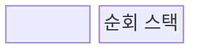
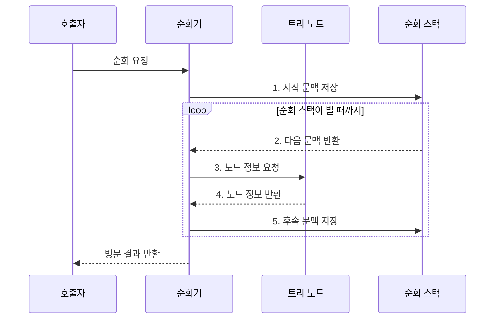

---
sidebar:
  order: 9
  label: "009. 이진 트리 순회: 전위•중위•후위 (Binary Tree Traversal)"
  badge:
    text: "기출 • 30%"
    variant: note
title: "이진 트리 순회: 전위•중위•후위 (Binary Tree Traversal)"
date: "2026-08-03T08:48:47+09:00"
tags:
  - "notes-basic-theory"
weight: 9
extra:
  question_no: "009"
  source_status: "기출"
  source_history: "126회"
  priority: 30
  priority_note: "순회 절차 중심이라 독립 확장성은 낮음"
---

## Ⅰ. 개요

핵심 용어

- **이진 트리 순회(Binary Tree Traversal)**: 루트와 두 하위 트리의 방문 순서를 정해 모든 노드를 처리하는 절차
- **방문(Visit)**: 노드의 데이터를 처리하거나 출력하는 동작
- **직렬화(Serialization)**: 트리 구조를 저장하거나 전송할 수 있는 순서열로 변환하는 작업
- **집계(Aggregation)**: 하위 노드의 값을 모아 상위 노드의 결과를 계산하는 작업

- 정의/개념: 루트•**하위 트리** 의 방문 순서를 정한 절차
- 배경/필요성: 단일 방문 순서로는 **직렬화•정렬•집계** 동시 충족 곤란

#### 한줄 요약

- 부모 방을 자식 방보다 먼저 기록할지, 사이에 기록할지, 나중에 기록할지에 따라 같은 트리도 직렬화•정렬•집계 순서가 달라진다.

## Ⅱ. 특징

핵심 용어

- **전위•중위•후위 순회**: 루트를 두 하위 트리보다 먼저•사이•나중에 방문하는 순회 방식
- **트리 높이 $h$**: 루트부터 가장 깊은 말단 노드까지의 경로 길이
- **복귀 문맥(Return Context)**: 하위 트리 처리 후 이어서 실행할 위치와 현재 노드 상태를 묶은 정보
- **재귀 깊이(Recursion Depth)**: 하위 트리를 따라 중첩된 함수 호출의 최대 단계 수

> 노드 수가 늘수록 붉은 편향 트리의 복귀 문맥은 선형 증가하지만 파란 균형 트리는 로그 증가하며, 트리 높이에 비례한 이론적 공간량이다.

- **전위•중위•후위** 에 따른 루트 처리 시점 구분
- 전체 노드 **1회 방문**으로 시간복잡도 $O(n)$
- **재귀 깊이** 가 트리 높이에 비례해 스택 사용량 증가

#### 한줄 요약

- 방마다 한 번씩 들르지만 돌아갈 갈림길을 쪽지로 쌓아 두므로, 한쪽으로 긴 트리는 높이만큼 순회 스택이 커진다.

## Ⅲ. 구조 및 구성요소

핵심 용어

- **순회기(Traverser)**: 정해진 방문 순서에 따라 자식으로 내려가고 노드를 처리한 뒤 상위로 되돌아오는 주체
- **순회 스택(Traversal Stack)**: 돌아갈 노드와 실행 문맥을 저장하는 후입선출 구조
- **하위 트리(Subtree)**: 특정 노드와 그 아래 자손으로 이루어진 부분 트리
- **복귀 문맥(Return Context)**: 하위 트리 처리 뒤 돌아갈 노드와 실행 위치를 묶은 정보

| 구성요소 | 책임 |
|:---|:---|
| 순회기 | **방문 순서**대로 하강•처리•복귀 |
| 트리 노드 | 데이터와 **좌•우 자식 참조** 보관 |
| 순회 스택 | **복귀 문맥**•미방문 하위 트리 보관 |

#### 한줄 요약

- 순회기가 노드의 자식 참조를 읽고, 나중에 처리할 위치와 방문 시점을 순회 스택에 보관한다.

## Ⅳ. 흐름도

핵심 용어

- **시작 문맥**: 루트에서 순회를 시작하기 위해 저장하는 첫 노드와 방문 단계
- **후속 문맥**: 아직 방문하지 않은 하위 트리와 상위 노드로 돌아올 위치를 나타내는 정보
- **명시적 스택**: 재귀 호출 대신 프로그램이 직접 노드와 방문 단계를 넣고 꺼내는 저장 구조

**동작 원리**

1. **시작 문맥 저장**: 루트의 첫 방문 단계 보관
2. **다음 문맥 반환**: 다음 노드와 방문 시점 복원
3. **노드 정보 요청**: 현재 노드의 값•자식 참조 조회
4. **노드 정보 반환**: 순회 순서에 따라 현재 값 처리
5. **후속 문맥 저장**: 미방문 하위 트리와 복귀 위치 배치

#### 한줄 요약

- 갈림길에서 돌아올 길과 방문 시점을 쪽지로 쌓듯, 순회기는 자식 참조와 방문 문맥을 순서에 맞춰 스택에 넣고 꺼낸다.

## Ⅴ. 종류 및 비교

핵심 용어

- **전위 순회(Pre-order)**: 루트→왼쪽→오른쪽 순서로 방문해 구조 기록에 사용하는 순회
- **중위 순회(In-order)**: 왼쪽→루트→오른쪽 순서로 방문해 이진 탐색 트리의 키를 정렬 출력하는 순회
- **후위 순회(Post-order)**: 왼쪽→오른쪽→루트 순서로 방문해 하위 결과를 집계하는 순회
- **널 표식(Null Marker)**: 직렬화할 때 빈 자식 위치를 보존하는 표시
- **직렬화(Serialization)**: 트리 구조를 순서열로 바꾸어 저장하거나 전송하는 작업
- **이진 탐색 트리(Binary Search Tree)**: 각 노드에서 왼쪽 키는 작고 오른쪽 키는 큰 순서 조건을 가진 트리

| 이진 트리 순회 | 전위 순회 | 중위 순회 | 후위 순회 |
|:---|:---|:---|:---|
| 적용 기준 | **널 표식** 포함 트리 직렬화 | **이진 탐색 트리** 정렬 출력 | 하위 노드 삭제•**용량 집계** |
| 핵심 특징 | 루트 → 왼쪽 → 오른쪽 | 왼쪽 → 루트 → 오른쪽 | 왼쪽 → 오른쪽 → 루트 |
| 한계 | **하위 결과** 기반 집계에 부적합 | 일반 이진 트리는 **정렬 미보장** | **부모 선처리** 작업에 부적합 |

> 요약: 직렬화는 **전위**, 정렬은 **중위**, 하위 집계는 후위 선택

#### 한줄 요약

- 부모부터 트리 모양을 기록하면 전위, 왼쪽 키부터 정렬해 읽으면 중위, 자식 용량을 모아 부모 합계를 내면 후위다.

## Ⅵ. 실무 고려사항 및 대책

핵심 용어

- **편향 트리(Skewed Tree)**: 한쪽 자식만 이어져 높이가 노드 수에 가깝게 커진 트리
- **스택 오버플로(Stack Overflow)**: 재귀 호출 스택이 용량 한도를 넘은 오류
- **스냅샷(Snapshot)**: 순회 중 변경과 분리해 특정 시점의 트리 상태를 고정한 복사본이나 뷰
- **이진 탐색 트리(Binary Search Tree, BST)**: 왼쪽 키는 작고 오른쪽 키는 큰 순서 조건을 가진 이진 트리
- **명시적 스택**: 재귀 호출 대신 프로그램이 직접 노드와 방문 단계를 저장하는 스택
- **변경 감지 버전**: 순회를 시작한 뒤 트리 구조가 바뀌었는지 확인하기 위한 상태 번호

| 문제 | 대책 | 효과 |
|:---|:---|:---|
| **편향 트리** 에서 재귀 깊이가 노드 수까지 증가 | 명시적 스택 기반 반복 순회 적용 | 호출 스택 **오버플로 방지** |
| 순회 중 구조 변경으로 노드 누락•중복•참조 단절 | **스냅샷 고정•변경 감지 버전** 적용 | 한 시점 기준의 **순회 결과 일관성** 확보 |
| 빈 자식 생략으로 서로 다른 트리가 같은 순서열로 표현 | 직렬화에 **널 표식** 과 구분자 규칙 포함 | 원래 **트리 구조 복원 가능성** 확보 |
| 일반 이진 트리의 중위 결과를 정렬 결과로 오인 | **이진 탐색 트리** 순서 조건 사전 검증 | 중위 순회의 **정렬 의미 오판 방지** |

#### 한줄 요약

- 한쪽으로 긴 트리는 명시적 스택으로 호출 스택 넘침을 방지한다.

## Ⅶ. 결론

핵심 용어

- **구조 기록•키 정렬•하위 집계**: 각각 부모 우선•키 순서•자식 우선 방문을 요구하는 대표 순회 목적

- 구조 기록은 **전위**, 키 정렬은 **중위**, 하위 집계는 후위 선택

#### 한줄 요약

- 부모를 먼저 써야 하면 전위, 키 순서가 필요하면 중위, 자식 결과를 먼저 모아야 하면 후위를 선택한다.
