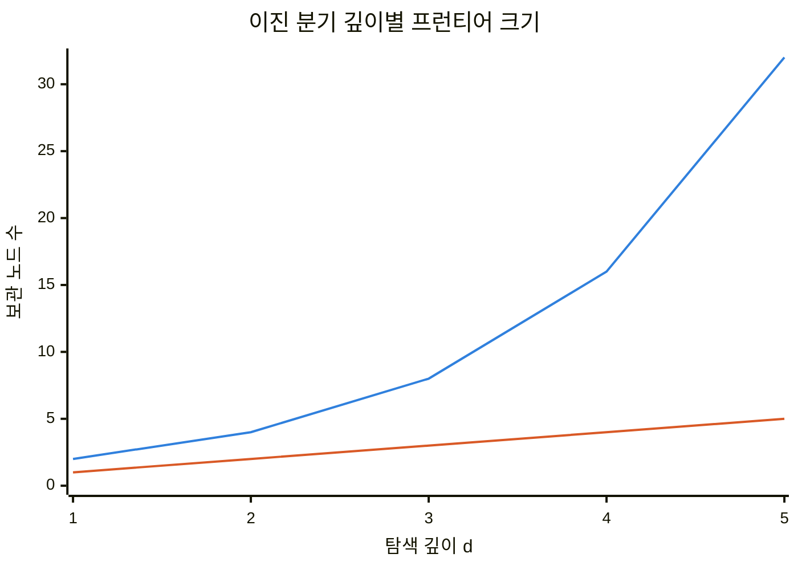
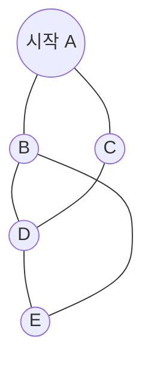
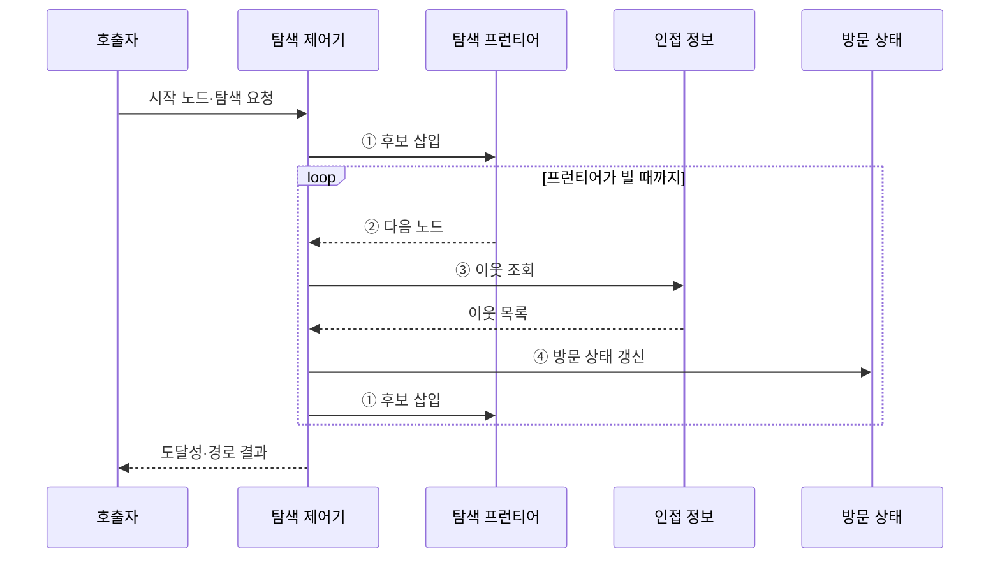

---
sidebar:
  order: 10
  label: "010. 그래프 탐색 — BFS·DFS (Graph Traversal)"
  badge:
    text: "미출 · 30%"
    variant: note
title: "그래프 탐색 — BFS·DFS (Graph Traversal)"
date: "2026-07-28T22:20:00+09:00"
tags:
  - "notes-basic-theory"
weight: 10
extra:
  question_no: "010"
  source_status: "미출"
  source_history: ""
  priority: 30
  priority_note: "너비·깊이 우선 탐색 선택의 기본 축"
---

## 미리 알고가기

- **그래프 탐색(Graph Traversal)**: 간선을 따라 노드를 중복 없이 방문해 도달성·경로를 분석하는 알고리즘
- **노드(Node)·간선(Edge)**: 노드는 연결 대상, 간선은 노드 간 연결
- **그래프 탐색 복잡도 $O(V+E)$**: 인접 리스트의 모든 정점과 간선을 한 번씩 확인하는 비용
- **인접 리스트(Adjacency List)**: 노드별 이웃 목록 저장
- **방문 상태**: 노드의 미방문·활성·완료를 구분해 중복 처리를 방지하는 표시값
- **탐색 프런티어(Frontier)**: 다음 방문 노드를 보관하는 큐·스택
- **너비 우선 탐색(Breadth-First Search, BFS)**: 시작 노드에서 간선 거리가 가까운 노드부터 계층적으로 방문하는 탐색 방식
- **깊이 우선 탐색(Depth-First Search, DFS)**: 미방문 이웃을 따라 한 경로를 끝까지 탐색한 뒤 이전 분기점으로 복귀하는 탐색 방식
- **도달성(Reachability)**: 두 노드 사이 경로의 존재 여부
- **무가중치 최단 경로**: 동일 비용 간선에서 간선 수가 가장 적은 경로
- **순환**: 한 노드에서 출발해 다시 돌아오는 경로
- **큐(Queue)**: 먼저 넣은 노드를 먼저 꺼내 같은 간선 거리의 후보부터 처리하는 너비 우선 탐색의 프런티어
- **스택(Stack)**: 마지막에 넣은 노드를 먼저 꺼내 한 활성 경로를 깊게 따라가는 깊이 우선 탐색의 프런티어
- **양방향 탐색(Bidirectional Search)**: 시작점과 목표점에서 동시에 탐색해 두 탐색 영역이 만날 때 경로를 연결하는 방식
- **스냅샷(Snapshot)**: 탐색 시작 시점의 그래프 구조를 고정한 사본
- **빌드 의존 그래프(Build Dependency Graph)**: 소프트웨어 모듈의 선행 빌드 관계를 노드와 간선으로 나타내며 DFS 활성 경로 재방문으로 순환을 탐지하는 그래프

## Ⅰ. 개요

- 정의/개념: 간선을 따라 노드를 방문해 **도달성**·경로를 분석하는 **알고리즘**
- 기존 한계: 분기·**순환**이 섞인 구조는 순차 순회로 연결 여부 판정 불가

### 쉽게 이해하기 (학습용)

- 분기와 순환이 있는 노선도도 방문 순서와 상태를 관리하면 빠짐이나 무한 반복 없이 탐색할 수 있다.

## Ⅱ. 특징

- **탐색 프런티어** 추출 순서로 갈리는 노드 확장 순서
- **방문 상태** 관리 기반의 중복·**순환 탐색** 방지
- **인접 리스트** 기준 시간복잡도 $O(V+E)$

| 계열 | 수식·의미 |
|:---|:---|
| ■ 파란색 1계열 | **BFS $2^d$**: 이진 분기에서 깊이별 큐 후보 수 |
| ■ 주황색 2계열 | **DFS $d$**: 한 경로를 추적할 때의 스택 깊이 |

> 넓은 그래프는 BFS 프런티어가 빠르게 증가

### 쉽게 이해하기 (학습용)

- 프런티어의 추출 순서가 탐색 모양을 정하고 방문 표시는 중복 처리를 방지한다.

## Ⅲ. 아키텍처

**도표안 A — 구조도**

**도표안 B — sequenceDiagram**

| 구성요소 | 책임 |
|:---|:---|
| 탐색 제어기 | **BFS·DFS 규칙**으로 이웃 확장 |
| 탐색 프런티어 | 방문 순서를 관리하는 **큐·스택** |
| 인접 정보 | 노드별 **이웃 목록** 보관 |
| 방문 상태 | **미방문·활성·완료** 상태 보관 |

**동작 원리**

- **① 후보 삽입**: 미방문 이웃을 큐·스택에 저장
- **② 다음 노드**: BFS·DFS 순서로 확장 대상 추출
- **③ 이웃 조회**: 선택 노드의 인접 목록 확보
- **④ 방문 상태 갱신**: 중복·순환 방지 상태 기록

### 쉽게 이해하기 (학습용)

- 제어기는 프런티어에서 후보를 꺼내 이웃과 방문 상태를 확인하며 결과를 만든다.

## Ⅳ. 종류 및 비교

| 그래프 탐색 | 너비 우선 탐색 | 깊이 우선 탐색 |
|:---|:---|:---|
| 적용 기준 | **무가중치 최단 경로**·최소 간선 수 | 의존 그래프의 **순환 탐지** |
| 핵심 특징 | **큐**로 먼저 발견한 노드부터 거리순 확장 | **스택**으로 최근 발견 노드부터 깊이 확장 |
| 한계 | **분기 계수** 클수록 큐 메모리 급증 | 깊은 그래프에서 **스택 오버플로** |

> 요약: 거리순 확장은 **BFS**, 한 경로 우선 추적은 **DFS**

### 쉽게 이해하기 (학습용)

- 거리순 확장은 BFS, 한 경로 우선 추적과 순환 탐지는 DFS가 적합하다.

## Ⅴ. 실무 고려사항 및 대책

| 고려사항 | 대책 | 효과 |
|:---|:---|:---|
| 발견 노드의 **중복 적재** | 발견 즉시 **방문 상태** 표시 | 메모리 낭비·중복 처리 방지 |
| 넓은 그래프의 **BFS 큐** 급증 | 깊이 제한·**양방향 탐색** 선택 | 최대 프런티어 크기 감소 |
| 깊은 그래프의 **DFS 재귀** 초과 | 명시적 **스택** 기반 반복 탐색 | **스택 오버플로** 방지 |
| 탐색 중 **그래프 변경** | 시작 시 **스냅샷**·버전 고정 | 경로 결과 **일관성** 유지 |

### 쉽게 이해하기 (학습용)

- 발견 즉시 방문 표시하고 그래프의 폭·깊이와 변경 가능성에 맞춰 프런티어와 탐색 기준 시점을 고정한다.

## Ⅵ. 결론

- 최소 간선 경로는 **BFS**, 활성 경로 순환 탐지는 **DFS** 선택

### 쉽게 이해하기 (학습용)

- 최소 간선 경로는 BFS, 활성 경로의 순환 판정은 DFS를 선택한다.
