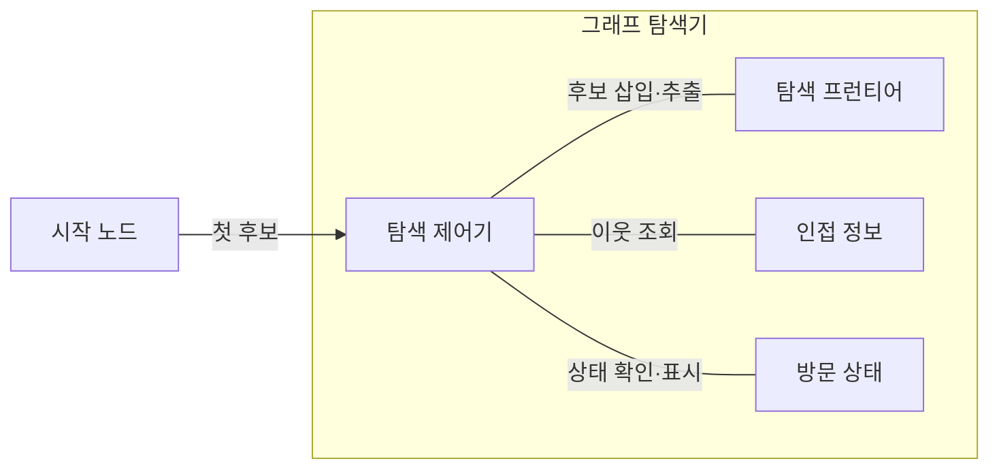
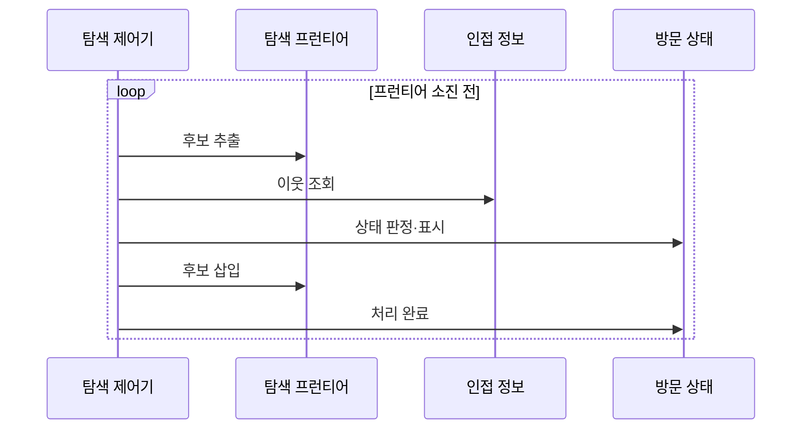

---
sidebar:
  order: 10
  label: "010. 그래프 탐색 — BFS·DFS (Graph Traversal)"
  badge:
    text: "미출제 · 30%"
    variant: note
title: "그래프 탐색 — BFS·DFS (Graph Traversal)"
date: "2026-07-25T23:46:00+09:00"
tags:
  - "notes-basic-theory"
weight: 10
extra:
  question_no: "010"
  source_status: "미출제"
  source_history: ""
  priority: 30
  priority_note: "너비·깊이 우선 탐색 선택의 기본 축"
---

## 미리 알고가기

- **그래프 탐색(Graph Traversal)**: 간선을 따라 노드를 중복 없이 방문해 도달성·경로를 분석하는 알고리즘
- **노드(Node)·간선(Edge)**: 노드는 연결 대상, 간선은 노드 간 연결
- **그래프 탐색 복잡도 $O(V+E)$**: ‘빅 오 브이 플러스 이’로 읽고 증가 차수(Order)의 $O$, 정점(Vertex)의 $V$, 간선(Edge)의 $E$, 두 확인 비용을 더하는 덧셈 기호(+)를 쓰는 관례에 따라 인접 리스트에서 모든 정점과 간선을 한 번씩 확인하는 비용을 나타냄
- **인접 리스트(Adjacency List)**: 노드별 이웃 목록 저장
- **방문 상태**: 노드의 미방문·활성·완료를 구분해 중복 처리를 방지하는 표시값
- **탐색 프런티어(Frontier)**: 다음 방문 노드를 보관하는 큐·스택
- **너비 우선 탐색(Breadth-First Search, BFS, 비에프에스)**: 영문 각 단어의 첫 글자를 따 BFS로 표기하며 시작 노드의 간선 거리 순으로 방문
- **깊이 우선 탐색(Depth-First Search, DFS, 디에프에스)**: 영문 각 단어의 첫 글자를 따 DFS로 표기하며 미방문 이웃을 따라가다 분기점으로 복귀
- **도달성(Reachability)**: 두 노드 사이 경로의 존재 여부
- **무가중치 최단 경로**: 동일 비용 간선에서 간선 수가 가장 적은 경로
- **순환**: 한 노드에서 출발해 다시 돌아오는 경로
- **큐(Queue)**: 먼저 넣은 노드를 먼저 꺼내 같은 간선 거리의 후보부터 처리하는 너비 우선 탐색의 프런티어
- **스택(Stack)**: 마지막에 넣은 노드를 먼저 꺼내 한 활성 경로를 깊게 따라가는 깊이 우선 탐색의 프런티어
- **서비스 그래프(Service Graph)**: 서비스 호출 관계를 노드와 간선으로 나타내며 장애 서비스까지의 호출 경로를 탐색하는 그래프
- **빌드 의존 그래프(Build Dependency Graph)**: 소프트웨어 모듈의 선행 빌드 관계를 노드와 간선으로 나타내며 DFS 활성 경로 재방문으로 순환을 탐지하는 그래프

## Ⅰ. 개요

- 정의/개념: 간선을 따라 노드를 방문해 **도달성**·경로를 분석하는 **알고리즘**
- 기존 한계: 분기·**순환**이 섞인 구조는 순차 순회로 연결 여부 판정 불가

### 쉽게 이해하기 (학습용)

- 지하철 노선도에서 이 역에서 저 역까지 갈 수 있는지, 갈 수 있다면 어느 선로를 거치는지를 환승역을 따라가며 알아내는 일이며, 노선도에는 갈라지는 길과 빙 돌아 제자리로 오는 고리가 섞여 있어 눈대중이 아니라 정해진 순서로 훑어야 빠짐도 무한 반복도 없다.

## Ⅱ. 특징

- **탐색 프런티어** 추출 순서로 갈리는 노드 확장 순서
- **방문 상태** 관리 기반의 중복·**순환 탐색** 방지
- **인접 리스트** 기준 시간복잡도 $O(V+E)$

### 쉽게 이해하기 (학습용)

- 다음에 가 볼 역을 모아 둔 더미에서 어느 것을 먼저 꺼내느냐가 탐색 모양을 정하고, 한 번 다녀온 역에는 도장을 찍어 두어 고리를 만나도 같은 자리를 맴돌지 않으며, 그래서 역과 선로를 한 번씩만 확인하면 끝나 노선도가 커진 만큼만 일이 늘어난다.

## Ⅲ. 아키텍처 및 구성요소

| 설계 요소 | 설명 |
|:---|:---|
| 탐색 제어기 | **BFS·DFS 규칙**으로 이웃 확장 제어 |
| 탐색 프런티어 | 다음 방문 순서를 관리하는 **큐·스택** |
| 인접 정보 | 노드별 **이웃 목록** 보관 |
| 방문 상태 | 노드별 **미방문·활성·완료** 보관 |

> 요약: **탐색 제어기**가 프런티어·인접 정보·**방문 상태** 조정

### 쉽게 이해하기 (학습용)

- 길잡이가 '다음에 가 볼 역' 더미에서 하나를 꺼내고, 그 역에서 이어지는 선로 목록을 이웃표에서 확인한 뒤, 방문표에 도장이 없는 역만 다시 더미에 넣는 식으로 갈 수 있는 범위를 한 겹씩 넓혀 간다.

## Ⅳ. 원리 및 절차 흐름도

| 절차 | 설명 |
|:---|:---|
| 후보 추출 | **큐 머리·스택 위**에서 다음 노드 선택 |
| 이웃 조회 | 인접 정보에서 현재 노드의 **이웃 목록** 확보 |
| 상태 판정·표시 | **미방문** 이웃만 **활성** 상태로 표시 |
| 후보 삽입 | 활성 표시한 이웃을 프런티어에 적재 |
| 처리 완료 | 이웃 처리 후 현재 노드를 **완료** 표시 |

> 요약: 발견 즉시 표시해 **중복 삽입**·무한 순회 방지

### 쉽게 이해하기 (학습용)

- 도장을 나갈 때가 아니라 처음 발견한 순간에 찍는 것이 핵심이어서, 같은 역이 여러 선로에서 동시에 보여도 더미에는 딱 한 번만 들어가고 고리를 만나도 이미 도장이 찍혀 있어 되돌아 도는 일이 없다.

## Ⅴ. 종류 및 비교

| 그래프 탐색 | 너비 우선 탐색(BFS) | 깊이 우선 탐색(DFS) |
|:---|:---|:---|
| 적용 기준 | **무가중치 최단 경로**·최소 간선 수 | 의존 그래프의 **사이클 검출**·위상 정렬 |
| 핵심 특징 | **큐**로 먼저 발견한 노드부터 거리순 확장 | **스택**으로 최근 발견 노드부터 깊이 확장 |
| 한계 | **분기 계수** 클수록 큐 메모리 급증 | 깊은 그래프에서 **스택 오버플로** |

> 요약: 거리순 확장은 **BFS**, 한 경로 우선 추적은 **DFS**

### 쉽게 이해하기 (학습용)

- 출발역에서 한 정거장 거리의 역을 모두 본 뒤 두 정거장으로 넘어가면 목적지에 닿는 순간이 곧 최소 환승이라 BFS가 맞고, 반대로 한 길을 끝까지 밀고 들어가다 지금 지나온 역을 다시 만나는지 보려면 그 길만 붙잡는 DFS라야 고리가 드러난다.

## Ⅵ. 실무 사례

1. 동일 비용 **서비스 그래프**는 **BFS**로 장애 노드 최단 경로 계산

### 쉽게 이해하기 (학습용)

- 어느 호출이든 비용이 같다고 보면 장애 서비스까지 거쳐 가는 서비스 수가 곧 거리이므로, 가까운 호출부터 한 겹씩 넓혀 가다 장애 노드에 닿는 순간이 곧 최소 호출 경로다.

## Ⅶ. 결론

- **무가중치 최단 경로**는 BFS, **활성 경로 순환**은 DFS

### 쉽게 이해하기 (학습용)

- 알고 싶은 것이 '몇 다리 건너서 닿는가'면 가까운 곳부터 넓게 훑어야 하고, '이 길이 제자리로 돌아오는가'면 한 길을 끝까지 붙잡고 깊게 내려가야 하므로 질문의 종류가 곧 탐색 방식을 정한다.
