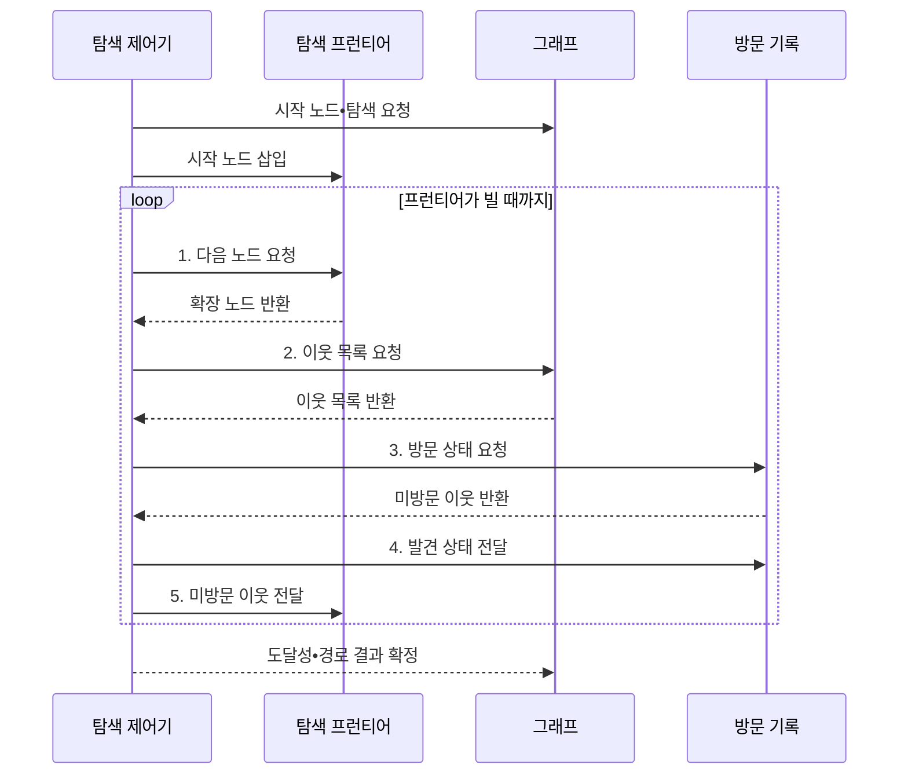

---
sidebar:
  order: 10
  label: "010. 그래프 탐색: BFS•DFS (Graph Traversal)"
  badge:
    text: "미출 • 30%"
    variant: note
title: "그래프 탐색: BFS•DFS (Graph Traversal)"
date: "2026-08-03T09:07:03+09:00"
tags:
  - "notes-basic-theory"
weight: 10
extra:
  question_no: "010"
  source_status: "미출"
  source_history: ""
  priority: 30
  priority_note: "너비•깊이 우선 탐색 선택의 기본 축"
---

## Ⅰ. 개요

핵심 용어

- **그래프 탐색(Graph Traversal)**: 간선을 따라 노드를 중복 없이 방문해 도달성•경로를 분석하는 알고리즘
- **도달성(Reachability)**: 두 노드 사이에 연결 경로가 존재하는 성질

- 정의/개념: 간선을 따라 노드의 **도달성•경로** 를 찾는 알고리즘
- 배경/필요성: 방문 상태 없이는 순환 그래프에서 **중복•무한 탐색** 발생

#### 한줄 요약

- 분기와 순환이 있는 노선도도 방문 순서와 상태를 관리하면 빠짐이나 무한 반복 없이 탐색할 수 있다.

## Ⅱ. 특징

핵심 용어

- **탐색 프런티어(Frontier)**: 다음에 방문할 노드를 보관하는 큐나 스택
- **방문 상태**: 노드의 미방문•활성•완료를 구분해 중복 처리를 막는 표시값
- **인접 리스트(Adjacency List)**: 각 노드에 연결된 이웃 목록을 저장하는 그래프 표현
- **$O(V+E)$**: 인접 리스트의 모든 정점 $V$와 간선 $E$를 한 번씩 확인하는 시간 상한

> 이진 분기 깊이가 커질수록 파란 BFS 큐 후보는 지수 증가하지만 붉은 DFS 활성 경로는 선형 증가하며, 분기 계수 2를 가정한 개념값이다.

- **탐색 프런티어** 추출 순서로 갈리는 노드 확장 순서
- **방문 상태** 관리 기반의 중복•**순환 탐색** 방지
- **인접 리스트** 기준 시간복잡도 $O(V+E)$

#### 한줄 요약

- 물결처럼 같은 거리의 역을 넓히면 BFS, 한 노선을 끝까지 따라가면 DFS이며, 방문 도장은 같은 역의 중복 탐색을 방지한다.

## Ⅲ. 구조 및 구성요소

핵심 용어

- **탐색 제어기**: BFS나 DFS 규칙에 따라 다음 노드와 이웃 확장 순서를 결정하는 주체
- **큐•스택(Queue•Stack)**: 먼저 발견한 노드 또는 가장 최근 발견한 노드를 먼저 꺼내는 프런티어 구조
- **활성 상태**: DFS에서 현재 탐색 경로에 들어와 있지만 처리가 끝나지 않은 노드 상태

| 구성요소 | 책임 |
|:---|:---|
| 탐색 제어기 | **BFS•DFS 규칙**으로 이웃 확장 |
| 탐색 프런티어 | 방문 순서를 관리하는 **큐•스택** |
| 인접 정보 | 노드별 **이웃 목록** 보관 |
| 방문 상태 | **미방문•활성•완료** 상태 보관 |

#### 한줄 요약

- 탐색 제어기가 프런티어에서 다음 노드를 선택하고, 인접 정보와 방문 상태를 대조해 새 후보만 추가한다.

## Ⅳ. 흐름도

핵심 용어

- **확장 노드**: 프런티어에서 꺼내 이웃 목록을 확인하는 현재 노드
- **발견 상태**: 노드를 프런티어에 넣는 즉시 방문 대상으로 기록한 상태
- **미방문 이웃**: 현재 노드와 연결됐지만 아직 발견 상태로 표시되지 않은 노드

**동작 원리**

- **1. 다음 노드 요청**: BFS•DFS 순서로 대상 추출
- **2. 이웃 목록 요청**: 그래프에서 확장 노드의 인접 정보 확보
- **3. 방문 상태 요청**: 이미 발견한 이웃 제외
- **4. 발견 상태 전달**: 중복•순환 방지 상태 반영
- **5. 미방문 이웃 전달**: 큐•스택에 후보 저장

#### 한줄 요약

- 길찾기 담당자가 대기함에서 다음 역을 꺼내 이웃 지도를 보고, 방문 도장이 없는 역만 다시 대기함에 넣어 경로를 넓힌다.

## Ⅴ. 종류 및 비교

핵심 용어

- **너비 우선 탐색(Breadth-First Search, BFS)**: 시작점에서 간선 거리가 가까운 노드부터 큐로 확장하는 탐색
- **깊이 우선 탐색(Depth-First Search, DFS)**: 미방문 이웃을 따라 한 경로를 끝까지 스택으로 추적하는 탐색
- **무가중치 최단 경로**: 모든 간선 비용이 같을 때 간선 수가 가장 적은 경로
- **분기 계수(Branching Factor)**: 한 노드에서 다음 단계로 확장되는 평균 이웃 수
- **스택 오버플로(Stack Overflow)**: 깊은 DFS 호출로 호출 스택이 용량 한도를 넘는 오류

| 그래프 탐색 | 너비 우선 탐색 | 깊이 우선 탐색 |
|:---|:---|:---|
| 적용 기준 | **무가중치 최단 경로**•최소 간선 수 | 의존 그래프의 **순환 탐지** |
| 핵심 특징 | **큐** 로 먼저 발견한 노드부터 거리순 확장 | **스택** 으로 최근 발견 노드부터 깊이 확장 |
| 한계 | **분기 계수** 클수록 큐 메모리 급증 | 깊은 그래프에서 **스택 오버플로** |

> 요약: 거리순 확장은 **BFS**, 한 경로 우선 추적은 **DFS**

#### 한줄 요약

- 가까운 역부터 찾는 BFS는 최소 간선 경로, 한 노선을 좇는 DFS는 순환 탐지에 맞다.

## Ⅵ. 실무 고려사항 및 대책

핵심 용어

- **양방향 탐색(Bidirectional Search)**: 시작점과 목표점에서 동시에 탐색해 두 영역이 만날 때 경로를 연결하는 방식
- **스택 오버플로(Stack Overflow)**: 깊은 재귀 호출로 호출 스택이 용량 한도를 넘는 오류
- **명시적 스택**: 재귀 호출 대신 프로그램이 직접 탐색 노드를 넣고 꺼내는 저장 구조
- **스냅샷(Snapshot)**: 탐색 시작 시점의 그래프 구조를 고정한 사본이나 뷰
- **그래프 버전**: 탐색 중 구조 변경 여부를 구분하도록 그래프 상태에 부여한 식별값
- **프런티어(Frontier)**: 다음에 방문할 노드를 보관하는 BFS 큐나 DFS 스택

| 문제 | 대책 | 효과 |
|:---|:---|:---|
| 발견 노드의 **중복 적재** 로 순환 그래프 반복 처리 | 프런티어 삽입 시 방문 상태 즉시 표시 | 중복 확장 제거와 **시간•메모리 절감** |
| 큰 분기 계수의 **BFS 큐** 로 프런티어 메모리 고갈 | 깊이 제한 또는 **양방향 탐색** 적용 | 최대 프런티어와 **탐색 공간 축소** |
| 편향 경로의 **DFS 재귀** 로 호출 스택 초과 | 명시적 스택 기반 반복 탐색 | 깊은 그래프의 **탐색 안정성** 확보 |
| 탐색 중 그래프 변경으로 도달성 결과 불일치 | **스냅샷•그래프 버전** 고정 | 동일 그래프 기준의 **도달성 재현** |

#### 한줄 요약

- 역을 대기함에 넣을 때 방문 표시해 중복 탐색을 방지한다.

## Ⅶ. 결론

핵심 용어

- **최소 간선 경로**: 시작점에서 목표점까지 거치는 간선 수가 가장 적은 경로
- **활성 경로 순환**: DFS가 현재 추적 중인 경로의 노드를 다시 만나 확인하는 순환

- 최소 간선 경로는 **BFS**, 활성 경로의 순환 탐지는 DFS 선택

#### 한줄 요약

- 가장 적은 환승을 찾으면 가까운 역부터 퍼지는 BFS를, 의존 관계가 되돌아오는지 찾으면 한 경로를 추적하는 DFS를 선택한다.
