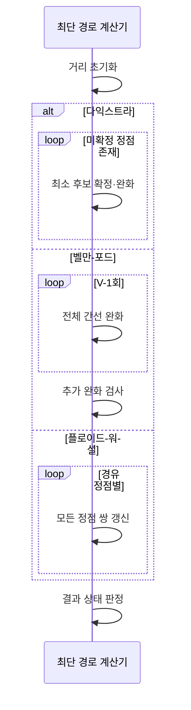

---
sidebar:
  order: 11
  label: "011. 최단 경로 — 다익스트라·벨만-포드·플로이드-워셜 (Shortest Path)"
  badge:
    text: "미출제 · 15%"
    variant: note
title: "최단 경로 — 다익스트라·벨만-포드·플로이드-워셜 (Shortest Path)"
date: "2026-07-26T22:16:20+09:00"
tags:
  - "notes-basic-theory"
weight: 11
extra:
  question_no: "011"
  source_status: "미출제"
  source_history: ""
  priority: 15
  priority_note: "음수 가중치·사이클·접근 범위로 선택"
---

## 미리 알고가기

- **최단 경로(Shortest Path)**: 간선 가중치 합을 최소화해 두 정점 사이 비용을 줄이는 경로
- **정점(Vertex)·간선(Edge)**: 정점은 대상, 간선은 대상 사이 연결
- **가중치(Weight)**: 간선에 부여한 거리·비용·지연 값
- **완화(Relaxation)**: 새 경로가 더 짧으면 거리값을 갱신해 최소 후보를 개선하는 연산
- **단일 출발점 최단 경로(Single-Source Shortest Path, SSSP, 에스에스에스피)**: 영문 각 단어의 첫 글자를 따 SSSP로 표기하며 한 출발점에서 모든 정점까지 최단 거리를 계산함
- **모든 쌍 최단 경로(All-Pairs Shortest Path, APSP, 에이피에스피)**: 영문 각 단어의 첫 글자를 따 APSP로 표기하며 모든 정점 쌍의 최단 거리를 계산함
- **정점 수 $V$**: ‘브이’로 읽고 정점(Vertex)의 머리글자를 쓰는 그래프 이론 관례에 따라 그래프의 정점 개수를 나타내며 벨만-포드 반복 횟수의 기준이 되는 변수
- **반복 횟수 $V-1$**: ‘브이 마이너스 원’으로 읽고 뺄셈 기호(-)로 정점 수에서 1을 뺀 값을 나타내는 산술 관례에 따라 단순 최단 경로가 사용할 수 있는 최대 간선 수만큼 전체 간선을 완화함
- **음수 사이클**: 반복할수록 경로 비용이 감소하는 순환
- **도달 불가 정점(Unreachable Vertex)**: 출발점에서 도달할 수 없는 정점
- **다익스트라 알고리즘(Dijkstra's Algorithm)**: 비음수 간선에서 최소 후보를 확정하며 단일 출발점 거리를 구하는 방식
- **벨만-포드 알고리즘(Bellman-Ford Algorithm)**: 모든 간선을 반복 완화해 음수 간선과 사이클을 처리하는 방식
- **플로이드-워셜 알고리즘(Floyd-Warshall Algorithm)**: 경유 정점을 늘리며 모든 정점 쌍의 거리를 구하는 방식
- **가중 그래프(Weighted Graph)**: 각 간선에 거리·비용·지연 같은 가중치를 부여해 경로의 총비용을 계산하는 그래프
- **거리값(Distance Value)**: 출발점에서 각 정점까지 또는 각 정점 쌍에 대해 현재까지 알려진 최소 비용 후보
- **선행 정점(Predecessor Vertex)**: 최단 경로에서 현재 정점 직전에 위치한 정점이며 목적지부터 거꾸로 따라가 전체 경로를 복원하는 데 쓰는 기록
- **최단 경로 계산기(Shortest Path Solver)**: 거리값을 초기화하고 완화를 반복해 거리값과 선행 정점을 갱신하는 연산 주체
- **라우팅(Routing)**: 여러 연결 경로 중 목적지까지 패킷이나 요청을 전달할 경로를 선택하는 동작
- **호출 그래프(Call Graph)**: 서비스나 함수의 호출 관계를 정점과 간선으로 나타내며 간선 비용의 합이 작은 경로를 계산하는 그래프
- **거리 행렬(Distance Matrix)**: 행과 열의 정점 쌍마다 거리값을 저장하며 플로이드-워셜이 경유 정점별로 갱신하는 표
- **대각선(Diagonal)**: 거리 행렬에서 행과 열의 정점이 같은 칸이며 자기 자신까지의 초기 거리를 0으로 두는 위치

## Ⅰ. 개요

- **정의/개념**: 간선 **가중치 합**이 최소인 경로를 찾는 **그래프 문제**
- **기존 한계**: 연결성만 보는 탐색으로는 **라우팅** 최소 비용 경로 미확정

### 쉽게 이해하기 (학습용)
- 갈아탈 때마다 요금이 붙는 노선도에서 목적지까지 요금 합계가 가장 작은 길을 고르는 문제이며, 연결돼 있느냐만 보는 탐색과 달리 간선마다 붙은 비용을 더해 비교해야 하므로 가장 적게 갈아타는 길과 가장 싼 길이 서로 다를 수 있다.

## Ⅱ. 특징

- 모든 부분 경로가 최단인 **최적 부분 구조**
- **완화** 반복으로 거리값 단조 감소·**수렴**

### 쉽게 이해하기 (학습용)
- 서울에서 부산까지 가장 싼 길이 대전을 지난다면 그 안에 든 서울에서 대전까지의 구간도 반드시 가장 싼 길이어야 하며, 그렇지 않다면 그 구간만 더 싼 길로 갈아 끼워 전체를 더 싸게 만들 수 있으므로 처음 가정이 무너진다.

## Ⅲ. 아키텍처 및 구성요소

| 설계 요소 | 설명 |
|:---|:---|
| 최단 경로 계산기 | **완화 규칙**대로 거리값·선행 정점 갱신 |
| 가중 그래프 | 정점·간선·**가중치**로 탐색 공간 표현 |
| 거리값 | 정점·정점 쌍의 **최소 비용 후보** 보관 |
| 선행 정점 | **경로 역추적**용 직전 정점 보관 |

> 요약: 계산기가 **거리값**을 줄이고 **선행 정점**에 경로 기록

### 쉽게 이해하기 (학습용)
- 노선도 위의 역마다 '지금까지 알아낸 가장 싼 요금'과 '그 요금으로 올 때 바로 앞에 들른 역' 두 칸을 연필로 적어 두고, 계산기가 더 싼 길을 찾을 때마다 두 칸을 고쳐 쓰므로 마지막에 목적지부터 앞 역을 거꾸로 따라가면 경로 전체가 되살아난다.

## Ⅳ. 원리 및 절차 흐름도

| 절차 | 설명 |
|:---|:---|
| 거리 초기화 | 출발점·**대각선** 0, 직접 간선값, 나머지 무한대 |
| 최소 후보 확정·완화 | **최소 거리 정점** 확정 후 인접 간선 완화 |
| 전체 간선 완화 | 모든 간선을 $V-1$회 반복해 거리 갱신 |
| 추가 완화 검사 | 추가 갱신 시 **음수 사이클** 검출 |
| 모든 정점 쌍 갱신 | **경유 정점**마다 모든 정점 쌍 거리 갱신 |
| 결과 상태 판정 | 음수 사이클 영향·**도달 불가**·정상 구분 |

> 요약: 반복 **완화** 후 음수 사이클 영향·도달 불가 검증

### 쉽게 이해하기 (학습용)
- 세 방식 모두 '더 싼 길을 찾으면 요금을 고쳐 적는' 완화를 되풀이하는 점은 같고 되풀이 범위만 달라서, 다익스트라는 가장 싼 역 하나를 굳히고 그 이웃만, 벨만-포드는 모든 선로를 정점 수만큼, 플로이드-워셜은 거쳐 갈 역을 하나씩 늘려 가며 훑는다.

## Ⅴ. 종류 및 비교

| 최단 경로 알고리즘 | 다익스트라 | 벨만-포드 | 플로이드-워셜 |
|:---|:---|:---|:---|
| 적용 기준 | **비음수** 간선·단일 출발점 | **음수 간선** 허용·단일 출발점 | 음수 간선 허용·**모든 정점 쌍** |
| 핵심 특징 | **최소 거리 정점** 확정·인접 완화 | **전체 간선**을 $V-1$회 완화 | **경유 정점**별 정점 쌍 갱신 |
| 한계 | 음수 간선에서 **최단 거리** 오산 | 간선 반복 완화로 **수행 시간** 증가 | 정점 증가 시 **세제곱 계산량** 급증 |

> 요약: 비음수 **다익스트라**, 음수 **벨만-포드**, 전 쌍 플로이드-워셜

### 쉽게 이해하기 (학습용)
- 다익스트라는 '지금 가장 싼 역은 더 싸질 리 없다'고 굳혀 버리므로 요금이 음수인 선로가 하나라도 있으면 그 가정이 깨져 틀린 답을 내고, 벨만-포드는 굳히지 않고 모든 선로를 정점 수만큼 되풀이해 음수도 감당하지만 그만큼 느리며, 플로이드-워셜은 아예 모든 역 쌍의 표를 채우므로 역이 늘면 계산이 급격히 불어난다.

## Ⅵ. 실무 사례

1. 비음수 가중치 **호출 그래프**는 **다익스트라**로 최소 지연 경로 산출
2. 할인·환급 정산 그래프는 **벨만-포드**로 **음수 사이클** 검출
3. 소규모 클러스터는 **플로이드-워셜**로 **전 정점 쌍** 경로 산출

### 쉽게 이해하기 (학습용)
- 서비스마다 응답 지연이 붙은 호출 그래프에서는 지연이 음수일 수 없으므로, 가장 빠른 서비스부터 하나씩 굳혀 가는 다익스트라가 그대로 들어맞아 최소 지연 호출 경로가 나온다.
- 할인과 환급이 섞이면 거래를 한 바퀴 돌 때마다 오히려 비용이 줄어드는 고리가 생길 수 있고, 이런 고리는 돌수록 싸져 최솟값이 존재하지 않으므로 벨만-포드로 미리 찾아내 정산을 막아야 한다.
- 노드가 수십 개뿐인 클러스터라면 출발점마다 따로 계산하기보다 모든 노드 쌍의 거리표를 한 번에 채워 두고 조회만 하는 편이 낫다.

## Ⅶ. 결론

- **음수 간선** 유무·**출발점 수**로 알고리즘 선택

### 쉽게 이해하기 (학습용)
- 간선에 음수가 있는지와 답이 필요한 대상이 한 출발점인지 모든 정점 쌍인지, 이 두 가지만 확인하면 다익스트라·벨만-포드·플로이드-워셜 중 하나로 좁혀진다.
