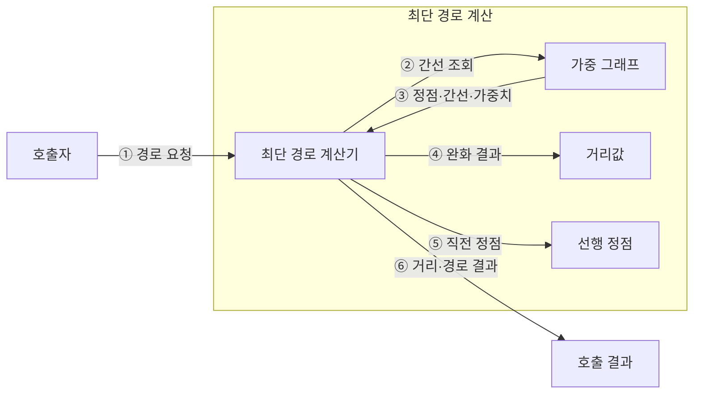

---
sidebar:
  order: 11
  label: "011. 최단 경로 — 다익스트라·벨만-포드·플로이드-워셜 (Shortest Path)"
  badge:
    text: "미출 · 15%"
    variant: note
title: "최단 경로 — 다익스트라·벨만-포드·플로이드-워셜 (Shortest Path)"
date: "2026-07-28T14:58:46+09:00"
tags:
  - "notes-basic-theory"
weight: 11
extra:
  question_no: "011"
  source_status: "미출"
  source_history: ""
  priority: 15
  priority_note: "음수 가중치·사이클·접근 범위로 선택"
---

## 미리 알고가기

- **최단 경로(Shortest Path)**: 간선 가중치 합을 최소화해 두 정점 사이 비용을 줄이는 경로
- **정점(Vertex)·간선(Edge)**: 정점은 대상, 간선은 대상 사이 연결
- **가중치(Weight)**: 간선에 부여한 거리·비용·지연 값
- **완화(Relaxation)**: 새 경로가 더 짧으면 거리값을 갱신해 최소 후보를 개선하는 연산
- **최적 부분 구조(Optimal Substructure)**: 전체 최단 경로를 부분 최단 경로로 구성할 수 있는 성질
- **단일 출발점 최단 경로(Single-Source Shortest Path, SSSP)**: 하나의 출발점에서 그래프의 모든 정점까지 최단 거리를 계산하는 문제
- **모든 쌍 최단 경로(All-Pairs Shortest Path, APSP)**: 그래프의 모든 정점 쌍 사이의 최단 거리를 계산하는 문제
- **정점 수 $V$**: 그래프의 정점 개수
- **반복 횟수 $V-1$**: 단순 경로가 가질 수 있는 최대 간선 수만큼의 완화 횟수
- **음수 사이클**: 반복할수록 경로 비용이 감소하는 순환
- **도달 불가 정점(Unreachable Vertex)**: 출발점에서 도달할 수 없는 정점
- **다익스트라 알고리즘(Dijkstra's Algorithm)**: 비음수 간선에서 최소 후보를 확정하며 단일 출발점 거리를 구하는 방식
- **벨만-포드 알고리즘(Bellman-Ford Algorithm)**: 모든 간선을 반복 완화해 음수 간선과 사이클을 처리하는 방식
- **플로이드-워셜 알고리즘(Floyd-Warshall Algorithm)**: 경유 정점을 늘리며 모든 정점 쌍의 거리를 구하는 방식
- **가중 그래프(Weighted Graph)**: 각 간선에 거리·비용·지연 같은 가중치를 부여해 경로의 총비용을 계산하는 그래프
- **거리값(Distance Value)**: 출발점에서 각 정점까지 또는 각 정점 쌍에 대해 현재까지 알려진 최소 비용 후보
- **선행 정점(Predecessor Vertex)**: 최단 경로에서 현재 정점 직전에 위치한 정점이며 목적지부터 거꾸로 따라가 전체 경로를 복원하는 데 쓰는 기록
- **최단 경로 계산기(Shortest Path Solver)**: 거리값을 초기화하고 완화를 반복해 거리값과 선행 정점을 갱신하는 연산 주체
- **라우팅(Routing)**: 여러 연결 경로 중 목적지까지 패킷이나 요청을 전달할 경로를 선택하는 동작

## Ⅰ. 개요

- 정의/개념: 간선 **가중치 합**이 최소인 경로를 찾는 **그래프 문제**
- 기존 한계: 연결성만 보는 탐색으로는 **라우팅** 최소 비용 경로 미확정

### 쉽게 이해하기 (학습용)
- 연결 여부가 아니라 간선 비용의 합을 비교하므로 가장 적게 거치는 길과 가장 싼 길은 다를 수 있다.

## Ⅱ. 특징

- 모든 부분 경로가 최단인 **최적 부분 구조**
- **완화** 반복으로 거리값 단조 감소·**수렴**

### 쉽게 이해하기 (학습용)
- 최단 경로의 부분 경로도 최단이어야 하며, 완화는 더 싼 후보를 찾을 때 거리값을 줄인다.

## Ⅲ. 아키텍처

| 구성요소 | 책임 | 흐름상 역할 |
|:---|:---|:---|
| 최단 경로 계산기 | **완화 규칙**으로 거리·경로 갱신 | ① 요청 → ② 조회 → ③ 완화 → ④⑤ 기록 → ⑥ 반환 |
| 가중 그래프 | 정점·간선·**가중치** 보관 | ② 조회 수신 → ③ 그래프 반환 |
| 거리값 | **최소 비용 후보** 보관 | ④ 완화 결과 저장 |
| 선행 정점 | **경로 역추적**용 직전 정점 보관 | ⑤ 직전 정점 저장 |

> 요약: 계산기가 **거리값**을 줄이고 **선행 정점**에 경로 기록

### 쉽게 이해하기 (학습용)
- 계산기는 더 짧은 경로를 찾을 때 거리값과 선행 정점을 함께 갱신한다.

## Ⅳ. 종류 및 비교

| 최단 경로 알고리즘 | 다익스트라 | 벨만-포드 | 플로이드-워셜 |
|:---|:---|:---|:---|
| 적용 기준 | **비음수** 간선·단일 출발점 | **음수 간선** 허용·단일 출발점 | 음수 간선 허용·**모든 정점 쌍** |
| 핵심 특징 | **최소 거리 정점** 확정·인접 완화 | **전체 간선**을 $V-1$회 완화 | **경유 정점**별 정점 쌍 갱신 |
| 한계 | 음수 간선에서 **최단 거리** 오산 | 간선 반복 완화로 **수행 시간** 증가 | 정점 증가 시 **세제곱 계산량** 급증 |

> 요약: 비음수 **다익스트라**, 음수 **벨만-포드**, 전 쌍 플로이드-워셜

### 쉽게 이해하기 (학습용)
- 비음수 단일 출발점은 다익스트라, 음수 간선은 벨만-포드, 모든 쌍은 플로이드-워셜이 적합하다.

## Ⅴ. 실무 고려사항 및 대책

| 고려사항 | 대책 | 효과 |
|:---|:---|:---|
| 음수 간선에 **다익스트라** 적용 | 실행 전 **가중치 범위** 검증 | 잘못된 거리 확정 방지 |
| **음수 사이클** 영향 범위 누락 | 추가 완화 후 도달 정점 전파 | 유한 거리 오판 방지 |
| 큰 그래프의 **자원 급증** | 범위·희소성으로 알고리즘 선택 | 계산 시간·메모리 절감 |
| 도달 불가와 큰 **거리값** 혼동 | 무한대 표식·오버플로 안전 연산 | 결과 상태 정확성 유지 |

### 쉽게 이해하기 (학습용)
- 가중치 부호와 계산 범위를 먼저 확인하고 음수 사이클·도달 불가를 정상 거리와 분리한다.

## Ⅵ. 결론

- 비음수는 **다익스트라**, 음수는 **벨만-포드**, 전 쌍은 플로이드-워셜

### 쉽게 이해하기 (학습용)
- 음수 간선 여부와 단일 출발점·모든 쌍 요구에 따라 알고리즘을 선택한다.
