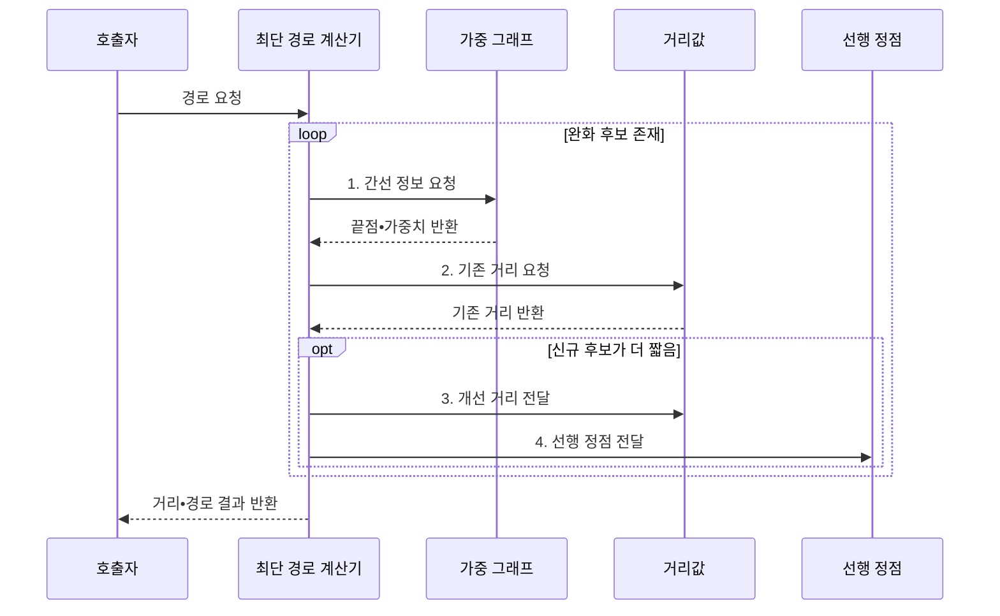

---
sidebar:
  order: 11
  label: "011. 최단 경로: 다익스트라•벨만-포드•플로이드-워셜 (Shortest Path)"
  badge:
    text: "미출 • 15%"
    variant: note
title: "최단 경로: 다익스트라•벨만-포드•플로이드-워셜 (Shortest Path)"
date: "2026-07-29T11:41:31+09:00"
tags:
  - "notes-basic-theory"
weight: 11
extra:
  question_no: "011"
  source_status: "미출"
  source_history: ""
  priority: 15
  priority_note: "음수 가중치•사이클•접근 범위로 선택"
---

## 미리 알고가기

- **최단 경로(Shortest Path)**: 간선 가중치 합을 최소화해 두 정점 사이 비용을 줄이는 경로
- **정점(Vertex)•간선(Edge)**: 정점은 대상, 간선은 대상 사이 연결
- **가중치(Weight)**: 간선에 부여한 거리•비용•지연 값
- **비음수 간선(Non-Negative Edge)**: 가중치가 0 이상이어서 경로를 연장해도 누적 비용이 줄지 않는 간선
- **완화(Relaxation)**: 새 경로가 더 짧으면 거리값을 갱신해 최소 후보를 개선하는 연산
- **최적 부분 구조(Optimal Substructure)**: 전체 최단 경로를 부분 최단 경로로 구성할 수 있는 성질
- **단일 출발점 최단 경로(Single-Source Shortest Path, SSSP)**: 하나의 출발점에서 그래프의 모든 정점까지 최단 거리를 계산하는 문제
- **모든 쌍 최단 경로(All-Pairs Shortest Path, APSP)**: 그래프의 모든 정점 쌍 사이의 최단 거리를 계산하는 문제
- **정점 수 $V$**: 그래프의 정점 개수
- **반복 횟수 $V-1$**: 단순 경로가 가질 수 있는 최대 간선 수만큼의 완화 횟수
- **음수 사이클**: 반복할수록 경로 비용이 감소하는 순환
- **도달 불가 정점(Unreachable Vertex)**: 출발점에서 도달할 수 없는 정점
- **희소 그래프(Sparse Graph)**: 가능한 정점 쌍에 비해 실제 간선 수가 적은 그래프
- **무한대 표식(Infinity Sentinel)**: 아직 도달 경로가 없는 거리값을 유한한 비용과 구분하는 특수값
- **다익스트라 알고리즘(Dijkstra's Algorithm)**: 비음수 간선에서 최소 후보를 확정하며 단일 출발점 거리를 구하는 방식
- **벨만-포드 알고리즘(Bellman-Ford Algorithm)**: 모든 간선을 반복 완화해 음수 간선과 사이클을 처리하는 방식
- **플로이드-워셜 알고리즘(Floyd-Warshall Algorithm)**: 경유 정점을 늘리며 모든 정점 쌍의 거리를 구하는 방식
- **가중 그래프(Weighted Graph)**: 각 간선에 거리•비용•지연 같은 가중치를 부여해 경로의 총비용을 계산하는 그래프
- **거리값(Distance Value)**: 출발점에서 각 정점까지 또는 각 정점 쌍에 대해 현재까지 알려진 최소 비용 후보
- **선행 정점(Predecessor Vertex)**: 최단 경로에서 현재 정점 직전에 위치한 정점이며 목적지부터 거꾸로 따라가 전체 경로를 복원하는 데 쓰는 기록
- **최단 경로 계산기(Shortest Path Solver)**: 거리값을 초기화하고 완화를 반복해 거리값과 선행 정점을 갱신하는 연산 주체
- **라우팅(Routing)**: 여러 연결 경로 중 목적지까지 패킷이나 요청을 전달할 경로를 선택하는 동작

## Ⅰ. 개요

- 정의/개념: 간선 **가중치 합**이 최소인 경로를 찾는 **그래프 문제**
- 배경/필요성: **가중 그래프**의 최소 비용 경로 결정

### 쉽게 이해하기 (학습용)

- 톨게이트 수가 적은 길보다 통행료 합이 싼 길이 따로 있듯, 최단 경로는 간선 수가 아니라 가중치 합을 최소화한다.

## Ⅱ. 특징

- 모든 부분 경로가 최단인 **최적 부분 구조**
- **완화** 반복으로 거리값 단조 감소•**수렴**
- 가중치 부호•계산 범위에 따른 **알고리즘 선택**

### 쉽게 이해하기 (학습용)

- 더 싼 우회로를 찾을 때마다 거리표를 낮추는 완화를 반복한다.

## Ⅲ. 구조 및 구성요소

| 구성요소 | 책임 |
|:---|:---|
| 최단 경로 계산기 | **완화 규칙**으로 거리•경로 갱신 |
| 가중 그래프 | 정점•간선•**가중치** 보관 |
| 거리값 | 정점별 **최소 비용 후보** 보관 |
| 선행 정점 | **경로 역추적**용 직전 정점 보관 |

### 쉽게 이해하기 (학습용)

- 계산기가 그래프의 간선 비용을 거리값과 비교하고, 더 짧은 경로의 거리와 직전 정점을 함께 기록한다.

## Ⅳ. 흐름도

**동작 원리**

- **1. 간선 정보 요청**: 완화 대상의 끝점•가중치 확보
- **2. 기존 거리 요청**: 신규 경로 비용과 비교
- **3. 개선 거리 전달**: 더 짧은 최소 후보로 교체
- **4. 선행 정점 전달**: 개선 경로의 직전 정점 기록

### 쉽게 이해하기 (학습용)

- 길 하나를 더 붙인 새 요금이 장부의 기존 요금보다 싸면, 계산기는 거리값과 직전 교차로를 함께 고쳐 최종 경로를 거꾸로 복원한다.

## Ⅴ. 종류 및 비교

| 최단 경로 알고리즘 | 다익스트라 | 벨만-포드 | 플로이드-워셜 |
|:---|:---|:---|:---|
| 적용 기준 | **비음수** 간선•단일 출발점 | **음수 간선** 허용•단일 출발점 | 음수 간선 허용•**모든 정점 쌍** |
| 핵심 특징 | **최소 거리 정점** 확정•인접 완화 | **전체 간선**을 $V-1$회 완화 | **경유 정점**별 정점 쌍 갱신 |
| 한계 | 음수 간선에서 **최단 거리** 오산 | 간선 반복 완화로 **수행 시간** 증가 | 정점 증가 시 **세제곱 계산량** 급증 |

> 요약: 비음수•음수•전 쌍 조건으로 알고리즘 선택

### 쉽게 이해하기 (학습용)

- 비음수•음수•모든 정점 쌍 조건에 따라 세 최단 경로 기법을 고른다.

## Ⅵ. 실무 고려사항 및 대책

| 고려사항 | 대책 | 효과 |
|:---|:---|:---|
| 음수 간선에 **다익스트라** 적용 | 실행 전 **가중치 범위** 검증 | 잘못된 거리 확정 방지 |
| **음수 사이클** 영향 범위 누락 | 추가 완화 후 도달 정점 전파 | 유한 거리 오판 방지 |
| 큰 그래프의 **자원 급증** | 범위•희소성으로 알고리즘 선택 | 계산 시간•메모리 절감 |
| 도달 불가와 큰 **거리값** 혼동 | 무한대 표식•오버플로 안전 연산 | 결과 상태 정확성 유지 |

### 쉽게 이해하기 (학습용)

- 음수 통행료 순환은 돌수록 총비용이 끝없이 내려가므로 별도 표시하고, 갈 수 없는 정점도 무한대 표식으로 큰 정상 거리와 구분한다.

## Ⅶ. 결론

- 가중치 부호•계산 범위로 **최단 경로 알고리즘** 선택

### 쉽게 이해하기 (학습용)

- 한 출발점의 비음수 도로는 다익스트라, 음수 도로는 벨만-포드, 모든 도시 쌍의 거리표는 플로이드-워셜로 계산한다.
