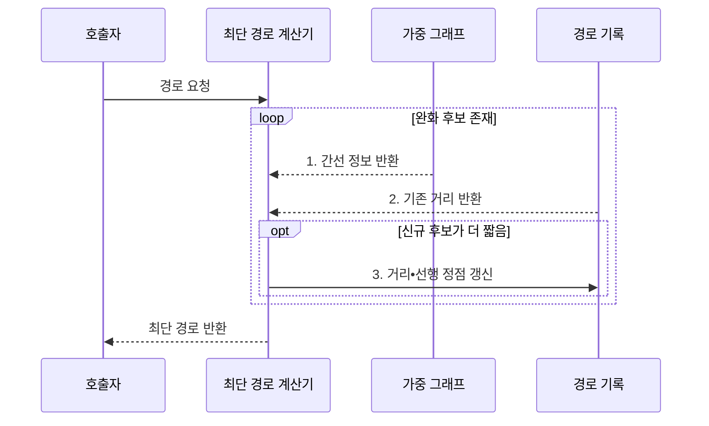

---
sidebar:
  order: 11
  label: "011. 최단 경로: 다익스트라•벨만-포드•플로이드-워셜 (Shortest Path)"
  badge:
    text: "미출 • 15%"
    variant: note
title: "최단 경로: 다익스트라•벨만-포드•플로이드-워셜 (Shortest Path)"
date: "2026-08-03T09:07:03+09:00"
tags:
  - "notes-basic-theory"
weight: 11
extra:
  question_no: "011"
  source_status: "미출"
  source_history: ""
  priority: 15
  priority_note: "음수 가중치•사이클•접근 범위로 선택"
---

## Ⅰ. 개요

핵심 용어

- **최단 경로(Shortest Path)**: 두 정점 사이에서 간선 가중치 합이 가장 작은 경로
- **가중치(Weight)**: 간선에 부여한 거리•비용•지연 값

- 정의/개념: 간선 **가중치 합** 이 최소인 경로를 찾는 **그래프 문제**
- 배경/필요성: 간선 수만 세는 탐색은 **가중치 합 최소 경로** 판정 불가

#### 한줄 요약

- 톨게이트 수가 적은 길보다 통행료 합이 싼 길이 따로 있듯, 최단 경로는 간선 수가 아니라 가중치 합을 최소화한다.

## Ⅱ. 특징

핵심 용어

- **최적 부분 구조(Optimal Substructure)**: 전체 최단 경로를 부분 최단 경로로 구성할 수 있는 성질
- **완화(Relaxation)**: 새 경로가 더 짧으면 거리값을 갱신해 최소 비용 후보를 개선하는 연산
- **수렴**: 완화를 반복한 뒤 더 이상 거리값이 감소하지 않는 상태

- 모든 부분 경로가 최단인 **최적 부분 구조**
- **완화** 반복으로 거리값 단조 감소•**수렴**

#### 한줄 요약

- 더 싼 우회로를 찾을 때마다 거리표를 낮추는 완화를 반복한다.

## Ⅲ. 구조 및 구성요소

핵심 용어

- **가중 그래프(Weighted Graph)**: 각 간선에 비용을 부여해 경로의 총비용을 계산하는 그래프
- **거리값(Distance Value)**: 현재까지 알려진 출발점과 정점 사이의 최소 비용 후보
- **선행 정점(Predecessor Vertex)**: 최단 경로에서 현재 정점 직전에 위치해 경로 역추적에 사용하는 정점
- **완화(Relaxation)**: 간선을 거친 새 경로가 더 짧을 때 거리값과 선행 정점을 갱신하는 연산
- **경로 역추적**: 목적지부터 선행 정점을 거꾸로 따라 최단 경로를 복원하는 과정

| 구성요소 | 책임 |
|:---|:---|
| 최단 경로 계산기 | **완화 규칙**으로 거리•경로 갱신 |
| 가중 그래프 | 정점•간선•**가중치** 보관 |
| 거리값 | 정점별 **최소 비용 후보** 보관 |
| 선행 정점 | **경로 역추적**용 직전 정점 보관 |

#### 한줄 요약

- 계산기가 그래프의 간선 비용을 거리값과 비교하고, 더 짧은 경로의 거리와 직전 정점을 함께 기록한다.

## Ⅳ. 흐름도

핵심 용어

- **완화 후보**: 기존 거리와 비교해 더 짧은 경로를 만들 수 있는 간선
- **경로 역추적**: 목적지에서 선행 정점을 거꾸로 따라 출발점까지의 경로를 복원하는 과정
- **최소 비용 후보**: 완화 과정에서 현재까지 발견한 가장 작은 거리값

**동작 원리**

1. **간선 정보 반환**: 완화 대상의 끝점•가중치 확보
2. **기존 거리 반환**: 신규 경로 비용과 현재 후보 비교
3. **거리•선행 정점 갱신**: 최소 비용과 경로 역추적용 직전 정점을 함께 기록

#### 한줄 요약

- 길 하나를 더 붙인 새 요금이 장부의 기존 요금보다 싸면, 계산기는 거리값과 직전 교차로를 함께 고쳐 최종 경로를 거꾸로 복원한다.

## Ⅴ. 종류 및 비교

핵심 용어

- **SSSP(Single-Source Shortest Path)**: 하나의 출발점에서 모든 정점까지 최단 거리를 구하는 문제
- **APSP(All-Pairs Shortest Path)**: 모든 정점 쌍 사이의 최단 거리를 구하는 문제
- **다익스트라(Dijkstra)**: 비음수 간선에서 최소 거리 정점을 확정하며 SSSP를 구하는 알고리즘
- **벨만-포드•플로이드-워셜(Bellman-Ford•Floyd-Warshall)**: 전체 간선을 반복 완화해 음수 SSSP를 구하거나 경유 정점을 늘려 APSP를 구하는 알고리즘
- **비음수•음수 간선**: 가중치가 0 이상인 간선과 0보다 작은 간선
- **경유 정점**: 출발점과 목적지 사이의 경로가 중간에 거쳐 가는 정점

| 최단 경로 알고리즘 | 다익스트라 | 벨만-포드 | 플로이드-워셜 |
|:---|:---|:---|:---|
| 적용 기준 | **비음수 SSSP** | **음수 SSSP** | 음수 간선 허용•**APSP** |
| 핵심 특징 | **최소 거리 정점** 확정•인접 완화 | **전체 간선** 을 $V-1$회 완화 | **경유 정점** 별 정점 쌍 갱신 |
| 한계 | 음수 간선에서 **최단 거리** 오산 | 간선 반복 완화로 **수행 시간** 증가 | 정점 증가 시 **세제곱 계산량** 급증 |

> 요약: 비음수•음수•전 쌍 조건으로 알고리즘 선택

#### 한줄 요약

- 비음수•음수•모든 정점 쌍 조건에 따라 세 최단 경로 기법을 선택한다.

## Ⅵ. 실무 고려사항 및 대책

핵심 용어

- **음수 사이클**: 반복할수록 경로 비용이 계속 감소해 최단 거리를 정의할 수 없는 순환
- **희소 그래프(Sparse Graph)**: 가능한 정점 쌍에 비해 실제 간선 수가 적은 그래프
- **무한대 표식(Infinity Sentinel)**: 아직 도달 경로가 없는 거리값을 유한한 비용과 구분하는 특수값
- **오버플로 안전 덧셈**: 거리와 가중치의 합이 수치형 범위를 넘지 않도록 검사하는 계산
- **SSSP•APSP**: 한 출발점에서 모든 정점까지와 모든 정점 쌍 사이의 최단 경로 문제
- **라우팅 범위**: 최단 경로를 계산해야 하는 출발점과 목적지의 대상 범위

| 문제 | 대책 | 효과 |
|:---|:---|:---|
| 음수 간선에서 다익스트라의 **거리 조기 확정 오류** | 실행 전 가중치 범위 검증 후 벨만-포드 선택 | 가중치 조건에 맞는 **최단거리 정확성** 확보 |
| **음수 사이클** 영향 정점을 유한 거리로 오판 | 추가 완화로 탐지하고 도달 정점까지 영향 전파 | 최단거리 미정의 **영향 범위 식별** |
| **라우팅 범위•희소성** 과 불일치한 전 쌍 계산으로 자원 급증 | SSSP•APSP와 희소성에 맞는 알고리즘 선택 | 질의 범위별 **시간•공간 비용 절감** |
| 도달 불가와 큰 정상 거리 혼동•덧셈 오버플로 | **무한대 표식•오버플로 안전 덧셈** 적용 | 무한대 상태와 **거리 계산 안전성** 확보 |

#### 한줄 요약

- 음수 통행료 순환은 돌수록 총비용이 끝없이 내려가므로 별도 표시하고, 갈 수 없는 정점도 무한대 표식으로 큰 정상 거리와 구분한다.

## Ⅶ. 결론

핵심 용어

- **비음수 간선(Non-Negative Edge)**: 가중치가 0 이상이어서 경로를 연장해도 누적 비용이 줄지 않는 간선
- **전 쌍 최단 경로**: 그래프의 모든 출발점과 목적지 조합에 대한 최소 비용 경로
- **다익스트라(Dijkstra)**: 비음수 간선에서 최소 거리 정점을 확정하며 한 출발점의 최단 경로를 구하는 알고리즘
- **벨만-포드(Bellman-Ford)**: 전체 간선을 반복 완화해 음수 간선을 포함한 한 출발점의 최단 경로를 구하는 알고리즘
- **플로이드-워셜(Floyd-Warshall)**: 경유 정점을 하나씩 추가해 모든 정점 쌍의 최단 거리를 구하는 알고리즘

- 비음수 **다익스트라**•음수 **벨만-포드**•전 쌍 플로이드-워셜 적용

#### 한줄 요약

- 한 출발점의 비음수 도로는 다익스트라, 음수 도로는 벨만-포드, 모든 도시 쌍의 거리표는 플로이드-워셜로 계산한다.
