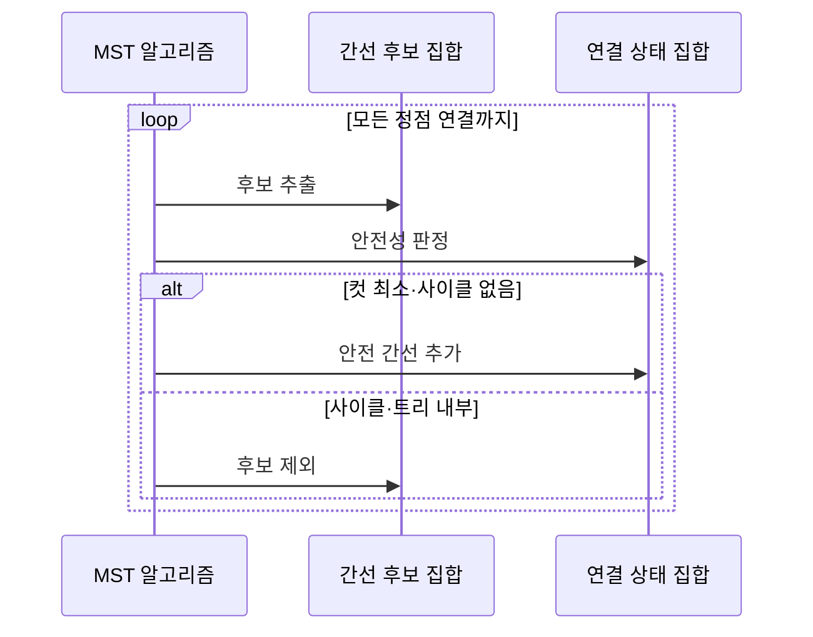

---
sidebar:
  order: 12
  label: "012. 최소 신장 트리 — 크루스칼·프림 (Minimum Spanning Tree)"
  badge:
    text: "미출제 · 15%"
    variant: note
title: "최소 신장 트리 — 크루스칼·프림 (Minimum Spanning Tree)"
date: "2026-07-26T22:16:20+09:00"
tags:
  - "notes-basic-theory"
weight: 12
extra:
  question_no: "012"
  source_status: "미출제"
  source_history: ""
  priority: 15
  priority_note: "최소 연결 비용과 두 알고리즘 비교에 적합"
---

## 미리 알고가기

- **최소 신장 트리(Minimum Spanning Tree, MST)**: 가중치 그래프의 모든 정점을 사이클 없이 연결하면서 간선 가중치 합을 최소화한 트리
- **신장 트리(Spanning Tree)**: 모든 정점을 사이클 없이 연결한 트리
- **가중 무방향 연결 그래프(Weighted Undirected Connected Graph)**: 간선마다 비용 값이 붙어 있고 방향 구분 없이 양쪽으로 오갈 수 있으며 어떤 두 정점 사이에도 경로가 있는 그래프이고, 경로가 끊긴 영역이 생기면 비연결 그래프라 부르며 이때 프림은 시작 정점이 속한 영역만 넓힐 수 있음
- **정점 수 $V$**: ‘브이’로 읽고 정점(Vertex)의 머리글자를 쓰는 그래프 이론 관례에 따라 그래프의 정점 개수를 나타내며 신장 트리 간선 수의 기준이 되는 변수
- **신장 트리 간선 수 $V-1$**: ‘브이 마이너스 원’으로 읽고 뺄셈 기호(-)로 정점 수보다 하나 적음을 나타내는 산술 관례에 따라 $V$개 정점을 사이클 없이 잇는 데 필요한 간선 수를 나타냄
- **서로소 집합(Disjoint Set Union)**: 연결 영역을 합치고 대표를 조회해 사이클을 판정하는 자료구조
- **우선순위 큐(Priority Queue)**: 담아 둔 후보 중 가중치가 가장 작은 것을 항상 먼저 꺼내 주는 자료구조이며, 프림이 현재 트리 둘레의 최소 간선을 매번 뽑는 데 사용함
- **방문 집합**: 프림이 현재 트리에 포함한 정점 집합
- **컷 속성(Cut Property)**: 이미 선택한 간선을 가르지 않는 컷이라면 그 컷을 건너는 간선 중 최소 가중치 간선을 골라도 최소 신장 트리로 확장할 수 있다는 성질이며, 두 알고리즘이 매 단계의 선택을 안전하다고 판단하는 근거
- **크루스칼 알고리즘(Kruskal's Algorithm)**: 전체 간선을 가중치순으로 선택해 사이클 없는 연결망을 만드는 방식
- **프림 알고리즘(Prim's Algorithm)**: 현재 트리 밖의 최소 간선을 선택해 연결 영역을 확장하는 방식
- **컷(Cut)**: 그래프의 정점 집합을 서로 겹치지 않는 두 영역으로 나누는 경계이며 두 영역을 잇는 안전 간선 후보를 정하는 기준
- **안전 간선(Safe Edge)**: 현재 선택한 간선과 함께 최소 신장 트리로 확장할 수 있음이 보장되는 컷의 최소 가중치 간선
- **희소 그래프(Sparse Graph)**: 가능한 정점 쌍에 비해 실제 간선 수가 적어 간선 목록 정렬 기반 크루스칼이 적합한 그래프
- **밀집 그래프(Dense Graph)**: 가능한 정점 쌍의 상당수가 간선으로 연결되어 인접 행렬 순회 기반 프림을 고려하는 그래프
- **인접 행렬(Adjacency Matrix)**: 행과 열의 정점 쌍마다 간선 존재 여부나 가중치를 저장하는 이차원 표
- **간선 목록(Edge List)**: 그래프의 각 간선을 두 끝 정점과 가중치의 묶음으로 저장하며 크루스칼이 가중치순으로 정렬하는 입력 구조
- **데이터센터(Data Center)**: 서버·스토리지·네트워크 장비를 운영하는 시설이며 링크 목록에서 최소 연결망을 구성하는 적용 대상
- **클러스터(Cluster)**: 여러 컴퓨터를 하나의 시스템처럼 연결한 집합이며 프림으로 기존 연결 영역에 인접 노드를 확장하는 적용 대상

## Ⅰ. 개요

- 정의/개념: 모든 정점을 **사이클** 없이 잇고 **총가중치**를 최소화한 트리
- 기존 한계: **중복 링크**를 남기면 연결망 **구축 비용**이 불필요하게 증가

### 쉽게 이해하기 (학습용)

- 섬 여러 개를 다리로 전부 이어야 하는데 다리를 마구 놓으면 이미 오갈 수 있는 섬을 또 잇는 고리 다리까지 생겨 건설비만 불어나므로, 모든 섬이 한 번씩만 이어지도록 고리 다리를 빼고 건설비 합이 가장 싼 다리 묶음만 남기는 것이 최소 신장 트리다

## Ⅱ. 특징

- 모든 정점 연결과 **사이클 배제**를 만족하는 $V-1$개 간선
- **컷 속성** 기반 **안전 간선** 선택으로 총비용 최소성 보장

### 쉽게 이해하기 (학습용)

- 섬 $V$개를 고리 없이 다 이으면 다리는 항상 하나 적은 $V-1$개로 정해지고, 섬 무리를 둘로 가르는 경계에서 가장 싼 다리 한 개는 최종 최저비용 망에 반드시 들어가므로(컷 속성) 그 다리를 먼저 골라도 나중에 손해가 나지 않는다

## Ⅲ. 아키텍처 및 구성요소

| 설계 요소 | 설명 |
|:---|:---|
| MST 알고리즘 | 후보를 받아 **안전 간선**만 누적하는 선택 주체 |
| 간선 후보 집합 | 정렬 **간선 목록**·**우선순위 큐**로 최소 후보 보관 |
| 연결 상태 집합 | **서로소 집합**·방문 집합으로 사이클 여부 판정 |

> 요약: 후보 집합과 **연결 상태** 조회로 안전 간선 확정

### 쉽게 이해하기 (학습용)

- 값싼 순서로 다리 후보를 쌓아 둔 바구니에서 하나씩 꺼내면(간선 후보 집합), 알고리즘이 그 다리 양 끝 섬이 이미 같은 무리에 묶였는지 명단(연결 상태 집합)에 대조해 같은 무리면 고리이므로 버리고 다른 무리면 채택한 뒤 두 무리를 한 무리로 합쳐 명단을 갱신한다

## Ⅳ. 원리 및 절차 흐름도

| 절차 | 설명 |
|:---|:---|
| 후보 추출 | 크루스칼은 전체, 프림은 **컷**에서 최소 간선 선택 |
| 안전성 판정 | **서로소 집합**·방문 여부로 사이클 형성 확인 |
| 안전 간선 추가 | 대표 병합·방문 표시로 **연결 영역** 확장 |
| 후보 제외 | **사이클** 형성·트리 내부 간선 폐기 |

> 요약: 전체 간선 또는 **컷의 최소 간선**을 사이클 없이 누적

### 쉽게 이해하기 (학습용)

- 싼 다리부터 한 개씩 꺼내 양 끝 섬이 이미 같은 무리면 고리가 되니 버리고 다른 무리면 채택해 두 무리를 합치는데, 이 되풀이는 흩어져 있던 섬이 전부 한 무리로 묶이는 순간 멈추고 그때 채택된 다리는 정확히 $V-1$개가 된다

## Ⅴ. 종류 및 비교

| MST 알고리즘 | 크루스칼 | 프림 |
|:---|:---|:---|
| 적용 기준 | 간선 목록 정렬이 싼 **희소 그래프** | 인접 행렬 순회가 유리한 **밀집 그래프** |
| 핵심 특징 | **가중치순** 무사이클 간선 선택 | 트리 밖 **최소 간선**으로 확장 |
| 한계 | 전체 **간선 정렬** 비용이 수행 시간 지배 | **비연결 그래프**에서 시작 영역만 확장 |

> 요약: **간선 밀도**와 입력 구조를 기준으로 두 기법 중 하나를 선택

### 쉽게 이해하기 (학습용)

- 링크가 드문 그래프는 간선 목록 자체가 짧아 전부 줄 세우는 크루스칼이 싸게 먹히고, 정점 쌍 대부분이 이어진 빽빽한 그래프는 그 많은 간선을 다 정렬하느니 지금 망 둘레만 훑는 프림이 낫다

## Ⅵ. 실무 사례

1. 데이터센터 링크 목록은 **크루스칼**로 최소 연결망 구성

### 쉽게 이해하기 (학습용)

- 데이터센터에 깔 수 있는 링크 후보를 비용이 싼 순서로 훑으면서 이미 이어진 랙끼리 다시 잇는 고리 링크는 버리고 새 랙을 물어 오는 링크만 남긴다

## Ⅶ. 결론

- 간선 목록은 **크루스칼**, 인접 확장은 **프림** 선택

### 쉽게 이해하기 (학습용)

- 깔 수 있는 링크가 목록으로 통째로 주어졌으면 전체에서 싼 것부터 고르는 크루스칼이 편하고, 이미 돌아가는 망을 넓히는 상황이면 망 둘레만 보는 프림이 편하다
