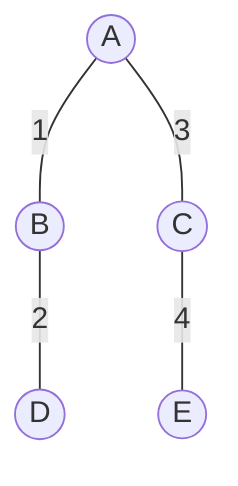
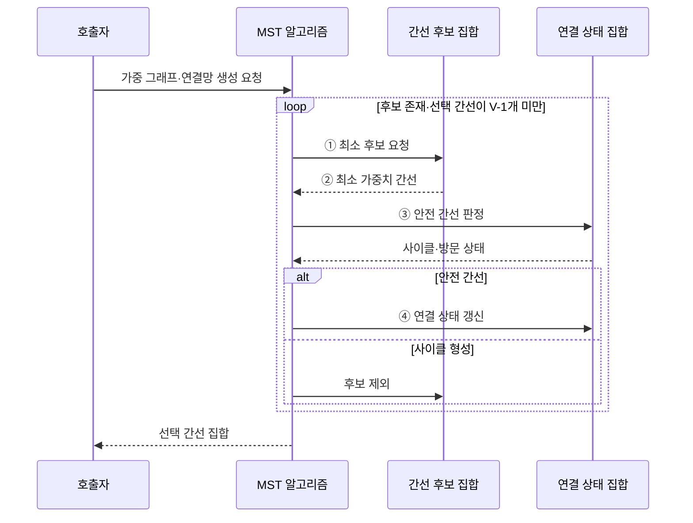

---
sidebar:
  order: 12
  label: "012. 최소 신장 트리 — 크루스칼·프림 (Minimum Spanning Tree)"
  badge:
    text: "미출 · 15%"
    variant: note
title: "최소 신장 트리 — 크루스칼·프림 (Minimum Spanning Tree)"
date: "2026-07-28T22:26:00+09:00"
tags:
  - "notes-basic-theory"
weight: 12
extra:
  question_no: "012"
  source_status: "미출"
  source_history: ""
  priority: 15
  priority_note: "최소 연결 비용과 두 알고리즘 비교에 적합"
---

## 미리 알고가기

- **최소 신장 트리(Minimum Spanning Tree, MST)**: 가중치 그래프의 모든 정점을 사이클 없이 연결하면서 간선 가중치 합을 최소화한 트리
- **신장 트리(Spanning Tree)**: 모든 정점을 사이클 없이 연결한 트리
- **최소 신장 숲(Minimum Spanning Forest)**: 비연결 그래프의 각 연결 영역에서 만든 최소 신장 트리 집합
- **가중 무방향 연결 그래프(Weighted Undirected Connected Graph)**: 방향 없는 비용 간선으로 모든 정점이 연결된 그래프
- **정점 수 $V$**: 그래프의 정점 개수
- **신장 트리 간선 수 $V-1$**: $V$개 정점을 사이클 없이 잇는 간선 수
- **서로소 집합(Disjoint Set Union)**: 연결 영역을 합치고 대표를 조회해 사이클을 판정하는 자료구조
- **우선순위 큐(Priority Queue)**: 담아 둔 후보 중 가중치가 가장 작은 것을 항상 먼저 꺼내 주는 자료구조이며, 프림이 현재 트리 둘레의 최소 간선을 매번 뽑는 데 사용함
- **방문 집합**: 프림이 현재 트리에 포함한 정점 집합
- **컷 속성(Cut Property)**: 이미 선택한 간선을 가르지 않는 컷이라면 그 컷을 건너는 간선 중 최소 가중치 간선을 골라도 최소 신장 트리로 확장할 수 있다는 성질이며, 두 알고리즘이 매 단계의 선택을 안전하다고 판단하는 근거
- **크루스칼 알고리즘(Kruskal's Algorithm)**: 전체 간선을 가중치순으로 선택해 사이클 없는 연결망을 만드는 방식
- **프림 알고리즘(Prim's Algorithm)**: 현재 트리 밖의 최소 간선을 선택해 연결 영역을 확장하는 방식
- **컷(Cut)**: 그래프의 정점 집합을 서로 겹치지 않는 두 영역으로 나누는 경계이며 두 영역을 잇는 안전 간선 후보를 정하는 기준
- **안전 간선(Safe Edge)**: 현재 선택한 간선과 함께 최소 신장 트리로 확장할 수 있음이 보장되는 컷의 최소 가중치 간선
- **희소 그래프(Sparse Graph)**: 가능한 정점 쌍에 비해 실제 간선 수가 적어 간선 목록 정렬 기반 크루스칼이 적합한 그래프
- **밀집 그래프(Dense Graph)**: 가능한 정점 쌍의 상당수가 간선으로 연결되어 인접 행렬 순회 기반 프림을 고려하는 그래프
- **인접 행렬(Adjacency Matrix)**: 행과 열의 정점 쌍마다 간선 존재 여부나 가중치를 저장하는 이차원 표
- **간선 목록(Edge List)**: 그래프의 각 간선을 두 끝 정점과 가중치의 묶음으로 저장하며 크루스칼이 가중치순으로 정렬하는 입력 구조

## Ⅰ. 개요

- 정의/개념: 모든 정점을 **사이클** 없이 잇고 **총가중치**를 최소화한 트리
- 기존 한계: **중복 링크**를 남기면 연결망 **구축 비용**이 불필요하게 증가

### 쉽게 이해하기 (학습용)

- 모든 섬을 연결하되 고리를 제외하고 총 건설비가 가장 작은 다리만 남기는 구조다.

## Ⅱ. 특징

- 모든 정점 연결과 **사이클 배제**를 만족하는 $V-1$개 간선
- **컷 속성** 기반 **안전 간선** 선택으로 총비용 최소성 보장

### 쉽게 이해하기 (학습용)

- 섬 $V$개를 고리 없이 이으면 다리는 $V-1$개이며, 연결된 섬과 남은 섬 사이의 가장 싼 다리는 총비용 최소성을 해치지 않는다.

## Ⅲ. 아키텍처

**도표안 A — 구조도**

**도표안 B — sequenceDiagram**

| 구성요소 | 책임 |
|:---|:---|
| MST 알고리즘 | 후보 중 **안전 간선**만 누적 |
| 간선 후보 집합 | 간선 목록·**우선순위 큐** 보관 |
| 연결 상태 집합 | 서로소 집합·**방문 집합** 보관 |

**동작 원리**

- **① 최소 후보 요청**: 정렬 목록·우선순위 큐의 최소 간선 조회
- **② 최소 가중치 간선**: 현재 선택 기준의 최소 후보 반환
- **③ 안전 간선 판정**: 사이클 없이 컷을 잇는지 검증
- **④ 연결 상태 갱신**: 안전 간선을 결과와 연결 집합에 반영

### 쉽게 이해하기 (학습용)

- 건설비가 가장 싼 다리 후보를 꺼내 두 섬이 이미 이어졌는지 확인하고, 고리를 만들지 않는 다리만 연결망에 넣는다.

## Ⅳ. 종류 및 비교

| MST 알고리즘 | 크루스칼 | 프림 |
|:---|:---|:---|
| 적용 기준 | 간선 목록 정렬이 싼 **희소 그래프** | 인접 행렬 순회가 유리한 **밀집 그래프** |
| 핵심 특징 | **가중치순** 무사이클 간선 선택 | 트리 밖 **최소 간선**으로 확장 |
| 한계 | 전체 **간선 정렬** 비용이 수행 시간 지배 | **비연결 그래프**에서 시작 영역만 확장 |

> 요약: **간선 밀도**와 입력 구조를 기준으로 두 기법 중 하나를 선택

### 쉽게 이해하기 (학습용)

- 후보 다리가 적으면 전체를 가격순으로 고르는 크루스칼, 촘촘하면 현재 연결 영역 둘레의 최저가를 확장하는 프림이 유리하다.

## Ⅴ. 실무 고려사항 및 대책

| 고려사항 | 대책 | 효과 |
|:---|:---|:---|
| **비연결 그래프**의 단일 트리 기대 | 연결성 검사 후 **신장 숲** 반환 | 누락 영역 오판 방지 |
| **동일 가중치** 간선의 결과 변동 | 정점 식별자로 보조 정렬 | 결과 **재현성** 확보 |
| **그래프 밀도**와 구현 불일치 | 목록은 **크루스칼**, 인접 구조는 프림 | 시간·메모리 절감 |
| 비용 변경 후 기존 **MST** 재사용 | 변경 범위 검증 또는 전체 재계산 | **최소성** 유지 |

### 쉽게 이해하기 (학습용)

- 떨어진 섬 무리는 신장 숲으로 나누고, 같은 가격은 섬 번호로 순서를 고정하며, 건설비가 바뀌면 최소 연결망을 다시 검증한다.

## Ⅵ. 결론

- 간선 목록·희소 그래프는 **크루스칼**, 인접 구조·밀집 그래프는 **프림**

### 쉽게 이해하기 (학습용)

- 전체 다리 목록이 짧으면 가격순 크루스칼을, 촘촘한 지도에서 한 영역을 넓혀 가면 프림을 선택한다.
