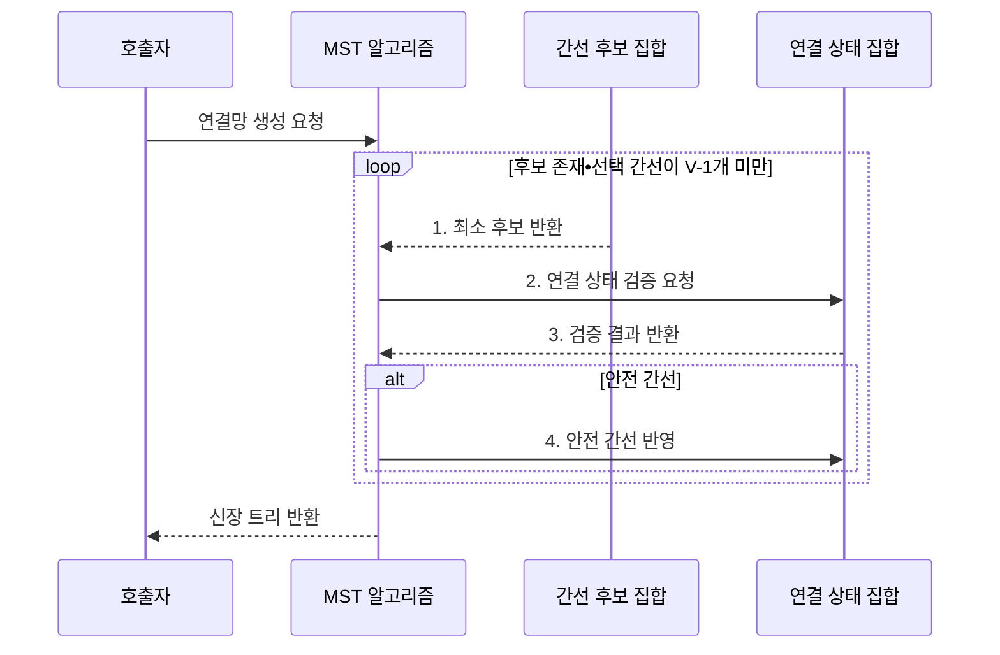

---
sidebar:
  order: 12
  label: "012. 최소 신장 트리: 크루스칼•프림 (Minimum Spanning Tree)"
  badge:
    text: "미출 • 15%"
    variant: note
title: "최소 신장 트리: 크루스칼•프림 (Minimum Spanning Tree)"
date: "2026-08-02T09:30:00+09:00"
tags:
  - "notes-basic-theory"
weight: 12
extra:
  question_no: "012"
  source_status: "미출"
  source_history: ""
  priority: 15
  priority_note: "최소 연결 비용과 두 알고리즘 비교에 적합"
---

## Ⅰ. 개요

핵심 용어

- **최소 신장 트리(Minimum Spanning Tree, MST)**: 모든 정점을 사이클 없이 연결하면서 간선 가중치 합을 최소화한 트리
- **신장 트리(Spanning Tree)**: 그래프의 모든 정점을 사이클 없이 연결한 트리

- 정의/개념: 모든 정점을 잇는 최소 **총가중치** 무사이클 트리
- 배경/필요성: 개별 최저가 간선 선택은 **사이클•정점 누락** 가능

### 쉽게 이해하기 (학습용)

- 모든 섬을 연결하되 고리를 제외하고 총 건설비가 가장 작은 다리만 남기는 구조다.

## Ⅱ. 특징

핵심 용어

- **컷(Cut)**: 그래프의 정점 집합을 겹치지 않는 두 영역으로 나눈 경계
- **컷 속성(Cut Property)**: 컷을 건너는 최소 가중치 간선을 선택해도 MST로 확장할 수 있다는 성질
- **안전 간선(Safe Edge)**: 현재 선택 집합과 함께 MST로 확장할 수 있음이 보장된 간선

- 모든 정점 연결과 **사이클 배제**를 만족하는 $V-1$개 간선
- **컷 속성** 기반 **안전 간선** 선택으로 총비용 최소성 보장
- **가중 무방향 그래프**의 연결 성분별 최소화

### 쉽게 이해하기 (학습용)

- 두 섬 무리 사이 가장 싼 다리를 골라도 최소 연결망의 총비용을 해치지 않는다.

## Ⅲ. 구조 및 구성요소

핵심 용어

- **우선순위 큐(Priority Queue)**: 후보 중 가중치가 가장 작은 간선을 먼저 꺼내는 자료구조
- **서로소 집합(Disjoint Set Union)**: 연결 영역의 대표를 조회하고 합쳐 사이클을 판정하는 자료구조
- **방문 집합**: 프림이 현재 트리에 포함한 정점을 기록하는 집합

| 구성요소 | 책임 |
|:---|:---|
| MST 알고리즘 | 후보 중 **안전 간선**만 누적 |
| 간선 후보 집합 | 간선 목록•**우선순위 큐** 보관 |
| 연결 상태 집합 | **서로소 집합•방문 집합** 보관 |

### 쉽게 이해하기 (학습용)

- MST 알고리즘이 최소 비용 후보를 꺼내고, 연결 상태 집합으로 사이클 발생 여부를 확인한다.

## Ⅳ. 흐름도

핵심 용어

- **최소 후보**: 정렬 목록이나 우선순위 큐에서 현재 가장 작은 가중치를 가진 간선
- **연결 상태**: 두 끝 정점이 이미 같은 연결 영역에 속하는지 나타내는 정보
- **$V-1$개 간선**: $V$개 정점을 사이클 없이 하나의 트리로 잇는 데 필요한 간선 수

**동작 원리**

1. **최소 후보 반환**: 정렬 목록•우선순위 큐에서 간선 조회
2. **연결 상태 검증 요청**: 후보 간선의 두 끝 정점 전달
3. **검증 결과 반환**: 사이클 없이 컷을 잇는 안전 간선 판정
4. **안전 간선 반영**: 선택 집합과 연결 상태에 간선 추가

### 쉽게 이해하기 (학습용)

- 건설비가 가장 싼 다리 후보를 꺼내 두 섬이 이미 이어졌는지 확인하고, 고리를 만들지 않는 다리만 연결망에 넣는다.

## Ⅴ. 종류 및 비교

핵심 용어

- **크루스칼(Kruskal)**: 전체 간선을 가중치순으로 검사해 사이클 없는 간선을 선택하는 알고리즘
- **프림(Prim)**: 현재 트리와 바깥 정점을 잇는 최소 간선으로 연결 영역을 확장하는 알고리즘
- **희소•밀집 그래프(Sparse•Dense Graph)**: 가능한 정점 쌍에 비해 실제 간선이 적거나 많은 그래프
- **간선 목록•인접 행렬**: 간선을 끝점과 가중치 묶음으로 나열하거나 정점 쌍별 가중치를 표로 저장한 구조

| MST 알고리즘 | 크루스칼 | 프림 |
|:---|:---|:---|
| 적용 기준 | 간선 목록 정렬이 싼 **희소 그래프** | 인접 행렬 순회가 유리한 **밀집 그래프** |
| 핵심 특징 | **가중치순** 무사이클 간선 선택 | 트리 밖 **최소 간선**으로 확장 |
| 한계 | 전체 **간선 정렬** 비용이 수행 시간 지배 | **비연결 그래프**에서 시작 영역만 확장 |

> 요약: **간선 밀도•입력 구조**로 알고리즘 선택

### 쉽게 이해하기 (학습용)

- 후보 다리가 적으면 전체를 가격순으로 고르는 크루스칼, 촘촘하면 현재 연결 영역 둘레의 최저가를 확장하는 프림이 유리하다.

## Ⅵ. 실무 고려사항 및 대책

핵심 용어

- **최소 신장 숲(Minimum Spanning Forest)**: 비연결 그래프의 각 연결 성분에서 만든 MST의 집합
- **결정적 보조 정렬**: 같은 가중치의 간선을 정점 식별자 같은 추가 기준으로 정렬해 결과를 재현하는 방식
- **영향 범위 검증**: 간선 비용 변경이 기존 MST의 최소성에 영향을 주는지 확인하는 과정

| 고려사항 | 대책 | 효과 |
|:---|:---|:---|
| **비연결 그래프**에서 단일 트리를 기대해 연결 영역 누락 | 연결성 검사 후 **최소 신장 숲** 반환 | 모든 연결 성분의 **최소 연결 결과** 보존 |
| 동일 가중치 간선으로 실행마다 다른 MST 생성 | 정점 식별자의 결정적 보조 정렬 적용 | 동률 간선의 **결과 재현성** 확보 |
| 그래프 밀도·입력 구조와 구현 불일치로 비용 증가 | 희소 간선 목록은 크루스칼, 밀집 인접 구조는 프림 선택 | 구조별 **정렬·메모리 비용 최적화** |
| 간선 비용 변경 후 과거 MST 재사용으로 최소성 상실 | 영향 범위 검증 또는 전체 재계산 | 변경 그래프의 **최소 비용 보장** 회복 |

### 쉽게 이해하기 (학습용)

- 연결되지 않은 섬 무리는 각각 최소 신장 숲으로 묶는다.

## Ⅶ. 결론

핵심 용어

- **간선 밀도**: 가능한 전체 간선 수에 비해 실제 간선이 차지하는 비율
- **인접 구조**: 각 정점의 이웃과 가중치를 저장해 프림이 확장 후보를 찾는 그래프 표현

- 희소 간선 목록은 **크루스칼**, 밀집 인접 구조는 **프림** 선택

### 쉽게 이해하기 (학습용)

- 전체 다리 목록이 짧으면 가격순 크루스칼을, 촘촘한 지도에서 한 영역을 넓혀 가면 프림을 선택한다.
