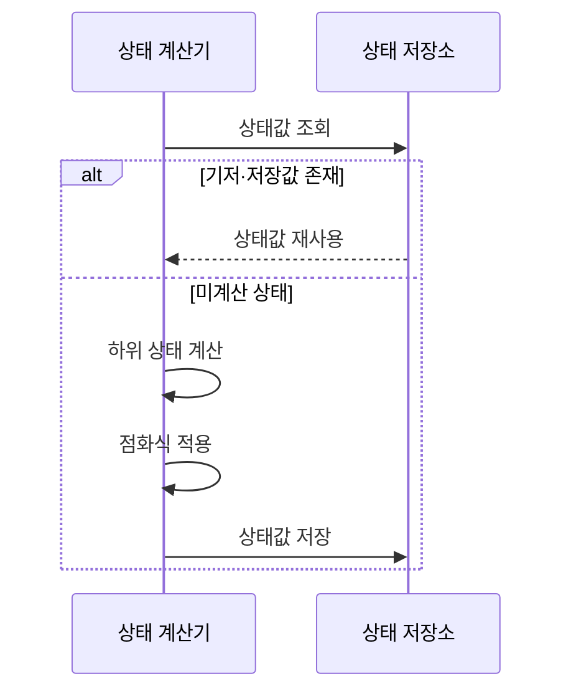

---
sidebar:
  order: 13
  label: "013. 동적 계획법 (Dynamic Programming)"
  badge:
    text: "기출 · 15%"
    variant: note
title: "동적 계획법 (Dynamic Programming)"
date: "2026-07-27T21:10:00+09:00"
tags:
  - "notes-basic-theory"
weight: 13
extra:
  question_no: "013"
  source_status: "기출"
  source_history: "122회"
  priority: 15
  priority_note: "기출 간격이 길고 최적 부분 구조 설명이 핵심"
---

## 미리 알고가기

- **동적 계획법(Dynamic Programming, DP, 디피)**: 영문명 Dynamic Programming을 줄인 공식 약어로, 중복 부분 문제의 상태값을 저장·재사용해 계산을 줄이는 설계 기법
- **중복 부분 문제(Overlapping Subproblems)**: 같은 작은 문제가 반복해 나타나는 성질
- **최적 부분 구조(Optimal Substructure)**: 부분 문제의 최적해로 전체 최적해를 구성하는 성질
- **상태(State)**: 부분 문제를 구분하는 최소 변수 조합
- **상태값(State Value)**: 각 상태에서 구할 결과
- **점화식(Recurrence Relation)**: 하위 상태값으로 현재 상태값을 계산하는 식
- **기저 상태(Base State)**: 점화식 없이 값이 정해지는 시작 상태
- **메모이제이션(Memoization)**: 필요한 상태만 재귀 계산·저장해 중복 호출을 줄이는 방식
- **타뷸레이션(Tabulation)**: 기저 상태부터 의존 순서로 표를 채워 목표값을 구하는 방식
- **하향식(Top-down)**: 목표 상태에서 필요한 하위 상태만 재귀 계산·저장하는 방식
- **상향식(Bottom-up)**: 기저 상태부터 의존 순서대로 전체 상태값을 계산하는 방식
- **재귀(Recursion)**: 입력을 더 작은 상태로 줄여 같은 함수를 다시 호출하며 하향식 동적 계획법의 미계산 하위 상태를 구하는 방식
- **호출 스택(Call Stack)**: 함수 호출의 반환 위치와 지역 상태를 저장하며 하향식 재귀 깊이에 따라 사용량이 늘어나는 메모리 영역
- **캐시(Cache)**: 계산을 끝낸 상태값을 보관해 같은 상태를 다시 요청할 때 즉시 반환하는 저장소
- **의존 순서(Dependency Order)**: 현재 상태값 계산에 필요한 하위 상태값이 먼저 확정되도록 정한 상태 처리 순서
- **희소 상태 공간(Sparse State Space)**: 정의할 수 있는 상태를 전부 세면 많지만 목표값을 구하는 데 실제로 도달 가능한 상태는 그중 일부뿐인 상황이며, 하향식이 필요한 칸만 골라 채워 이득을 보는 조건
- **편집 거리(Edit Distance)**: 한 문자열을 다른 문자열로 바꾸는 데 필요한 삽입·삭제·치환의 최소 횟수이며 동적 계획표의 이전·현재 행만 유지하는 적용 대상
- **공간 최적화(Space Optimization)**: 다음 상태 계산에 더는 필요 없는 이전 상태값을 버려 동적 계획법 저장소의 메모리 사용량을 줄이는 기법

## Ⅰ. 개요

- 정의/개념: **중복 부분 문제**의 **상태값**을 저장·재사용하는 설계 기법
- 기존 한계: 완전 탐색의 **중복 상태 재계산**으로 계산량 급증

### 쉽게 이해하기 (학습용)
- 같은 하위 문제를 매번 새로 푸는 완전 탐색은 같은 계산을 수없이 되풀이하므로, 한 번 푼 작은 문제의 답을 공책 한 칸에 적어 두었다가 그 문제가 또 나오면 계산하지 않고 적어 둔 값을 그대로 꺼내 쓰는 것이 동적 계획법이다

## Ⅱ. 특징

- **중복 부분 문제**를 상태로 통합해 상태당 1회 계산
- 최적화 문제는 **최적 부분 구조**로 **점화식** 구성

### 쉽게 이해하기 (학습용)
- 같은 작은 문제가 반복되면 공책의 같은 칸으로 묶어 한 번만 계산하고, 최적화 문제에서는 작은 칸의 최선으로 큰 칸의 최선을 만들 수 있을 때 점화식으로 연결한다

## Ⅲ. 아키텍처 및 구성요소

| 설계 요소 | 설명 |
|:---|:---|
| 상태 계산기 | 계산 대상 선택·**점화식** 적용 |
| 상태 저장소 | **메모이제이션 캐시**·**타뷸레이션 표**로 확정값 보관 |

> 요약: **상태 계산기**와 저장소 분담으로 **중복 계산** 제거

### 쉽게 이해하기 (학습용)
- 계산기가 채울 칸을 정해 아래 칸 값을 점화식으로 결합하고 공책에 적어 두면, 같은 칸을 다시 요청할 때 저장된 값을 꺼내 쓴다

## Ⅳ. 원리 및 절차 흐름도

| 절차 | 설명 |
|:---|:---|
| 상태값 조회 | **기저 상태**·저장값 존재 여부 확인 |
| 상태값 재사용 | 이미 확정한 **상태값** 반환 |
| 하위 상태 계산 | 미저장 하위 상태만 **재귀** 전개 |
| 점화식 적용 | 하위 상태값을 결합해 현재 상태값 확정 |
| 상태값 저장 | 확정값을 **캐시**에 기록해 재계산 차단 |

> 요약: 저장값은 재사용하고, 미계산 상태에만 **점화식** 적용

### 쉽게 이해하기 (학습용)
- 공책에 이미 답이 적힌 칸이나 더 쪼갤 수 없는 맨 아래 칸은 계산 없이 바로 값을 돌려주고, 아직 빈 칸으로 남은 상태만 더 작은 칸으로 내려가 값을 구한 뒤 그 자리에 적어 둔다

## Ⅴ. 종류 및 비교

| DP 구현 방식 | 하향식 | 상향식 |
|:---|:---|:---|
| 적용 기준 | 도달 가능 상태가 **희소**한 문제 | 의존 순서가 명확하고 **전체 상태** 계산 |
| 핵심 특징 | 목표 의존 상태만 **재귀**·저장 | **의존 순서**대로 전체 표 계산 |
| 한계 | 재귀 깊이에 따른 **호출 스택** 초과 | 미사용 상태까지 채워 **공간 복잡도** 증가 |

> 요약: **상태 공간** 대비 실제 계산량으로 방식 선택

### 쉽게 이해하기 (학습용)
- 표에서 실제로 쓰는 칸이 몇 개뿐이면 목표 칸부터 필요한 칸만 파고드는 하향식이 이득이지만 그만큼 재귀가 깊어져 호출 스택이 넘칠 수 있고, 채우는 순서가 뻔한 문제는 맨 아래부터 표를 쭉 채우는 상향식이 안전한 대신 안 쓸 칸까지 메모리를 먹는다

## Ⅵ. 실무 사례

1. **편집 거리** DP는 이전·현재 행만 유지해 공간 절약

### 쉽게 이해하기 (학습용)
- 두 문자열을 비교하는 표는 현재 행을 채울 때 바로 윗행만 보므로 다 지난 행은 버리고 두 줄만 들고 다니면 메모리가 크게 준다

## Ⅶ. 결론

- 중복 계산 제거를 위해 상태·의존성을 검토하여 **DP** 활용

### 쉽게 이해하기 (학습용)
- 쓸 칸이 얼마 안 되면 목표에서 필요한 칸만 찾아 내려가고, 전체 칸의 계산 순서가 눈에 보이면 맨 아래부터 차례로 채우는 쪽을 고른다
