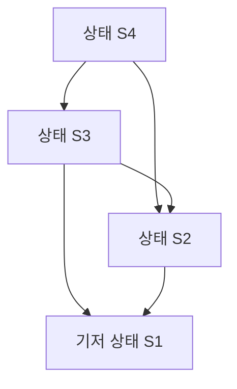
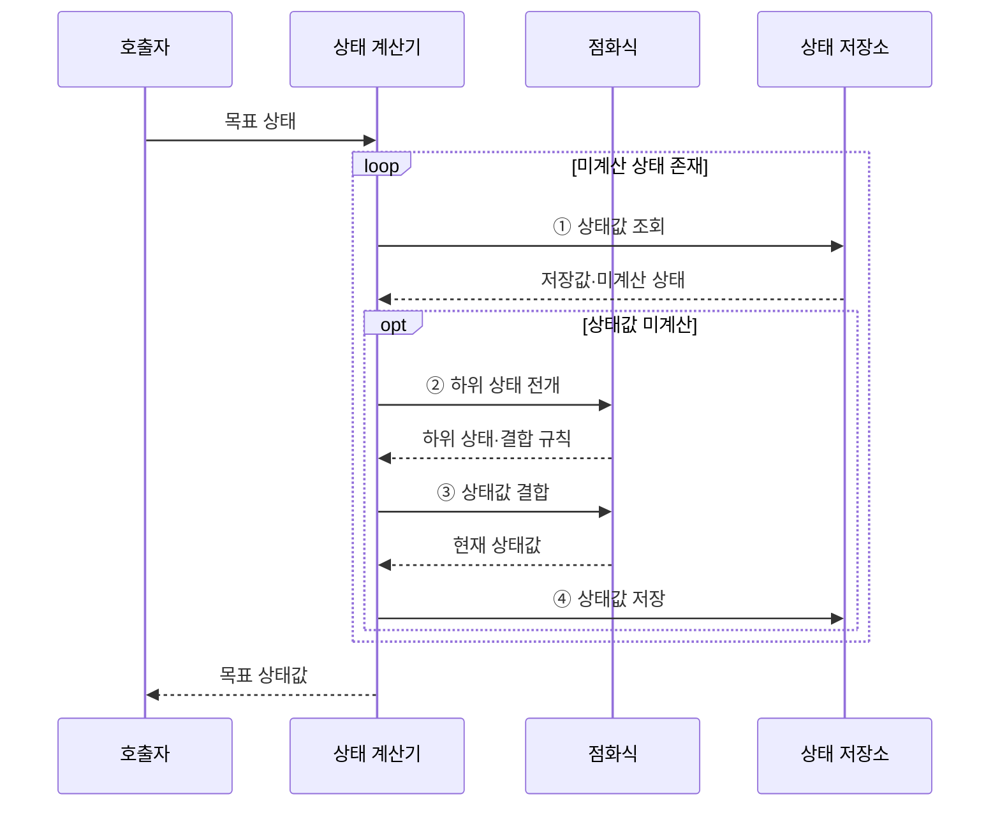

---
sidebar:
  order: 13
  label: "013. 동적 계획법 (Dynamic Programming)"
  badge:
    text: "기출 · 15%"
    variant: note
title: "동적 계획법 (Dynamic Programming)"
date: "2026-07-28T22:29:00+09:00"
tags:
  - "notes-basic-theory"
weight: 13
extra:
  question_no: "013"
  source_status: "기출"
  source_history: "122회"
  priority: 15
  priority_note: "기출 간격이 길고 최적 부분 구조 설명이 핵심"
---

## 미리 알고가기

- **동적 계획법(Dynamic Programming, DP)**: 중복되는 부분 문제의 해를 저장·재사용하여 계산량을 줄이는 알고리즘 설계 기법
- **중복 부분 문제(Overlapping Subproblems)**: 같은 작은 문제가 반복해 나타나는 성질
- **최적 부분 구조(Optimal Substructure)**: 부분 문제의 최적해로 전체 최적해를 구성하는 성질
- **상태(State)**: 부분 문제를 구분하는 최소 변수 조합
- **상태값(State Value)**: 각 상태에서 구할 결과
- **점화식(Recurrence Relation)**: 하위 상태값으로 현재 상태값을 계산하는 식
- **기저 상태(Base State)**: 점화식 없이 값이 정해지는 시작 상태
- **메모이제이션(Memoization)**: 필요한 상태만 재귀 계산·저장해 중복 호출을 줄이는 방식
- **타뷸레이션(Tabulation)**: 기저 상태부터 의존 순서로 표를 채워 목표값을 구하는 방식
- **하향식(Top-down)**: 목표 상태에서 필요한 하위 상태만 재귀 계산·저장하는 방식
- **상향식(Bottom-up)**: 기저 상태부터 의존 순서대로 전체 상태값을 계산하는 방식
- **재귀(Recursion)**: 입력을 더 작은 상태로 줄여 같은 함수를 다시 호출하며 하향식 동적 계획법의 미계산 하위 상태를 구하는 방식
- **호출 스택(Call Stack)**: 함수 호출의 반환 위치와 지역 상태를 저장하며 하향식 재귀 깊이에 따라 사용량이 늘어나는 메모리 영역
- **의존 순서(Dependency Order)**: 현재 상태값 계산에 필요한 하위 상태값이 먼저 확정되도록 정한 상태 처리 순서
- **희소 상태 공간(Sparse State Space)**: 정의할 수 있는 상태를 전부 세면 많지만 목표값을 구하는 데 실제로 도달 가능한 상태는 그중 일부뿐인 상황이며, 하향식이 필요한 칸만 골라 채워 이득을 보는 조건

## Ⅰ. 개요

- 정의/개념: **중복 부분 문제**의 **상태값**을 저장·재사용하는 설계 기법
- 기존 한계: 완전 탐색의 **중복 상태 재계산**으로 계산량 급증

### 쉽게 이해하기 (학습용)

- 큰 퍼즐의 같은 조각을 다시 만날 때 답 쪽지를 꺼내듯, 부분 문제의 상태값을 저장해 중복 계산을 없앤다.

## Ⅱ. 특징

- **중복 부분 문제**를 상태로 통합해 상태당 1회 계산
- 최적화 문제는 **최적 부분 구조**로 **점화식** 구성

### 쉽게 이해하기 (학습용)

- 같은 퍼즐 조각은 한 번만 풀고, 작은 조각의 최적 답을 조립 규칙인 점화식으로 합쳐 전체 답을 만든다.

## Ⅲ. 아키텍처

**도표안 A — 구조도**

**도표안 B — sequenceDiagram**

| 구성요소 | 책임 |
|:---|:---|
| 상태 계산기 | 하위 상태 분해·**점화식** 결합 |
| 점화식 | 하위 상태와 현재 상태의 **의존 관계** 정의 |
| 상태 저장소 | **메모이제이션·타뷸레이션** 상태값 보관 |

**동작 원리**

- **① 상태값 조회**: 저장소에서 목표 상태 확인
- **② 하위 상태 전개**: 점화식으로 의존 상태·결합 규칙 결정
- **③ 상태값 결합**: 확정된 하위 상태값으로 현재 값 계산
- **④ 상태값 저장**: 확정값 보관 후 **중복 계산** 생략

### 쉽게 이해하기 (학습용)

- 계산기가 답안 서랍에서 상태값을 먼저 찾고, 빈칸이면 더 작은 문제를 풀어 점화식으로 합친 뒤 같은 서랍에 기록한다.

## Ⅳ. 종류 및 비교

| DP 구현 방식 | 하향식 | 상향식 |
|:---|:---|:---|
| 적용 기준 | 도달 가능 상태가 **희소**한 문제 | 의존 순서가 명확하고 **전체 상태** 계산 |
| 핵심 특징 | 목표 의존 상태만 **재귀**·저장 | **의존 순서**대로 전체 표 계산 |
| 한계 | 재귀 깊이에 따른 **호출 스택** 초과 | 미사용 상태까지 채워 **공간 복잡도** 증가 |

> 요약: **상태 공간** 대비 실제 계산량으로 방식 선택

### 쉽게 이해하기 (학습용)

- 필요한 칸이 드문 표는 목표 칸부터 거슬러 채우고, 모든 칸이 필요하면 첫 칸부터 순서대로 채운다.

## Ⅴ. 실무 고려사항 및 대책

| 고려사항 | 대책 | 효과 |
|:---|:---|:---|
| 불완전한 **상태 정의** | 미래 결정 변수를 상태에 포함 | **최적해 정확성** 유지 |
| **순환 의존성**·기저 상태 누락 | 상태 전이·종료 조건 검증 | **무한 재귀** 방지 |
| 큰 **상태 공간**의 메모리 급증 | 실제 의존 범위만 배열로 유지 | **공간복잡도** 절감 |
| 하향식 **재귀 깊이** 초과 | 상향식 전환·명시적 스택 | **호출 스택** 오류 방지 |

### 쉽게 이해하기 (학습용)

- 미로 지도를 그릴 때 현재 선택에 필요한 갈림길만 표시하고 출구 표지를 먼저 세우면, 무한 순환이나 지도 범람을 방지할 수 있다.

## Ⅵ. 결론

- 희소 도달 상태는 **하향식**, 전체 상태 계산은 **상향식** 선택

### 쉽게 이해하기 (학습용)

- 표에서 실제 방문할 칸이 적으면 목표부터 거슬러 가고, 거의 모든 칸을 쓴다면 시작 칸부터 차례로 채운다.
