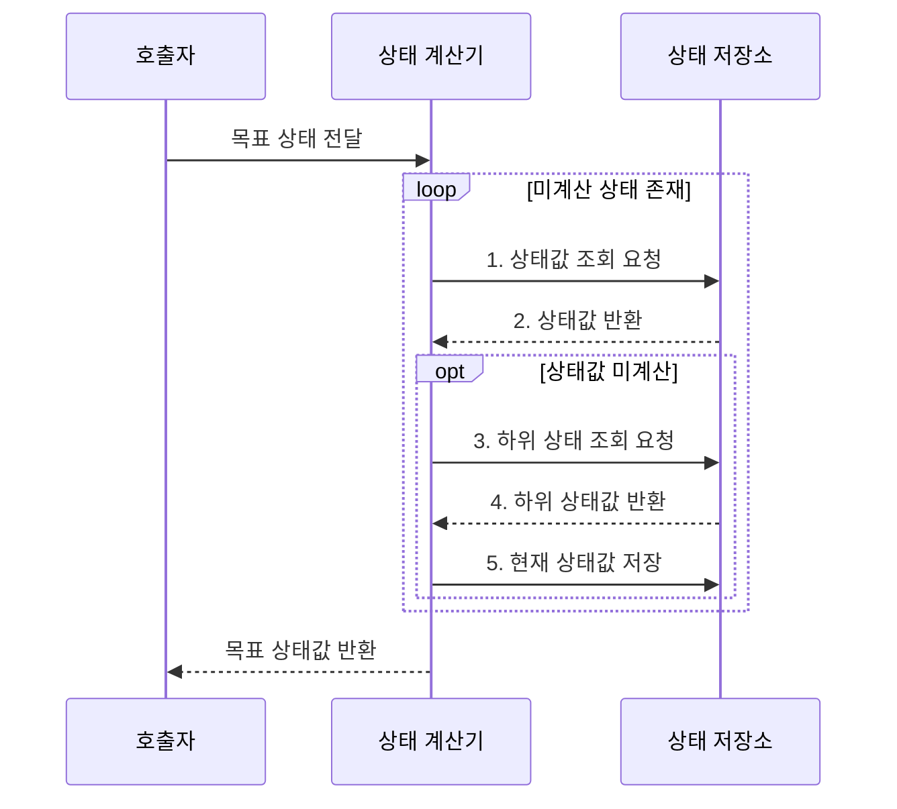

---
sidebar:
  order: 13
  label: "013. 동적 계획법 (Dynamic Programming)"
  badge:
    text: "기출 • 15%"
    variant: note
title: "동적 계획법 (Dynamic Programming)"
date: "2026-08-02T09:31:00+09:00"
tags:
  - "notes-basic-theory"
weight: 13
extra:
  question_no: "013"
  source_status: "기출"
  source_history: "122회"
  priority: 15
  priority_note: "기출 간격이 길고 최적 부분 구조 설명이 핵심"
---

## Ⅰ. 개요

핵심 용어

- **동적 계획법(Dynamic Programming, DP)**: 중복되는 부분 문제의 해를 저장•재사용해 계산량을 줄이는 알고리즘 설계 기법
- **상태값(State Value)**: 부분 문제를 나타내는 각 상태에서 구할 결과

- 정의/개념: **중복 상태값**을 저장•재사용하는 설계 기법
- 배경/필요성: 완전 탐색의 **중복 상태 계산** 제거

### 쉽게 이해하기 (학습용)

- 큰 퍼즐의 같은 조각을 다시 만날 때 답 쪽지를 꺼내듯, 부분 문제의 상태값을 저장해 중복 계산을 없앤다.

## Ⅱ. 특징

핵심 용어

- **중복 부분 문제(Overlapping Subproblems)**: 같은 작은 문제가 여러 계산 경로에서 반복해 나타나는 성질
- **최적 부분 구조(Optimal Substructure)**: 부분 문제의 최적해로 전체 최적해를 구성할 수 있는 성질
- **점화식(Recurrence Relation)**: 하위 상태값을 결합해 현재 상태값을 계산하는 식
- **기저 상태(Base State)**: 점화식 없이 값이 직접 정해지는 시작 상태

- **중복 부분 문제**를 상태로 통합해 상태당 1회 계산
- 최적화 문제는 **최적 부분 구조**로 **점화식** 구성
- 기저 상태부터 의존 관계를 따르는 **계산 순서** 관리

### 쉽게 이해하기 (학습용)

- 같은 퍼즐 조각은 한 번만 풀고, 작은 조각의 최적 답을 조립 규칙인 점화식으로 합쳐 전체 답을 만든다.

## Ⅲ. 구조 및 구성요소

핵심 용어

- **상태(State)**: 부분 문제를 서로 구분하는 최소 변수의 조합
- **메모이제이션(Memoization)**: 필요한 상태를 재귀로 계산해 저장하고 중복 호출 때 재사용하는 방식
- **타뷸레이션(Tabulation)**: 기저 상태부터 의존 순서대로 표를 채워 목표값을 구하는 방식

| 구성요소 | 책임 |
|:---|:---|
| 상태 계산기 | 하위 상태 분해•**점화식** 결합 |
| 상태 저장소 | **메모이제이션•타뷸레이션** 상태값 보관 |

### 쉽게 이해하기 (학습용)

- 상태 계산기가 점화식으로 필요한 하위 상태를 찾고, 이미 계산한 값은 상태 저장소에서 재사용한다.

## Ⅳ. 흐름도

핵심 용어

- **미계산 상태**: 상태 저장소에 아직 결과가 기록되지 않은 부분 문제
- **의존 상태**: 현재 상태값을 점화식으로 구하기 전에 값이 필요한 하위 상태
- **상태 저장소**: 계산한 상태값을 키와 함께 보관해 이후 요청에서 재사용하는 공간

**동작 원리**

1. **상태값 조회 요청**: 목표•하위 상태의 계산 여부 확인
2. **상태값 반환**: 계산된 기존 상태값 재사용
3. **하위 상태 조회 요청**: 점화식의 미계산 의존 상태 지정
4. **하위 상태값 반환**: 점화식 결합에 필요한 값 전달
5. **현재 상태값 저장**: 결합한 확정값을 재사용 대상으로 등록

### 쉽게 이해하기 (학습용)

- 계산기가 답안 서랍에서 상태값을 먼저 찾고, 빈칸이면 더 작은 문제를 풀어 점화식으로 합친 뒤 같은 서랍에 기록한다.

## Ⅴ. 종류 및 비교

핵심 용어

- **하향식(Top-down)**: 목표 상태에서 필요한 하위 상태만 재귀로 계산•저장하는 방식
- **상향식(Bottom-up)**: 기저 상태부터 의존 순서대로 전체 상태값을 계산하는 방식
- **희소 상태 공간(Sparse State Space)**: 정의 가능한 상태 중 목표 계산에서 실제 도달하는 상태가 일부뿐인 공간
- **호출 스택(Call Stack)**: 재귀 함수의 반환 위치와 지역 상태를 저장하는 메모리 영역

| DP 구현 방식 | 하향식 | 상향식 |
|:---|:---|:---|
| 적용 기준 | 도달 가능 상태가 **희소**한 문제 | 의존 순서가 명확하고 **전체 상태** 계산 |
| 핵심 특징 | 목표 의존 상태만 **재귀**•저장 | **의존 순서**대로 전체 표 계산 |
| 한계 | 재귀 깊이에 따른 **호출 스택** 초과 | 미사용 상태까지 채워 **공간 복잡도** 증가 |

> 요약: **상태 공간** 대비 실제 계산량으로 방식 선택

### 쉽게 이해하기 (학습용)

- 필요한 칸이 드문 표는 목표 칸부터 거슬러 채우고, 모든 칸이 필요하면 첫 칸부터 순서대로 채운다.

## Ⅵ. 실무 고려사항 및 대책

핵심 용어

- **상태 정의**: 이후 선택 결과를 구분하는 최소 정보를 하나의 부분 문제로 표현하는 기준
- **순환 의존**: 상태들이 서로의 값을 먼저 요구해 계산 순서를 정할 수 없는 관계
- **롤링 배열(Rolling Array)**: 현재 계산에 필요한 최근 상태 범위만 유지해 공간 사용량을 줄이는 기법
- **명시적 스택**: 재귀 호출 대신 프로그램이 직접 미처리 상태를 넣고 꺼내는 저장 구조

| 고려사항 | 대책 | 효과 |
|:---|:---|:---|
| 불완전한 **상태 정의**로 미래 결정 정보가 소실돼 오답 | 이후 선택을 바꾸는 최소 변수를 상태에 포함 | 부분 문제의 **최적 부분 구조 보존** |
| 순환 의존·기저 상태 누락으로 무한 재귀·미정 참조 | 상태 전이의 감소 방향과 종료 조건 검증 | 의존 순서와 **계산 종료 보장** |
| 큰 **상태 공간**의 전체 표 할당으로 메모리 고갈 | 실제 의존 범위만 롤링 배열로 유지 | 동일 결과에서 **공간복잡도 감소** |
| 깊은 하향식 상태 연쇄로 호출 스택 초과 | 상향식 전환 또는 명시적 스택 적용 | 큰 입력의 **호출 스택 초과 방지** |

### 쉽게 이해하기 (학습용)

- 필요한 상태만 정의해 답안 표의 불필요한 확장을 방지한다.

## Ⅶ. 결론

핵심 용어

- **상태 공간**: 문제에서 정의할 수 있는 모든 상태의 집합
- **실제 계산량**: 목표값을 구하는 과정에서 실제로 값을 계산하는 상태의 수

- 희소 상태는 **하향식**, 전체 상태는 **상향식** 선택

### 쉽게 이해하기 (학습용)

- 표에서 실제 방문할 칸이 적으면 목표부터 거슬러 가고, 거의 모든 칸을 쓴다면 시작 칸부터 차례로 채운다.
