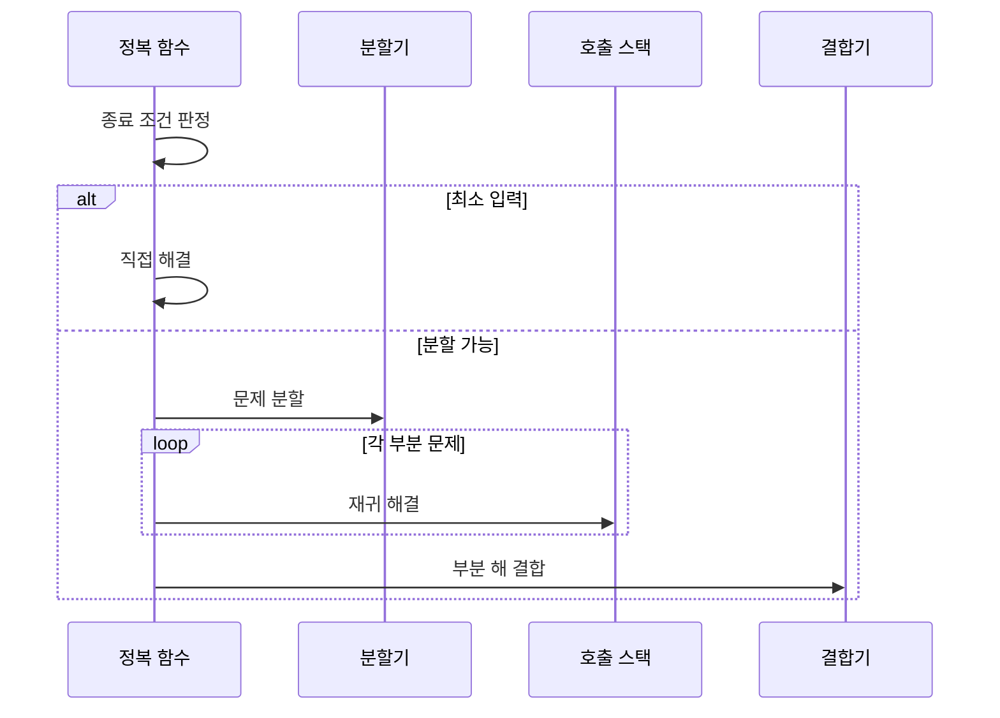

---
sidebar:
  order: 14
  label: "014. 분할 정복 (Divide and Conquer)"
  badge:
    text: "기출 · 15%"
    variant: note
title: "분할 정복 (Divide and Conquer)"
date: "2026-07-25T21:45:00+09:00"
tags:
  - "notes-basic-theory"
weight: 14
extra:
  question_no: "014"
  source_status: "기출"
  source_history: "122회"
  priority: 15
  priority_note: "기출 간격은 길지만 재귀 분할의 기본 패턴"
  reference_status: "작성법 모범 사례"
---

## 미리 알고가기

- **분할 정복(Divide and Conquer)**: 문제를 독립된 부분으로 나눠 재귀 해결·결합하는 설계 기법
- **분할(Divide)**: 큰 문제를 같은 형태의 작은 문제로 나누는 단계
- **정복(Conquer)**: 더 작은 부분 문제에 같은 함수를 다시 호출해 답을 구하는 단계
- **결합(Combine)**: 부분 해를 모아 전체 해를 만드는 단계
- **종료 조건(Base Case)**: 재귀를 멈추고 직접 답을 구하는 최소 입력
- **재귀 호출(Recursive Call)**: 같은 함수를 더 작은 입력으로 호출해 부분 문제를 해결하는 동작
- **정복 함수**: 종료 조건을 먼저 판정하고 분할·재귀·결합을 차례로 지휘하는 재귀 함수이며, 문제가 바뀌어도 이 재귀 구조는 그대로 두고 아래 분할기·결합기만 갈아 끼움
- **분할기·결합기**: 분할 정복에서 문제마다 달라지는 두 부분으로, 분할기는 입력을 작은 부분 문제로 자르고 결합기는 돌아온 부분 해를 전체 해로 합치며, 병합 정렬은 자르기가 단순한 대신 합치기가 무겁고 퀵 정렬은 그 반대임
- **호출 스택(Call Stack)**: 아직 답을 돌려받지 못한 재귀 호출의 복귀 위치와 부분 해를 쌓아 두는 메모리 영역이며, 호출 깊이가 깊어질수록 쌓이는 양이 늘어남
- **상호 비의존성**: 한 부분 문제를 푸는 동안 다른 부분 문제의 중간 계산이나 답을 전혀 요구하지 않는 성질이며, 이 성질이 있어야 조각을 서로 다른 처리 장치에 나눠 맡길 수 있음
- **동적 계획법(Dynamic Programming, DP, 디피)**: 영문 각 단어의 첫 글자를 따 DP로 표기하며 중복 부분 문제의 상태값을 저장·재사용하는 기법
- **최적 부분 구조(Optimal Substructure)**: 작은 문제의 최적해로 큰 문제의 최적해 구성
- **호출 깊이(Call Depth)**: 재귀 함수가 종료 조건에 도달하기 전 연속으로 자신을 호출한 횟수이며 분할 균형에 따라 스택 사용량이 달라지는 기준
- **불균형 분할**: 나뉜 부분 문제의 크기가 크게 치우쳐 한쪽만 계속 커지는 분할이며, 호출 깊이가 깊어져 스택 사용량과 수행 시간이 함께 늘어나는 원인
- **결합 비용(Combine Cost)**: 부분 문제의 해를 전체 해로 합치는 데 추가로 드는 시간과 메모리
- **상태 공간(State Space)**: 동적 계획법에서 서로 구분해 저장해야 하는 모든 상태의 집합이며 상태 수가 늘면 계산량과 메모리가 증가함
- **병렬 처리(Parallel Processing)**: 서로 의존하지 않는 부분 문제를 여러 처리 장치에서 동시에 실행하고 결과를 결합하는 방식
- **외부 병합 정렬(External Merge Sort)**: 메모리보다 큰 파일을 메모리 크기의 구간으로 나눠 정렬한 뒤 저장장치에서 순차 병합하는 방식
- **부분 집계(Partial Aggregation)**: 분할한 데이터마다 합계 같은 중간 결과를 독립 계산한 뒤 최종 결과로 결합하는 처리

## Ⅰ. 개요

- **정의/개념**: 문제를 **독립 부분 문제**로 나눠 **재귀** 해결·결합하는 기법
- **기존 한계**: 분할 없이 처리하면 **연산량** 급증·**병렬화** 불가

### 쉽게 이해하기 (학습용)

- 1000쪽 보고서를 혼자 다 읽으면 며칠이 걸리지만 열 명이 100쪽씩 나눠 읽고 각자 요약을 써 온 뒤 그 요약을 이어 붙이면 하루면 끝나는데, 100쪽씩 자르는 일이 분할이고 각자 읽는 일이 정복이며 요약을 이어 붙이는 일이 결합이고, 100쪽도 길면 다시 10쪽씩 자르는 것이 재귀다

## Ⅱ. 특징

- 같은 형태 부분 문제의 **재귀 호출**로 구현 단일화
- 부분 문제 **상호 비의존성**에 따른 **병렬 처리**
- **호출 깊이**·**결합 비용**이 총 수행 시간 좌우

### 쉽게 이해하기 (학습용)

- 큰 종이를 반으로 계속 접듯 같은 자르기를 되풀이하니 조각마다 같은 해법이 그대로 통해 코드 한 벌로 모든 크기를 처리하고, 조각끼리 서로 답을 참고할 필요가 없어 여러 사람이 동시에 한 조각씩 맡을 수 있지만, 다 푼 뒤 조각을 도로 붙이는 품이 크면 나눠서 아낀 시간이 그 붙이는 데 그대로 되돌아간다

## Ⅲ. 아키텍처 및 구성요소

| 설계 요소 | 설명 |
|:---|:---|
| 정복 함수 | **종료 조건** 판정과 분할·결합 호출을 제어 |
| 분할기 | 입력을 같은 형태 **부분 문제**로 분리 |
| 호출 스택 | **호출 깊이**만큼 복귀 위치·부분 해 보관 |
| 결합기 | 반환된 부분 해를 **전체 해**로 구성 |

> 요약: 재귀 구조는 공통, **분할기**·**결합기**만 문제별 교체

### 쉽게 이해하기 (학습용)

- 주방장이 큰 주문을 받으면 재료를 나누는 보조에게 넘겨 조각 주문을 만들고(분할기) 조각마다 같은 조리를 다시 맡기면서 어디까지 진행했는지 주문표를 차곡차곡 쌓아 두었다가(호출 스택) 다 익은 조각을 한 접시에 담는 담당(결합기)에게 넘기는데, 이 순서를 정하고 언제 멈출지 판단하는 주방장 본인이 정복 함수다

## Ⅳ. 원리 및 절차 흐름도

| 절차 | 설명 |
|:---|:---|
| 종료 조건 판정 | 더 나눌 수 없는 **최소 입력** 여부 판별 |
| 직접 해결 | **종료 조건** 입력의 답 즉시 산출 |
| 문제 분할 | 같은 형태 **부분 문제**로 입력 분리 |
| 재귀 해결 | **호출 스택** 적재 후 정복 함수 재호출 |
| 부분 해 결합 | 반환 부분 해를 **전체 해**로 구성 |

> 요약: 최소 입력은 직접 해결, 나머지는 **분할·재귀·결합**

### 쉽게 이해하기 (학습용)

- 택배 상자를 열었더니 안에 더 작은 상자가 들어 있어 계속 열어 보다가 더는 열리지 않는 마지막 상자에서 물건을 꺼내는 것이 종료 조건과 직접 해결이고, 열어 둔 상자를 되짚어 올라오며 꺼낸 물건들을 큰 상자에 차곡차곡 담아 되돌리는 것이 부분 해 결합이다

## Ⅴ. 종류 및 비교

| 문제 분해 기법 | 분할 정복 | 동적 계획법 |
|:---|:---|:---|
| 적용 기준 | **중복 부분 문제** 부재·독립 분할 가능 | 동일 상태 반복 등장·**최적 부분 구조** |
| 핵심 특징 | 부분 해를 **재귀 결합** | **상태값 표** 저장·재사용 |
| 한계 | **불균형 분할**·과다 **결합 비용** | **상태 공간** 증가에 따른 메모리 초과 |

> 요약: 부분 문제 재등장 여부가 **분할 정복**·**DP** 분기점

### 쉽게 이해하기 (학습용)

- 병합 정렬처럼 왼쪽 반과 오른쪽 반이 서로 남의 답을 전혀 쓰지 않으면 그냥 따로 풀어 합치면 되지만, 피보나치처럼 같은 작은 문제가 수없이 다시 튀어나오면 그때마다 새로 푸는 대신 한 번 푼 답을 공책에 적어 두고 꺼내 쓰는 동적 계획법이 이득이다

## Ⅵ. 실무 사례

1. 메모리 초과 파일은 **외부 병합 정렬**로 구간 정렬·순차 병합
2. 대규모 집계는 구간별 **부분 집계** 후 **병렬 결합**

### 쉽게 이해하기 (학습용)

- 메모리에 다 안 들어가는 로그 파일은 메모리에 들어갈 만큼씩 잘라 조각마다 따로 정렬해 디스크에 써 두었다가, 정렬된 조각들의 맨 앞 줄만 서로 비교해 작은 것부터 한 줄씩 뽑아 이어 붙이면 전체가 정렬된다
- 하루치 매출을 한 대가 다 더하면 오래 걸리므로 시간대별로 데이터를 갈라 서버마다 자기 몫의 합만 구하게 하고, 마지막에 그 부분 합들만 한 번 더 더해 전체 합을 만든다

## Ⅶ. 결론

- **분할·결합 비용**이 병렬 이득을 넘으면 **순차 처리** 전환

### 쉽게 이해하기 (학습용)

- 조각을 나누고 도로 붙이는 데 드는 품이 여러 명이 동시에 풀어 아낀 시간보다 커지면 나누는 수고가 오히려 손해이므로, 그냥 한 사람이 처음부터 끝까지 순서대로 푸는 편이 빠르다
