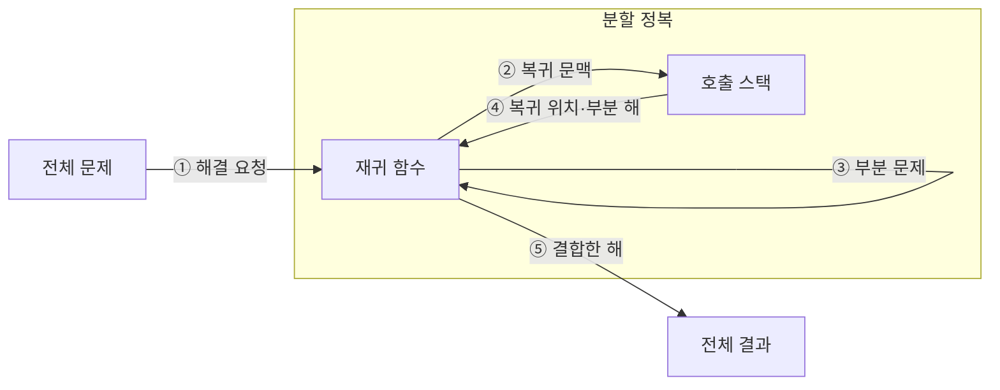

---
sidebar:
  order: 14
  label: "014. 분할 정복 (Divide and Conquer)"
  badge:
    text: "기출 · 15%"
    variant: note
title: "분할 정복 (Divide and Conquer)"
date: "2026-07-28T11:52:14+09:00"
tags:
  - "notes-basic-theory"
weight: 14
extra:
  question_no: "014"
  source_status: "기출"
  source_history: "122회"
  priority: 15
  priority_note: "기출 간격은 길지만 재귀 분할의 기본 패턴"
---

## 미리 알고가기

- **분할 정복(Divide and Conquer)**: 문제를 독립된 부분으로 나눠 재귀 해결·결합하는 설계 기법
- **분할(Divide)**: 큰 문제를 같은 형태의 작은 문제로 나누는 단계
- **정복(Conquer)**: 더 작은 부분 문제에 같은 함수를 다시 호출해 답을 구하는 단계
- **결합(Combine)**: 부분 해를 모아 전체 해를 만드는 단계
- **종료 조건(Base Case)**: 재귀를 멈추고 직접 답을 구하는 최소 입력
- **재귀 호출(Recursive Call)**: 같은 함수를 더 작은 입력으로 호출해 부분 문제를 해결하는 동작
- **재귀 함수(Recursive Function)**: 종료 조건을 판정하고 더 작은 부분 문제에 자신을 다시 호출한 뒤 반환된 부분 해를 결합하는 함수
- **호출 스택(Call Stack)**: 아직 답을 돌려받지 못한 재귀 호출의 복귀 위치와 부분 해를 쌓아 두는 메모리 영역이며, 호출 깊이가 깊어질수록 쌓이는 양이 늘어남
- **상호 비의존성**: 한 부분 문제를 푸는 동안 다른 부분 문제의 중간 계산이나 답을 전혀 요구하지 않는 성질이며, 이 성질이 있어야 조각을 서로 다른 처리 장치에 나눠 맡길 수 있음
- **동적 계획법(Dynamic Programming, DP)**: 중복되는 부분 문제의 해를 저장·재사용하여 계산량을 줄이는 알고리즘 설계 기법
- **점화식(Recurrence Relation)**: 하위 상태값을 결합해 현재 상태값을 계산하는 관계식
- **호출 깊이(Call Depth)**: 재귀 함수가 종료 조건에 도달하기 전 연속으로 자신을 호출한 횟수이며 분할 균형에 따라 스택 사용량이 달라지는 기준
- **불균형 분할**: 나뉜 부분 문제의 크기가 크게 치우쳐 한쪽만 계속 커지는 분할이며, 호출 깊이가 깊어져 스택 사용량과 수행 시간이 함께 늘어나는 원인
- **결합 비용(Combine Cost)**: 부분 문제의 해를 전체 해로 합치는 데 추가로 드는 시간과 메모리
- **상태 공간(State Space)**: 동적 계획법에서 서로 구분해 저장해야 하는 모든 상태의 집합이며 상태 수가 늘면 계산량과 메모리가 증가함
- **병렬 처리(Parallel Processing)**: 서로 의존하지 않는 부분 문제를 여러 처리 장치에서 동시에 실행하고 결과를 결합하는 방식
- **외부 병합 정렬(External Merge Sort)**: 메모리보다 큰 파일을 메모리 크기의 구간으로 나눠 정렬한 뒤 저장장치에서 순차 병합하는 방식
- **부분 집계(Partial Aggregation)**: 분할한 데이터마다 합계 같은 중간 결과를 독립 계산한 뒤 최종 결과로 결합하는 처리

## Ⅰ. 개요

- 정의/개념: 문제를 **독립 부분 문제**로 나눠 **재귀** 해결·결합하는 기법
- 기존 한계: 전체 문제 일괄 처리의 **자원 한도**·**병렬화** 제약

### 쉽게 이해하기 (학습용)

- 큰 보고서를 독립된 묶음으로 나눠 각각 처리하고 결과를 합치는 방식이다.

## Ⅱ. 특징

- 같은 형태 부분 문제에 동일 **재귀 해법** 반복 적용
- 부분 문제 **상호 비의존성**에 따른 **병렬 처리**
- **호출 깊이**·**결합 비용**이 총 수행 시간 좌우

### 쉽게 이해하기 (학습용)

- 독립 부분 문제는 동시에 풀 수 있지만 분할·결합 비용이 크면 병렬 이득이 줄어든다.

## Ⅲ. 구성 및 동작 흐름

| 구성요소 | 역할 | 흐름 |
|:---|:---|:---|
| 재귀 함수 | **종료 조건** 판정·분할·재호출·결합 수행 | ①, ③, ⑤ |
| 호출 스택 | **호출 깊이**만큼 복귀 위치·부분 해 보관 | ②, ④ |

> 요약: **재귀 함수**가 작은 입력으로 자신을 반복 호출

### 쉽게 이해하기 (학습용)

- 재귀 함수는 문제를 줄여 호출하고 스택의 복귀 문맥을 따라 부분 해를 결합한다.

## Ⅳ. 운영 고려사항

| 고려사항 | 대응 방안 | 기대 효과 |
|:---|:---|:---|
| 불균형 분할로 호출 깊이 증가 | 피벗·분할 기준 개선과 깊이 제한 적용 | 최악 시간·스택 사용 완화 |
| 작은 문제까지 재귀해 호출 비용 증가 | 임계 크기 이하에서 반복 알고리즘 전환 | 함수 호출 오버헤드 감소 |
| 결합 단계의 메모리·복사 비용 | 버퍼 재사용과 제자리 결합 가능성 검토 | 추가 공간·복사량 절감 |
| 병렬 작업 크기 편차 | 작업 단위 세분화와 동적 스케줄링 | 처리 장치 활용률 향상 |

### 쉽게 이해하기 (학습용)

- 분할 균형과 재귀 임계값, 결합 비용을 함께 조정해야 한다.

## Ⅴ. 종류 및 비교

| 문제 분해 기법 | 분할 정복 | 동적 계획법 |
|:---|:---|:---|
| 적용 기준 | **중복 부분 문제** 부재·독립 분할 가능 | 동일 상태 반복·**점화식** 정의 가능 |
| 핵심 특징 | 부분 해를 **재귀 결합** | **상태값 표** 저장·재사용 |
| 한계 | **불균형 분할**·과다 **결합 비용** | **상태 공간** 증가에 따른 메모리 초과 |

> 요약: 부분 문제의 재등장 여부를 기준으로 **분할 정복**과 **DP** 선택

### 쉽게 이해하기 (학습용)

- 부분 문제가 독립이면 분할 정복, 같은 상태가 반복되면 동적 계획법이 적합하다.

## Ⅵ. 실무 사례

1. 메모리 초과 파일은 **외부 병합 정렬**로 구간 정렬·순차 병합

### 쉽게 이해하기 (학습용)

- 파일을 메모리 크기로 나눠 정렬하고 순차 병합해 전체 순서를 만든다.

## Ⅶ. 결론

- 병렬 효율을 위해 분할·결합 비용을 검토하여 **분할정복** 활용

### 쉽게 이해하기 (학습용)

- 분할·결합 비용이 병렬 이득보다 작을 때 효과적이다.
