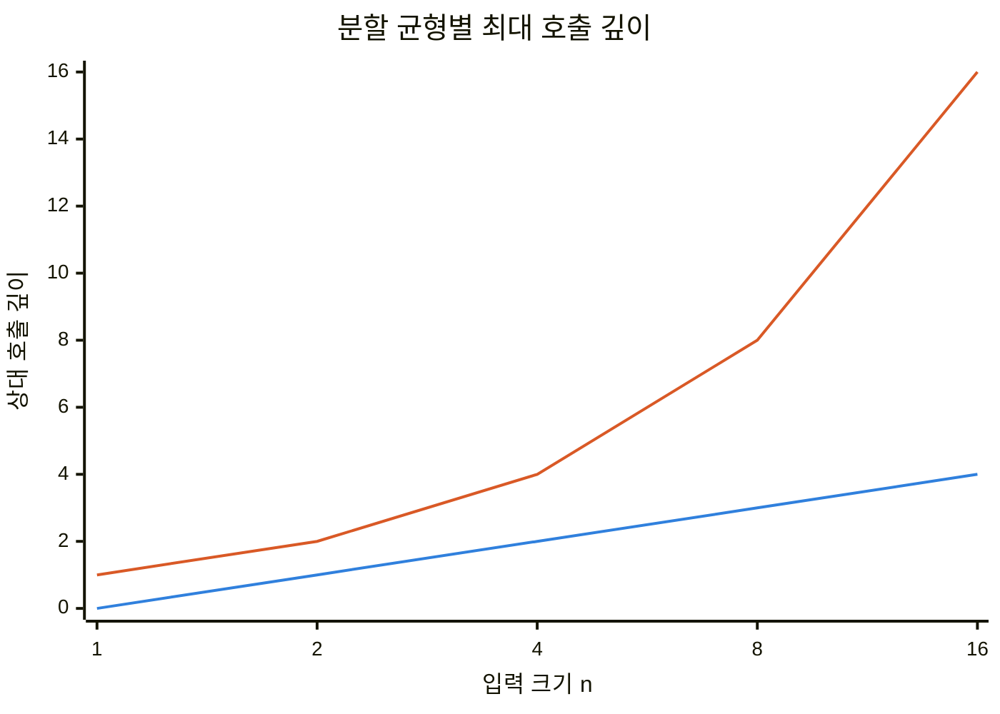
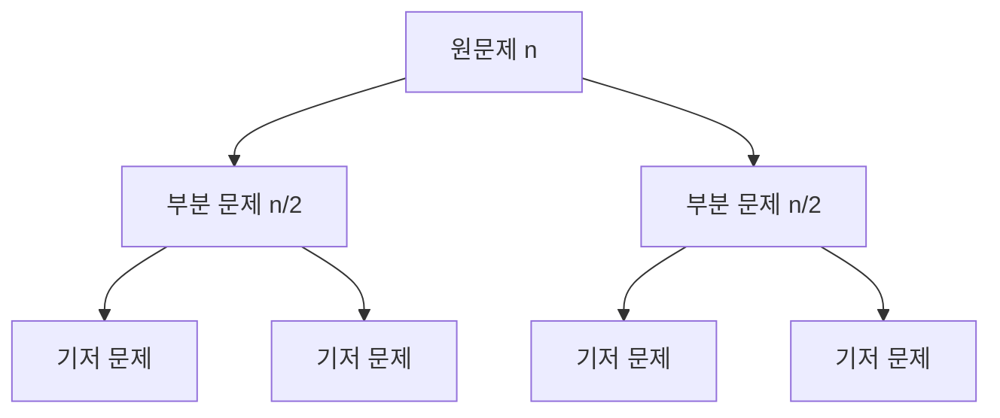
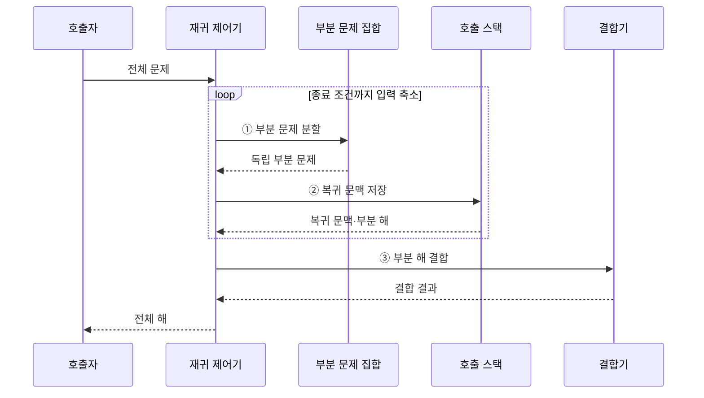

---
sidebar:
  order: 14
  label: "014. 분할 정복 (Divide and Conquer)"
  badge:
    text: "기출 · 15%"
    variant: note
title: "분할 정복 (Divide and Conquer)"
date: "2026-07-28T21:30:30+09:00"
tags:
  - "notes-basic-theory"
weight: 14
extra:
  question_no: "014"
  source_status: "기출"
  source_history: "122회"
  priority: 15
  priority_note: "기출 간격은 길지만 재귀 분할의 기본 패턴"
---

## 미리 알고가기

- **분할 정복(Divide and Conquer)**: 문제를 독립된 부분으로 나눠 재귀 해결·결합하는 설계 기법
- **분할(Divide)**: 큰 문제를 같은 형태의 작은 문제로 나누는 단계
- **정복(Conquer)**: 더 작은 부분 문제에 같은 함수를 다시 호출해 답을 구하는 단계
- **결합(Combine)**: 부분 해를 모아 전체 해를 만드는 단계
- **종료 조건(Base Case)**: 재귀를 멈추고 직접 답을 구하는 최소 입력
- **재귀 호출(Recursive Call)**: 같은 함수를 더 작은 입력으로 호출해 부분 문제를 해결하는 동작
- **재귀 함수(Recursive Function)**: 종료 조건을 판정하고 더 작은 부분 문제에 자신을 다시 호출한 뒤 반환된 부분 해를 결합하는 함수
- **호출 스택(Call Stack)**: 아직 답을 돌려받지 못한 재귀 호출의 복귀 위치와 부분 해를 쌓아 두는 메모리 영역이며, 호출 깊이가 깊어질수록 쌓이는 양이 늘어남
- **상호 비의존성**: 한 부분 문제를 푸는 동안 다른 부분 문제의 중간 계산이나 답을 전혀 요구하지 않는 성질이며, 이 성질이 있어야 조각을 서로 다른 처리 장치에 나눠 맡길 수 있음
- **동적 계획법(Dynamic Programming, DP)**: 중복되는 부분 문제의 해를 저장·재사용하여 계산량을 줄이는 알고리즘 설계 기법
- **점화식(Recurrence Relation)**: 하위 상태값을 결합해 현재 상태값을 계산하는 관계식
- **호출 깊이(Call Depth)**: 재귀 함수가 종료 조건에 도달하기 전 연속으로 자신을 호출한 횟수이며 분할 균형에 따라 스택 사용량이 달라지는 기준
- **불균형 분할**: 나뉜 부분 문제의 크기가 크게 치우쳐 한쪽만 계속 커지는 분할이며, 호출 깊이가 깊어져 스택 사용량과 수행 시간이 함께 늘어나는 원인
- **결합 비용(Combine Cost)**: 부분 문제의 해를 전체 해로 합치는 데 추가로 드는 시간과 메모리
- **상태 공간(State Space)**: 동적 계획법에서 서로 구분해 저장해야 하는 모든 상태의 집합이며 상태 수가 늘면 계산량과 메모리가 증가함
- **병렬 처리(Parallel Processing)**: 서로 의존하지 않는 부분 문제를 여러 처리 장치에서 동시에 실행하고 결과를 결합하는 방식
- **임계 크기(Threshold Size)**: 재귀 호출보다 반복 처리가 유리해지는 부분 문제의 크기
- **제자리 결합(In-place Merge)**: 별도 배열을 크게 늘리지 않고 기존 저장 공간에서 부분 해를 합치는 방식
- **동적 스케줄링(Dynamic Scheduling)**: 실행 중 남은 작업량에 따라 부분 문제를 처리 장치에 다시 배정하는 방식

## Ⅰ. 개요

- 정의/개념: 문제를 **독립 부분 문제**로 나눠 **재귀** 해결·결합하는 기법
- 기존 한계: 전체 문제 일괄 처리의 **자원 한도**·**병렬화** 제약

### 쉽게 이해하기 (학습용)

- 큰 보고서를 독립된 묶음으로 나눠 여러 사람이 처리한 뒤 한 권으로 합치듯, 큰 문제를 나누고 부분 해를 결합한다.

## Ⅱ. 특징

- 같은 형태 부분 문제에 동일 **재귀 해법** 반복 적용
- 부분 문제 **상호 비의존성**에 따른 **병렬 처리**
- **호출 깊이**·**결합 비용**이 총 수행 시간 좌우

■ **균형 분할** &nbsp;&nbsp; ■ **불균형 분할**

> 불균형 분할은 호출 깊이와 스택 사용량 증가

### 쉽게 이해하기 (학습용)

- 여러 사람이 독립된 문서 묶음을 동시에 끝내도 묶음을 나누고 합치는 시간이 길면 전체 마감은 빨라지지 않는다.

## Ⅲ. 아키텍처

**도표안 A — 구조도**

**도표안 B — sequenceDiagram**

| 구성요소 | 책임 |
|:---|:---|
| 재귀 제어기 | **종료 조건** 판정·재귀 흐름 통제 |
| 부분 문제 집합 | 상호 비의존 **부분 문제** 보관 |
| 호출 스택 | **복귀 위치·부분 해** 보관 |
| 결합기 | 부분 해로 **전체 해** 구성 |

**동작 원리**

- **① 부분 문제 분할**: 입력을 독립된 작은 문제로 분해
- **② 복귀 문맥 저장**: 호출 위치와 결합 정보 보관
- **③ 부분 해 결합**: 종료 조건에서 반환된 해를 전체로 구성

### 쉽게 이해하기 (학습용)

- 큰 상자를 작은 상자로 계속 나누고 스택에 붙인 귀환표를 따라 돌아오며, 각 상자의 답을 합쳐 전체 답을 만든다.

## Ⅳ. 종류 및 비교

| 문제 분해 기법 | 분할 정복 | 동적 계획법 |
|:---|:---|:---|
| 적용 기준 | **중복 부분 문제** 부재·독립 분할 가능 | 동일 상태 반복·**점화식** 정의 가능 |
| 핵심 특징 | 부분 해를 **재귀 결합** | **상태값 표** 저장·재사용 |
| 한계 | **불균형 분할**·과다 **결합 비용** | **상태 공간** 증가에 따른 메모리 초과 |

> 요약: 부분 문제의 재등장 여부를 기준으로 **분할 정복**과 **DP** 선택

### 쉽게 이해하기 (학습용)

- 서로 다른 퍼즐 조각이면 따로 풀어 합치고, 같은 조각이 반복되면 답을 표에 적어 재사용한다.

## Ⅴ. 실무 고려사항 및 대책

| 고려사항 | 대책 | 효과 |
|:---|:---|:---|
| **불균형 분할**로 호출 깊이 증가 | 균형 분할·**깊이 제한** | 최악 시간·**스택 사용량** 완화 |
| 작은 문제의 **재귀 비용** 증가 | **임계 크기**부터 반복 처리 | **함수 호출 비용** 감소 |
| 결합의 **메모리·복사 비용** | 보조 배열 재사용·**제자리 결합** | 추가 공간·**복사량** 절감 |
| 병렬 작업의 **크기 편차** | 작업 세분화·**동적 스케줄링** | 처리 장치 **활용률** 향상 |

### 쉽게 이해하기 (학습용)

- 큰 짐을 비슷한 무게로 나누고 작은 짐은 바로 처리하며 빈 작업자에게 남은 짐을 옮기면 대기 시간을 줄일 수 있다.

## Ⅵ. 결론

- **분할·결합 비용**이 병렬 이득보다 크면 **순차 처리** 전환

### 쉽게 이해하기 (학습용)

- 짐을 나누고 다시 모으는 시간이 여러 사람이 동시에 처리해 아낀 시간보다 짧을 때만 분할 정복을 선택한다.
