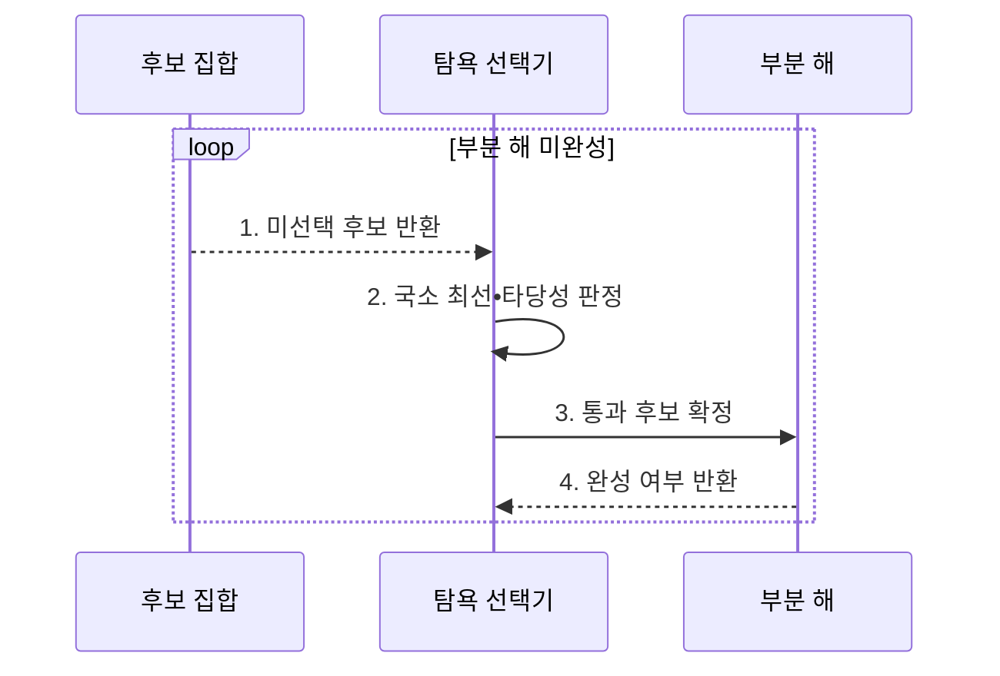

---
sidebar:
  order: 15
  label: "015. 탐욕 알고리즘 (Greedy Algorithm)"
  badge:
    text: "기출 • 30%"
    variant: note
title: "탐욕 알고리즘 (Greedy Algorithm)"
date: "2026-08-03T08:48:47+09:00"
tags:
  - "notes-basic-theory"
weight: 15
extra:
  question_no: "015"
  source_status: "기출"
  source_history: "122회"
  priority: 30
  priority_note: "탐욕 선택 조건과 반례 제시형에 적합"
---

## Ⅰ. 개요

핵심 용어

- **탐욕 알고리즘(Greedy Algorithm)**: 매 단계의 국소 최선을 되돌리지 않고 확정해 해를 구성하는 기법
- **국소 최적 선택(Local Optimal Choice)**: 현재 단계에서 가장 유리한 후보를 선택하는 결정

- 정의/개념: **국소 최적 선택** 을 되돌리지 않고 누적하는 설계 기법
- 배경/필요성: 후보 증가에 따른 **완전 탐색 계산량** 절감

#### 한줄 요약

- 갈림길마다 가장 가까운 길을 골라 되돌아가지 않듯, 국소 최선 선택을 누적해 전체 해를 만든다.

## Ⅱ. 특징

핵심 용어

- **탐욕 선택 속성(Greedy Choice Property)**: 국소 최선 선택을 포함하는 전역 최적해가 존재하는 성질
- **최적 부분 구조(Optimal Substructure)**: 부분 문제의 최적해로 전체 최적해를 구성할 수 있는 성질
- **전역 최적해(Global Optimum)**: 가능한 모든 완성 해 가운데 목적 함수 값이 가장 좋은 해
- **국소 최적 선택(Local Optimal Choice)**: 현재 단계에서 목적 함수 값이 가장 유리한 후보를 고르는 결정
- **상태 관리 비용**: 선택 과정의 중간 상태와 이력을 저장하고 갱신하는 데 드는 자원

- **국소 최적 선택** 확정 후 되돌림 없는 해 구성
- **탐욕 선택 속성**•**최적 부분 구조** 충족 시 전역 최적해 보장
- 선택•타당성 검사만 반복하는 **낮은 상태 관리 비용**

#### 한줄 요약

- 장바구니에 물건을 하나씩 확정해 다시 빼지 않으므로, 매 선택을 바꿔도 손해가 없다는 탐욕 선택 속성이 있어야 전체 최선이 된다.

## Ⅲ. 구조 및 구성요소

핵심 용어

- **후보 집합(Candidate Set)**: 아직 선택하거나 폐기할 수 있는 모든 대상을 보관하는 집합
- **목적 함수(Objective Function)**: 후보 선택의 비용이나 이익을 수치화해 우열을 정하는 함수
- **타당성 함수(Feasibility Function)**: 후보를 추가해도 제약 조건을 지키는지 검사하는 함수
- **부분 해(Partial Solution)**: 선택한 후보를 누적했지만 아직 완성 조건에는 도달하지 않은 중간 결과
- **선택 함수(Selection Function)**: 목적 함수 기준으로 현재 가장 유리한 후보를 고르는 함수
- **해 판정 함수(Solution Function)**: 부분 해가 문제의 완성 조건을 충족했는지 확인하는 함수

| 구성요소 | 책임 |
|:---|:---|
| 후보 집합 | 미선택 **후보** 보관 |
| 선택 함수 | **목적 함수** 기준 국소 최선 결정 |
| 타당성 함수 | 후보의 **제약 조건** 검사 |
| 부분 해 | 통과 후보 누적•**선택 이력** 보관 |
| 해 판정 함수 | 부분 해의 **완성 조건** 판정 |

#### 한줄 요약

- 선택 함수가 후보 중 현재 최선을 선택하고, 타당성 검사를 통과한 후보만 부분 해에 확정한다.

## Ⅳ. 흐름도

핵심 용어

- **선택 함수(Selection Function)**: 남은 후보 중 목적 함수 기준으로 가장 유리한 대상을 고르는 함수
- **해 판정 함수(Solution Function)**: 현재 부분 해가 문제의 완성 조건을 충족했는지 판정하는 함수
- **되돌림 없는 선택**: 부분 해에 확정한 후보를 이후 단계에서 취소하지 않는 처리 방식
- **목적 함수(Objective Function)**: 후보 선택의 비용이나 이익을 수치화하는 함수
- **타당성 판정**: 후보를 더한 부분 해가 제약 조건을 지키는지 확인하는 절차
- **부분 해(Partial Solution)**: 선택한 후보를 누적했지만 아직 완성되지 않은 중간 결과

**동작 원리**

- **1. 미선택 후보 반환**: 선택 가능 대상 확보
- **2. 국소 최선•타당성 판정**: 목적 함수로 하나를 고르고 제약 충족 여부 확인
- **3. 통과 후보 확정**: 타당한 선택을 되돌리지 않고 부분 해에 누적
- **4. 완성 여부 반환**: 미완성이면 다음 선택 반복

#### 한줄 요약

- 진열대에서 가장 값싼 물건을 골라 조건을 통과하면 장바구니에 확정하고, 완성될 때까지 이미 담은 물건은 다시 꺼내지 않는다.

## Ⅴ. 종류 및 비교

핵심 용어

- **동적 계획법(Dynamic Programming, DP)**: 중복되는 부분 문제의 해를 저장•재사용하는 설계 기법
- **메모이제이션(Memoization)**: 계산한 상태값을 저장해 같은 상태에서 다시 사용하는 방식
- **완전 탐색(Exhaustive Search)**: 가능한 해를 모두 생성하고 검사하는 기법
- **반례(Counterexample)**: 국소 최선이 전역 최적해를 만들지 못함을 보여 주는 구체적인 입력
- **탐욕 선택 속성(Greedy Choice Property)**: 국소 최선 선택을 포함하는 전역 최적해가 존재하는 성질
- **점화식(Recurrence Relation)**: 하위 상태값을 결합해 현재 상태값을 계산하는 관계식
- **상태 공간(State Space)**: 동적 계획법이 구분해 저장하는 모든 상태의 집합

| 최적화 기법 | 탐욕 알고리즘 | 동적 계획법 | 완전 탐색 |
|:---|:---|:---|:---|
| 적용 기준 | **탐욕 선택 속성**•최적 부분 구조 성립 | 중복 상태•**점화식** 정의 가능 | 모든 후보의 **계산 시간** 감당 가능 |
| 핵심 특징 | 현재 최선을 **즉시 확정** | **메모이제이션**•표 기반 해 재사용 | 모든 해 **생성•비교** |
| 한계 | **반례** 존재 시 최적해 미보장 | **상태 공간** 증가에 따른 메모리 초과 | 후보 증가에 따른 **계산량 폭증** |

> 요약: **탐욕 속성**•중복 상태•후보 규모로 최적화 기법 선택

#### 한줄 요약

- 지름길 선택이 항상 최선임을 증명하면 탐욕, 같은 길을 반복하면 DP, 길이 몇 개뿐이면 전부 확인한다.

## Ⅵ. 실무 고려사항 및 대책

핵심 용어

- **교환 논증(Exchange Argument)**: 어떤 최적해의 선택을 탐욕 선택으로 바꿔도 손해가 없음을 보여 최적성을 증명하는 방법
- **동률 해소 규칙(Tie-breaking Rule)**: 목적값이 같은 후보 중 하나를 항상 동일한 기준으로 선택하는 규칙
- **경계값 시험**: 탐욕 선택이 실패할 가능성이 큰 입력 범위의 끝값과 특수값을 검사하는 시험
- **최소 반례**: 탐욕 선택이 실패함을 보이는 입력 가운데 더 작게 줄일 수 없는 사례
- **타당성 함수(Feasibility Function)**: 후보 추가 뒤에도 모든 제약 조건이 성립하는지 판정하는 함수

| 문제 | 대책 | 효과 |
|:---|:---|:---|
| **탐욕 선택 속성** 미성립으로 국소 최선이 전역 오답 생성 | **교환 논증** 과 최소 반례로 최적성 검증 | 문제에 대한 **전역 최적성 근거** 확보 |
| 숨은 제약 누락으로 실행 불가능한 부분 해 생성 | 모든 제약을 **타당성 함수** 에 반영 | 매 선택 후 **해의 실행 가능성** 유지 |
| 동률 후보 처리 불명확으로 실행별 결과 변동 | 결정적 **동률 해소 규칙** 적용 | 동일 입력의 **결과 재현성** 확보 |
| 입력 범위 확대 시 검증하지 않은 경계에서 반례 발생 | 경계값 시험과 소규모 DP•완전 탐색 대조 | 적용 범위의 **최적성 검증 신뢰도** 향상 |

#### 한줄 요약

- 경계값 반례로 국소 선택이 전체 최적해를 보장하는지 검증한다.

## Ⅶ. 결론

핵심 용어

- **최적성 증명**: 탐욕 선택을 반복해도 전역 최적해가 보장됨을 논리적으로 보이는 과정
- **DP•완전 탐색**: 반례가 있을 때 상태 해를 재사용하거나 모든 후보를 검사해 최적해를 찾는 대안
- **탐욕 알고리즘(Greedy Algorithm)**: 매 단계의 국소 최선을 되돌리지 않고 확정해 해를 구성하는 기법

- 최적성 증명 시 **탐욕**, 반례 존재 시 **DP•완전 탐색** 선택

#### 한줄 요약

- 매 갈림길의 최선이 전체 최선으로 이어짐을 증명하면 탐욕을 쓰고, 반례가 나오면 모든 경로를 비교하는 방식으로 바꾼다.
