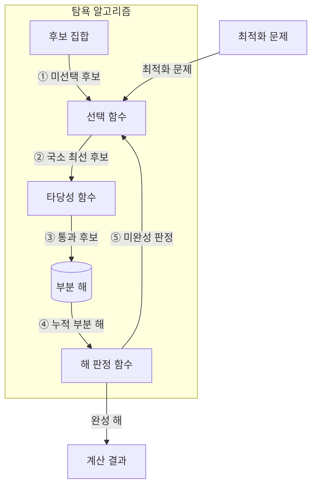
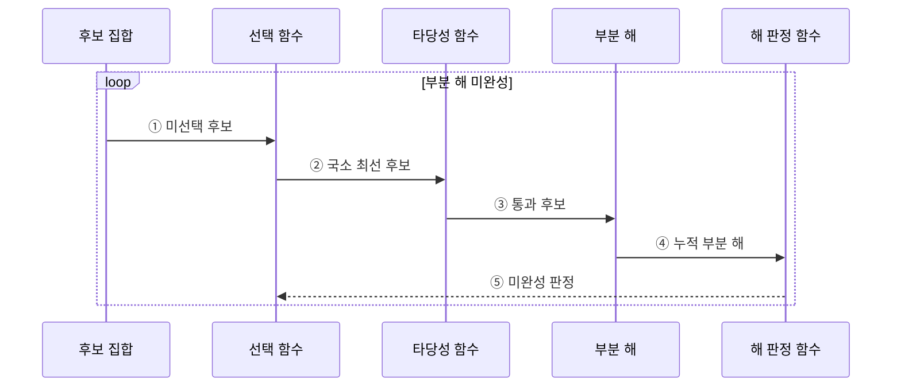

---
sidebar:
  order: 15
  label: "015. 탐욕 알고리즘 (Greedy Algorithm)"
  badge:
    text: "기출 · 30%"
    variant: note
title: "탐욕 알고리즘 (Greedy Algorithm)"
date: "2026-07-28T19:22:00+09:00"
tags:
  - "notes-basic-theory"
weight: 15
extra:
  question_no: "015"
  source_status: "기출"
  source_history: "122회"
  priority: 30
  priority_note: "탐욕 선택 조건과 반례 제시형에 적합"
---

## 미리 알고가기

- **탐욕 알고리즘(Greedy Algorithm)**: 매 단계의 국소 최선을 되돌리지 않고 확정해 해를 구성하는 기법
- **국소 최적 선택(Local Optimal Choice)**: 현재 단계에서 가장 유리한 후보를 선택
- **전역 최적해(Global Optimum)**: 모든 선택을 마친 전체 해 중 최선
- **탐욕 선택 속성(Greedy Choice Property)**: 국소 최선 선택을 포함한 전역 최적해가 존재
- **최적 부분 구조(Optimal Substructure)**: 부분 문제 최적해로 전체 최적해를 구성
- **교환 논증(Exchange Argument)**: 최적해의 선택을 탐욕 선택으로 바꿔도 손해가 없어 최적성을 보이는 증명
- **선택 함수(Selection Function)**: 남은 후보 중 가장 유리한 대상을 선택
- **타당성 함수(Feasibility Function)**: 후보가 제약을 지키는지 검사
- **동적 계획법(Dynamic Programming, DP)**: 중복되는 부분 문제의 해를 저장·재사용하여 계산량을 줄이는 알고리즘 설계 기법
- **메모이제이션(Memoization)**: 한 번 계산한 상태값을 적어 두었다가 같은 상태가 다시 나오면 계산 없이 꺼내 쓰는 동적 계획법의 저장 방식
- **완전 탐색(Exhaustive Search)**: 가능한 해를 모두 생성·검사하는 기법
- **후보 집합(Candidate Set)**: 각 단계에서 아직 선택하거나 폐기할 수 있는 모든 대상을 보관하는 집합
- **목적 함수(Objective Function)**: 완성된 해나 후보 선택의 비용·이익을 수치화하여 최적 여부를 비교하는 함수
- **해 판정 함수(Solution Function)**: 현재까지 선택한 부분 해가 문제의 완성 조건을 충족했는지 판정하는 함수
- **부분 해(Partial Solution)**: 일부 후보만 선택해 아직 완성되지 않았으며 탐욕 선택을 누적하는 중간 결과
- **반례(Counterexample)**: 국소 최선 선택이 전역 최적해를 만들지 못함을 보여 탐욕 알고리즘 적용을 배제하는 구체적 입력
- **상태 공간(State Space)**: 동적 계획법이나 완전 탐색이 구분해 계산해야 하는 가능한 상태의 집합
- **점화식(Recurrence Relation)**: 하위 상태값을 결합해 현재 상태값을 계산하며 동적 계획법의 상태 전이를 정의하는 식
- **동률 해소 규칙(Tie-breaking Rule)**: 목적값이 같은 후보 중 하나를 항상 같은 기준으로 선택하는 규칙

## Ⅰ. 개요

- 정의/개념: 단계별 **국소 최적 선택**을 확정해 전체 해를 구성하는 기법
- 기존 한계: 후보 증가로 **완전 탐색 계산량** 급증

### 쉽게 이해하기 (학습용)

- 갈림길마다 가장 가까운 길을 골라 되돌아가지 않듯, 국소 최선 선택을 누적해 전체 해를 만든다.

## Ⅱ. 특징

- **국소 최적 선택** 확정 후 되돌림 없는 해 구성
- **탐욕 선택 속성**·**최적 부분 구조** 충족 시 전역 최적해 보장

### 쉽게 이해하기 (학습용)

- 장바구니에 물건을 하나씩 확정해 다시 빼지 않으므로, 매 선택을 바꿔도 손해가 없다는 탐욕 선택 속성이 있어야 전체 최선이 된다.

## Ⅲ. 아키텍처

**도표안 A — 동작 흐름도**

**도표안 B — sequenceDiagram**

| 구성요소 | 책임 |
|:---|:---|
| 선택 함수 | **목적 함수** 기준 국소 최선 결정 |
| 후보 집합 | 미선택 **후보** 보관 |
| 타당성 함수 | 후보의 **제약 조건** 검사 |
| 부분 해 | 통과 후보 누적·**선택 이력** 보관 |
| 해 판정 함수 | 부분 해의 **완성 조건** 판정 |

**동작 원리**

- **① 미선택 후보**: 후보 집합에서 선택 가능 대상 제공
- **② 국소 최선 후보**: **목적 함수** 기준 최선 하나 확정
- **③ 통과 후보**: 제약 충족분만 **부분 해** 누적
- **④ 누적 부분 해**: 완성 여부를 해 판정 함수에 전달
- **⑤ 미완성 판정**: **되돌림 없이** 다음 선택 반복

### 쉽게 이해하기 (학습용)

- 진열대에서 가장 값싼 물건을 골라 조건을 통과하면 장바구니에 확정하고, 완성될 때까지 이미 담은 물건은 다시 꺼내지 않는다.

## Ⅳ. 종류 및 비교

| 최적화 기법 | 탐욕 알고리즘 | 동적 계획법 | 완전 탐색 |
|:---|:---|:---|:---|
| 적용 기준 | **탐욕 선택 속성**·최적 부분 구조 성립 | 중복 상태·**점화식** 정의 가능 | **후보 집합** 크기가 자원 한도 이내 |
| 핵심 특징 | 현재 최선을 **즉시 확정** | **메모이제이션**·표 기반 해 재사용 | 모든 해 **생성·비교** |
| 한계 | **반례** 존재 시 최적해 미보장 | **상태 공간** 증가에 따른 메모리 초과 | 후보 증가에 따른 **계산량 폭증** |

> 요약: **탐욕 속성**·중복 상태·후보 규모로 최적화 기법 선택

### 쉽게 이해하기 (학습용)

- 지름길 선택이 항상 최선임을 증명하면 탐욕, 같은 길을 반복하면 DP, 길이 몇 개뿐이면 전부 확인한다.

## Ⅴ. 실무 고려사항 및 대책

| 고려사항 | 대책 | 효과 |
|:---|:---|:---|
| **탐욕 선택 속성** 미증명 | **교환 논증**·반례 검증 | **전역 최적성** 여부 확정 |
| 숨은 제약의 **후보 무효화** | 모든 제약을 **타당성 함수**에 반영 | 실행 불가능 **부분 해** 방지 |
| **동률 후보**에 따른 결과 변동 | 결정적 **동률 해소 규칙** 적용 | 결과 **재현성** 확보 |
| 입력 확대 시 **반례** 발생 | 경계값 시험·**DP 결과** 대조 | 잘못된 기법 **채택 방지** |

### 쉽게 이해하기 (학습용)

- 지름길 규칙을 여러 지도와 경계 지점에 시험하고 동률이면 같은 표지판을 따르게 해야 매번 유효한 최선 경로를 얻는다.

## Ⅵ. 결론

- 최적성 증명 시 **탐욕**, 반례면 **DP·완전 탐색** 전환

### 쉽게 이해하기 (학습용)

- 매 갈림길의 최선이 전체 최선으로 이어짐을 증명하면 탐욕을 쓰고, 반례가 나오면 모든 경로를 비교하는 방식으로 바꾼다.
