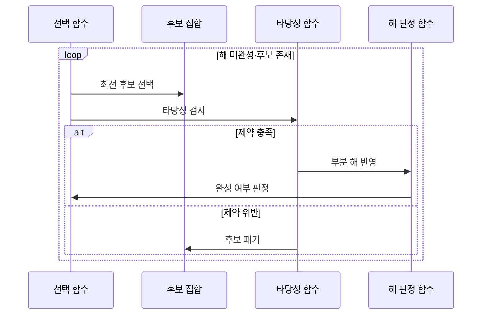

---
sidebar:
  order: 15
  label: "015. 탐욕 알고리즘 (Greedy Algorithm)"
  badge:
    text: "기출 · 30%"
    variant: note
title: "탐욕 알고리즘 (Greedy Algorithm)"
date: "2026-07-26T22:16:20+09:00"
tags:
  - "notes-basic-theory"
weight: 15
extra:
  question_no: "015"
  source_status: "기출"
  source_history: "122회"
  priority: 30
  priority_note: "탐욕 선택 조건과 반례 제시형에 적합"
---

## 미리 알고가기

- **탐욕 알고리즘(Greedy Algorithm)**: 매 단계의 국소 최선을 되돌리지 않고 확정해 해를 구성하는 기법
- **국소 최적 선택(Local Optimal Choice)**: 현재 단계에서 가장 유리한 후보를 선택
- **전역 최적해(Global Optimum)**: 모든 선택을 마친 전체 해 중 최선
- **탐욕 선택 속성(Greedy Choice Property)**: 국소 최선 선택을 포함한 전역 최적해가 존재
- **최적 부분 구조(Optimal Substructure)**: 부분 문제 최적해로 전체 최적해를 구성
- **교환 논증(Exchange Argument)**: 최적해의 선택을 탐욕 선택으로 바꿔도 손해가 없어 최적성을 보이는 증명
- **선택 함수(Selection Function)**: 남은 후보 중 가장 유리한 대상을 선택
- **타당성 함수(Feasibility Function)**: 후보가 제약을 지키는지 검사
- **최소 연결(Least Connections)**: 활성 연결이 가장 적은 서버 선택
- **동적 계획법(Dynamic Programming, DP, 디피)**: 영문 각 단어의 첫 글자를 따 DP로 표기하며 중복 부분 문제의 상태값을 저장·재사용하는 기법
- **메모이제이션(Memoization)**: 한 번 계산한 상태값을 적어 두었다가 같은 상태가 다시 나오면 계산 없이 꺼내 쓰는 동적 계획법의 저장 방식
- **완전 탐색(Exhaustive Search)**: 가능한 해를 모두 생성·검사하는 기법
- **파드(Pod)**: 함께 배치되는 하나 이상의 컨테이너 묶음
- **컨테이너 스케줄러(Container Scheduler)**: 자원·제약·점수로 파드를 실행할 노드에 배치하는 시스템
- **후보 집합(Candidate Set)**: 각 단계에서 아직 선택하거나 폐기할 수 있는 모든 대상을 보관하는 집합
- **목적 함수(Objective Function)**: 완성된 해나 후보 선택의 비용·이익을 수치화하여 최적 여부를 비교하는 함수
- **해 판정 함수(Solution Function)**: 현재까지 선택한 부분 해가 문제의 완성 조건을 충족했는지 판정하는 함수
- **부분 해(Partial Solution)**: 일부 후보만 선택해 아직 완성되지 않았으며 탐욕 선택을 누적하는 중간 결과
- **반례(Counterexample)**: 국소 최선 선택이 전역 최적해를 만들지 못함을 보여 탐욕 알고리즘 적용을 배제하는 구체적 입력
- **상태 공간(State Space)**: 동적 계획법이나 완전 탐색이 구분해 계산해야 하는 가능한 상태의 집합
- **점화식(Recurrence Relation)**: 하위 상태값을 결합해 현재 상태값을 계산하며 동적 계획법의 상태 전이를 정의하는 식
- **부하 분산기(Load Balancer)**: 들어오는 요청을 여러 서버에 나눠 보내는 장비·소프트웨어이며, 최소 연결 방식에서는 지금 활성 연결이 가장 적은 서버를 골라 요청을 넘김

## Ⅰ. 개요

- **정의/개념**: 단계별 **국소 최적 선택**을 확정해 전체 해를 구성하는 기법
- **기존 한계**: **완전 탐색**은 후보가 늘수록 **탐색 시간** 감당 불가

### 쉽게 이해하기 (학습용)

- 회의실 하나에 최대한 많은 회의를 넣으려면 모든 조합을 다 따져 볼 수도 있지만 끝나는 시각이 가장 이른 회의부터 집어넣으면 뒤에 남는 시간이 가장 길게 남아 결국 가장 많이 들어가는데, 이렇게 눈앞에서 제일 유리한 하나만 보고 바로 확정해 버리는 방식이 탐욕 알고리즘이다

## Ⅱ. 특징

- **국소 최적 선택** 확정 후 되돌림 없는 해 구성
- **탐욕 선택 속성**·**최적 부분 구조** 충족 시 전역 최적해 보장

### 쉽게 이해하기 (학습용)

- 한 번 집은 것을 도로 내려놓지 않으니 되돌아가 다시 따질 경우의 수도 어디까지 뒤졌는지 적어 둘 기록도 필요 없어 가볍지만, 대신 지금의 최선이 끝까지 최선으로 남는다는 보장이 문제 구조에 있어야만 그 가벼움을 쓸 수 있다

## Ⅲ. 아키텍처 및 구성요소

| 설계 요소 | 설명 |
|:---|:---|
| 후보 집합 | 매 단계 공급되는 **선택 후보** 전체 보관 |
| 선택 함수 | 남은 후보 중 **국소 최선** 결정 |
| 타당성 함수 | 후보의 **제약 조건** 충족 여부 검사 |
| 목적 함수 | 부분 해·완성 해의 **비용·이익** 수치화 |
| 해 판정 함수 | **부분 해**의 문제 완성 조건 충족 판정 |

> 요약: **선택 함수**와 **타당성 함수**를 통과한 후보만 부분 해로 확정

### 쉽게 이해하기 (학습용)

- 뷔페 진열대에 손대지 않은 음식이 늘어선 것이 후보 집합이고, 가장 맛있어 보이는 접시를 집는 사람이 선택 함수, 접시 용량을 넘지 않는지 재는 사람이 타당성 함수, 음식마다 점수를 매겨 둔 표가 목적 함수, 담긴 접시가 한 끼로 충분한지 보는 사람이 해 판정 함수다

## Ⅳ. 원리 및 절차 흐름도

| 절차 | 설명 |
|:---|:---|
| 최선 후보 선택 | 남은 후보 중 **국소 최선** 결정 |
| 타당성 검사 | 후보의 **제약 조건** 위반 여부 확인 |
| 부분 해 반영 | 통과 후보를 **부분 해**에 확정 추가 |
| 완성 여부 판정 | 문제 **완성 조건** 충족 시 반복 종료 |
| 후보 폐기 | 위반 후보를 **후보 집합**에서 제외 |

> 요약: **최선 후보** 중 타당한 것만 부분 해로 확정

### 쉽게 이해하기 (학습용)

- 진열대에서 지금 가장 맛있어 보이는 음식을 집어 접시에 올려 보고 접시가 넘치면 도로 내려놓고 다음 음식으로 넘어가되, 한 번 접시에 올려 확정한 음식은 나중에 더 좋은 것이 보여도 빼지 않고 접시가 다 찰 때까지 이 집기를 되풀이한다

## Ⅴ. 종류 및 비교

| 최적화 기법 | 탐욕 알고리즘 | 동적 계획법 | 완전 탐색 |
|:---|:---|:---|:---|
| 적용 기준 | **탐욕 선택 속성**·최적 부분 구조 성립 | 중복 상태·**점화식** 정의 가능 | **후보 집합** 크기가 자원 한도 이내 |
| 핵심 특징 | 현재 최선을 **즉시 확정** | **메모이제이션**·표 기반 해 재사용 | 모든 해 **생성·비교** |
| 한계 | **반례** 존재 시 최적해 미보장 | **상태 공간** 증가에 따른 메모리 초과 | 후보 증가에 따른 **계산량 폭증** |

> 요약: 반례 유무를 기준으로 **탐욕 알고리즘**과 **동적 계획법** 선택

### 쉽게 이해하기 (학습용)

- 거스름돈을 500원짜리부터 큰 동전 순으로 집으면 우리나라 동전에서는 늘 최소 개수가 나오지만 4원·3원·1원짜리만 있는 가짜 화폐로 6원을 만들면 4원+1원+1원 세 개가 나와 3원 두 개보다 손해인데, 이런 반례가 하나라도 나오면 탐욕을 버리고 조합을 표에 적어 두는 동적 계획법이나 전부 세어 보는 완전 탐색으로 넘어간다

## Ⅵ. 실무 사례

1. **컨테이너 스케줄러**는 적합 노드 중 최고 점수에 **파드 배치**
2. **부하 분산기**는 **최소 연결** 기준으로 서버 선택

### 쉽게 이해하기 (학습용)

- 새 파드를 어디에 띄울지 정할 때 스케줄러는 메모리와 라벨 조건에 안 맞는 노드를 먼저 후보에서 빼고 남은 노드마다 여유 자원 점수를 매겨 1등 노드에 바로 꽂아 버리며, 나중에 더 한가한 노드가 생겨도 그 파드를 옮기지 않는다
- 손님이 창구 앞에 서면 분산기는 지금 각 창구에 줄 서 있는 사람 수만 보고 가장 짧은 줄로 보내며, 그 손님의 업무가 오래 걸릴지까지는 따지지 않고 눈앞의 최소 대기 줄만 고른다

## Ⅶ. 결론

- **교환 논증** 증명 시 탐욕, 실패 시 **DP 전환**

### 쉽게 이해하기 (학습용)

- 어떤 정답 묶음을 가져와도 그 안의 선택 하나를 지금 내가 집은 최선으로 바꿔치기했을 때 결과가 나빠지지 않음을 보일 수 있으면 탐욕을 밀고 나가고, 그 바꿔치기가 손해가 되는 입력이 하나라도 나오면 미련 없이 동적 계획법으로 갈아탄다
