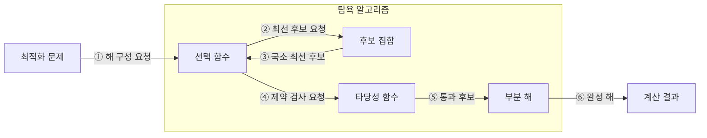

---
sidebar:
  order: 15
  label: "015. 탐욕 알고리즘 (Greedy Algorithm)"
  badge:
    text: "기출 · 30%"
    variant: note
title: "탐욕 알고리즘 (Greedy Algorithm)"
date: "2026-07-28T11:53:15+09:00"
tags:
  - "notes-basic-theory"
weight: 15
extra:
  question_no: "015"
  source_status: "기출"
  source_history: "122회"
  priority: 30
  priority_note: "탐욕 선택 조건과 반례 제시형에 적합"
---

## 미리 알고가기

- **탐욕 알고리즘(Greedy Algorithm)**: 매 단계의 국소 최선을 되돌리지 않고 확정해 해를 구성하는 기법
- **국소 최적 선택(Local Optimal Choice)**: 현재 단계에서 가장 유리한 후보를 선택
- **전역 최적해(Global Optimum)**: 모든 선택을 마친 전체 해 중 최선
- **탐욕 선택 속성(Greedy Choice Property)**: 국소 최선 선택을 포함한 전역 최적해가 존재
- **최적 부분 구조(Optimal Substructure)**: 부분 문제 최적해로 전체 최적해를 구성
- **교환 논증(Exchange Argument)**: 최적해의 선택을 탐욕 선택으로 바꿔도 손해가 없어 최적성을 보이는 증명
- **선택 함수(Selection Function)**: 남은 후보 중 가장 유리한 대상을 선택
- **타당성 함수(Feasibility Function)**: 후보가 제약을 지키는지 검사
- **동적 계획법(Dynamic Programming, DP)**: 중복되는 부분 문제의 해를 저장·재사용하여 계산량을 줄이는 알고리즘 설계 기법
- **메모이제이션(Memoization)**: 한 번 계산한 상태값을 적어 두었다가 같은 상태가 다시 나오면 계산 없이 꺼내 쓰는 동적 계획법의 저장 방식
- **완전 탐색(Exhaustive Search)**: 가능한 해를 모두 생성·검사하는 기법
- **파드(Pod)**: 함께 배치되는 하나 이상의 컨테이너 묶음
- **컨테이너 스케줄러(Container Scheduler)**: 자원·제약·점수로 파드를 실행할 노드에 배치하는 시스템
- **후보 집합(Candidate Set)**: 각 단계에서 아직 선택하거나 폐기할 수 있는 모든 대상을 보관하는 집합
- **목적 함수(Objective Function)**: 완성된 해나 후보 선택의 비용·이익을 수치화하여 최적 여부를 비교하는 함수
- **해 판정 함수(Solution Function)**: 현재까지 선택한 부분 해가 문제의 완성 조건을 충족했는지 판정하는 함수
- **부분 해(Partial Solution)**: 일부 후보만 선택해 아직 완성되지 않았으며 탐욕 선택을 누적하는 중간 결과
- **반례(Counterexample)**: 국소 최선 선택이 전역 최적해를 만들지 못함을 보여 탐욕 알고리즘 적용을 배제하는 구체적 입력
- **상태 공간(State Space)**: 동적 계획법이나 완전 탐색이 구분해 계산해야 하는 가능한 상태의 집합
- **점화식(Recurrence Relation)**: 하위 상태값을 결합해 현재 상태값을 계산하며 동적 계획법의 상태 전이를 정의하는 식

## Ⅰ. 개요

- 정의/개념: 단계별 **국소 최적 선택**을 확정해 전체 해를 구성하는 기법
- 기존 한계: 후보 증가로 **완전 탐색 계산량** 급증

### 쉽게 이해하기 (학습용)

- 매 단계 가장 유리한 선택을 확정하되 그 선택이 전체 최적해로 이어짐을 증명해야 한다.

## Ⅱ. 특징

- **국소 최적 선택** 확정 후 되돌림 없는 해 구성
- **탐욕 선택 속성**·**최적 부분 구조** 충족 시 전역 최적해 보장

### 쉽게 이해하기 (학습용)

- 선택을 되돌리지 않으므로 계산은 단순하지만 탐욕 선택 속성이 성립해야 최적해를 보장한다.

## Ⅲ. 구성 및 동작 흐름

| 구성요소 | 역할 | 흐름 |
|:---|:---|:---|
| 후보 집합 | 매 단계 공급되는 **선택 후보** 보관 | ②, ③ |
| 선택 함수 | 남은 후보 중 **국소 최선** 결정 | ①–④ |
| 타당성 함수 | 후보의 **제약 조건** 충족 여부 검사 | ④, ⑤ |
| 부분 해 | 통과 후보를 누적하고 완성 조건 판정 | ⑤, ⑥ |

> 요약: **선택 함수**와 **타당성 함수**를 통과한 후보만 부분 해로 확정

### 쉽게 이해하기 (학습용)

- 최선 후보를 선택하고 제약을 통과한 후보만 부분 해에 확정한다.

## Ⅳ. 운영 고려사항

| 고려사항 | 대응 방안 | 기대 효과 |
|:---|:---|:---|
| 국소 선택이 전역 최적해를 훼손 | 교환 논증·컷 속성 등으로 탐욕 선택 속성 증명 | 최적성 보장 |
| 숨은 제약으로 후보 선택이 무효화 | 타당성 함수를 모든 제약과 함께 검증 | 실행 불가능한 해 방지 |
| 동률 후보에 따른 결과 변동 | 결정적 보조 정렬 기준 정의 | 재현 가능한 결과 확보 |
| 입력 범위 확대 시 반례 발생 | 경계값·무작위 반례 시험 후 DP와 비교 | 잘못된 기법 적용 방지 |

### 쉽게 이해하기 (학습용)

- 최적성 증명과 반례 검증을 통과한 선택 규칙만 사용한다.

## Ⅴ. 종류 및 비교

| 최적화 기법 | 탐욕 알고리즘 | 동적 계획법 | 완전 탐색 |
|:---|:---|:---|:---|
| 적용 기준 | **탐욕 선택 속성**·최적 부분 구조 성립 | 중복 상태·**점화식** 정의 가능 | **후보 집합** 크기가 자원 한도 이내 |
| 핵심 특징 | 현재 최선을 **즉시 확정** | **메모이제이션**·표 기반 해 재사용 | 모든 해 **생성·비교** |
| 한계 | **반례** 존재 시 최적해 미보장 | **상태 공간** 증가에 따른 메모리 초과 | 후보 증가에 따른 **계산량 폭증** |

> 요약: **탐욕 속성**·중복 상태·후보 규모로 최적화 기법 선택

### 쉽게 이해하기 (학습용)

- 탐욕 속성이 증명되면 탐욕, 중복 상태가 있으면 DP, 후보가 작으면 완전 탐색을 검토한다.

## Ⅵ. 실무 사례

1. **컨테이너 스케줄러**는 적합 노드 중 최고 점수에 **파드 배치**

### 쉽게 이해하기 (학습용)

- 제약에 맞는 노드를 거른 뒤 최고 점수 노드에 파드를 배치한다.

## Ⅶ. 결론

- 빠른 해 선택을 위해 탐욕 속성·반례를 검토하여 **그리디** 활용

### 쉽게 이해하기 (학습용)

- 국소 선택의 최적성을 증명하고 반례가 없을 때 적용한다.
