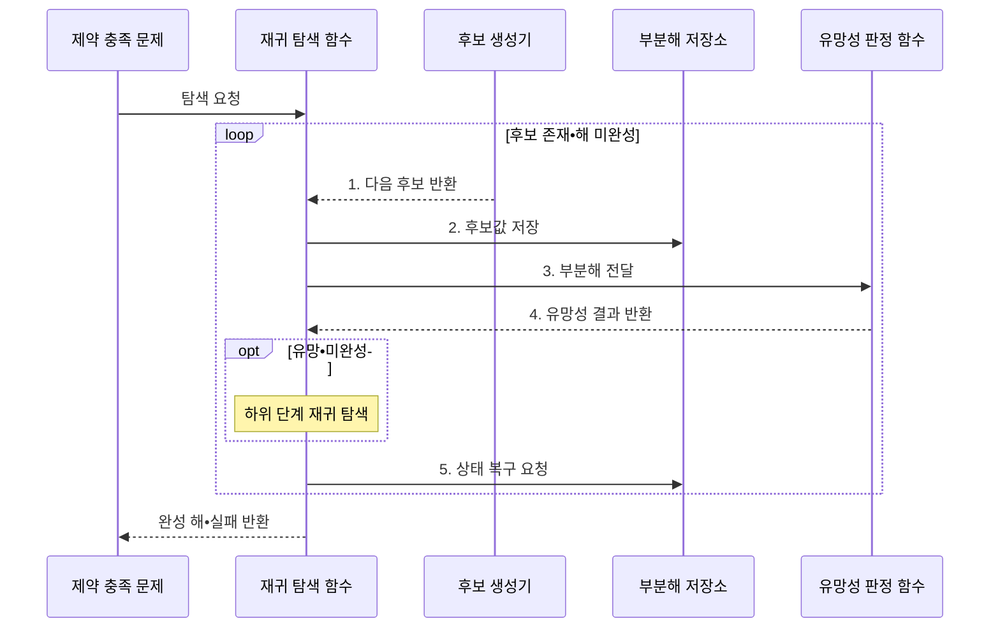

---
sidebar:
  order: 16
  label: "016. 백트래킹 (Backtracking)"
  badge:
    text: "기출 • 30%"
    variant: note
title: "백트래킹 (Backtracking)"
date: "2026-07-30T19:09:02+09:00"
tags:
  - "notes-basic-theory"
weight: 16
extra:
  question_no: "016"
  source_status: "기출"
  source_history: "122회"
  priority: 30
  priority_note: "기출 간격이 길고 가지치기 비교에 유용"
---

## 미리 알고가기

- **상태 공간 트리(State Space Tree)**: 부분해를 노드로 펼쳐 가능한 선택 경로를 표현한 탐색 공간
- **부분해(Partial Solution)**: 일부 변수만 정해진 미완성 해
- **유망성(Promising)**: 유효한 해로 확장될 수 있는 부분해의 성질
- **가지치기(Pruning)**: 해로 확장될 수 없는 분기를 제거해 탐색량을 줄이는 동작
- **제약 충족 문제(Constraint Satisfaction Problem)**: 여러 제약을 모두 만족하는 변수값 탐색
- **분기 한정(Branch and Bound)**: 목적함수 경계로 최적값 개선 불가 분기 제거
- **깊이 우선 탐색(Depth-First Search)**: 한 경로를 끝까지 간 뒤 직전 분기로 복귀
- **백트래킹(Backtracking)**: 제약을 어긴 분기를 버리고 이전 선택으로 돌아가 후보를 줄이는 탐색
- **완전 탐색(Exhaustive Search)**: 가능한 후보를 모두 생성•검사해 해를 찾는 방식
- **조합 폭발(Combinatorial Explosion)**: 후보 조합이 지수적으로 늘어 실행 가능한 시간•메모리를 초과하는 현상
- **재귀 탐색(Recursive Search)**: 유망한 부분해를 다음 선택 단계의 입력으로 삼아 같은 탐색 함수를 다시 호출하는 동작
- **목적 함수(Objective Function)**: 완성된 해의 비용이나 이익을 수치화하며 분기 한정에서 현재 최적값과 경계를 비교하는 함수
- **경계(Bound)**: 현재 부분해의 하위 분기에서 얻을 수 있는 최선의 목적값 한계를 추정하여 탐색 지속 여부를 정하는 값
- **복구 상태(Restoration State)**: 후보 선택으로 바뀐 값과 순서를 기록하여 재귀 탐색 뒤 부분해를 선택 전 상태로 되돌리는 정보
- **호출 스택•스택 오버플로(Call Stack•Stack Overflow)**: 호출 스택은 재귀의 복귀 위치와 상태를 저장하며, 깊이가 용량을 넘으면 스택 오버플로가 발생
- **유망성 판정 함수**: 지금 부분해가 앞으로 유효한 해로 자랄 수 있는지 제약으로 검사해 하위 분기를 더 볼지 결정하는 함수

> **키워드:** 백트래킹 (Backtracking)

## Ⅰ. 개요

- 정의/개념: **제약 위반** 분기를 제거하고 이전 선택으로 복귀하는 탐색 기법
- 배경/필요성: 제약 충족 문제의 **조합 폭발** 억제

### 쉽게 이해하기 (학습용)

- 스도쿠에서 규칙을 어긴 값을 지우고 이전 선택으로 돌아가 다른 후보를 시험하는 방식이다.

## Ⅱ. 특징

- **상태 공간 트리**를 **깊이 우선**으로 순회•상태 복원
- **유망성** 판정으로 위반 분기 **가지치기**해 탐색량 축소
- 선택 전 상태를 보존하는 **역순 복구**로 후보 독립성 유지

### 쉽게 이해하기 (학습용)

- 스도쿠의 모순을 일찍 찾을수록 그 아래 후보를 한꺼번에 버릴 수 있다.

## Ⅲ. 구조 및 구성요소

| 구성요소 | 책임 |
|:---|:---|
| 재귀 탐색 함수 | **깊이 우선**으로 부분해 확장•복귀 |
| 후보 생성기 | 현재 단계의 **선택 후보** 열거 |
| 부분해 저장소 | 선택 변수값과 **복구 상태** 보관 |
| 유망성 판정 함수 | **제약 위반**으로 분기 확장 판정 |

### 쉽게 이해하기 (학습용)

- 재귀 탐색 함수가 후보를 부분해에 적용하고, 제약을 위반하면 저장한 변경 내역으로 선택 전 상태를 복구한다.

## Ⅳ. 흐름도

**동작 원리**

- **1. 다음 후보 반환**: 현재 단계의 선택값 획득
- **2. 후보값 저장**: 선택값•복구 정보를 부분해에 적용
- **3. 부분해 전달**: 현재 선택을 포함한 제약 검사 요청
- **4. 유망성 결과 반환**: 위반 분기 가지치기•재귀 확장 판정
- **5. 상태 복구 요청**: 재귀 복귀 후 선택 전 상태로 환원

### 쉽게 이해하기 (학습용)

- 스도쿠 숫자를 연필로 써 제약을 확인하고, 모순이면 지우개로 이전 상태를 복구한 뒤 다음 숫자를 시험한다.

## Ⅴ. 종류 및 비교

| 탐색 전략 | 백트래킹 | 완전 탐색 | 분기 한정 |
|:---|:---|:---|:---|
| 적용 기준 | 부분해 단계에서 위반 **조기 판정** 가능 | 모든 후보의 **계산 시간** 감당 가능 | **목적 함수** 경계 산출 가능 |
| 핵심 특징 | **제약 위반** 분기 제거 | 모든 후보 **전수 검사** | **상•하한** 비교로 분기 폐기 |
| 한계 | 제약 판정 지연 시 **지수 시간** 잔존 | 후보 **조합 폭발** | **경계 계산** 오버헤드 |

> 요약: 제약 위반은 백트래킹, 목적값 개선 불가는 **분기 한정**

### 쉽게 이해하기 (학습용)

- 스도쿠처럼 규칙 위반을 중간에 알면 백트래킹, 남은 선택으로도 최고 점수를 못 넘는다고 알면 분기 한정으로 가지를 자른다.

## Ⅵ. 실무 고려사항 및 대책

| 고려사항 | 대책 | 효과 |
|:---|:---|:---|
| 늦은 **가지치기**로 무효 부분해의 하위 조합까지 탐색 | 비용이 낮고 강한 제약부터 검사 | 불필요한 **탐색 노드 수 감소** |
| 부분해 복구 누락으로 이전 후보의 변경이 다음 후보에 잔존 | 변경 항목 기록 후 역순 복구 | 분기별 **상태 독립성** 확보 |
| 비효율적 후보 순서로 같은 해의 탐색 노드 급증 | 제약이 많은 변수·값부터 선택 | 해 발견 전 **탐색 공간 축소** |
| 큰 상태 공간의 깊은 재귀로 호출 스택 초과 | 깊이 한도 또는 명시적 스택 적용 | 깊은 탐색의 **호출 스택 초과 방지** |

### 쉽게 이해하기 (학습용)

- 실패한 선택의 변경을 역순으로 되돌려 다음 후보에 흔적을 남기지 않는다.

## Ⅶ. 결론

- 부분해의 **제약 위반**을 조기에 판정하면 백트래킹 선택

### 쉽게 이해하기 (학습용)

- 완성 전에 틀린 선택을 알아낼 수 있는 문제일수록, 그 아래 후보를 통째로 지우는 백트래킹의 이득이 커진다.
