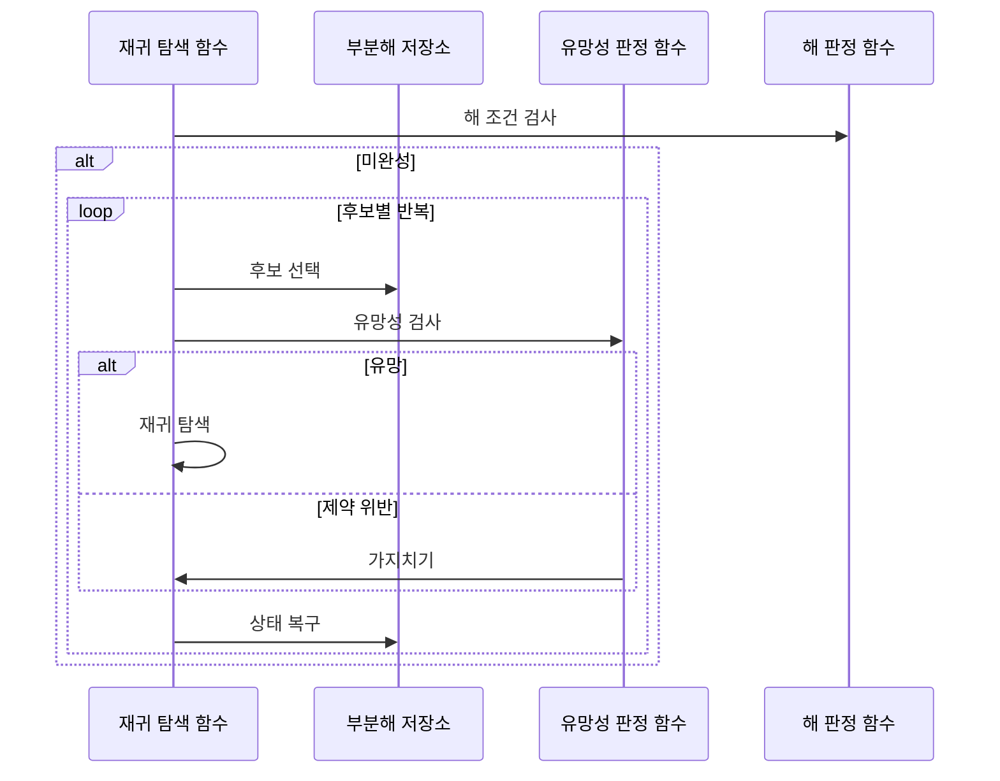

---
sidebar:
  order: 16
  label: "016. 백트래킹 (Backtracking)"
  badge:
    text: "기출 · 30%"
    variant: note
title: "백트래킹 (Backtracking)"
date: "2026-07-25T21:55:00+09:00"
tags:
  - "notes-basic-theory"
weight: 16
extra:
  question_no: "016"
  source_status: "기출"
  source_history: "122회"
  priority: 30
  priority_note: "기출 간격이 길고 가지치기 비교에 유용"
---

## 미리 알고가기

- **상태 공간 트리(State Space Tree)**: 부분해를 노드로 펼쳐 가능한 선택 경로를 표현한 탐색 공간
- **부분해(Partial Solution)**: 일부 변수만 정해진 미완성 해
- **유망성(Promising)**: 유효한 해로 확장될 수 있는 부분해의 성질
- **가지치기(Pruning)**: 해로 확장될 수 없는 분기를 제거해 탐색량을 줄이는 동작
- **제약 충족 문제(Constraint Satisfaction Problem)**: 여러 제약을 모두 만족하는 변수값 탐색
- **분기 한정(Branch and Bound)**: 목적함수 경계로 최적값 개선 불가 분기 제거
- **깊이 우선 탐색(Depth-First Search)**: 한 경로를 끝까지 간 뒤 직전 분기로 복귀
- **백트래킹(Backtracking)**: 제약을 어긴 분기를 버리고 이전 선택으로 돌아가 후보를 줄이는 탐색
- **완전 탐색(Exhaustive Search)**: 가능한 후보를 모두 생성·검사해 해를 찾는 방식
- **조합 폭발(Combinatorial Explosion)**: 선택 단계나 후보 수가 늘면서 가능한 조합 수가 지수적으로 증가해 계산 자원 한도를 넘는 현상
- **재귀 탐색(Recursive Search)**: 유망한 부분해를 다음 선택 단계의 입력으로 삼아 같은 탐색 함수를 다시 호출하는 동작
- **목적 함수(Objective Function)**: 완성된 해의 비용이나 이익을 수치화하며 분기 한정에서 현재 최적값과 경계를 비교하는 함수
- **경계(Bound)**: 현재 부분해의 하위 분기에서 얻을 수 있는 최선의 목적값 한계를 추정하여 탐색 지속 여부를 정하는 값
- **복구 상태(Restoration State)**: 후보 선택으로 바뀐 값과 순서를 기록하여 재귀 탐색 뒤 부분해를 선택 전 상태로 되돌리는 정보
- **유망성 판정 함수**: 지금 부분해가 앞으로 유효한 해로 자랄 수 있는지 제약으로 검사해 하위 분기를 더 볼지 결정하는 함수
- **해 판정 함수(Solution Function)**: 지금까지 채운 부분해가 문제의 완성 조건을 모두 채웠는지 확인해 탐색을 끝낼지 정하는 함수
- **패키지 의존성 해결(Package Dependency Resolution)**: 여러 소프트웨어 패키지의 호환 버전 조합을 찾으며 제약 위반 시 이전 선택을 복구하는 작업
- **버전 제약(Version Constraint)**: 패키지가 함께 사용할 수 있는 버전 범위나 제외 조건을 정의하여 후보 조합의 유망성을 판정하는 규칙
- **조합 테스트(Combinatorial Testing)**: 입력 옵션의 조합을 체계적으로 생성하되 금지 조합의 하위 분기를 제거해 테스트 수를 줄이는 기법

## Ⅰ. 개요

- **정의/개념**: **제약 위반** 분기를 제거·복귀해 후보 탐색을 줄이는 기법
- **기존 한계**: **제약 충족 문제**를 전수 검사하면 **조합 폭발** 발생

### 쉽게 이해하기 (학습용)
- 미로에서 막다른 벽에 부딪히면 지나온 갈림길까지 되돌아가 아직 안 가 본 길로 들어서는데, 갈림길 하나가 변수 하나를 정하는 선택 단계이고 벽에 부딪히는 순간이 제약 위반이며 되돌아가는 그 동작이 백트래킹이다

## Ⅱ. 특징

- **상태 공간 트리**를 **깊이 우선**으로 순회·상태 복원
- **유망성** 판정으로 위반 분기 **가지치기**해 탐색량 축소

### 쉽게 이해하기 (학습용)
- 미로를 한 갈래씩 끝까지 파고들며 들어온 자리 표시를 되돌아 나올 때 지우니 기억할 것은 지금 걸어온 한 줄뿐이고, 벽이 눈앞에 보일 때 바로 돌아서면 그 뒤에 숨어 있던 무수한 갈래를 통째로 안 걸어도 되지만 벽이 맨 끝에서야 드러나는 미로라면 결국 전부 걷게 된다

## Ⅲ. 아키텍처 및 구성요소

| 설계 요소 | 설명 |
|:---|:---|
| 재귀 탐색 함수 | **깊이 우선**으로 부분해를 확장·복귀시키는 주체 |
| 부분해 저장소 | 선택한 변수값과 **복구 상태** 보관 |
| 유망성 판정 함수 | **제약 위반** 여부로 하위 분기 확장 판정 |
| 해 판정 함수 | 모든 변수 확정과 **완성 조건** 충족 판정 |

> 요약: **유망성** 판정과 선택 전 상태 기록으로 탐색 제어

### 쉽게 이해하기 (학습용)
- 스도쿠 빈칸에 숫자를 하나 적어 두는 곳이 부분해 저장소이고, 그 숫자가 같은 줄이나 같은 상자에 이미 있는지 보는 사람이 유망성 판정 함수, 빈칸이 하나도 안 남았는지 세는 사람이 해 판정 함수이며, 적었다 지웠다 하며 칸을 오르내리는 손이 재귀 탐색 함수다

## Ⅳ. 원리 및 절차 흐름도

| 절차 | 설명 |
|:---|:---|
| 해 조건 검사 | 목표 상태와 **제약 조건** 충족 여부 판정 |
| 후보 선택 | 후보값을 **부분해**에 반영 |
| 유망성 검사 | 부분해의 유효 해 **확장 가능성** 판정 |
| 재귀 탐색 | 통과한 부분해의 다음 **선택 단계** 진입 |
| 가지치기 | **위반 부분해**의 하위 분기 탐색 생략 |
| 상태 복구 | **복구 상태**로 선택 전 부분해 복원 |

> 요약: 해 조건 확인 후 **유망** 후보만 하위 단계 진입·복구

### 쉽게 이해하기 (학습용)
- 아직 답이 다 차지 않았으면 빈칸에 후보 하나를 적어 넣고 규칙에 걸리는지부터 보아 걸리면 그 아래를 통째로 건너뛰며, 걸리지 않아 더 내려갔다 돌아왔을 때는 적어 둔 값을 반드시 지우고 다음 후보를 적는데 이 지우기가 없으면 다음 후보가 앞 선택에 오염된다

## Ⅴ. 종류 및 비교

| 탐색 전략 | 백트래킹 | 완전 탐색 | 분기 한정 |
|:---|:---|:---|:---|
| 적용 기준 | 부분해 단계에서 위반 **조기 판정** 가능 | 후보 수가 **자원 한도** 이내 | **목적 함수** 경계 산출 가능 |
| 핵심 특징 | **제약 위반** 분기 제거 | 모든 후보 **전수 검사** | **상·하한** 비교로 분기 폐기 |
| 한계 | 제약 판정 지연 시 **지수 시간** 잔존 | 후보 **조합 폭발** | **경계 함수** 계산 오버헤드 |

> 요약: 제약 위반은 백트래킹, 목적값 개선 불가는 **분기 한정**

### 쉽게 이해하기 (학습용)
- 후보가 몇 개 안 되면 그냥 전부 세어 보면 되지만, 답이 되다 만 상태에서 이미 규칙을 어겼음을 알 수 있으면 그 아래를 통째로 버리는 백트래킹이 이득이고, 규칙은 안 어겼어도 지금 최고 기록보다 좋아질 가망이 없다고 계산되면 그 가지를 버리는 것이 분기 한정이다

## Ⅵ. 실무 사례

1. **패키지 의존성 해결**은 **버전 제약** 위반 시 이전 선택 복구
2. **조합 테스트** 생성은 금지 조합 발견 시 분기 **가지치기**

### 쉽게 이해하기 (학습용)
- 설치할 패키지 버전을 하나 정해 놓고 내려가다가 다른 패키지가 요구하는 버전 범위와 어긋나면, 방금 정한 버전을 취소해 그 자리를 비운 뒤 다음 버전으로 바꿔 다시 내려간다
- 옵션 조합표를 만들다가 A를 켜면 B를 못 켠다는 금지 규칙에 걸리는 순간, 그 조합에서 뻗어 나갈 나머지 옵션 조합은 아예 만들지 않아 시험할 경우의 수가 크게 준다

## Ⅶ. 결론

- 부분해에서 **제약 위반** 조기 판정 가능 시 **백트래킹**

### 쉽게 이해하기 (학습용)
- 답을 다 채우기 전 중간 상태에서 이미 틀렸다고 판정할 수 있어야 그 아래를 통째로 건너뛰는 이득이 생기고, 끝까지 채워 봐야만 옳고 그름을 아는 문제라면 되돌아가는 장치를 붙여도 결국 모든 조합을 다 걷게 된다
