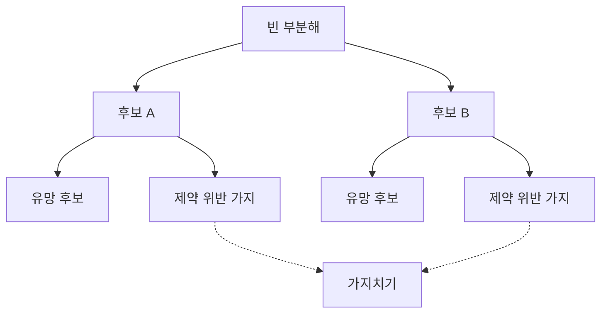
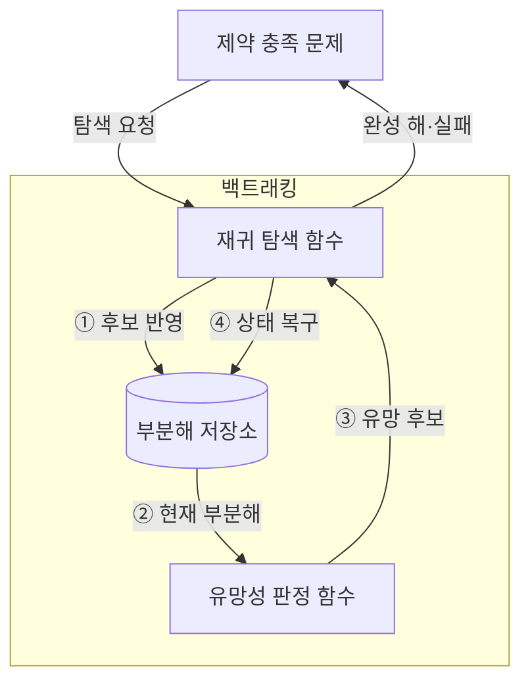
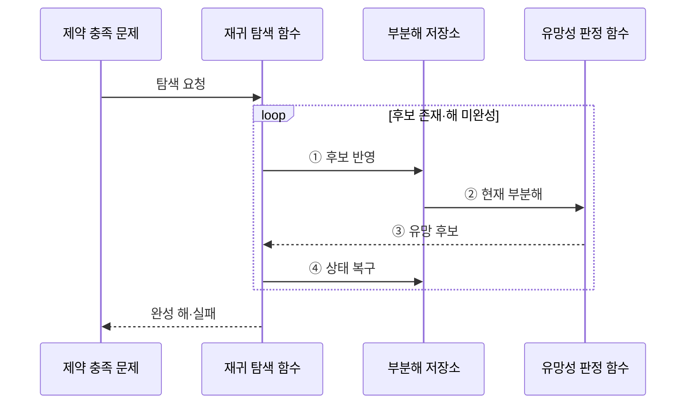

---
sidebar:
  order: 16
  label: "016. 백트래킹 (Backtracking)"
  badge:
    text: "기출 · 30%"
    variant: note
title: "백트래킹 (Backtracking)"
date: "2026-07-28T19:24:00+09:00"
tags:
  - "notes-basic-theory"
weight: 16
extra:
  question_no: "016"
  source_status: "기출"
  source_history: "122회"
  priority: 30
  priority_note: "기출 간격이 길고 가지치기 비교에 유용"
---

## 미리 알고가기

- **상태 공간 트리(State Space Tree)**: 부분해를 노드로 펼쳐 가능한 선택 경로를 표현한 탐색 공간
- **부분해(Partial Solution)**: 일부 변수만 정해진 미완성 해
- **유망성(Promising)**: 유효한 해로 확장될 수 있는 부분해의 성질
- **가지치기(Pruning)**: 해로 확장될 수 없는 분기를 제거해 탐색량을 줄이는 동작
- **제약 충족 문제(Constraint Satisfaction Problem)**: 여러 제약을 모두 만족하는 변수값 탐색
- **분기 한정(Branch and Bound)**: 목적함수 경계로 최적값 개선 불가 분기 제거
- **깊이 우선 탐색(Depth-First Search)**: 한 경로를 끝까지 간 뒤 직전 분기로 복귀
- **백트래킹(Backtracking)**: 제약을 어긴 분기를 버리고 이전 선택으로 돌아가 후보를 줄이는 탐색
- **완전 탐색(Exhaustive Search)**: 가능한 후보를 모두 생성·검사해 해를 찾는 방식
- **조합 폭발(Combinatorial Explosion)**: 선택 단계나 후보 수가 늘면서 가능한 조합 수가 지수적으로 증가해 계산 자원 한도를 넘는 현상
- **재귀 탐색(Recursive Search)**: 유망한 부분해를 다음 선택 단계의 입력으로 삼아 같은 탐색 함수를 다시 호출하는 동작
- **목적 함수(Objective Function)**: 완성된 해의 비용이나 이익을 수치화하며 분기 한정에서 현재 최적값과 경계를 비교하는 함수
- **경계(Bound)**: 현재 부분해의 하위 분기에서 얻을 수 있는 최선의 목적값 한계를 추정하여 탐색 지속 여부를 정하는 값
- **복구 상태(Restoration State)**: 후보 선택으로 바뀐 값과 순서를 기록하여 재귀 탐색 뒤 부분해를 선택 전 상태로 되돌리는 정보
- **유망성 판정 함수**: 지금 부분해가 앞으로 유효한 해로 자랄 수 있는지 제약으로 검사해 하위 분기를 더 볼지 결정하는 함수
- **해 판정 함수(Solution Function)**: 지금까지 채운 부분해가 문제의 완성 조건을 모두 채웠는지 확인해 탐색을 끝낼지 정하는 함수
- **패키지 의존성 해결(Package Dependency Resolution)**: 여러 소프트웨어 패키지의 호환 버전 조합을 찾으며 제약 위반 시 이전 선택을 복구하는 작업
- **버전 제약(Version Constraint)**: 패키지가 함께 사용할 수 있는 버전 범위나 제외 조건을 정의하여 후보 조합의 유망성을 판정하는 규칙
- **조합 테스트(Combinatorial Testing)**: 입력 옵션의 조합을 체계적으로 생성하되 금지 조합의 하위 분기를 제거해 테스트 수를 줄이는 기법

## Ⅰ. 개요

- 정의/개념: **제약 위반** 분기를 제거·복귀해 후보 탐색을 줄이는 기법
- 기존 한계: **제약 충족 문제**를 전수 검사하면 **조합 폭발** 발생

### 쉽게 이해하기 (학습용)
- 스도쿠에서 규칙을 어긴 값을 지우고 이전 선택으로 돌아가 다른 후보를 시험하는 방식이다.

## Ⅱ. 특징

- **상태 공간 트리**를 **깊이 우선**으로 순회·상태 복원
- **유망성** 판정으로 위반 분기 **가지치기**해 탐색량 축소

### 쉽게 이해하기 (학습용)
- 현재 선택 경로만 저장하며 제약 위반을 일찍 찾을수록 더 많은 하위 조합을 제거한다.

## Ⅲ. 아키텍처

**도표안 A — 구조도**

**도표안 B — 동작 흐름도**

**도표안 C — sequenceDiagram**

| 구성요소 | 책임 |
|:---|:---|
| 재귀 탐색 함수 | **깊이 우선**으로 부분해 확장·복귀 |
| 부분해 저장소 | 선택 변수값과 **복구 상태** 보관 |
| 유망성 판정 함수 | **제약 위반**으로 분기 확장 판정 |

**동작 원리**

- **① 후보 반영**: 다음 선택값을 부분해에 적용
- **② 현재 부분해**: 제약 판정 대상 상태 전달
- **③ 유망 후보**: 확장 가능한 분기만 탐색 지속
- **④ 상태 복구**: 복귀 시 선택 전 상태로 환원

### 쉽게 이해하기 (학습용)
- 재귀 탐색 함수는 후보를 반영하고 유망한 분기만 내려간 뒤 상태를 복구한다.

## Ⅳ. 종류 및 비교

| 탐색 전략 | 백트래킹 | 완전 탐색 | 분기 한정 |
|:---|:---|:---|:---|
| 적용 기준 | 부분해 단계에서 위반 **조기 판정** 가능 | 후보 수가 **자원 한도** 이내 | **목적 함수** 경계 산출 가능 |
| 핵심 특징 | **제약 위반** 분기 제거 | 모든 후보 **전수 검사** | **상·하한** 비교로 분기 폐기 |
| 한계 | 제약 판정 지연 시 **지수 시간** 잔존 | 후보 **조합 폭발** | **경계 계산** 오버헤드 |

> 요약: 제약 위반은 백트래킹, 목적값 개선 불가는 **분기 한정**

### 쉽게 이해하기 (학습용)
- 중간 제약 위반은 백트래킹, 목적값 개선 불가는 분기 한정으로 제거한다.

## Ⅴ. 실무 고려사항 및 대책

| 고려사항 | 대책 | 효과 |
|:---|:---|:---|
| 가지치기 판정이 늦어 탐색량 급증 | 값싼 강한 제약부터 검사 | 하위 분기 조기 제거 |
| 복귀 후 상태가 이전 선택에 오염 | 변경 항목 기록 후 역순 복구 | 후보 간 독립성 보장 |
| 후보 순서에 따른 탐색 시간 편차 | 실패 가능성·제약도가 높은 후보 우선 | 해 발견 시간 단축 |
| 깊은 재귀로 호출 스택 초과 | 깊이 한도와 명시적 스택 검토 | 실행 안정성 확보 |
| 패키지 조합의 **버전 제약** 충돌 | 충돌 시 이전 선택 복구 | 유효 버전 조합 탐색 |

### 쉽게 이해하기 (학습용)
- 제약을 일찍 검사하고 재귀 복귀 때 변경 상태를 정확히 되돌려야 한다.

## Ⅵ. 결론

- 부분해 **제약 조기 판정** 가능 시 백트래킹 선택

### 쉽게 이해하기 (학습용)
- 완성 전 제약 위반을 판정할 수 있을수록 가지치기 효과가 커진다.
